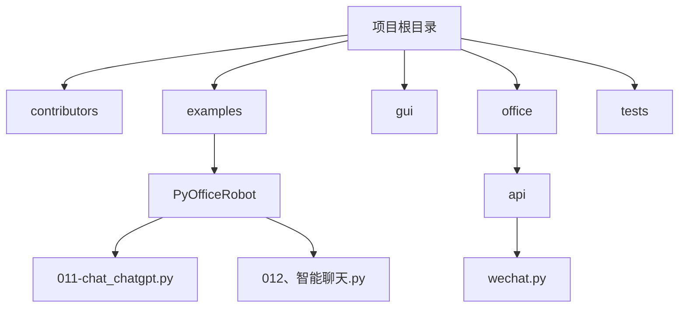
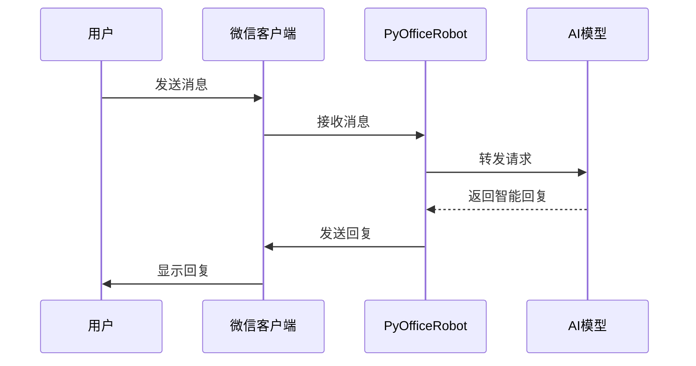
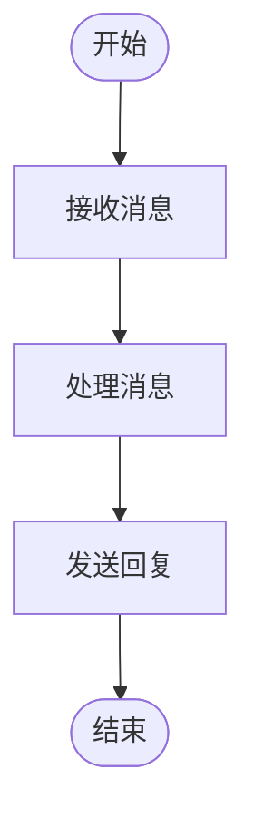
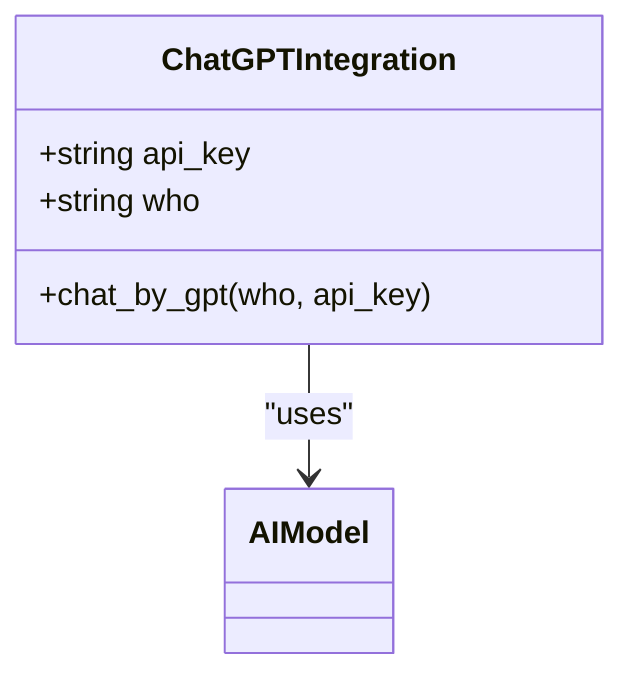
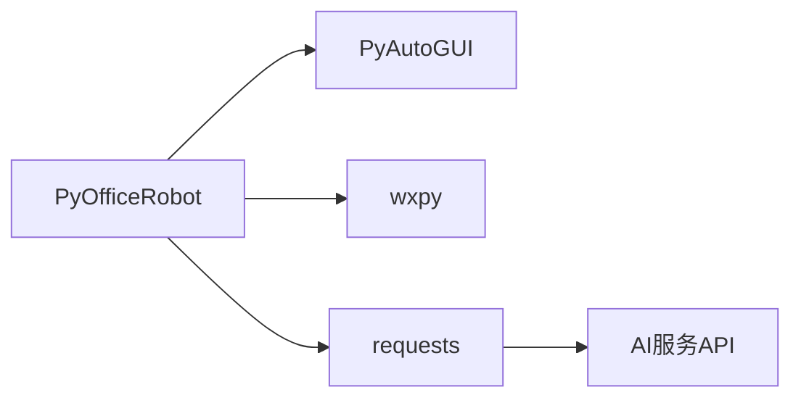

# 智能聊天机器人

<cite>
**本文档中引用的文件**  
- [011-chat_chatgpt.py](file://examples/PyOfficeRobot/011-chat_chatgpt.py)
- [012、智能聊天.py](file://examples/PyOfficeRobot/012、智能聊天.py)
- [wechat.py](file://office/api/wechat.py)
- [chat.py](file://examples/porobot/chat.py)
</cite>

## 目录
1. [简介](#简介)
2. [项目结构](#项目结构)
3. [核心组件](#核心组件)
4. [架构概述](#架构概述)
5. [详细组件分析](#详细组件分析)
6. [依赖分析](#依赖分析)
7. [性能考虑](#性能考虑)
8. [故障排除指南](#故障排除指南)
9. [结论](#结论)

## 简介
本项目旨在提供一个简单易用的智能聊天机器人解决方案，通过集成AI模型（如ChatGPT）实现与用户的自然语言交互。系统支持微信平台上的自动化对话功能，用户只需一行代码即可启动智能聊天服务。该解决方案不仅适用于个人开发者，也适合企业级应用，能够显著提升工作效率和用户体验。

## 项目结构
该项目采用模块化设计，主要分为以下几个部分：核心API、示例代码、GUI界面以及测试用例。其中，`examples/PyOfficeRobot`目录下包含了多个实用的示例脚本，用于演示不同功能的使用方法；`office/api`目录则封装了各种办公自动化相关的API接口。

**图示来源**  
- [011-chat_chatgpt.py](file://examples/PyOfficeRobot/011-chat_chatgpt.py)
- [012、智能聊天.py](file://examples/PyOfficeRobot/012、智能聊天.py)
- [wechat.py](file://office/api/wechat.py)

**本节来源**  
- [011-chat_chatgpt.py](file://examples/PyOfficeRobot/011-chat_chatgpt.py)
- [012、智能聊天.py](file://examples/PyOfficeRobot/012、智能聊天.py)
- [wechat.py](file://office/api/wechat.py)

## 核心组件
智能聊天机器人的核心功能由`chat_robot`函数和`chat_by_gpt`函数构成。这两个函数分别提供了基础的聊天机器人能力和基于AI模型的高级对话能力。通过调用这些函数，开发者可以轻松地将智能对话功能集成到自己的应用程序中。

**本节来源**  
- [011-chat_chatgpt.py](file://examples/PyOfficeRobot/011-chat_chatgpt.py#L7)
- [012、智能聊天.py](file://examples/PyOfficeRobot/012、智能聊天.py#L7)
- [wechat.py](file://office/api/wechat.py#L84-L93)

## 架构概述
整个系统的架构围绕着PyOfficeRobot库展开，该库作为连接底层操作系统和上层应用的桥梁，提供了丰富的API接口。当用户发送消息时，系统会首先通过`receive_message`函数捕获输入，然后根据配置选择是否调用AI模型进行处理，最后通过`send_message`函数将响应返回给用户。

**图示来源**  
- [011-chat_chatgpt.py](file://examples/PyOfficeRobot/011-chat_chatgpt.py#L7)
- [wechat.py](file://office/api/wechat.py#L5-L15)

## 详细组件分析
### chat_robot函数分析
`chat_robot`函数是实现基础聊天功能的核心。它接收一个参数`who`，表示聊天对象的名称或备注。此函数内部调用了PyOfficeRobot库中的相应方法来完成消息的接收与发送。

#### 功能特点
- 支持指定聊天对象
- 自动化消息处理流程
- 易于集成到现有项目中

**图示来源**  
- [wechat.py](file://office/api/wechat.py#L84-L93)

**本节来源**  
- [wechat.py](file://office/api/wechat.py#L84-L93)
- [012、智能聊天.py](file://examples/PyOfficeRobot/012、智能聊天.py#L7)

### chat_by_gpt函数分析
`chat_by_gpt`函数扩展了基本的聊天功能，通过集成外部AI服务（如ChatGPT），实现了更加智能化的对话体验。开发者需要提供API密钥以访问AI服务。

#### 集成方式
- 使用API密钥认证
- 将用户输入转发至AI服务
- 获取并返回AI生成的回复

**图示来源**  
- [011-chat_chatgpt.py](file://examples/PyOfficeRobot/011-chat_chatgpt.py#L7)
- [wechat.py](file://office/api/wechat.py#L84-L93)

**本节来源**  
- [011-chat_chatgpt.py](file://examples/PyOfficeRobot/011-chat_chatgpt.py#L7)
- [wechat.py](file://office/api/wechat.py#L84-L93)

## 依赖分析
本项目依赖于PyOfficeRobot库及其他相关组件。通过分析`requirements.txt`文件可知，主要依赖包括但不限于：PyAutoGUI、wxpy等。这些库共同支撑起了整个自动化办公生态系统。

**图示来源**  
- [wechat.py](file://office/api/wechat.py)
- [011-chat_chatgpt.py](file://examples/PyOfficeRobot/011-chat_chatgpt.py)

**本节来源**  
- [wechat.py](file://office/api/wechat.py)
- [011-chat_chatgpt.py](file://examples/PyOfficeRobot/011-chat_chatgpt.py)

## 性能考虑
在实际部署过程中，需要注意以下几点以确保系统稳定高效运行：
- **响应延迟**：由于涉及到网络请求，AI模型的响应时间可能会影响用户体验。建议优化网络连接或采用缓存机制减少重复请求。
- **上下文保持**：为了实现连贯的对话，需要妥善管理对话历史记录。可以通过数据库或内存存储来实现。
- **自然语言理解**：虽然AI模型具备较强的语义理解能力，但仍需针对特定场景进行微调以提高准确率。

## 故障排除指南
遇到问题时，请参考以下步骤进行排查：
1. 检查API密钥是否正确配置
2. 确认网络连接正常
3. 查看日志文件获取详细错误信息
4. 更新至最新版本的PyOfficeRobot库

**本节来源**  
- [011-chat_chatgpt.py](file://examples/PyOfficeRobot/011-chat_chatgpt.py)
- [wechat.py](file://office/api/wechat.py)

## 结论
通过本文档的介绍，我们全面了解了如何利用`chat_robot`函数与AI模型（如ChatGPT）集成，构建一个端到端的智能聊天机器人系统。从简单的消息收发到复杂的自然语言处理，这套方案为开发者提供了强大的工具集。未来，随着技术的发展，我们可以期待更多创新的应用场景出现。