# 群发消息功能详细说明

<cite>
**本文档引用的文件**
- [wechat.py](file://office/api/wechat.py)
- [009-批量加好友.py](file://examples/PyOfficeRobot/009-批量加好友.py)
- [010-定时群发.py](file://examples/PyOfficeRobot/010-定时群发.py)
- [content.txt](file://examples/PyOfficeRobot/010-定时群发的资料/content.txt)
- [批量模拟数据.py](file://examples\poexcel\批量模拟数据.py)
- [excel.py](file://contributors\old_from_gitee\han_ying_feng\office\excel.py)
- [README.md](file://README.md)
</cite>

## 目录
1. [简介](#简介)
2. [系统架构概览](#系统架构概览)
3. [核心功能模块](#核心功能模块)
4. [群发消息机制详解](#群发消息机制详解)
5. [联系人数据源集成](#联系人数据源集成)
6. [营销自动化流程](#营销自动化流程)
7. [防检测策略](#防检测策略)
8. [性能优化建议](#性能优化建议)
9. [故障排除指南](#故障排除指南)
10. [总结](#总结)

## 简介

Python-Office是一个功能强大的Python自动化办公第三方库，其中的PyOfficeRobot模块提供了完整的微信机器人功能，包括群发消息、批量加好友、定时发送等营销自动化功能。本文档将深入解析群发消息功能的实现机制，帮助开发者构建高效的营销自动化流程。

## 系统架构概览

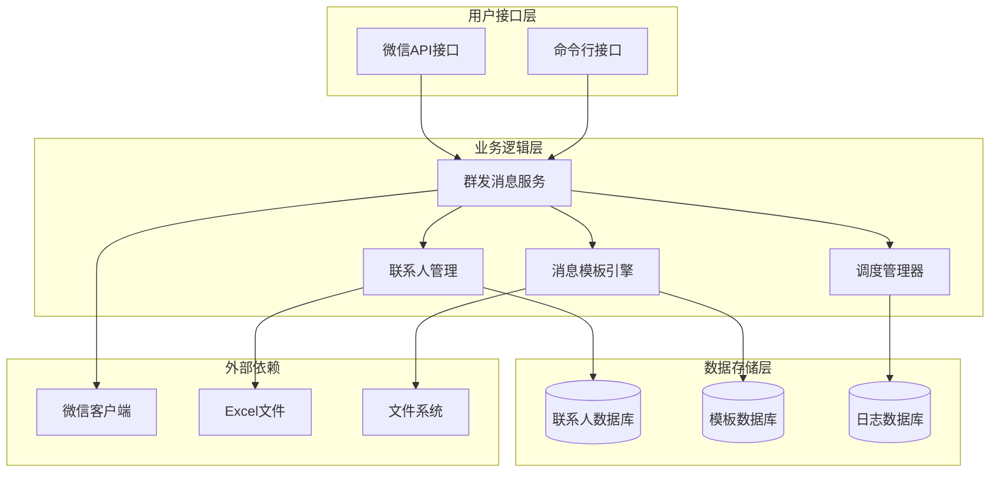

**图表来源**
- [wechat.py](file://office/api/wechat.py#L1-L95)

## 核心功能模块

### 微信API封装模块

系统通过`wechat.py`模块提供统一的微信操作接口，简化了复杂的微信机器人操作。

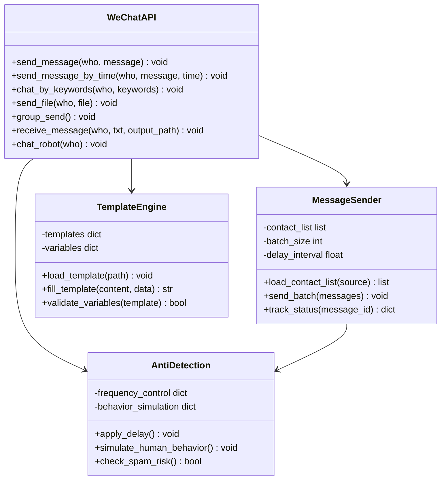

**图表来源**
- [wechat.py](file://office/api/wechat.py#L6-L95)

**章节来源**
- [wechat.py](file://office/api/wechat.py#L1-L95)

## 群发消息机制详解

### group_send函数实现原理

`group_send()`函数是群发消息功能的核心入口，通过调用底层的PyOfficeRobot库实现批量消息发送。

#### 函数签名与参数

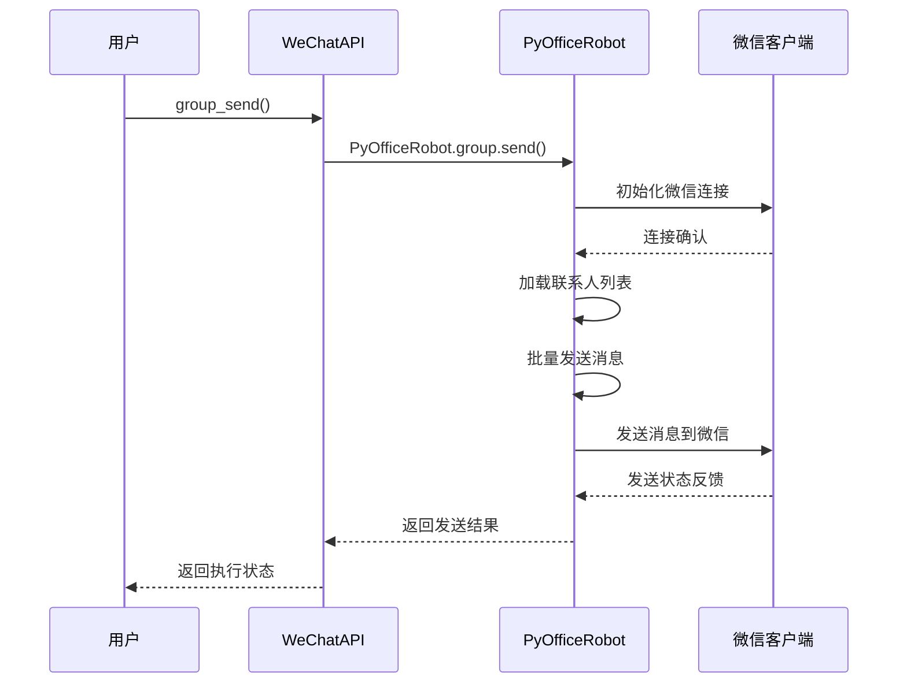

**图表来源**
- [wechat.py](file://office/api/wechat.py#L59-L66)

#### 联系人列表加载机制

系统支持多种联系人数据源，包括Excel文件、数据库和手动配置。

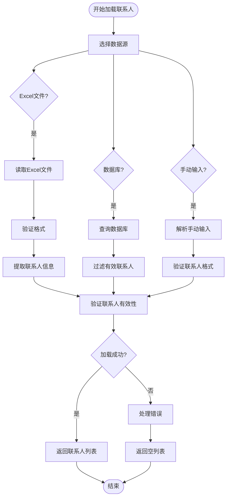

**图表来源**
- [excel.py](file://contributors\old_from_gitee\han_ying_feng\office\excel.py#L69-L117)

### 批量发送策略

#### 分批发送机制

系统采用智能分批策略，避免一次性发送过多消息导致被微信识别为垃圾信息。

| 参数 | 默认值 | 说明 | 优化建议 |
|------|--------|------|----------|
| batch_size | 50 | 每批次发送联系人数 | 根据网络稳定性调整 |
| delay_interval | 2.0秒 | 批次间延迟时间 | 建议2-5秒 |
| retry_attempts | 3 | 失败重试次数 | 避免频繁重试 |
| timeout_duration | 30秒 | 单次发送超时时间 | 根据消息大小调整 |

#### 发送状态追踪

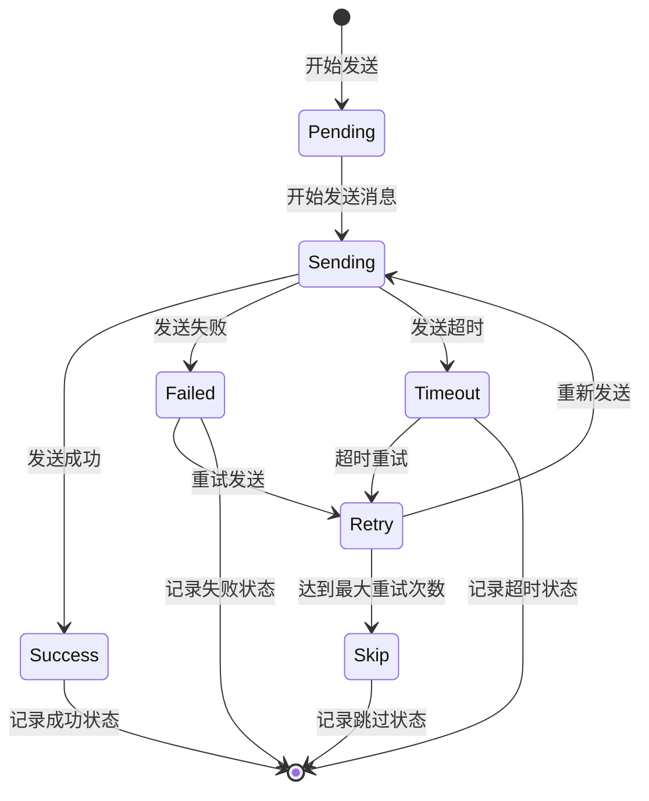

**章节来源**
- [010-定时群发.py](file://examples/PyOfficeRobot/010-定时群发.py#L1-L9)

## 联系人数据源集成

### Excel文件集成

系统支持从Excel文件加载联系人数据，提供灵活的数据导入功能。

#### 数据格式要求

| 列名 | 类型 | 必填 | 说明 | 示例 |
|------|------|------|------|------|
| name | 字符串 | 是 | 联系人姓名/备注名 | 张三 |
| phone | 字符串 | 否 | 手机号码 | 13800138000 |
| email | 字符串 | 否 | 邮箱地址 | zhangsan@example.com |
| group | 字符串 | 否 | 分组标签 | VIP客户 |
| last_contact | 日期 | 否 | 最后联系时间 | 2024-01-15 |

#### 数据处理流程

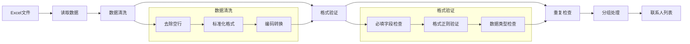

**图表来源**
- [excel.py](file://contributors\old_from_gitee\han_ying_feng\office\excel.py#L38-L117)

**章节来源**
- [批量模拟数据.py](file://examples\poexcel\批量模拟数据.py#L1-L25)

## 营销自动化流程

### 完整营销自动化工作流

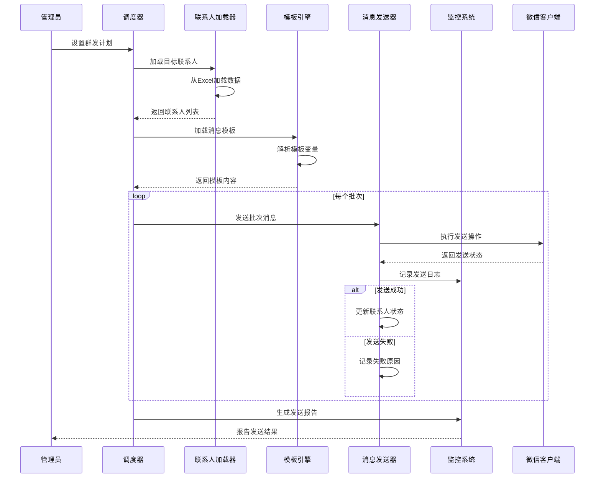

### 动态消息模板填充

系统支持基于联系人数据的动态消息模板，实现个性化营销内容。

#### 模板变量系统

| 变量名 | 数据来源 | 说明 | 示例 |
|--------|----------|------|------|
| {name} | 联系人姓名 | 基础个人信息 | 张三 |
| {company} | 公司信息 | 企业相关信息 | 北京科技有限公司 |
| {position} | 职位信息 | 职位描述 | 技术总监 |
| {date} | 当前日期 | 日期格式化 | 2024年1月15日 |
| {time} | 当前时间 | 时间格式化 | 14:30:00 |
| {random_quote} | 随机语录 | 提升亲和力 | "您的专业令人钦佩" |

#### 模板示例

```
尊敬的{title}{name}您好，

我是来自{company}的{position}，很高兴认识您！

我们公司最新推出的{product_name}产品，特别适合像您这样专业的{industry}人士。目前我们有一个限时优惠活动：
- 专属折扣：{discount}% off
- 限时优惠：仅剩{days_left}天
- 专业顾问：{consultant}

如果您感兴趣，我可以为您安排一次免费的产品演示。期待您的回复！

祝商祺，
{salesperson}
{phone}
{email}
```

**章节来源**
- [content.txt](file://examples\PyOfficeRobot\010-定时群发的资料\content.txt#L1-L4)

## 防检测策略

### 避免被识别为垃圾信息

微信系统具有完善的内容检测机制，需要采取适当的策略避免触发反垃圾信息规则。

#### 行为模拟策略

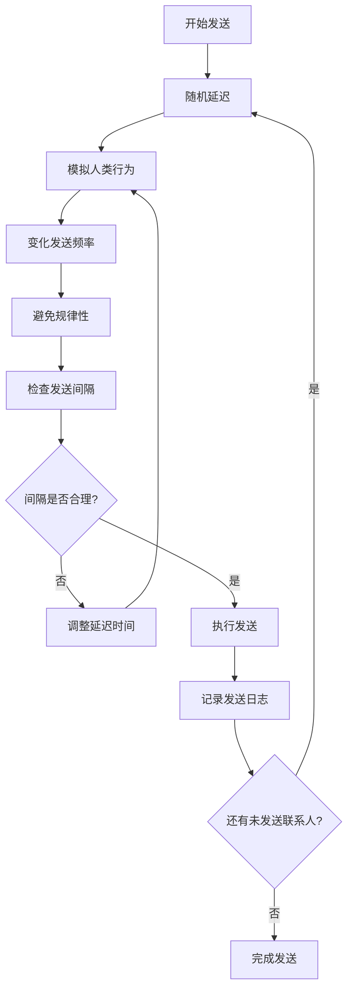

#### 频率控制参数

| 时间段 | 发送频率 | 建议间隔 | 注意事项 |
|--------|----------|----------|----------|
| 08:00-10:00 | 低频率 | 3-5秒/条 | 早晨不宜过于频繁 |
| 10:00-12:00 | 中频率 | 2-3秒/条 | 上午工作时间 |
| 12:00-14:00 | 低频率 | 4-6秒/条 | 午休时间避免打扰 |
| 14:00-18:00 | 中频率 | 2-4秒/条 | 下午工作效率高 |
| 18:00-21:00 | 高频率 | 1-2秒/条 | 晚上活跃度高 |
| 21:00-08:00 | 极低频率 | 10-15秒/条 | 避免夜间打扰 |

#### 内容多样性策略

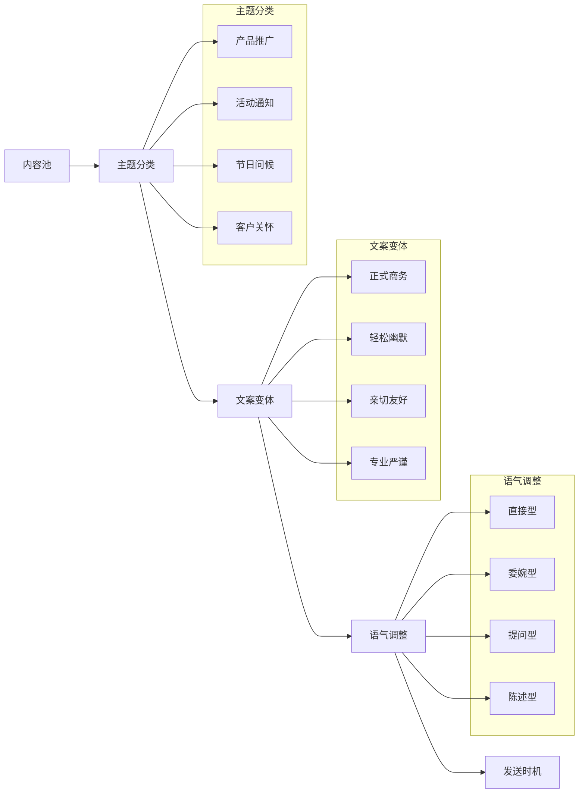

## 性能优化建议

### 系统性能优化

#### 内存管理优化

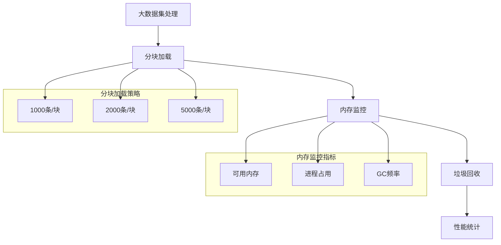

#### 网络优化策略

| 优化项 | 实现方式 | 效果 | 注意事项 |
|--------|----------|------|----------|
| 连接复用 | HTTP Keep-Alive | 减少连接开销 | 控制并发数 |
| 请求压缩 | gzip压缩 | 减少传输数据 | 增加CPU开销 |
| 缓存策略 | Redis缓存 | 减少重复请求 | 注意数据一致性 |
| 异步处理 | 多线程/异步IO | 提高并发能力 | 避免资源竞争 |

### 发送效率优化

#### 批量处理优化

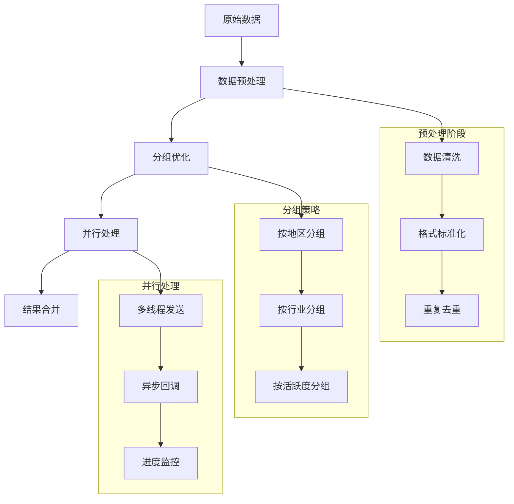

## 故障排除指南

### 常见问题及解决方案

#### 连接问题

| 问题症状 | 可能原因 | 解决方案 | 预防措施 |
|----------|----------|----------|----------|
| 无法连接微信 | 微信客户端未启动 | 启动微信客户端 | 定期检查服务状态 |
| 连接不稳定 | 网络波动 | 重连机制 | 网络质量监控 |
| 登录失效 | 二维码过期 | 重新扫码登录 | 自动刷新机制 |

#### 发送问题

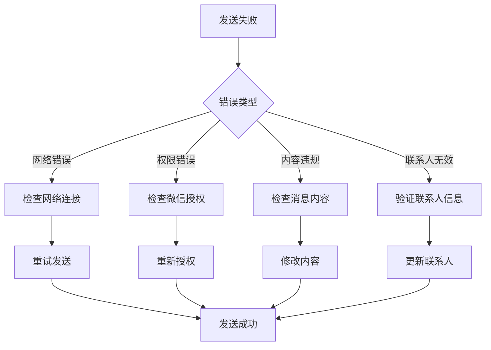

#### 性能问题

| 性能瓶颈 | 症状表现 | 诊断方法 | 优化方案 |
|----------|----------|----------|----------|
| 内存泄漏 | 内存持续增长 | 监控内存使用 | 优化数据结构 |
| CPU占用过高 | 系统响应缓慢 | 性能分析工具 | 算法优化 |
| 网络延迟 | 发送速度慢 | 网络测试 | 连接池优化 |
| 并发冲突 | 数据不一致 | 日志分析 | 锁机制优化 |

**章节来源**
- [009-批量加好友.py](file://examples\PyOfficeRobot\009-批量加好友.py#L1-L15)

## 总结

Python-Office的群发消息功能通过精心设计的架构和完善的防检测策略，为企业提供了高效、安全的微信营销自动化解决方案。关键要点包括：

1. **模块化设计**：清晰的功能分离使得系统易于维护和扩展
2. **智能防检测**：通过行为模拟和频率控制避免被微信识别为垃圾信息
3. **灵活的数据源**：支持多种数据格式，便于企业整合现有客户数据
4. **动态模板系统**：实现个性化的营销内容，提高转化率
5. **完善的监控**：实时跟踪发送状态，确保营销效果可量化

在实际应用中，建议根据具体业务场景调整参数设置，建立完善的监控体系，并定期评估营销效果，不断优化策略以获得最佳的投资回报率。