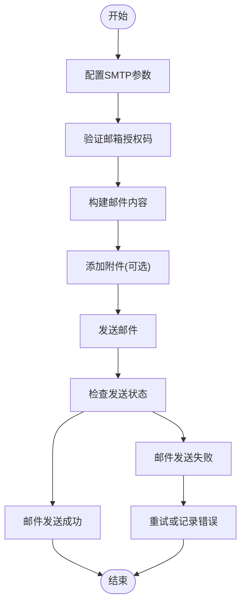
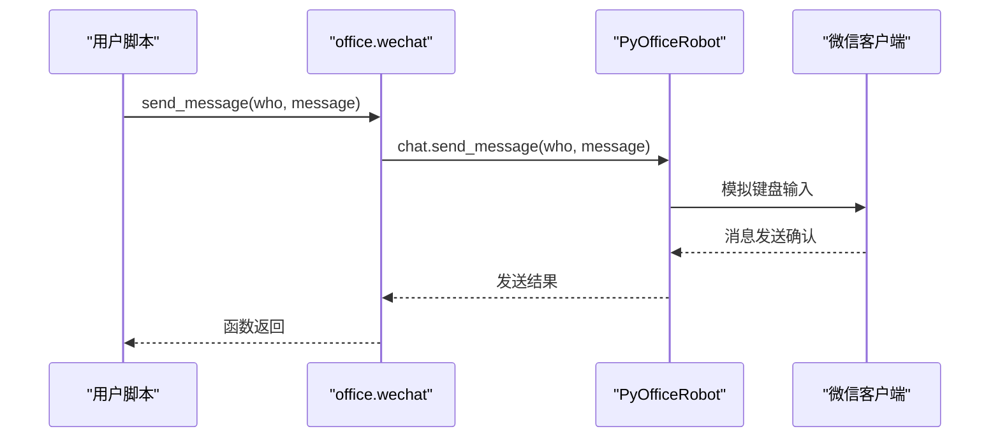
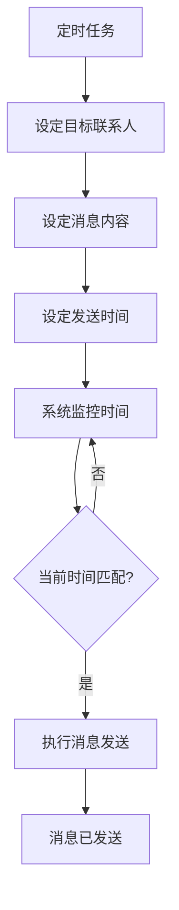

# 自动化通信

<cite>
**本文档中引用的文件**   
- [email.py](file://office/api/email.py)
- [wechat.py](file://office/api/wechat.py)
- [发送邮件.py](file://examples/poemail/发送邮件.py)
- [001-发一条信息.py](file://examples/PyOfficeRobot/001-发一条信息.py)
- [002-发文件.py](file://examples/PyOfficeRobot/002-发文件.py)
- [003-根据关键词回复.py](file://examples/PyOfficeRobot/003-根据关键词回复.py)
- [004-定时发送.py](file://examples/PyOfficeRobot/004-定时发送.py)
- [005-自定义功能.py](file://examples/PyOfficeRobot/005-自定义功能.py)
- [008-发消息换行.py](file://examples/PyOfficeRobot/008-发消息换行.py)
- [009-批量加好友.py](file://examples/PyOfficeRobot/009-批量加好友.py)
- [010-定时群发.py](file://examples/PyOfficeRobot/010-定时群发.py)
- [@AutomationLog.txt](file://examples/PyOfficeRobot/@AutomationLog.txt)
</cite>

## 目录
1. [简介](#简介)
2. [邮件自动化功能](#邮件自动化功能)
3. [微信机器人功能](#微信机器人功能)
4. [会话保持与登录机制](#会话保持与登录机制)
5. [安全性注意事项](#安全性注意事项)
6. [故障排查指南](#故障排查指南)
7. [总结](#总结)

## 简介
本项目提供了一套完整的自动化通信解决方案，涵盖邮件发送和微信机器人两大核心功能。通过`python-office`库，用户可以轻松实现邮件的自动发送与接收，以及微信消息的自动化处理。系统基于SMTP协议实现邮件功能，并通过模拟用户操作实现微信自动化，无需依赖网页版微信，适用于所有微信用户。

## 邮件自动化功能

`python-office`提供了简洁的邮件发送接口，封装了SMTP协议的复杂性，使用户能够快速实现邮件自动化功能。核心功能通过`office.api.email`模块提供。

### SMTP配置与邮件发送
邮件发送功能的核心是SMTP配置。用户需要配置邮箱的SMTP服务并获取授权码。系统支持多种邮箱服务商，通过`Mail_Type`常量预设了常见邮箱的服务器配置。

**图源**
- [email.py](file://office/api/email.py#L9-L34)
- [发送邮件.py](file://examples/poemail/发送邮件.py#L23-L25)

### 附件添加与HTML邮件构建
系统支持邮件附件的添加，通过`attach_files`参数可以指定一个或多个附件文件路径。对于HTML格式的邮件内容，用户可以直接在`content`参数中使用HTML标签来构建富文本邮件，实现更丰富的邮件展示效果。

**节源**
- [email.py](file://office/api/email.py#L9-L34)
- [发送邮件.py](file://examples/poemail/发送邮件.py#L27-L34)

## 微信机器人功能

微信自动化功能通过`PyOfficeRobot`库实现，提供了丰富的API接口，支持消息收发、文件传输、群组管理等多种场景。

### 消息收发功能
系统提供了简单易用的消息发送接口，支持向指定联系人发送文本消息。通过`send_message`函数，只需指定接收人名称和消息内容即可完成发送。

**图源**
- [wechat.py](file://office/api/wechat.py#L6-L16)
- [001-发一条信息.py](file://examples/PyOfficeRobot/001-发一条信息.py#L48-L52)

### 群组管理与定时任务
系统支持群发消息和定时发送功能。通过`group_send`函数可以实现向多个联系人批量发送消息，而`send_message_by_time`函数则允许用户设定特定时间自动发送消息，实现定时提醒或定期通知的功能。

**图源**
- [wechat.py](file://office/api/wechat.py#L19-L30)
- [004-定时发送.py](file://examples/PyOfficeRobot/004-定时发送.py#L8)
- [010-定时群发.py](file://examples/PyOfficeRobot/010-定时群发.py#L8)

### 高级功能应用实例
系统还支持更复杂的自动化场景，如根据关键词自动回复、批量添加好友等。这些功能通过组合基础API实现智能化的微信交互。

**节源**
- [003-根据关键词回复.py](file://examples/PyOfficeRobot/003-根据关键词回复.py#L7-L14)
- [009-批量加好友.py](file://examples/PyOfficeRobot/009-批量加好友.py#L7-L12)
- [005-自定义功能.py](file://examples/PyOfficeRobot/005-自定义功能.py#L8-L14)

## 会话保持与登录机制

系统采用客户端模拟的方式实现微信自动化，不依赖网页版微信的会话机制。用户需要在本地运行微信客户端，系统通过识别微信界面元素来执行操作。

### 二维码登录流程
首次使用时，系统会引导用户通过手机微信扫描二维码完成身份验证。这一过程与常规微信登录流程一致，确保了账号的安全性。登录成功后，系统会保持会话状态，直到用户主动退出或微信客户端关闭。

### 会话保持机制
系统通过监控微信客户端的运行状态来维持会话。只要微信客户端保持运行，自动化功能就可以持续工作。与网页版微信机器人不同，这种基于客户端的方案不受网页版微信可用性限制，适用于所有微信用户。

**节源**
- [wechat.py](file://office/api/wechat.py#L4-L94)
- [@AutomationLog.txt](file://examples/PyOfficeRobot/@AutomationLog.txt#L1-L84)

## 安全性注意事项

### 邮箱安全
使用邮件功能时，建议使用邮箱授权码而非账户密码。授权码可以在邮箱设置中生成，具有更细粒度的权限控制，即使泄露也不会影响账户安全。

### 微信账号安全
微信自动化基于客户端模拟，不会上传用户数据到第三方服务器。所有操作都在本地完成，保证了用户隐私安全。但需注意，频繁的自动化操作可能触发微信的安全机制，建议合理设置操作间隔。

**节源**
- [发送邮件.py](file://examples/poemail/发送邮件.py#L43-L45)
- [wechat.py](file://office/api/wechat.py#L4-L94)

## 故障排查指南

### 网络超时问题
当遇到网络超时错误时，可能是由于网络连接不稳定或服务器响应缓慢。建议检查网络连接，或尝试在不同时间段重新执行操作。

### 账号限制问题
部分功能可能因账号权限限制而无法使用。对于邮件功能，确保已开启SMTP服务并正确配置授权码；对于微信功能，确保微信客户端正常运行且已登录。

### 元素识别失败
微信自动化可能因界面元素变化而导致操作失败。查看`@AutomationLog.txt`日志文件可以帮助诊断问题，常见的"Find Control Timeout"错误表明系统无法识别预期的界面元素。

**节源**
- [@AutomationLog.txt](file://examples/PyOfficeRobot/@AutomationLog.txt#L1-L84)
- [wechat.py](file://office/api/wechat.py#L4-L94)

## 总结
`python-office`提供了一套完整的自动化通信解决方案，通过简洁的API接口降低了技术门槛。邮件功能基于标准的SMTP协议，支持丰富的邮件格式和附件处理；微信机器人功能则突破了网页版微信的限制，实现了真正的全用户覆盖。系统设计注重安全性和稳定性，同时提供了详细的错误日志和排查指南，帮助用户快速解决问题。