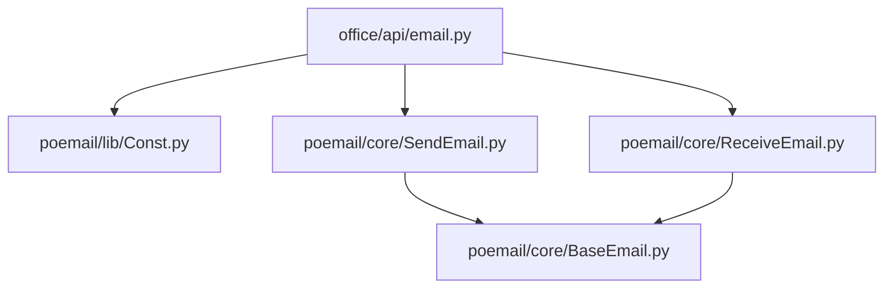
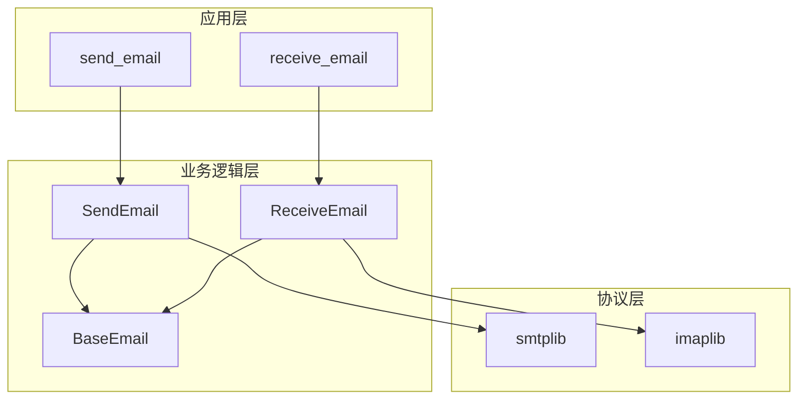
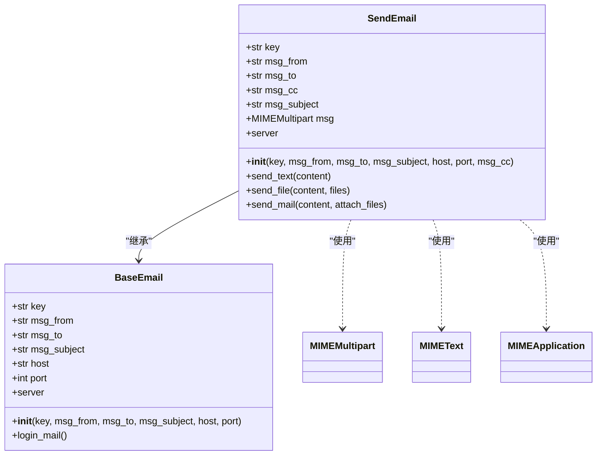
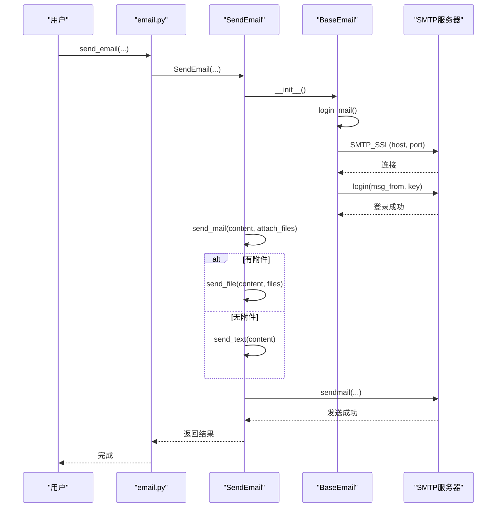
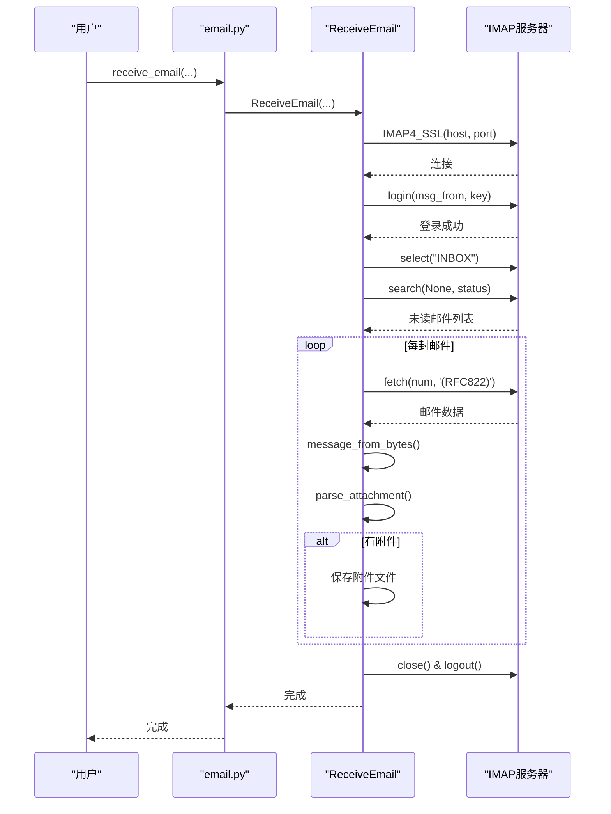
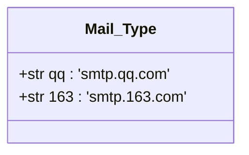
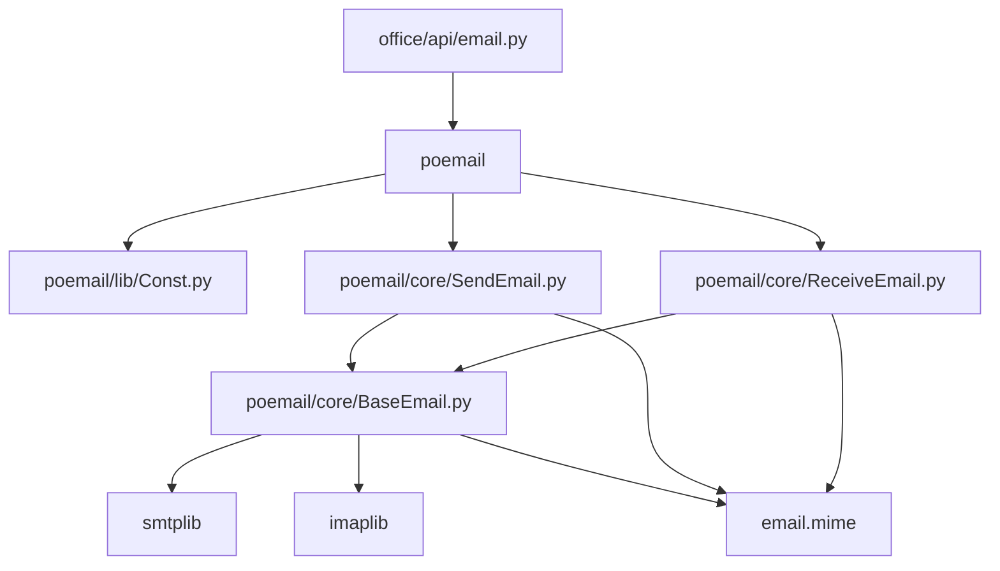

# 邮件自动化

<cite>
**本文档中引用的文件**  
- [email.py](file://office/api/email.py)
- [发送邮件.py](file://examples/poemail/发送邮件.py)
- [Const.py](file://venv/Lib/site-packages/poemail/lib/Const.py)
- [BaseEmail.py](file://venv/Lib/site-packages/poemail/core/BaseEmail.py)
- [SendEmail.py](file://venv/Lib/site-packages/poemail/core/SendEmail.py)
- [ReceiveEmail.py](file://venv/Lib/site-packages/poemail/core/ReceiveEmail.py)
</cite>

## 目录
1. [简介](#简介)
2. [项目结构](#项目结构)
3. [核心组件](#核心组件)
4. [架构概述](#架构概述)
5. [详细组件分析](#详细组件分析)
6. [依赖分析](#依赖分析)
7. [性能考虑](#性能考虑)
8. [故障排除指南](#故障排除指南)
9. [结论](#结论)

## 简介
本文档详细解析`python-office`项目中的邮件自动化功能，重点分析`email.py`模块中`send_email`与`receive_email`两个核心接口的实现机制。文档涵盖SMTP服务器配置、密钥认证方式、抄送功能、附件支持及邮件内容构建策略，并结合示例代码说明使用方法和最佳实践。

## 项目结构
邮件自动化功能主要分布在`office/api/email.py`中，通过封装`poemail`库提供高层接口。配置常量定义在`poemail/lib/Const.py`中，核心逻辑实现在`poemail/core/`目录下的`BaseEmail.py`、`SendEmail.py`和`ReceiveEmail.py`文件中。示例代码位于`examples/poemail/发送邮件.py`。

**图示来源**  
- [email.py](file://office/api/email.py)
- [Const.py](file://venv/Lib/site-packages/poemail/lib/Const.py)
- [SendEmail.py](file://venv/Lib/site-packages/poemail/core/SendEmail.py)
- [ReceiveEmail.py](file://venv/Lib/site-packages/poemail/core/ReceiveEmail.py)
- [BaseEmail.py](file://venv/Lib/site-packages/poemail/core/BaseEmail.py)

**本节来源**  
- [email.py](file://office/api/email.py)
- [Const.py](file://venv/Lib/site-packages/poemail/lib/Const.py)

## 核心组件
`send_email`和`receive_email`是邮件自动化功能的两个核心接口，分别用于发送和接收电子邮件。这些接口基于`poemail`库构建，提供了简洁易用的API来处理常见的邮件操作任务。

**本节来源**  
- [email.py](file://office/api/email.py#L9-L44)

## 架构概述
邮件自动化功能采用分层架构设计，上层接口`email.py`提供用户友好的函数调用，中间层`poemail`库实现具体业务逻辑，底层使用Python标准库`smtplib`和`imaplib`进行网络通信。

**图示来源**  
- [email.py](file://office/api/email.py)
- [SendEmail.py](file://venv/Lib/site-packages/poemail/core/SendEmail.py)
- [ReceiveEmail.py](file://venv/Lib/site-packages/poemail/core/ReceiveEmail.py)
- [BaseEmail.py](file://venv/Lib/site-packages/poemail/core/BaseEmail.py)

## 详细组件分析

### 发送邮件功能分析
`send_email`接口通过调用`poemail.send.send_email`方法实现邮件发送功能，支持配置发件人、收件人、主题、内容、抄送和附件等参数。

#### 类图展示

**图示来源**  
- [SendEmail.py](file://venv/Lib/site-packages/poemail/core/SendEmail.py#L18-L81)
- [BaseEmail.py](file://venv/Lib/site-packages/poemail/core/BaseEmail.py#L11-L27)

#### 发送流程序列图

**图示来源**  
- [email.py](file://office/api/email.py#L9-L34)
- [SendEmail.py](file://venv/Lib/site-packages/poemail/core/SendEmail.py)
- [BaseEmail.py](file://venv/Lib/site-packages/poemail/core/BaseEmail.py)

**本节来源**  
- [email.py](file://office/api/email.py#L9-L35)
- [SendEmail.py](file://venv/Lib/site-packages/poemail/core/SendEmail.py)
- [BaseEmail.py](file://venv/Lib/site-packages/poemail/core/BaseEmail.py)

### 接收邮件功能分析
`receive_email`接口用于从邮箱服务器接收邮件，支持过滤未读邮件并保存附件。

#### 接收流程序列图

**图示来源**  
- [email.py](file://office/api/email.py#L37-L44)
- [ReceiveEmail.py](file://venv/Lib/site-packages/poemail/core/ReceiveEmail.py)

**本节来源**  
- [email.py](file://office/api/email.py#L37-L44)
- [ReceiveEmail.py](file://venv/Lib/site-packages/poemail/core/ReceiveEmail.py)

### 邮件类型常量分析
`Mail_Type`常量定义了不同邮箱服务商的SMTP服务器地址，便于用户快速配置。

**图示来源**  
- [Const.py](file://venv/Lib/site-packages/poemail/lib/Const.py#L19-L22)

**本节来源**  
- [Const.py](file://venv/Lib/site-packages/poemail/lib/Const.py#L19-L22)

## 依赖分析
邮件自动化功能依赖于多个Python标准库和第三方库，形成了清晰的依赖关系链。

**图示来源**  
- [email.py](file://office/api/email.py)
- [Const.py](file://venv/Lib/site-packages/poemail/lib/Const.py)
- [SendEmail.py](file://venv/Lib/site-packages/poemail/core/SendEmail.py)
- [ReceiveEmail.py](file://venv/Lib/site-packages/poemail/core/ReceiveEmail.py)
- [BaseEmail.py](file://venv/Lib/site-packages/poemail/core/BaseEmail.py)

**本节来源**  
- [email.py](file://office/api/email.py)
- [Const.py](file://venv/Lib/site-packages/poemail/lib/Const.py)
- [SendEmail.py](file://venv/Lib/site-packages/poemail/core/SendEmail.py)
- [ReceiveEmail.py](file://venv/Lib/site-packages/poemail/core/ReceiveEmail.py)
- [BaseEmail.py](file://venv/Lib/site-packages/poemail/core/BaseEmail.py)

## 性能考虑
邮件自动化功能在设计时考虑了以下性能因素：
- 使用SSL连接确保传输安全
- 批量处理邮件提高效率
- 合理的异常处理机制保证稳定性
- 内存友好的流式处理大附件

## 故障排除指南
### 常见问题及解决方案

| 问题 | 原因 | 解决方案 |
|------|------|----------|
| SSL连接失败 | 未启用SMTP服务 | 登录邮箱设置页面开启SMTP服务 |
| 授权码错误 | 使用了登录密码 | 获取并使用邮箱授权码而非登录密码 |
| 发送速度慢 | 网络延迟 | 检查网络连接，考虑使用本地代理 |
| 附件无法下载 | 文件名包含特殊字符 | 使用`fix_unsaved_char`函数处理文件名 |

### 安全最佳实践
- **使用环境变量存储敏感信息**：避免在代码中硬编码邮箱密码或授权码
- **限制权限**：为自动化任务创建专用邮箱账户，限制其权限
- **定期轮换密钥**：定期更换邮箱授权码以降低安全风险
- **日志脱敏**：确保日志中不记录敏感信息

**本节来源**  
- [email.py](file://office/api/email.py)
- [BaseEmail.py](file://venv/Lib/site-packages/poemail/core/BaseEmail.py)
- [ReceiveEmail.py](file://venv/Lib/site-packages/poemail/core/ReceiveEmail.py)

## 结论
`python-office`项目的邮件自动化功能提供了简洁高效的API接口，通过分层架构设计实现了发送和接收邮件的核心功能。系统支持多种邮箱服务商配置，具备良好的扩展性和安全性，配合详细的文档和示例代码，使开发者能够快速集成邮件自动化功能到自己的应用中。