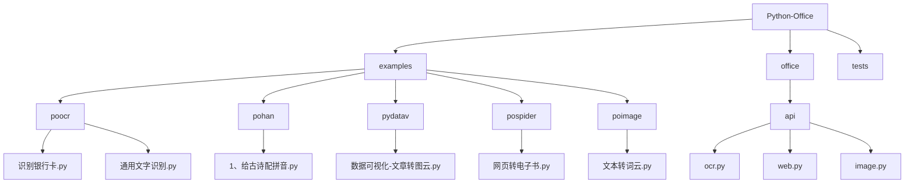
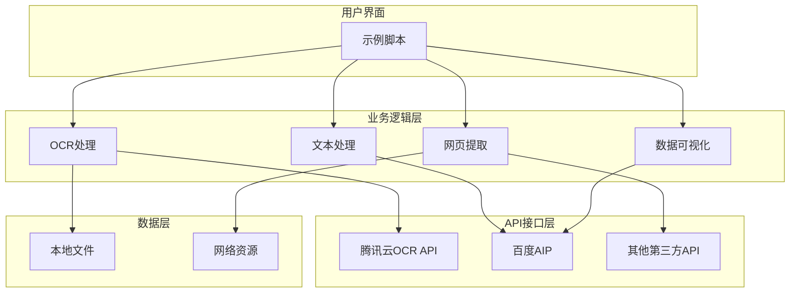
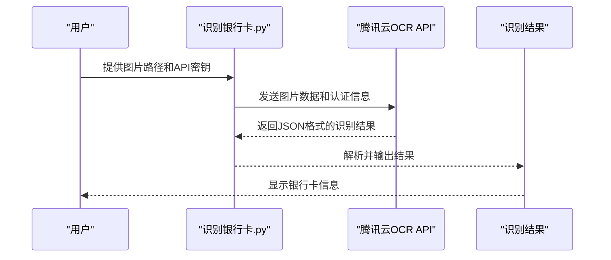
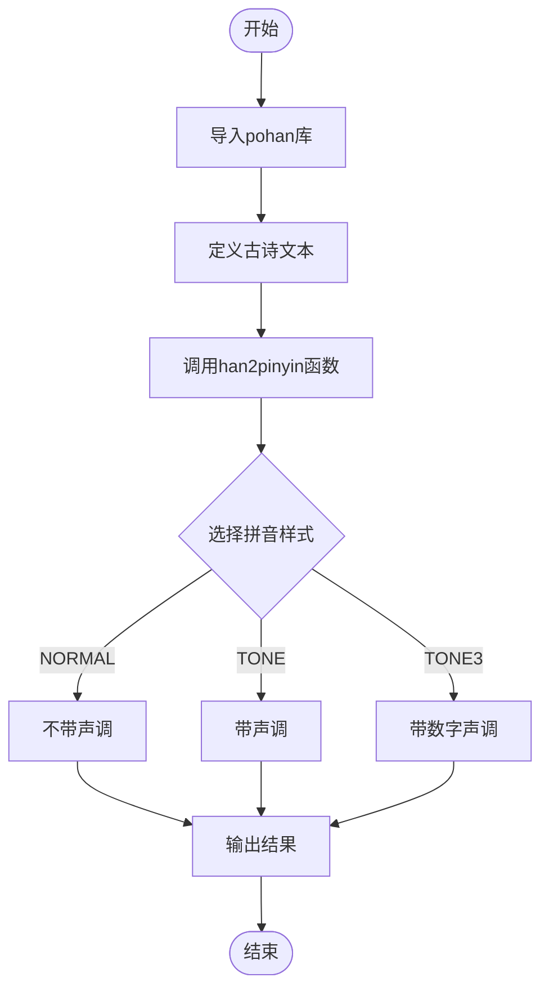
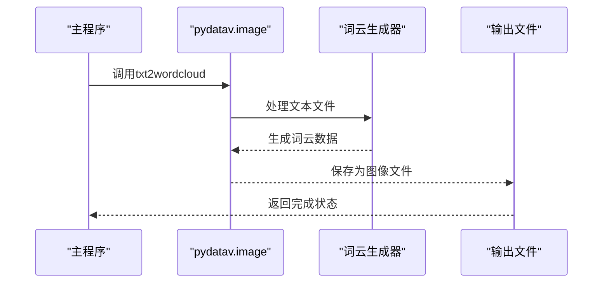
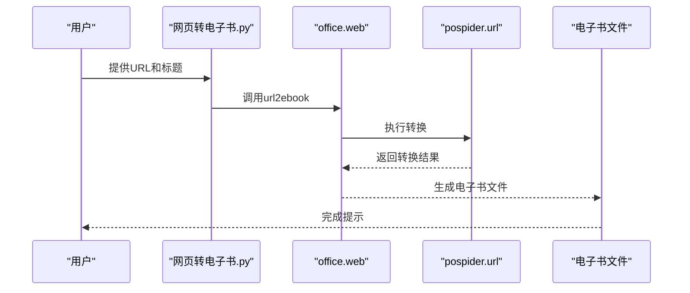
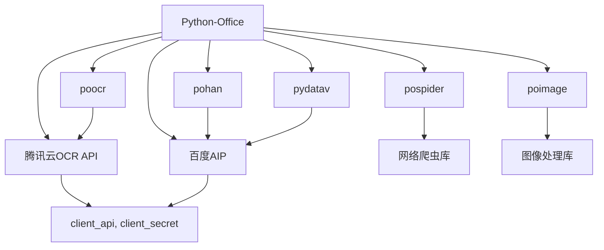

# AI集成示例

<cite>
**本文档中引用的文件**   
- [识别银行卡.py](file://examples/poocr/识别银行卡.py)
- [通用文字识别.py](file://examples/poocr/通用文字识别.py)
- [1、给古诗配拼音.py](file://examples/pohan/1、给古诗配拼音.py)
- [数据可视化-文章转图云.py](file://examples/pydatav/数据可视化-文章转图云.py)
- [网页转电子书.py](file://examples/pospider/网页转电子书.py)
- [txt2wordcloud.py](file://examples/poimage/文本转词云.py)
- [ocr.py](file://office/api/ocr.py)
- [web.py](file://office/api/web.py)
- [image.py](file://office/api/image.py)
- [ruiming.py](file://office/api/testApi/ruiming.py)
- [测试API功能演示.py](file://examples/poruiming/测试API功能演示.py)
- [test.txt](file://examples/pydatav/txt2wordcloud/test.txt)
</cite>

## 目录
1. [简介](#简介)
2. [项目结构](#项目结构)
3. [核心组件](#核心组件)
4. [架构概述](#架构概述)
5. [详细组件分析](#详细组件分析)
6. [依赖分析](#依赖分析)
7. [性能考虑](#性能考虑)
8. [故障排除指南](#故障排除指南)
9. [结论](#结论)

## 简介
本文档深入解析了Python-Office项目中的AI相关功能示例，涵盖OCR文字识别（银行卡、通用文本）、文本处理（古诗拼音标注）、网页内容提取与电子书生成、数据可视化（词云生成）等智能应用。文档说明了如何调用百度AIP、腾讯云等第三方API，处理认证、配额和响应解析。同时提供了预处理和后处理技巧以提升识别准确率，并展示了如何将AI能力嵌入到常规办公流程中，如自动提取发票信息或生成报告摘要。

## 项目结构
Python-Office项目是一个综合性的自动化办公工具库，其结构清晰地组织了各种功能模块。项目主要分为以下几个部分：

- **contributors**：包含社区贡献者的代码和示例
- **examples**：提供各种功能的使用示例，包括OCR、文本处理、图像处理、数据可视化等
- **gui**：图形用户界面相关代码
- **office**：核心功能模块，包含API接口和实现
- **tests**：测试代码和资源

AI相关功能主要分布在`examples`目录下的`poocr`、`pohan`、`pydatav`、`pospider`等子目录中，这些示例展示了如何将AI技术集成到日常办公任务中。

**图源**
- [识别银行卡.py](file://examples/poocr/识别银行卡.py)
- [通用文字识别.py](file://examples/poocr/通用文字识别.py)
- [1、给古诗配拼音.py](file://examples/pohan/1、给古诗配拼音.py)
- [数据可视化-文章转图云.py](file://examples/pydatav/数据可视化-文章转图云.py)
- [网页转电子书.py](file://examples/pospider/网页转电子书.py)
- [文本转词云.py](file://examples/poimage/文本转词云.py)

**节源**
- [识别银行卡.py](file://examples/poocr/识别银行卡.py)
- [通用文字识别.py](file://examples/poocr/通用文字识别.py)
- [1、给古诗配拼音.py](file://examples/pohan/1、给古诗配拼音.py)
- [数据可视化-文章转图云.py](file://examples/pydatav/数据可视化-文章转图云.py)
- [网页转电子书.py](file://examples/pospider/网页转电子书.py)

## 核心组件

本文档分析的核心组件包括：
- OCR文字识别功能：通过腾讯云API实现银行卡和通用文本的识别
- 文本处理功能：为古诗添加拼音标注
- 数据可视化功能：从文本生成词云图像
- 网页内容提取功能：将网页转换为电子书格式
- 图像处理功能：包括图片压缩、水印添加、卡通化等

这些组件共同构成了Python-Office项目中的AI功能集，为用户提供了一系列智能化的办公解决方案。

**节源**
- [识别银行卡.py](file://examples/poocr/识别银行卡.py)
- [通用文字识别.py](file://examples/poocr/通用文字识别.py)
- [1、给古诗配拼音.py](file://examples/pohan/1、给古诗配拼音.py)
- [数据可视化-文章转图云.py](file://examples/pydatav/数据可视化-文章转图云.py)
- [网页转电子书.py](file://examples/pospider/网页转电子书.py)

## 架构概述

Python-Office项目的AI功能架构采用分层设计，将API调用、业务逻辑和用户界面分离。核心架构如下：

**图源**
- [ocr.py](file://office/api/ocr.py)
- [web.py](file://office/api/web.py)
- [image.py](file://office/api/image.py)

**节源**
- [ocr.py](file://office/api/ocr.py)
- [web.py](file://office/api/web.py)
- [image.py](file://office/api/image.py)

## 详细组件分析

### OCR文字识别分析

#### 银行卡识别
银行卡识别功能通过调用腾讯云的OCR API实现，能够从银行卡照片中提取卡号、有效期等信息。

**图源**
- [识别银行卡.py](file://examples/poocr/识别银行卡.py)

**节源**
- [识别银行卡.py](file://examples/poocr/识别银行卡.py)

#### 通用文字识别
通用文字识别功能同样基于腾讯云OCR API，可以识别各种类型的文本内容。

**图源**
- [通用文字识别.py](file://examples/poocr/通用文字识别.py)

**节源**
- [通用文字识别.py](file://examples/poocr/通用文字识别.py)

### 文本处理分析

#### 古诗拼音标注
古诗拼音标注功能通过pohan库实现，为中文文本添加拼音标注，支持多种拼音样式。

**图源**
- [1、给古诗配拼音.py](file://examples/pohan/1、给古诗配拼音.py)

**节源**
- [1、给古诗配拼音.py](file://examples/pohan/1、给古诗配拼音.py)

### 数据可视化分析

#### 词云生成
词云生成功能从文本文件中提取关键词并生成可视化词云图像。

**图源**
- [数据可视化-文章转图云.py](file://examples/pydatav/数据可视化-文章转图云.py)
- [文本转词云.py](file://examples/poimage/文本转词云.py)

**节源**
- [数据可视化-文章转图云.py](file://examples/pydatav/数据可视化-文章转图云.py)
- [文本转词云.py](file://examples/poimage/文本转词云.py)

### 网页内容提取分析

#### 网页转电子书
网页转电子书功能将指定URL的网页内容转换为电子书格式。

**图源**
- [网页转电子书.py](file://examples/pospider/网页转电子书.py)
- [web.py](file://office/api/web.py)

**节源**
- [网页转电子书.py](file://examples/pospider/网页转电子书.py)
- [web.py](file://office/api/web.py)

## 依赖分析

Python-Office项目的AI功能依赖于多个外部服务和库，其依赖关系如下：

**图源**
- [ocr.py](file://office/api/ocr.py)
- [image.py](file://office/api/image.py)
- [web.py](file://office/api/web.py)

**节源**
- [ocr.py](file://office/api/ocr.py)
- [image.py](file://office/api/image.py)
- [web.py](file://office/api/web.py)

## 性能考虑

在使用AI功能时，需要考虑以下性能因素：

1. **API调用限制**：第三方API通常有调用频率和配额限制
2. **网络延迟**：远程API调用受网络状况影响
3. **图片预处理**：高质量的输入图片能提高识别准确率
4. **错误处理**：需要妥善处理API调用失败的情况
5. **缓存机制**：对重复内容的识别结果进行缓存可提高效率

建议在实际使用中实现适当的重试机制、错误日志记录和性能监控。

## 故障排除指南

### API认证问题
当遇到API认证失败时，请检查：
- API ID和密钥是否正确
- 是否已正确配置认证信息
- API服务是否正常运行

### 识别准确率问题
提高识别准确率的技巧：
- 使用高分辨率、清晰的图片
- 确保图片光线均匀，避免反光
- 对图片进行预处理（如裁剪、旋转、增强对比度）
- 在可能的情况下提供上下文信息

### 网络连接问题
当遇到网络连接问题时：
- 检查网络连接是否正常
- 验证API端点URL是否正确
- 检查防火墙设置是否阻止了API调用

**节源**
- [识别银行卡.py](file://examples/poocr/识别银行卡.py)
- [通用文字识别.py](file://examples/poocr/通用文字识别.py)
- [测试API功能演示.py](file://examples/poruiming/测试API功能演示.py)

## 结论

Python-Office项目通过集成多种AI功能，为用户提供了强大的自动化办公解决方案。这些功能不仅简化了日常办公任务，还通过智能化处理提高了工作效率。通过合理使用这些AI功能，用户可以将复杂的办公流程自动化，专注于更有价值的工作内容。

未来，建议进一步优化API调用效率，增加更多AI功能，并提供更完善的错误处理和用户体验。