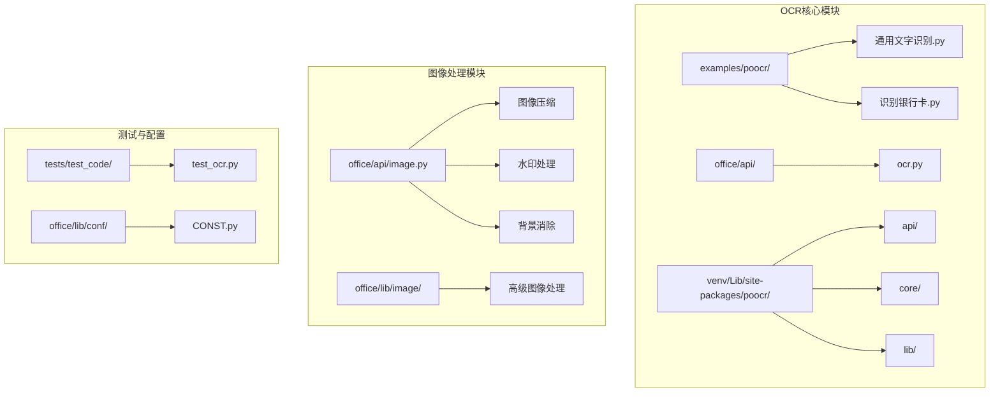
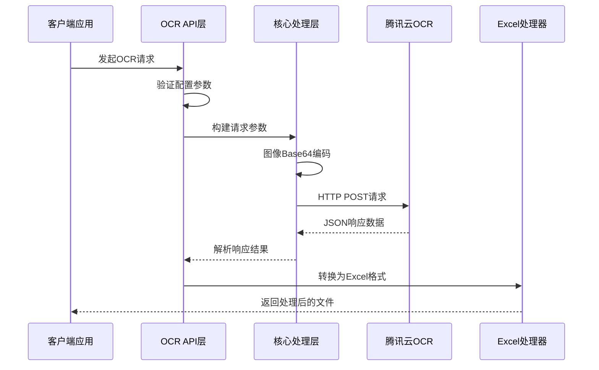
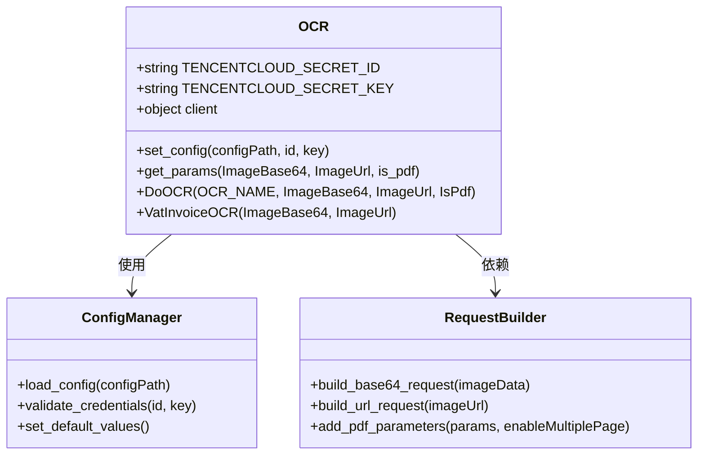
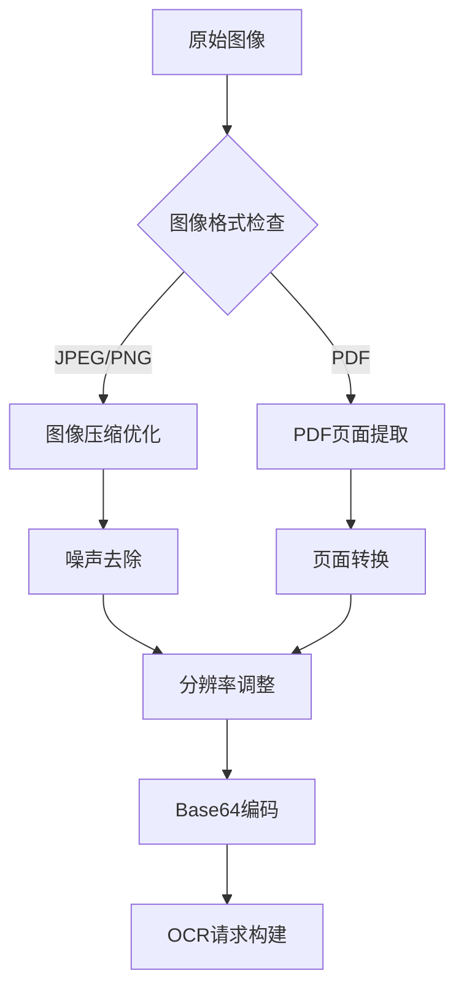
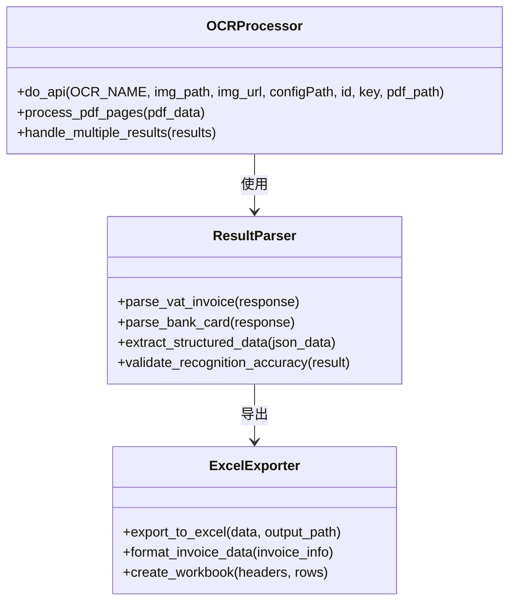
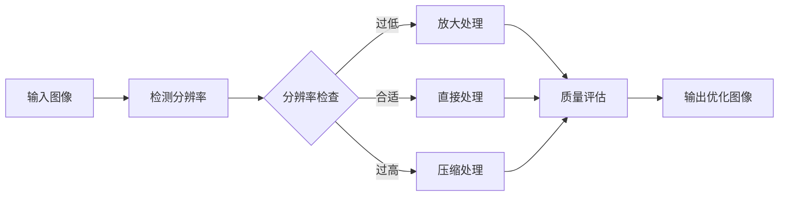
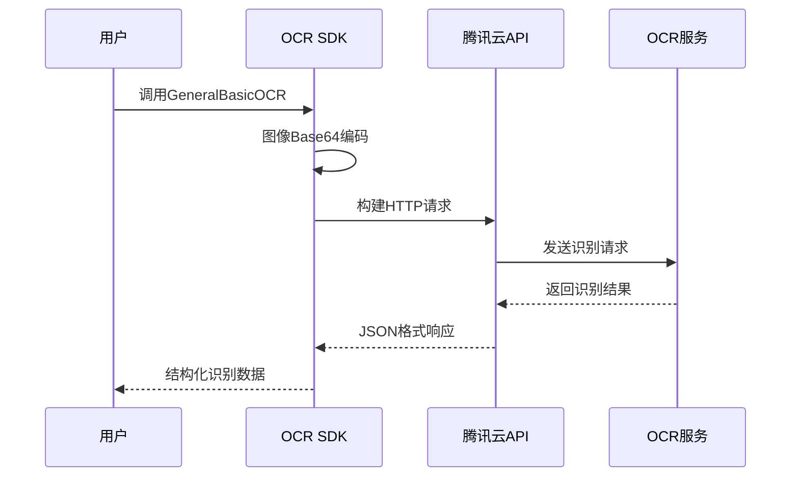
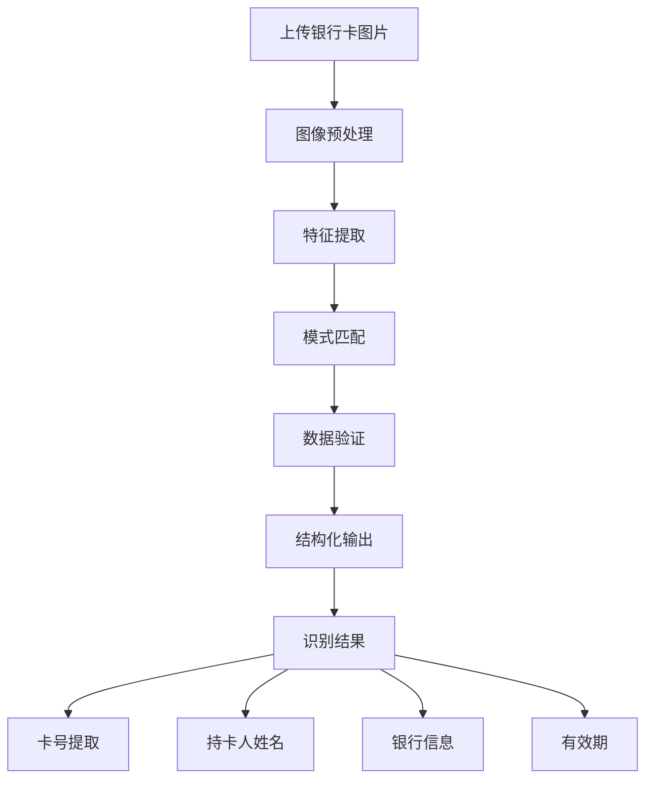
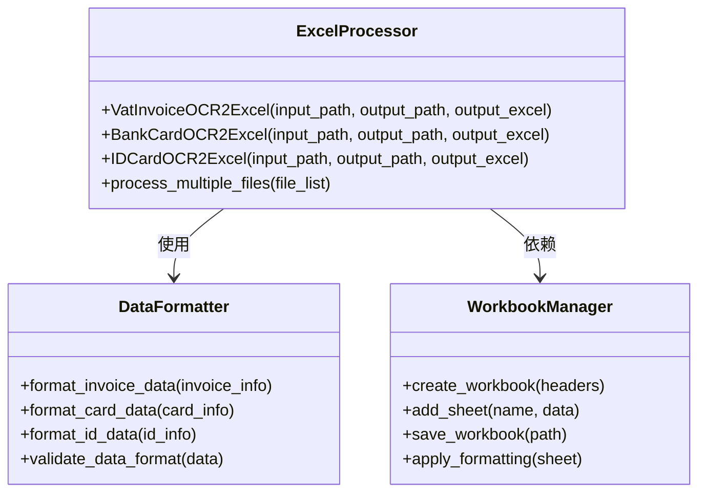
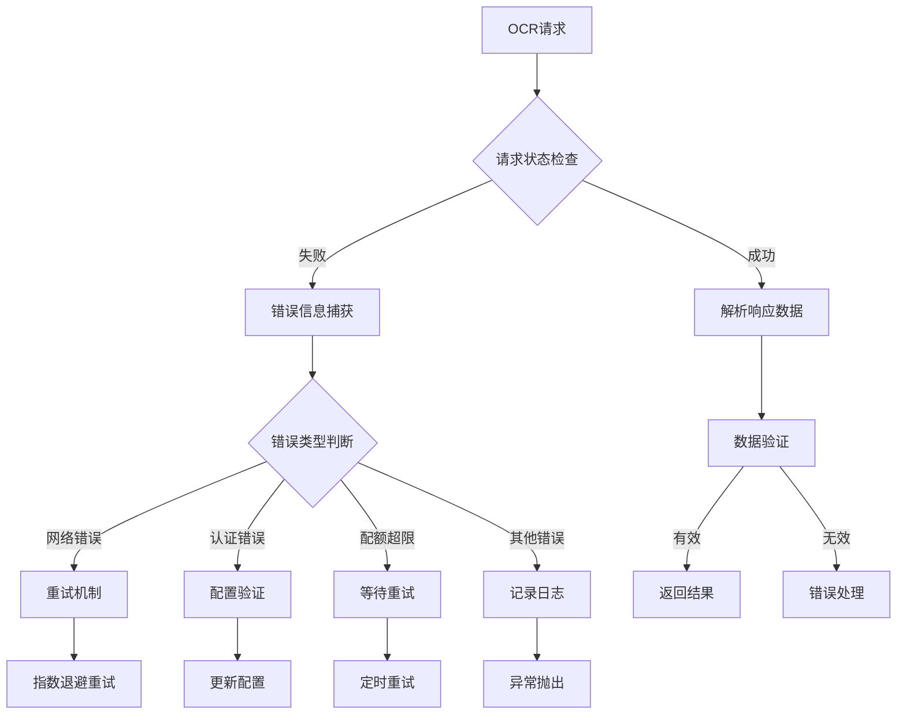

# OCR文字识别示例

<cite>
**本文档引用的文件**
- [examples/poocr/识别银行卡.py](file://examples/poocr/识别银行卡.py)
- [examples/poocr/通用文字识别.py](file://examples/poocr/通用文字识别.py)
- [office/api/ocr.py](file://office/api/ocr.py)
- [office/api/image.py](file://office/api/image.py)
- [office/api/testApi/ruiming.py](file://office/api/testApi/ruiming.py)
- [tests/test_code/test_ocr.py](file://tests/test_code/test_ocr.py)
- [venv/Lib/site-packages/poocr/api/ocr.py](file://venv/Lib/site-packages/poocr/api/ocr.py)
- [venv/Lib/site-packages/poocr/api/ocr2excel.py](file://venv/Lib/site-packages/poocr/api/ocr2excel.py)
- [venv/Lib/site-packages/poocr/core/OCR.py](file://venv/Lib/site-packages/poocr/core/OCR.py)
- [venv/Lib/site-packages/poocr/lib/CommonUtils.py](file://venv/Lib/site-packages/poocr/lib/CommonUtils.py)
- [office/lib/image/eliminate_background.py](file://office/lib/image/eliminate_background.py)
- [office/lib/image/add_watermark_service.py](file://office/lib/image/add_watermark_service.py)
</cite>

## 目录
1. [简介](#简介)
2. [项目结构](#项目结构)
3. [核心组件](#核心组件)
4. [架构概览](#架构概览)
5. [详细组件分析](#详细组件分析)
6. [配置与认证](#配置与认证)
7. [图像预处理](#图像预处理)
8. [OCR识别流程](#ocr识别流程)
9. [结果处理与导出](#结果处理与导出)
10. [错误处理与配额管理](#错误处理与配额管理)
11. [性能优化建议](#性能优化建议)
12. [故障排除指南](#故障排除指南)
13. [总结](#总结)

## 简介

本文档深入解析基于百度AIP和腾讯云OCR服务的文字识别功能实现，涵盖银行卡识别与通用文本识别两大核心场景。该系统提供了完整的OCR解决方案，包括API密钥配置、HTTP请求发起、JSON响应解析、结构化数据处理以及自动化报告生成等功能。

系统支持多种OCR识别场景，包括增值税发票识别、身份证识别、银行卡识别、车牌识别等，能够自动将识别结果填充至Excel或Word报告中，实现发票、证件等文档的自动化信息提取。

## 项目结构



**图表来源**
- [examples/poocr/通用文字识别.py](file://examples/poocr/通用文字识别.py#L1-L16)
- [examples/poocr/识别银行卡.py](file://examples/poocr/识别银行卡.py#L1-L17)
- [office/api/ocr.py](file://office/api/ocr.py#L1-L29)

**章节来源**
- [examples/poocr/通用文字识别.py](file://examples/poocr/通用文字识别.py#L1-L16)
- [examples/poocr/识别银行卡.py](file://examples/poocr/识别银行卡.py#L1-L17)
- [office/api/ocr.py](file://office/api/ocr.py#L1-L29)

## 核心组件

### OCR API接口层

系统采用分层架构设计，核心组件包括：

1. **API调用层**：负责与腾讯云OCR服务的HTTP通信
2. **核心处理层**：处理图像编码、请求构建和响应解析
3. **业务逻辑层**：实现特定场景的OCR识别功能
4. **数据转换层**：将OCR结果转换为结构化数据格式

### 主要功能模块

- **通用文字识别**：支持基础文本内容提取
- **银行卡识别**：专门针对银行卡信息的结构化提取
- **发票识别**：增值税发票、火车票等多种票据识别
- **证件识别**：身份证、护照、营业执照等证件信息提取

**章节来源**
- [venv/Lib/site-packages/poocr/api/ocr.py](file://venv/Lib/site-packages/poocr/api/ocr.py#L1-L435)
- [venv/Lib/site-packages/poocr/api/ocr2excel.py](file://venv/Lib/site-packages/poocr/api/ocr2excel.py#L1-L550)

## 架构概览



**图表来源**
- [venv/Lib/site-packages/poocr/api/ocr.py](file://venv/Lib/site-packages/poocr/api/ocr.py#L20-L63)
- [venv/Lib/site-packages/poocr/core/OCR.py](file://venv/Lib/site-packages/poocr/core/OCR.py#L66-L100)

## 详细组件分析

### OCR配置与认证组件



**图表来源**
- [venv/Lib/site-packages/poocr/core/OCR.py](file://venv/Lib/site-packages/poocr/core/OCR.py#L16-L100)

#### 配置管理机制

系统支持多种配置方式：

1. **环境变量配置**：通过`SecretId`和`SecretKey`环境变量
2. **参数传入**：直接在函数调用时传入API密钥
3. **配置文件**：使用自定义配置文件路径

**章节来源**
- [venv/Lib/site-packages/poocr/core/OCR.py](file://venv/Lib/site-packages/poocr/core/OCR.py#L23-L44)

### 图像处理与预处理组件



**图表来源**
- [venv/Lib/site-packages/poocr/lib/CommonUtils.py](file://venv/Lib/site-packages/poocr/lib/CommonUtils.py#L21-L38)
- [office/api/image.py](file://office/api/image.py#L5-L17)

#### 图像预处理功能

系统提供多种图像预处理功能以提升识别准确率：

1. **图像压缩**：减少文件大小，提高传输效率
2. **背景消除**：移除干扰背景，突出识别区域
3. **水印处理**：检测和移除影响识别的水印
4. **分辨率调整**：确保图像达到最佳识别质量

**章节来源**
- [office/api/image.py](file://office/api/image.py#L5-L153)
- [office/lib/image/eliminate_background.py](file://office/lib/image/eliminate_background.py#L41-L71)

### OCR识别引擎



**图表来源**
- [venv/Lib/site-packages/poocr/api/ocr.py](file://venv/Lib/site-packages/poocr/api/ocr.py#L20-L63)
- [venv/Lib/site-packages/poocr/api/ocr2excel.py](file://venv/Lib/site-packages/poocr/api/ocr2excel.py#L72-L125)

**章节来源**
- [venv/Lib/site-packages/poocr/api/ocr.py](file://venv/Lib/site-packages/poocr/api/ocr.py#L20-L63)
- [venv/Lib/site-packages/poocr/api/ocr2excel.py](file://venv/Lib/site-packages/poocr/api/ocr2excel.py#L72-L125)

## 配置与认证

### API密钥获取

系统支持两种主要的OCR服务提供商：

1. **腾讯云OCR**：通过腾讯云控制台获取SecretId和SecretKey
2. **百度AIP**：通过百度AI开放平台注册获取API密钥

### 配置方式

#### 环境变量配置
```python
import os
os.environ['SecretId'] = 'your-secret-id'
os.environ['SecretKey'] = 'your-secret-key'
```

#### 函数参数配置
```python
result = poocr.ocr.BankCardOCR(
    img_path='image.jpg',
    id='your-secret-id',
    key='your-secret-key'
)
```

#### 配置文件方式
```python
result = poocr.ocr.BankCardOCR(
    img_path='image.jpg',
    configPath='/path/to/config.json'
)
```

**章节来源**
- [tests/test_code/test_ocr.py](file://tests/test_code/test_ocr.py#L26-L34)
- [venv/Lib/site-packages/poocr/core/OCR.py](file://venv/Lib/site-packages/poocr/core/OCR.py#L23-L44)

## 图像预处理

### 分辨率优化

系统自动处理图像分辨率以确保最佳识别效果：



**图表来源**
- [office/api/image.py](file://office/api/image.py#L5-L17)

### 噪声去除技术

系统采用多种算法去除图像噪声：

1. **背景消除算法**：基于颜色阈值的背景分离
2. **边缘增强**：提高文字边缘的对比度
3. **滤波处理**：应用高斯滤波器减少随机噪声

### 图像压缩优化

```python
# 示例：图像压缩配置
office.image.compress_image(
    input_file='original.jpg',
    output_file='optimized.jpg',
    quality=75  # 质量参数：1-100
)
```

**章节来源**
- [office/api/image.py](file://office/api/image.py#L5-L17)
- [office/lib/image/eliminate_background.py](file://office/lib/image/eliminate_background.py#L41-L71)

## OCR识别流程

### 通用文字识别流程



**图表来源**
- [examples/poocr/通用文字识别.py](file://examples/poocr/通用文字识别.py#L11-L15)

### 银行卡识别流程



**图表来源**
- [examples/poocr/识别银行卡.py](file://examples/poocr/识别银行卡.py#L12-L16)

### 发票识别流程

系统支持多种发票类型的识别：

| 发票类型 | 识别功能 | 输出字段 |
|---------|---------|---------|
| 增值税发票 | 完整信息提取 | 发票代码、号码、金额、税额、开票日期 |
| 火车票 | 行程信息提取 | 车次、出发站、到达站、座位号、票价 |
| 车辆通行费发票 | 路径信息提取 | 车牌号、入口站、出口站、金额 |
| 定额发票 | 固定信息提取 | 发票号码、金额、开票日期 |

**章节来源**
- [office/api/ocr.py](file://office/api/ocr.py#L6-L28)
- [venv/Lib/site-packages/poocr/api/ocr2excel.py](file://venv/Lib/site-packages/poocr/api/ocr2excel.py#L72-L125)

## 结果处理与导出

### Excel自动化导出

系统提供完整的Excel自动化导出功能：



**图表来源**
- [venv/Lib/site-packages/poocr/api/ocr2excel.py](file://venv/Lib/site-packages/poocr/api/ocr2excel.py#L72-L125)

### 数据结构化处理

系统将OCR识别结果转换为结构化数据：

#### 增值税发票数据结构
```json
{
    "发票代码": "12345678",
    "发票号码": "87654321",
    "开票日期": "2024-01-15",
    "合计金额": 1000.00,
    "合计税额": 130.00,
    "价税合计": 1130.00,
    "购买方名称": "某某公司",
    "销售方名称": "供应商公司",
    "项目明细": [
        {
            "货物或应税劳务、服务名称": "办公用品",
            "规格型号": "标准",
            "单位": "件",
            "数量": 10,
            "单价": 100.00,
            "金额": 1000.00,
            "税率": 0.13,
            "税额": 130.00
        }
    ]
}
```

#### 银行卡数据结构
```json
{
    "卡号": "622208xxxxxxxxxxxx",
    "持卡人姓名": "张三",
    "银行名称": "中国工商银行",
    "卡类型": "借记卡",
    "有效期": "2028-12"
}
```

**章节来源**
- [venv/Lib/site-packages/poocr/api/ocr2excel.py](file://venv/Lib/site-packages/poocr/api/ocr2excel.py#L453-L506)

## 错误处理与配额管理

### 错误处理机制



**图表来源**
- [venv/Lib/site-packages/poocr/core/OCR.py](file://venv/Lib/site-packages/poocr/core/OCR.py#L66-L100)
- [venv/Lib/site-packages/poocr/lib/CommonUtils.py](file://venv/Lib/site-packages/poocr/lib/CommonUtils.py#L9-L18)

### 配额管理策略

#### 请求频率限制
- **默认限制**：10次/秒（增值税发票识别）
- **降级策略**：超过限制时自动降级处理
- **队列管理**：使用简单队列管理请求顺序

#### 错误恢复机制

1. **自动重试**：网络错误自动重试3次
2. **降级处理**：识别失败时提供基础信息
3. **日志记录**：详细记录错误信息便于排查
4. **状态监控**：实时监控API使用状态

**章节来源**
- [venv/Lib/site-packages/poocr/core/OCR.py](file://venv/Lib/site-packages/poocr/core/OCR.py#L66-L100)
- [venv/Lib/site-packages/poocr/lib/CommonUtils.py](file://venv/Lib/site-packages/poocr/lib/CommonUtils.py#L9-L18)

## 性能优化建议

### 图像处理优化

1. **预处理优化**：
   - 使用适当的图像压缩质量（75-85）
   - 避免过度放大导致的图像失真
   - 保持合理的分辨率（300 DPI以上）

2. **并发处理**：
   - 批量处理多个文件时使用多线程
   - 实现进度条显示处理状态
   - 使用异步IO提高I/O效率

### API调用优化

1. **连接池管理**：
   - 复用HTTP连接减少建立开销
   - 设置合理的超时时间
   - 实现连接健康检查

2. **缓存策略**：
   - 缓存频繁识别的固定信息
   - 实现本地缓存机制
   - 使用CDN加速静态资源

### 内存管理

1. **大文件处理**：
   - 流式处理避免内存溢出
   - 及时释放不再使用的资源
   - 使用生成器处理大量数据

2. **垃圾回收**：
   - 定期触发垃圾回收
   - 监控内存使用情况
   - 实现内存泄漏检测

## 故障排除指南

### 常见问题及解决方案

#### 认证失败
**症状**：出现"认证失败"或"权限不足"错误
**解决方案**：
1. 检查SecretId和SecretKey是否正确
2. 确认API密钥是否已启用OCR服务
3. 验证账户余额是否充足

#### 识别准确率低
**症状**：识别结果包含大量错误信息
**解决方案**：
1. 提高图像质量，确保清晰度
2. 使用图像预处理功能
3. 调整识别参数设置

#### 请求超时
**症状**：API请求长时间无响应
**解决方案**：
1. 检查网络连接稳定性
2. 增加超时时间设置
3. 实现断线重连机制

#### 配额超限
**症状**：出现"请求频率超限"错误
**解决方案**：
1. 实现请求限流机制
2. 使用异步处理降低峰值
3. 考虑升级服务套餐

### 调试技巧

1. **启用详细日志**：
```python
import logging
logging.basicConfig(level=logging.DEBUG)
```

2. **验证图像格式**：
```python
from PIL import Image
img = Image.open('image.jpg')
print(f"Format: {img.format}, Size: {img.size}")
```

3. **测试API连通性**：
```python
try:
    result = poocr.ocr.GeneralBasicOCR(img_path='test.jpg')
    print("API is working")
except Exception as e:
    print(f"API error: {e}")
```

**章节来源**
- [tests/test_code/test_ocr.py](file://tests/test_code/test_ocr.py#L26-L34)
- [venv/Lib/site-packages/poocr/lib/CommonUtils.py](file://venv/Lib/site-packages/poocr/lib/CommonUtils.py#L9-L18)

## 总结

本文档全面介绍了基于百度AIP和腾讯云OCR服务的文字识别功能实现。系统具备以下核心优势：

1. **完整的OCR解决方案**：支持多种识别场景和输出格式
2. **灵活的配置机制**：多种认证方式适应不同使用场景
3. **强大的图像处理能力**：内置多种图像预处理功能
4. **自动化报表生成**：一键生成Excel格式的结构化数据
5. **健壮的错误处理**：完善的异常处理和恢复机制

通过合理配置和使用本系统，可以显著提高文档数字化处理的效率，实现发票、证件等文档的自动化信息提取和处理。建议在实际应用中根据具体需求选择合适的识别参数和预处理策略，以获得最佳的识别效果。