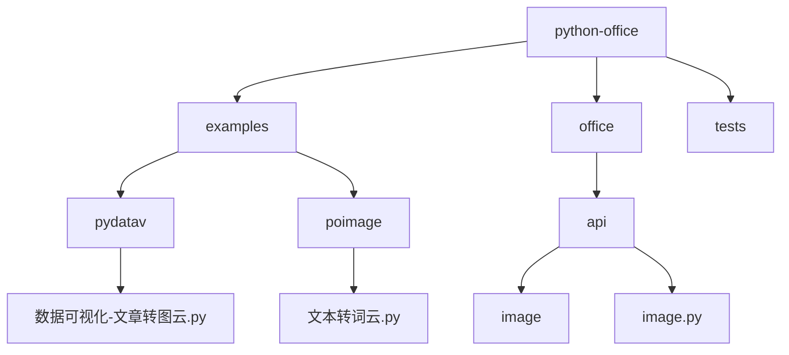
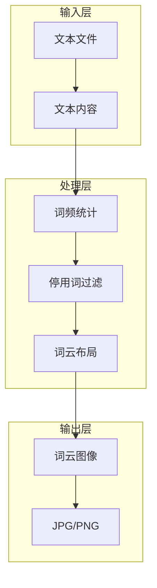
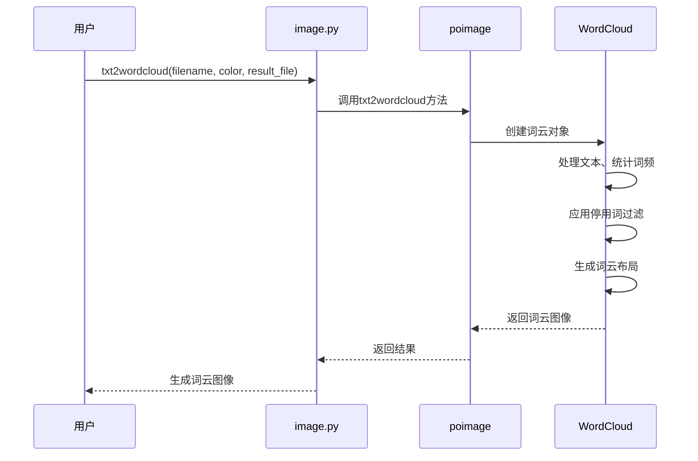
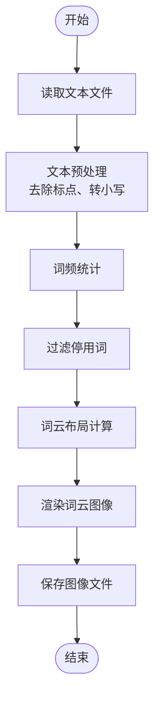
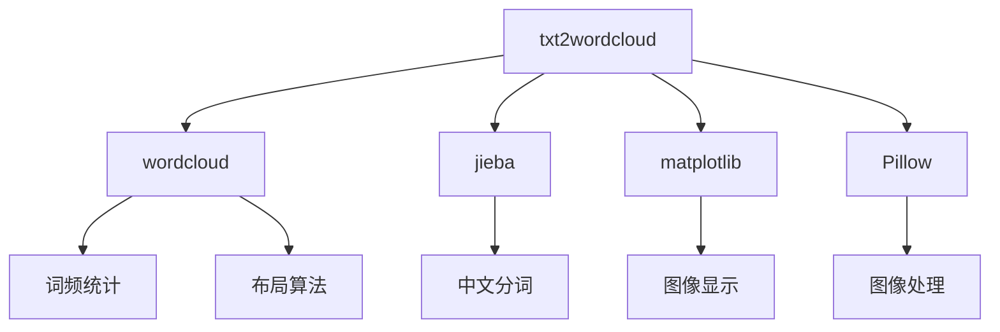

# 数据可视化与词云生成

<cite>
**本文档引用的文件**  
- [数据可视化-文章转图云.py](file://examples/pydatav/数据可视化-文章转图云.py)
- [文本转词云.py](file://examples/poimage/文本转词云.py)
- [image.py](file://office/api/image.py)
- [test.txt](file://examples/pydatav/txt2wordcloud/test.txt)
- [res.jpg](file://examples/pydatav/txt2wordcloud/res.jpg)
</cite>

## 目录
1. [简介](#简介)
2. [项目结构](#项目结构)
3. [核心组件](#核心组件)
4. [架构概述](#架构概述)
5. [详细组件分析](#详细组件分析)
6. [依赖分析](#依赖分析)
7. [性能考虑](#性能考虑)
8. [故障排除指南](#故障排除指南)
9. [结论](#结论)

## 简介
本文档系统讲解如何使用`python-office`库将文本数据转化为可视化词云图像，用于报告展示或舆情分析。文档涵盖词频统计算法、停用词过滤、字体与颜色主题配置、词云形状掩码等关键技术点。通过`wordcloud`库和自定义绘图逻辑，演示从原始文本到高质量图像的完整生成过程。同时提供性能优化建议，如大数据量分批处理、缓存机制，并展示如何嵌入到PPT或PDF报告中实现自动化输出。

## 项目结构
`python-office`项目是一个功能丰富的办公自动化工具集，其中`poimage`模块专门处理图像相关操作，包括词云生成。项目结构清晰，分为多个功能模块，如`excel`、`pdf`、`wechat`等，每个模块都有独立的API接口。

**Diagram sources**
- [数据可视化-文章转图云.py](file://examples/pydatav/数据可视化-文章转图云.py)
- [文本转词云.py](file://examples/poimage/文本转词云.py)
- [image.py](file://office/api/image.py)

**Section sources**
- [数据可视化-文章转图云.py](file://examples/pydatav/数据可视化-文章转图云.py)
- [文本转词云.py](file://examples/poimage/文本转词云.py)
- [image.py](file://office/api/image.py)

## 核心组件
词云生成的核心组件包括文本处理、词频统计、图形渲染三个主要部分。`poimage`库封装了这些功能，提供了简洁的API接口。

**Section sources**
- [image.py](file://office/api/image.py)
- [数据可视化-文章转图云.py](file://examples/pydatav/数据可视化-文章转图云.py)

## 架构概述
词云生成的架构基于`wordcloud`库，通过`poimage`进行封装，提供更高层次的API。用户可以通过简单的函数调用实现复杂的词云生成功能。

**Diagram sources**
- [image.py](file://office/api/image.py)
- [数据可视化-文章转图云.py](file://examples/pydatav/数据可视化-文章转图云.py)

## 详细组件分析

### 词云生成组件分析
该组件负责将文本文件转换为词云图像，支持自定义背景颜色和输出文件名。

**Diagram sources**
- [image.py](file://office/api/image.py)
- [文本转词云.py](file://examples/poimage/文本转词云.py)

**Section sources**
- [image.py](file://office/api/image.py)
- [文本转词云.py](file://examples/poimage/文本转词云.py)

### 文本处理流程

**Diagram sources**
- [image.py](file://office/api/image.py)
- [test.txt](file://examples/pydatav/txt2wordcloud/test.txt)

## 依赖分析
词云生成功能依赖于多个外部库和内部模块，形成了清晰的依赖关系。

**Diagram sources**
- [image.py](file://office/api/image.py)
- [数据可视化-文章转图云.py](file://examples/pydatav/数据可视化-文章转图云.py)

**Section sources**
- [image.py](file://office/api/image.py)
- [数据可视化-文章转图云.py](file://examples/pydatav/数据可视化-文章转图云.py)

## 性能考虑
对于大数据量的文本处理，建议采用分批处理策略，避免内存溢出。同时可以使用缓存机制，避免重复处理相同的文本内容。

## 故障排除指南
常见问题包括字体显示异常、中文乱码、内存不足等。解决方案包括确保系统安装了中文字体，合理设置词云参数，以及优化文本处理流程。

**Section sources**
- [image.py](file://office/api/image.py)
- [数据可视化-文章转图云.py](file://examples/pydatav/数据可视化-文章转图云.py)

## 结论
`python-office`库的词云生成功能为文本数据可视化提供了简单高效的解决方案。通过封装复杂的底层实现，用户可以专注于数据分析和结果展示，大大提高了工作效率。