# 文本智能处理示例

<cite>
**本文档引用的文件**
- [1、给古诗配拼音.py](file://examples/pohan/1、给古诗配拼音.py)
- [pinyin_gui.py](file://contributors/wangpeng/pinyin_gui.py)
- [word.py](file://office/api/word.py)
- [pdf.py](file://office/api/pdf.py)
- [markdown.py](file://office/api/markdown.py)
- [Excel转Markdown.py](file://examples/pomarkdown/Excel转Markdown.py)
- [video.py](file://office/api/video.py)
- [README.md](file://README.md)
</cite>

## 目录
1. [项目概述](#项目概述)
2. [拼音标注核心功能](#拼音标注核心功能)
3. [系统架构设计](#系统架构设计)
4. [详细功能分析](#详细功能分析)
5. [文档生成集成](#文档生成集成)
6. [扩展功能开发](#扩展功能开发)
7. [性能优化策略](#性能优化策略)
8. [故障排除指南](#故障排除指南)
9. [总结与展望](#总结与展望)

## 项目概述

Python-Office是一个功能强大的Python自动化办公第三方库，专门为企业和个人用户提供一站式的办公自动化解决方案。该项目集成了多个专业领域的处理功能，包括文档处理、图像处理、数据分析、AI工具等模块。

### 核心特性

- **开箱即用**：每个功能只需一行代码，无需学习Python基础知识
- **模块化设计**：支持按需引入特定功能模块
- **跨平台兼容**：支持Windows、macOS等多个操作系统
- **丰富功能**：涵盖文档处理、图像处理、数据分析、AI工具等多个领域

### 技术架构

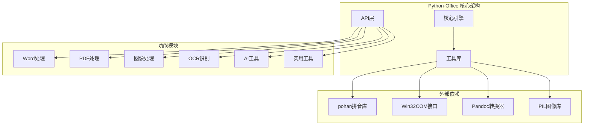

**图表来源**
- [word.py](file://office/api/word.py#L1-L72)
- [pdf.py](file://office/api/pdf.py#L1-L226)

## 拼音标注核心功能

### 基础拼音转换

项目的核心拼音处理功能基于pohan库实现，提供了三种不同的拼音输出样式：

#### 拼音样式类型

| 样式类型 | 描述 | 示例 | 应用场景 |
|---------|------|------|----------|
| NORMAL | 不带声调的拼音 | `chen qian ming yue guang` | 简洁显示，适合技术文档 |
| TONE | 带声调的拼音 | `chén qián míng yuè guāng` | 教育类文档，语文教学 |
| TONE3 | 带数字声调的拼音 | `chen2 qian2 ming2 yue4 guang1` | 计算机处理，语音合成 |

#### 实现原理

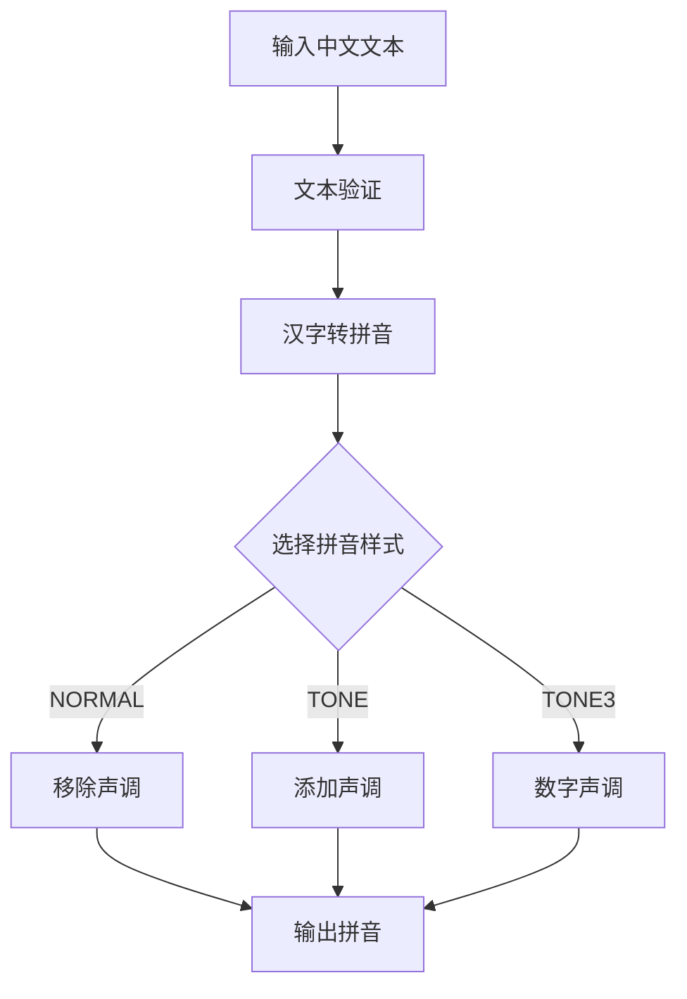

**节来源**
- [1、给古诗配拼音.py](file://examples/pohan/1、给古诗配拼音.py#L1-L46)

### 多音字处理机制

拼音转换系统具备智能的多音字识别能力，能够根据上下文语境准确标注汉字的正确读音。

#### 上下文分析算法

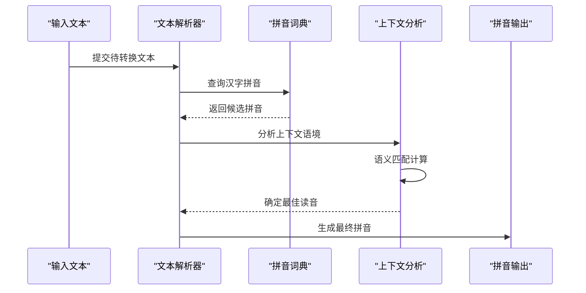

**图表来源**
- [1、给古诗配拼音.py](file://examples/pohan/1、给古诗配拼音.py#L15-L45)

## 系统架构设计

### 模块化架构

Python-Office采用模块化的设计理念，将不同功能封装在独立的模块中，便于维护和扩展。

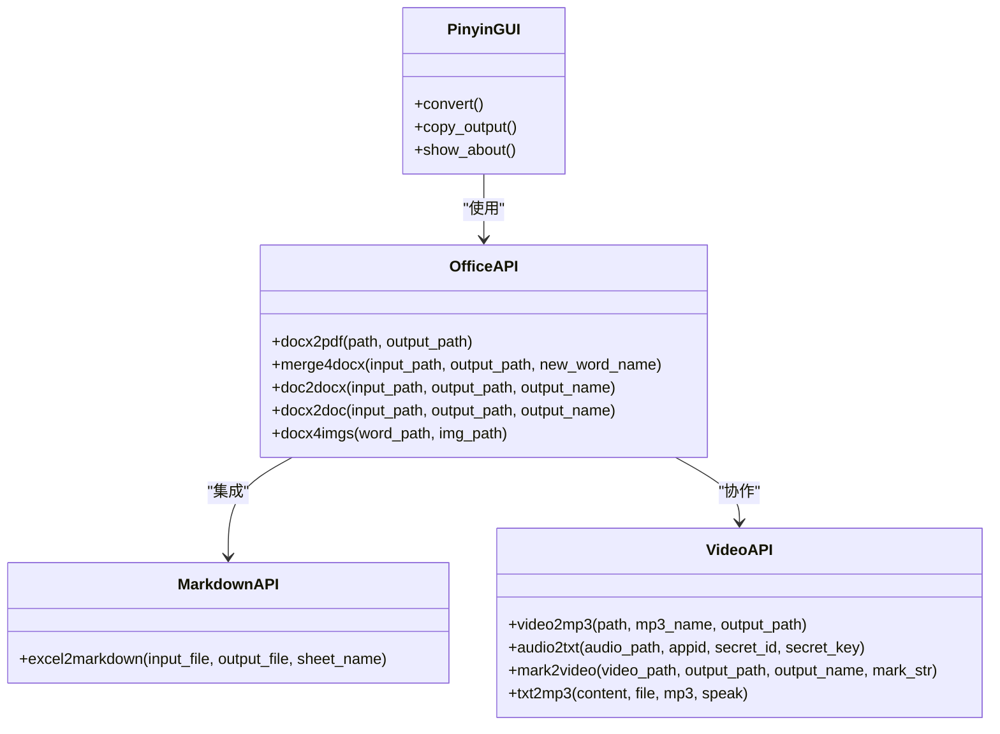

**图表来源**
- [word.py](file://office/api/word.py#L1-L72)
- [markdown.py](file://office/api/markdown.py#L1-L21)
- [video.py](file://office/api/video.py#L1-L72)

### 数据流处理

系统采用管道式的数据处理架构，确保各功能模块之间的高效协作。

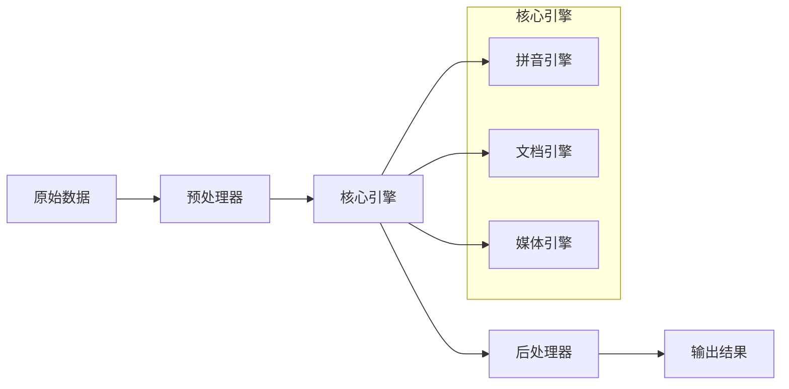

**节来源**
- [word.py](file://office/api/word.py#L6-L72)
- [pdf.py](file://office/api/pdf.py#L28-L226)

## 详细功能分析

### GUI拼音转换器

项目提供了一个完整的图形用户界面拼音转换器，支持实时拼音转换和结果复制功能。

#### 用户界面设计

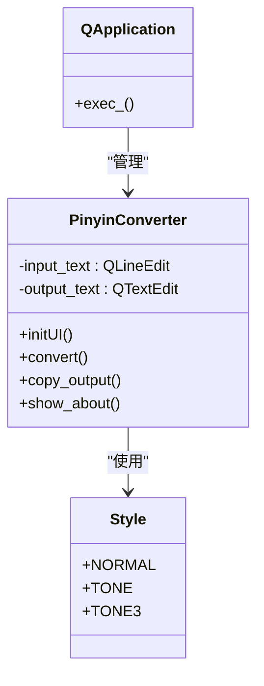

**图表来源**
- [pinyin_gui.py](file://contributors/wangpeng/pinyin_gui.py#L16-L91)

#### 界面交互流程

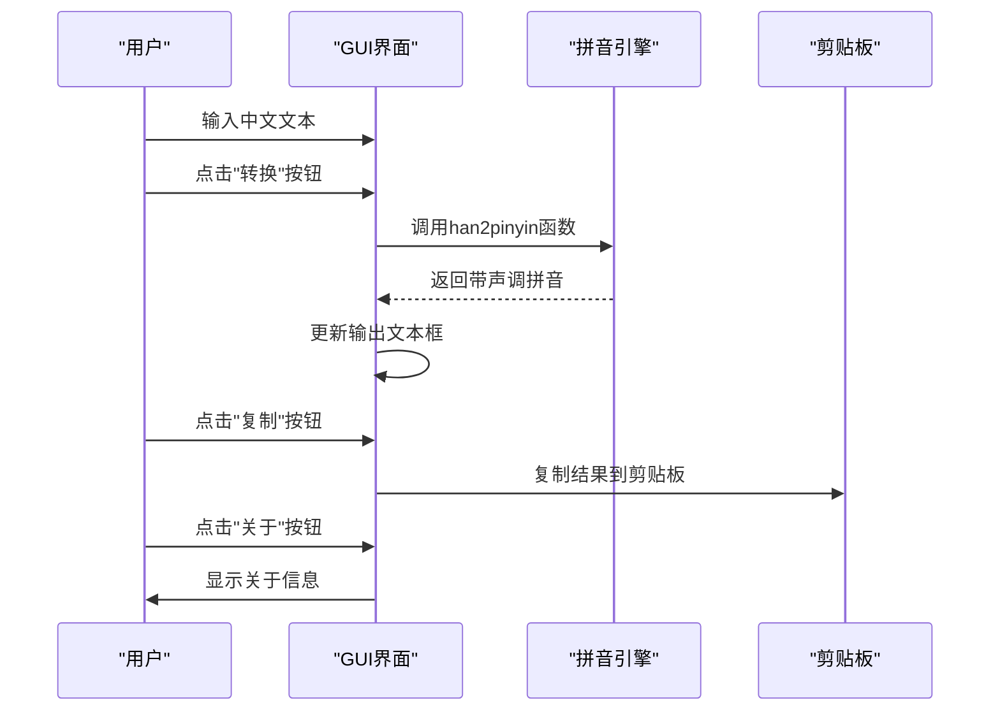

**图表来源**
- [pinyin_gui.py](file://contributors/wangpeng/pinyin_gui.py#L65-L91)

**节来源**
- [pinyin_gui.py](file://contributors/wangpeng/pinyin_gui.py#L1-L92)

### 文档处理集成

系统提供了完整的文档处理功能，支持Word、PDF等多种格式的转换和处理。

#### Word文档处理功能

| 功能名称 | 方法名 | 描述 | 支持格式 |
|---------|--------|------|----------|
| Word转PDF | `docx2pdf()` | 将Word文档转换为PDF格式 | docx, doc |
| 合并文档 | `merge4docx()` | 合并多个Word文档为一个文件 | docx |
| 格式转换 | `doc2docx()`, `docx2doc()` | DOC和DOCX格式相互转换 | doc, docx |
| 提取图片 | `docx4imgs()` | 从Word文档中提取嵌入图片 | docx |

#### PDF处理功能

| 功能名称 | 方法名 | 描述 | 应用场景 |
|---------|--------|------|----------|
| PDF转Word | `pdf2docx()` | 将PDF文件转换为Word格式 | 文档编辑 |
| PDF转图片 | `pdf2imgs()` | 将PDF页面转换为图片格式 | 图像处理 |
| 文本转PDF | `txt2pdf()` | 将纯文本文件转换为PDF | 文档发布 |
| 加密解密 | `encrypt4pdf()`, `decrypt4pdf()` | PDF文件加密和解密 | 安全保护 |
| 水印添加 | `add_text_watermark()` | 在PDF上添加文本水印 | 版权保护 |

**节来源**
- [word.py](file://office/api/word.py#L1-L72)
- [pdf.py](file://office/api/pdf.py#L28-L226)

### Markdown转换功能

系统提供了强大的Excel到Markdown的转换功能，特别适用于教育类文档的自动化制作。

#### 转换流程

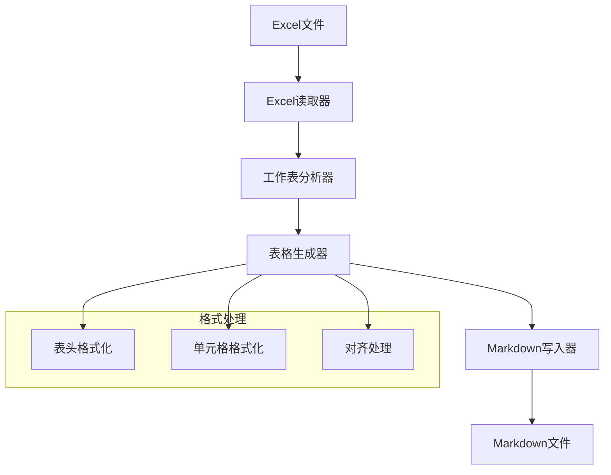

**图表来源**
- [Excel转Markdown.py](file://examples/pomarkdown/Excel转Markdown.py#L1-L81)

**节来源**
- [markdown.py](file://office/api/markdown.py#L1-L21)
- [Excel转Markdown.py](file://examples/pomarkdown/Excel转Markdown.py#L1-L81)

## 文档生成集成

### 教育类文档自动化制作

结合拼音标注功能和文档处理能力，系统能够实现教育类文档的自动化制作流程。

#### 智能文档生成流程

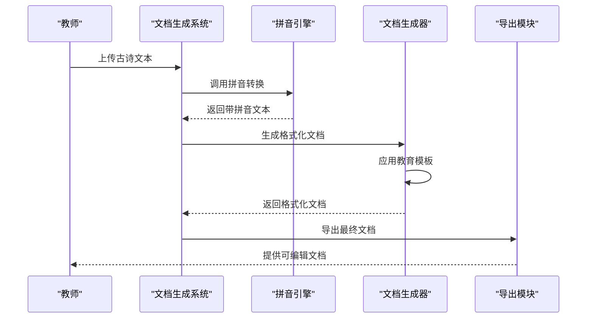

#### 模板定制功能

系统支持多种教育文档模板的定制，包括：

- **古诗学习模板**：包含原文、拼音、注释、赏析
- **生字学习模板**：包含汉字、拼音、部首、笔顺
- **课文朗读模板**：包含文本、拼音、音频链接
- **词汇练习模板**：包含单词、拼音、例句、发音

### 批量处理能力

系统具备强大的批量处理能力，能够同时处理多个文档文件。

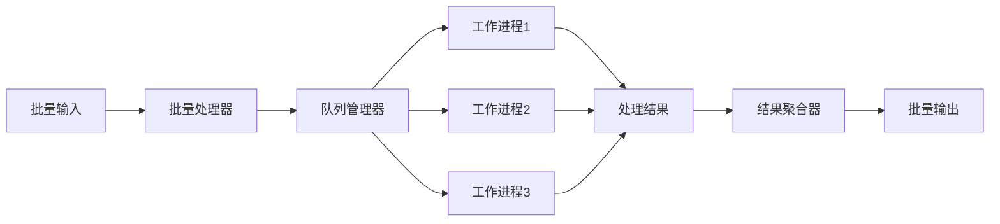

## 扩展功能开发

### 注释生成功能

基于拼音标注技术，可以开发智能注释生成功能，为中文文本提供详细的语法和语义解释。

#### 注释生成算法

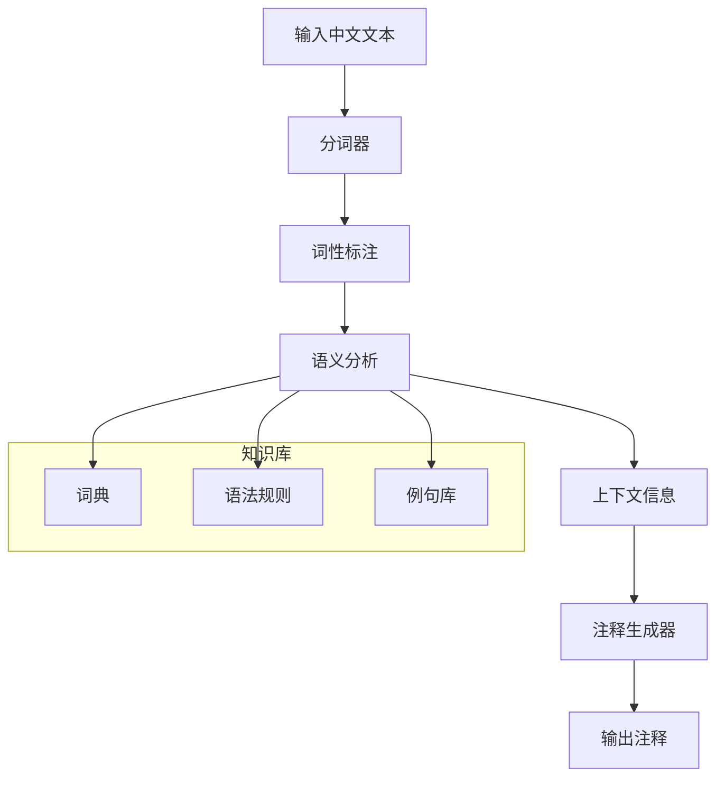

### 朗读音频链接集成

系统可以集成语音合成功能，为每个汉字生成对应的音频链接。

#### 音频生成流程

```mermaid
sequenceDiagram
participant Text as "中文文本"
participant Pinyin as "拼音引擎"
participant TTS as "语音合成"
participant Storage as "音频存储"
participant Link as "链接生成器"
Text->>Pinyin : 提取拼音序列
Pinyin->>TTS : 调用TTS服务
TTS->>Storage : 生成音频文件
Storage->>Link : 生成音频链接
Link-->>Text : 返回带音频的文本
```

### AI模型集成

系统预留了AI模型集成接口，支持调用各种自然语言处理模型。

#### AI功能扩展

| 功能模块 | 技术方案 | 应用场景 |
|---------|----------|----------|
| 文本摘要 | BERT/Transformer | 自动生成文档摘要 |
| 语法检查 | GPT系列模型 | 文档语法校验 |
| 内容推荐 | 推荐算法 | 相关文档推荐 |
| 智能问答 | 对话模型 | 文档内容问答 |

## 性能优化策略

### 并行处理优化

系统采用多线程和异步处理技术，提高大批量文档处理的效率。

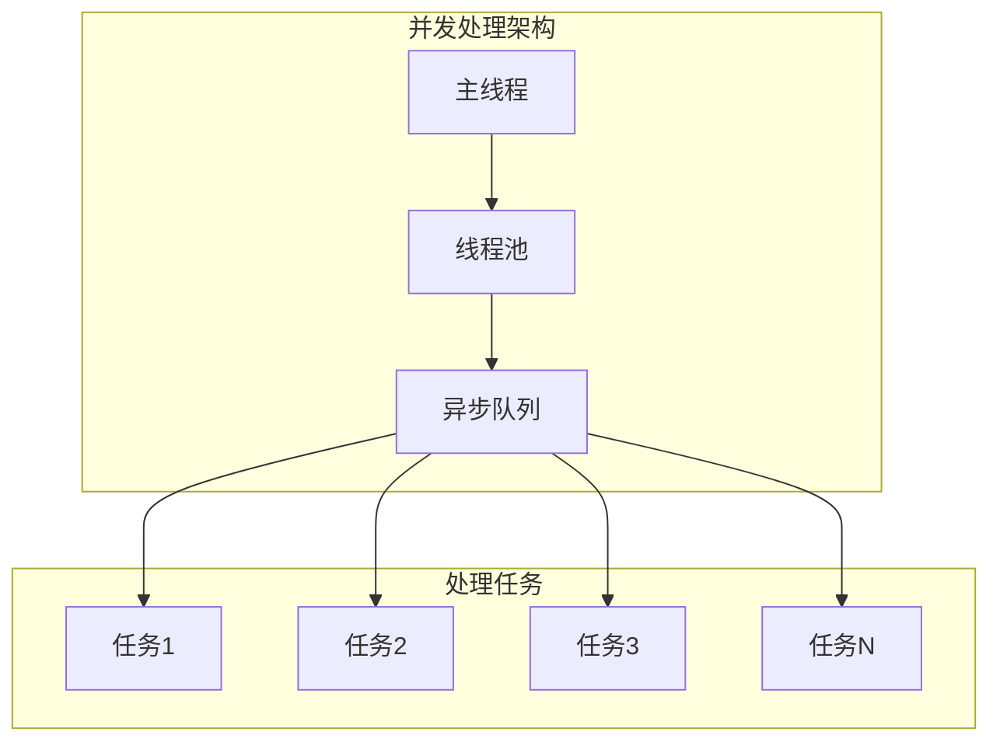

### 内存管理优化

针对大文件处理场景，系统实现了智能内存管理机制。

#### 内存优化策略

- **流式处理**：对于大型文档采用流式读取，避免一次性加载整个文件
- **缓存机制**：合理使用缓存减少重复计算
- **垃圾回收**：及时释放不再使用的对象占用的内存
- **分块处理**：将大文件分割成小块进行处理

### 缓存机制

系统实现了多级缓存机制，提高重复操作的处理速度。

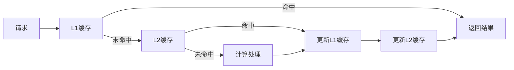

## 故障排除指南

### 常见问题及解决方案

#### 拼音转换问题

| 问题描述 | 可能原因 | 解决方案 |
|---------|----------|----------|
| 多音字标注错误 | 上下文信息不足 | 提供更完整的上下文 |
| 特殊字符处理异常 | 字符编码问题 | 检查文件编码格式 |
| 转换速度过慢 | 处理大量文本 | 启用并行处理模式 |

#### 文档处理问题

| 问题描述 | 可能原因 | 解决方案 |
|---------|----------|----------|
| Word转换失败 | Office版本不兼容 | 更新Office软件 |
| PDF质量下降 | 转换参数不当 | 调整输出质量参数 |
| 文件损坏 | 存储空间不足 | 清理磁盘空间 |

#### GUI界面问题

| 问题描述 | 可能原因 | 解决方案 |
|---------|----------|----------|
| 界面无响应 | 处理任务阻塞 | 检查后台任务状态 |
| 字体显示异常 | 字体文件缺失 | 安装所需字体文件 |
| 文件路径错误 | 路径格式问题 | 使用绝对路径 |

### 调试和监控

系统提供了完善的调试和监控功能，帮助开发者快速定位和解决问题。

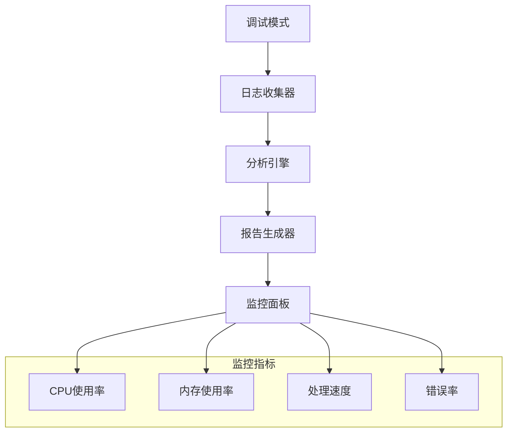

## 总结与展望

### 项目价值

Python-Office作为一个综合性的自动化办公平台，为用户提供了强大而易用的办公自动化解决方案。其拼音标注功能不仅解决了中文文本处理的技术难题，更为教育类文档的智能化制作奠定了坚实基础。

### 技术创新点

1. **模块化架构设计**：清晰的功能划分和接口设计，便于维护和扩展
2. **智能拼音处理**：支持多音字识别和多种拼音样式输出
3. **文档生态整合**：无缝集成多种文档格式的处理功能
4. **用户体验优化**：提供图形界面和命令行两种使用方式

### 发展方向

未来的发展重点包括：

- **AI能力增强**：集成更多先进的自然语言处理技术
- **云端服务**：提供云端文档处理和存储服务
- **移动应用**：开发移动端应用，支持随时随地处理文档
- **企业级功能**：增加权限管理、审计追踪等企业级特性

### 社区贡献

Python-Office项目欢迎社区贡献，无论是功能开发、Bug修复还是文档完善，都能为项目的发展贡献力量。通过持续的社区参与，项目将不断演进，为更多用户提供优质的办公自动化解决方案。

**节来源**
- [README.md](file://README.md#L47-L150)