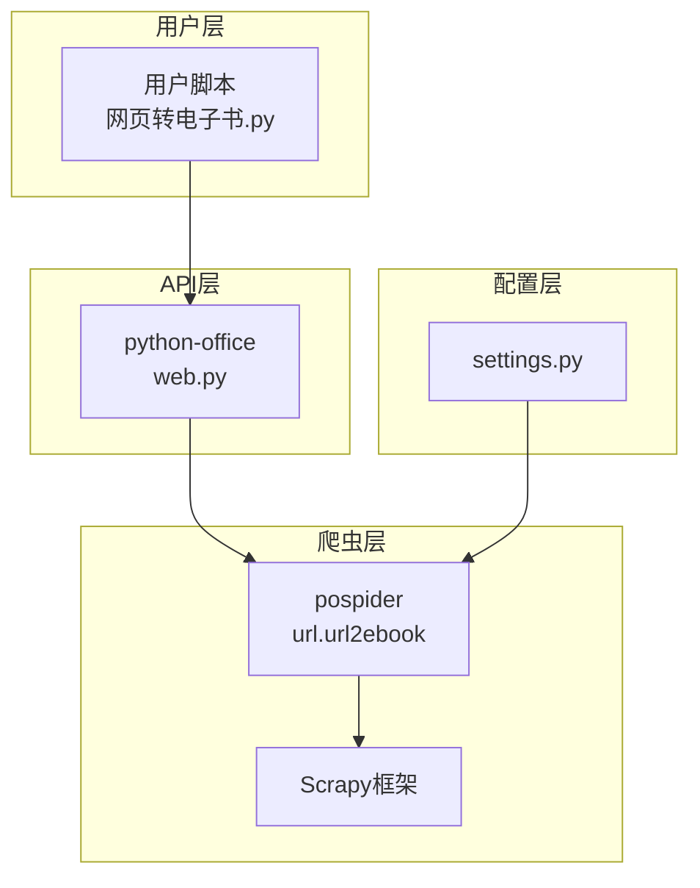
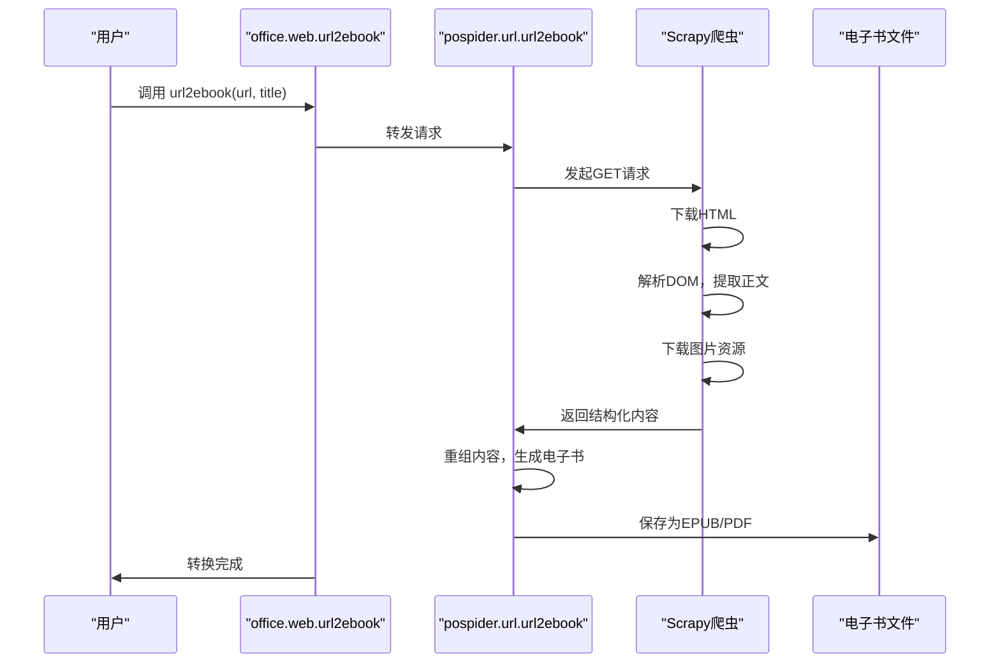
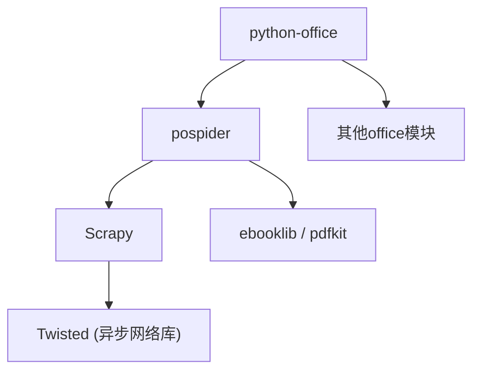

# 网页内容提取与电子书生成

<cite>
**本文档引用文件**  
- [网页转电子书.py](file://examples/pospider/网页转电子书.py)
- [web.py](file://office/api/web.py)
- [settings.py](file://settings.py)
</cite>

## 目录
1. [简介](#简介)
2. [项目结构](#项目结构)
3. [核心组件](#核心组件)
4. [架构概述](#架构概述)
5. [详细组件分析](#详细组件分析)
6. [依赖分析](#依赖分析)
7. [性能考虑](#性能考虑)
8. [故障排除指南](#故障排除指南)
9. [结论](#结论)

## 简介
本文档全面介绍如何使用 `python-office` 库中的 `pospider` 模块将网页内容提取并转换为电子书（如 EPUB、PDF）的技术流程。重点说明如何通过爬虫技术提取网页正文内容，去除广告和导航栏等干扰元素，保留原始标题结构与图片资源。文档还将讲解内容重组逻辑、章节划分策略以及元数据（作者、标题、封面）的自动填充方式。结合实际示例，展示如何批量处理多个网页生成可阅读的电子书文件，适用于知识归档、离线阅读等办公场景。

## 项目结构
`python-office` 是一个综合性的办公自动化工具库，其网页内容提取与电子书生成功能主要集中在 `examples/pospider` 和 `office/api/web.py` 模块中。`examples/pospider` 目录下的 `网页转电子书.py` 文件提供了功能演示和使用示例，而核心的 `url2ebook` 函数则定义在 `office/api/web.py` 中，该函数作为接口调用底层的 `pospider` 爬虫库来完成实际的网页抓取和转换工作。

**Section sources**
- [网页转电子书.py](file://examples/pospider/网页转电子书.py)
- [web.py](file://office/api/web.py)

## 核心组件
系统的核心功能由两个主要组件构成：高层级的 `office.web.url2ebook` API 接口和底层的 `pospider` 爬虫库。`office.web.url2ebook` 函数提供了一个简洁易用的接口，用户只需传入网页URL和电子书标题即可启动转换流程。该函数内部负责调用 `pospider.url.url2ebook` 方法，后者执行具体的网页抓取、内容清洗、结构化和电子书格式生成等复杂任务。

**Section sources**
- [web.py](file://office/api/web.py#L5-L17)
- [网页转电子书.py](file://examples/pospider/网页转电子书.py#L28-L32)

## 架构概述
整个系统的架构遵循分层设计原则。上层是用户直接交互的 `python-office` 库，它提供统一的API（如 `office.web.url2ebook`）来简化复杂操作。下层是专门的 `pospider` 爬虫库，它基于 Scrapy 框架构建，负责处理网络请求、解析HTML、提取主要内容、去除噪音（如广告、侧边栏）并最终将结构化内容打包成电子书。`settings.py` 文件中定义了爬虫的全局配置，如用户代理、请求延迟和中间件设置，确保了抓取过程的稳定性和隐蔽性。

**Diagram sources**
- [网页转电子书.py](file://examples/pospider/网页转电子书.py)
- [web.py](file://office/api/web.py)
- [settings.py](file://settings.py)

## 详细组件分析

### 网页转电子书功能分析
该功能的核心是 `url2ebook` 函数，它实现了从网页到电子书的端到端转换。其工作流程如下：首先，函数接收一个网页URL和一个电子书标题作为输入参数。然后，它通过 `pospider` 库发起HTTP请求，获取网页的原始HTML内容。接下来，利用内容提取算法（可能基于DOM分析或机器学习模型）识别并提取出文章的主体内容，同时过滤掉页眉、页脚、广告和导航菜单等非必要元素。提取的内容会保留原有的标题层级（H1, H2, H3等）以维持文档结构，并自动下载内联的图片资源。最后，这些结构化的文本和图片被重新组织，并按照EPUB或PDF等标准电子书格式进行封装，生成最终的电子书文件。

#### API调用流程

**Diagram sources**
- [web.py](file://office/api/web.py#L5-L17)
- [网页转电子书.py](file://examples/pospider/网页转电子书.py#L28-L32)

**Section sources**
- [web.py](file://office/api/web.py#L5-L17)
- [网页转电子书.py](file://examples/pospider/网页转电子书.py#L10-L55)

### 内容提取与清洗逻辑
虽然具体的实现代码位于未完全暴露的 `pospider` 包中，但根据 `settings.py` 的配置可以推断其工作原理。该爬虫库很可能使用了 Scrapy 框架的 `Item Pipeline` 来处理抓取到的数据。`ITEM_PIPELINES` 配置项指定了 `JsonWriterPipeline`，这表明抓取到的内容会经过一系列管道处理，其中就包括内容清洗和结构化。清洗过程可能涉及使用正则表达式或CSS选择器来定位和移除已知的干扰元素（如class为"ad"或"sidebar"的div），并保留具有文章特征的元素（如包含大量文本的`<article>`标签或特定class的`
`）。元数据（如作者、发布日期）的自动填充可能通过解析HTML中的`<meta>`标签（如`og:title`, `article:author`）来实现。

**Section sources**
- [settings.py](file://settings.py#L29-L31)
- [web.py](file://office/api/web.py#L3)

## 依赖分析
该功能依赖于一个分层的软件栈。最上层是 `python-office` 库，它作为用户友好的封装层。其核心依赖是 `pospider` 爬虫库，该库本身又依赖于强大的 `Scrapy` 框架来处理网络爬虫的复杂性，如请求调度、并发控制和中间件管理。`settings.py` 文件中的配置证明了这一点，其中定义了 `DOWNLOADER_MIDDLEWARES` 和 `SPIDER_MODULES` 等Scrapy特有的设置。此外，生成电子书还需要依赖如 `ebooklib`（用于EPUB）或 `reportlab`/`pdfkit`（用于PDF）等第三方库，尽管这些依赖在当前可见代码中未直接体现。

**Diagram sources**
- [web.py](file://office/api/web.py#L3)
- [settings.py](file://settings.py)

**Section sources**
- [web.py](file://office/api/web.py#L3)
- [settings.py](file://settings.py)

## 性能考虑
系统的性能主要受网络I/O和内容处理速度的影响。`settings.py` 中的 `CONCURRENT_REQUESTS = 16` 设置允许同时发起16个请求，这在批量处理多个网页时能显著提高效率。然而，`DOWNLOAD_DELAY = 1` 的设置引入了1秒的下载延迟，这是为了遵守网站的 `robots.txt` 规则（`ROBOTSTXT_OBEY = False` 表示此规则被忽略，但延迟仍被保留）并避免对目标服务器造成过大压力，这在一定程度上限制了抓取速度。对于单个网页的转换，性能瓶颈可能在于内容解析和电子书生成的CPU密集型计算上。

## 故障排除指南
在使用该功能时，可能会遇到以下常见问题：
1.  **转换失败**：最常见的原因是网络连接问题或提供的URL无效。应检查网络状态并确认URL的正确性。
2.  **内容提取不完整**：如果目标网页的结构特殊或使用了复杂的JavaScript动态加载内容，`pospider` 的默认提取规则可能无法正确识别正文。这种情况下，可能需要更高级的配置或自定义爬虫。
3.  **反爬虫机制**：目标网站可能设置了反爬虫措施（如验证码、IP封禁）。`settings.py` 中的 `IPProxyMiddleware` 表明系统支持使用代理IP池来应对此类问题，但需要用户自行配置。
4.  **依赖缺失**：如果底层的 `pospider` 或 `Scrapy` 库未正确安装，将导致 `ImportError`。确保所有依赖都已通过 `pip` 安装。

**Section sources**
- [网页转电子书.py](file://examples/pospider/网页转电子书.py#L35-L37)
- [settings.py](file://settings.py#L22-L27)

## 结论
`python-office` 库通过集成 `pospider` 爬虫工具，提供了一套简洁高效的网页内容提取与电子书生成解决方案。其分层架构将复杂的爬虫技术封装在易用的API之下，使得开发者和普通用户都能轻松实现网页内容的归档和离线阅读。尽管部分核心实现细节（如 `pospider` 的具体代码）未完全公开，但通过分析其接口、配置和工作流程，我们可以清晰地理解其技术原理。该方案特别适用于需要批量处理技术文档、博客文章等静态网页内容的办公自动化场景，极大地提升了信息管理和知识沉淀的效率。