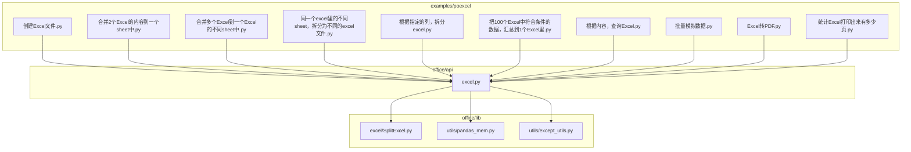
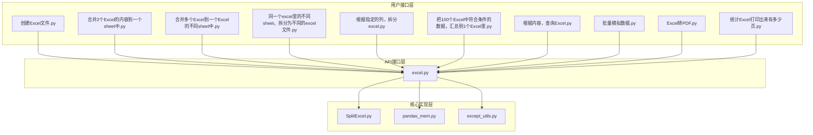
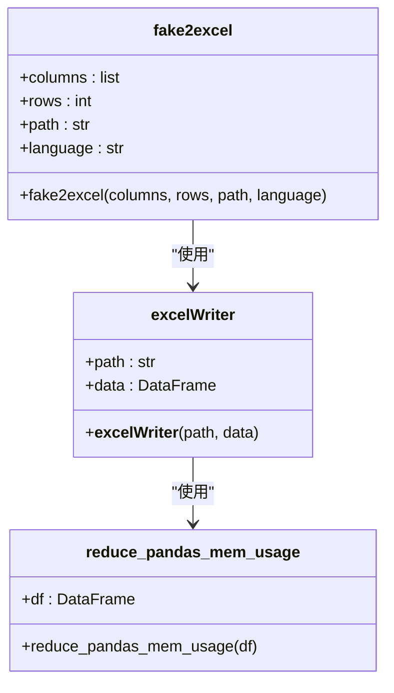
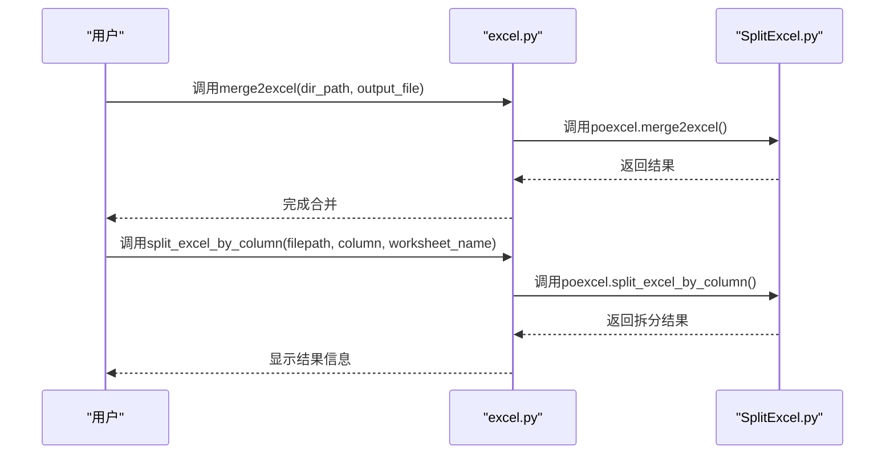
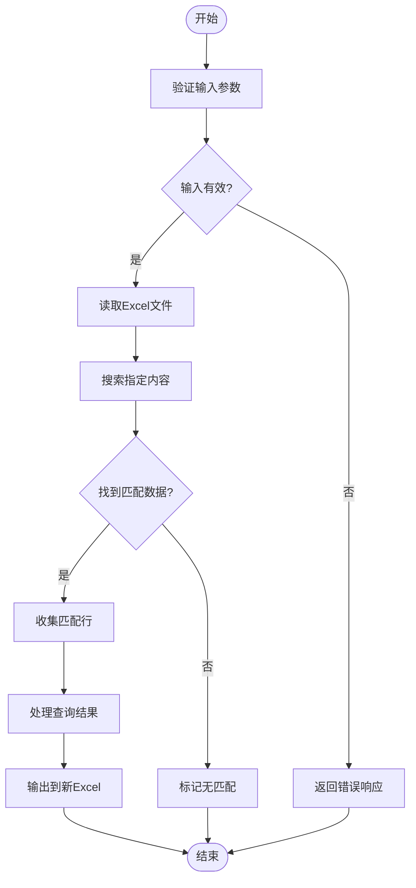
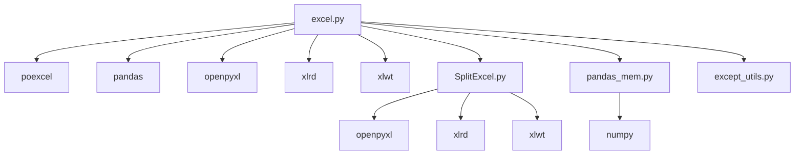

# Excel处理示例

<cite>
**本文档中引用的文件**   
- [创建Excel文件.py](file://examples/poexcel/创建Excel文件.py)
- [合并2个Excel的内容到一个sheet中.py](file://examples/poexcel/合并2个Excel的内容到一个sheet中.py)
- [合并多个Excel到一个Excel的不同sheet中.py](file://examples/poexcel/合并多个Excel到一个Excel的不同sheet中.py)
- [同一个excel里的不同sheet，拆分为不同的excel文件.py](file://examples/poexcel/同一个excel里的不同sheet，拆分为不同的excel文件.py)
- [根据指定的列，拆分excel.py](file://examples/poexcel/根据指定的列，拆分excel.py)
- [把100个Excel中符合条件的数据，汇总到1个Excel里.py](file://examples/poexcel/把100个Excel中符合条件的数据，汇总到1个Excel里.py)
- [根据内容，查询Excel.py](file://examples/poexcel/根据内容，查询Excel.py)
- [批量模拟数据.py](file://examples/poexcel/批量模拟数据.py)
- [Excel转PDF.py](file://examples/poexcel/Excel转PDF.py)
- [统计Excel打印出来有多少页.py](file://examples/poexcel/统计Excel打印出来有多少页.py)
- [excel.py](file://office/api/excel.py)
- [SplitExcel.py](file://office/lib/excel/SplitExcel.py)
- [pandas_mem.py](file://office/lib/utils/pandas_mem.py)
- [except_utils.py](file://office/lib/utils/except_utils.py)
</cite>

## 目录
1. [简介](#简介)
2. [项目结构](#项目结构)
3. [核心组件](#核心组件)
4. [架构概述](#架构概述)
5. [详细组件分析](#详细组件分析)
6. [依赖分析](#依赖分析)
7. [性能考虑](#性能考虑)
8. [故障排除指南](#故障排除指南)
9. [结论](#结论)

## 简介
本项目是一个全面的Python办公自动化工具库，专注于Excel文件的各种处理任务。它提供了从文件创建、数据合并、条件查询到批量生成、结构拆分与汇总等一系列高频办公场景的解决方案。通过封装pandas和openpyxl等底层库的复杂性，该项目为用户提供了简洁易用的API接口，使得非专业程序员也能轻松完成复杂的Excel操作。每个功能都配有详细的示例代码和业务场景说明，帮助用户快速上手并应用于实际工作流程中。

## 项目结构

**图示来源**
- [创建Excel文件.py](file://examples/poexcel/创建Excel文件.py#L1-L19)
- [合并2个Excel的内容到一个sheet中.py](file://examples/poexcel/合并2个Excel的内容到一个sheet中.py#L1-L28)
- [合并多个Excel到一个Excel的不同sheet中.py](file://examples/poexcel/合并多个Excel到一个Excel的不同sheet中.py#L1-L20)
- [同一个excel里的不同sheet，拆分为不同的excel文件.py](file://examples/poexcel/同一个excel里的不同sheet，拆分为不同的excel文件.py#L1-L24)
- [根据指定的列，拆分excel.py](file://examples/poexcel/根据指定的列，拆分excel.py#L1-L33)
- [把100个Excel中符合条件的数据，汇总到1个Excel里.py](file://examples/poexcel/把100个Excel中符合条件的数据，汇总到1个Excel里.py#L1-L23)
- [根据内容，查询Excel.py](file://examples/poexcel/根据内容，查询Excel.py#L1-L11)
- [批量模拟数据.py](file://examples/poexcel/批量模拟数据.py#L1-L25)
- [Excel转PDF.py](file://examples/poexcel/Excel转PDF.py#L1-L25)
- [统计Excel打印出来有多少页.py](file://examples/poexcel/统计Excel打印出来有多少页.py#L1-L31)
- [excel.py](file://office/api/excel.py#L1-L137)
- [SplitExcel.py](file://office/lib/excel/SplitExcel.py#L1-L144)
- [pandas_mem.py](file://office/lib/utils/pandas_mem.py#L1-L42)
- [except_utils.py](file://office/lib/utils/except_utils.py#L1-L35)

**本节来源**
- [创建Excel文件.py](file://examples/poexcel/创建Excel文件.py#L1-L19)
- [合并2个Excel的内容到一个sheet中.py](file://examples/poexcel/合并2个Excel的内容到一个sheet中.py#L1-L28)
- [合并多个Excel到一个Excel的不同sheet中.py](file://examples/poexcel/合并多个Excel到一个Excel的不同sheet中.py#L1-L20)
- [同一个excel里的不同sheet，拆分为不同的excel文件.py](file://examples/poexcel/同一个excel里的不同sheet，拆分为不同的excel文件.py#L1-L24)
- [根据指定的列，拆分excel.py](file://examples/poexcel/根据指定的列，拆分excel.py#L1-L33)
- [把100个Excel中符合条件的数据，汇总到1个Excel里.py](file://examples/poexcel/把100个Excel中符合条件的数据，汇总到1个Excel里.py#L1-L23)
- [根据内容，查询Excel.py](file://examples/poexcel/根据内容，查询Excel.py#L1-L11)
- [批量模拟数据.py](file://examples/poexcel/批量模拟数据.py#L1-L25)
- [Excel转PDF.py](file://examples/poexcel/Excel转PDF.py#L1-L25)
- [统计Excel打印出来有多少页.py](file://examples/poexcel/统计Excel打印出来有多少页.py#L1-L31)

## 核心组件

本项目的核心组件围绕Excel处理功能展开，主要包括文件创建、数据合并、条件查询、批量生成、结构拆分与汇总等高频办公任务。这些功能通过`office.api.excel`模块对外提供统一的API接口，而具体的实现则分布在`office.lib.excel`和`office.lib.utils`等底层模块中。例如，`fake2excel`函数用于创建包含模拟数据的Excel文件，适用于快速生成测试数据；`merge2excel`和`merge2sheet`分别支持将多个Excel文件合并到一个文件的不同sheet中或将多个sheet的内容合并到一个sheet中，满足不同的数据整合需求；`split_excel_by_column`函数可以根据指定列的内容将一个大Excel文件拆分为多个小文件，非常适合部门数据分发的场景。

**本节来源**
- [excel.py](file://office/api/excel.py#L25-L137)
- [SplitExcel.py](file://office/lib/excel/SplitExcel.py#L1-L144)
- [pandas_mem.py](file://office/lib/utils/pandas_mem.py#L1-L42)

## 架构概述

**图示来源**
- [excel.py](file://office/api/excel.py#L1-L137)
- [SplitExcel.py](file://office/lib/excel/SplitExcel.py#L1-L144)
- [pandas_mem.py](file://office/lib/utils/pandas_mem.py#L1-L42)
- [except_utils.py](file://office/lib/utils/except_utils.py#L1-L35)

## 详细组件分析

### 文件创建与模拟数据生成分析

#### 对于对象导向组件：

**图示来源**
- [excel.py](file://office/api/excel.py#L25-L39)
- [SplitExcel.py](file://office/lib/excel/SplitExcel.py#L1-L144)
- [pandas_mem.py](file://office/lib/utils/pandas_mem.py#L1-L42)

**本节来源**
- [创建Excel文件.py](file://examples/poexcel/创建Excel文件.py#L1-L19)
- [批量模拟数据.py](file://examples/poexcel/批量模拟数据.py#L1-L25)
- [excel.py](file://office/api/excel.py#L25-L39)

### 数据合并与拆分分析

#### 对于API/服务组件：

**图示来源**
- [excel.py](file://office/api/excel.py#L42-L55)
- [SplitExcel.py](file://office/lib/excel/SplitExcel.py#L117-L136)

**本节来源**
- [合并多个Excel到一个Excel的不同sheet中.py](file://examples/poexcel/合并多个Excel到一个Excel的不同sheet中.py#L1-L20)
- [合并2个Excel的内容到一个sheet中.py](file://examples/poexcel/合并2个Excel的内容到一个sheet中.py#L1-L28)
- [根据指定的列，拆分excel.py](file://examples/poexcel/根据指定的列，拆分excel.py#L1-L33)
- [同一个excel里的不同sheet，拆分为不同的excel文件.py](file://examples/poexcel/同一个excel里的不同sheet，拆分为不同的excel文件.py#L1-L24)

### 条件查询与数据汇总分析

#### 对于复杂逻辑组件：

**图示来源**
- [excel.py](file://office/api/excel.py#L92-L105)
- [把100个Excel中符合条件的数据，汇总到1个Excel里.py](file://examples/poexcel/把100个Excel中符合条件的数据，汇总到1个Excel里.py#L1-L23)

**本节来源**
- [把100个Excel中符合条件的数据，汇总到1个Excel里.py](file://examples/poexcel/把100个Excel中符合条件的数据，汇总到1个Excel里.py#L1-L23)
- [根据内容，查询Excel.py](file://examples/poexcel/根据内容，查询Excel.py#L1-L11)
- [excel.py](file://office/api/excel.py#L92-L105)

## 依赖分析

**图示来源**
- [excel.py](file://office/api/excel.py#L22)
- [SplitExcel.py](file://office/lib/excel/SplitExcel.py#L1-L3)
- [pandas_mem.py](file://office/lib/utils/pandas_mem.py#L1)
- [except_utils.py](file://office/lib/utils/except_utils.py#L7)

**本节来源**
- [excel.py](file://office/api/excel.py#L1-L137)
- [SplitExcel.py](file://office/lib/excel/SplitExcel.py#L1-L144)
- [pandas_mem.py](file://office/lib/utils/pandas_mem.py#L1-L42)
- [except_utils.py](file://office/lib/utils/except_utils.py#L1-L35)

## 性能考虑

在处理大型Excel文件时，内存使用和处理速度是关键的性能指标。本项目通过多种方式优化性能：首先，在`pandas_mem.py`模块中实现了`reduce_pandas_mem_usage`函数，该函数遍历DataFrame的所有列并根据数据范围自动选择最合适的数据类型（如int8、int16等），从而显著减少内存占用。其次，对于Excel文件的读取操作，使用`read_only=True`和`data_only=True`参数来提高读取效率，特别是在处理XLSX格式文件时。此外，建议用户在处理超大文件时采用分块处理策略，避免一次性加载整个文件到内存中。对于频繁的写操作，应尽量减少对ExcelWriter对象的打开和关闭次数，以提高I/O效率。

**本节来源**
- [pandas_mem.py](file://office/lib/utils/pandas_mem.py#L1-L42)
- [SplitExcel.py](file://office/lib/excel/SplitExcel.py#L96)

## 故障排除指南

本项目的错误处理机制主要通过`except_utils.py`模块中的`except_dec`装饰器实现。该装饰器为所有关键函数提供了统一的异常捕获和输出格式，当程序出现异常时，会打印详细的错误信息，包括异常时间、异常函数和异常原因，并提供社区支持链接和提问渠道。常见的错误场景包括文件路径不存在、文件格式不正确、列索引超出范围等。例如，在使用`split_excel_by_column`函数时，如果指定的列号超过了工作表的最大列数，系统会返回明确的错误提示"最大列数是X，取不到第Y列"。对于文件读取异常，也会有相应的错误信息提示。建议用户在遇到问题时首先检查文件路径和格式是否正确，然后查看是否有足够的权限访问目标文件。

**本节来源**
- [except_utils.py](file://office/lib/utils/except_utils.py#L1-L35)
- [SplitExcel.py](file://office/lib/excel/SplitExcel.py#L44-L45)
- [SplitExcel.py](file://office/lib/excel/SplitExcel.py#L97)

## 结论

本项目提供了一套完整的Excel处理解决方案，涵盖了文件创建、数据合并、条件查询、批量生成、结构拆分与汇总等高频办公任务。通过封装底层库的复杂性，为用户提供了简洁易用的API接口。项目架构清晰，分为用户接口层、API接口层和核心实现层，各层职责分明。在性能方面，通过数据类型优化和读取模式选择等方式有效提升了处理效率。错误处理机制完善，为用户提供了良好的调试体验。总体而言，这是一个功能丰富、易于使用且性能优良的Excel处理工具库，能够显著提升办公自动化效率。