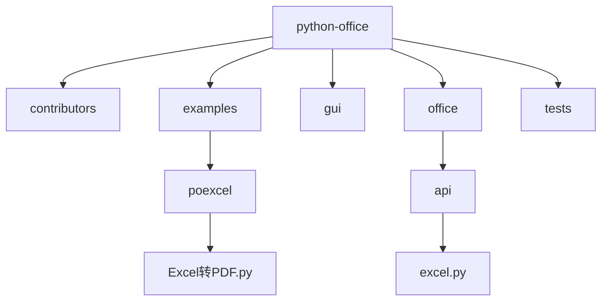
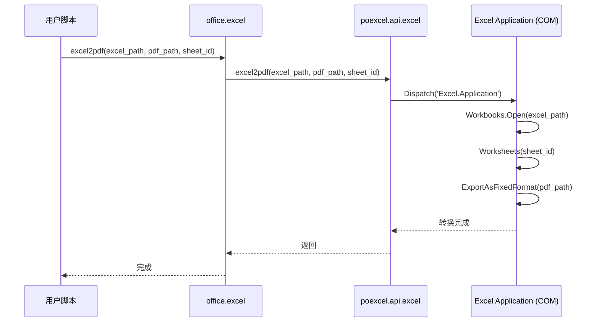
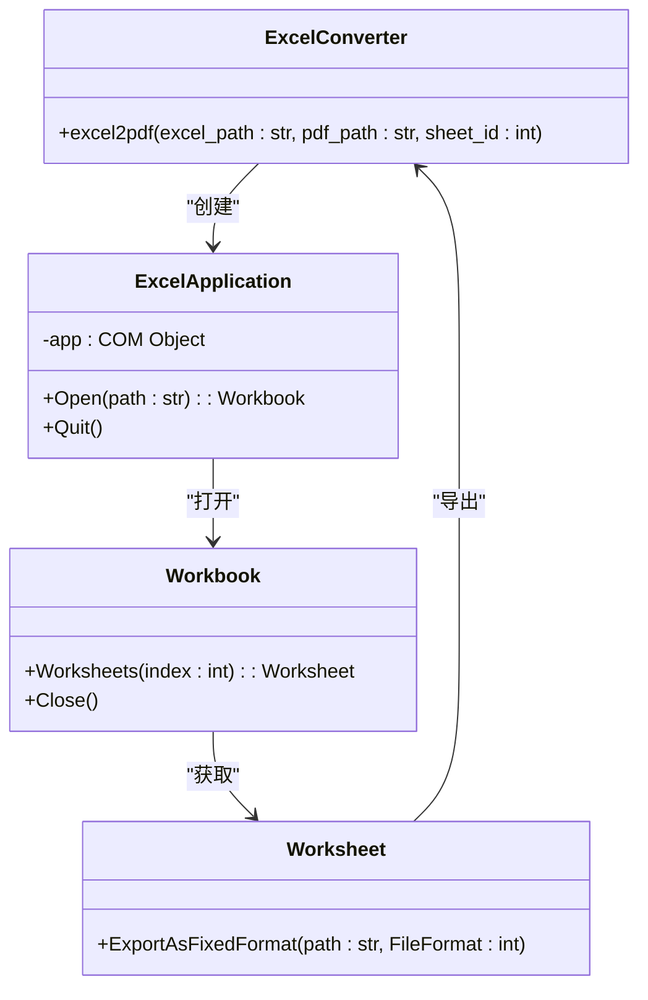
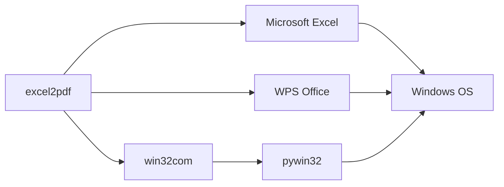

# Excel格式转换

<cite>
**本文档引用的文件**   
- [Excel转PDF.py](file://examples/poexcel/Excel转PDF.py)
- [excel.py](file://office/api/excel.py)
- [FileToExcel.py](file://contributors/old_from_gitee/FileToExcel/FileToExcel.py)
- [ExcelType.py](file://venv/Lib/site-packages/poexcel/core/ExcelType.py)
- [xls2xlsx.py](file://contributors/CatchDr/xls2xlsx.py)
- [xlsx2xls.py](file://contributors/CatchDr/xlsx2xls.py)
</cite>

## 目录
1. [简介](#简介)
2. [项目结构](#项目结构)
3. [核心组件](#核心组件)
4. [架构概述](#架构概述)
5. [详细组件分析](#详细组件分析)
6. [依赖分析](#依赖分析)
7. [性能考虑](#性能考虑)
8. [故障排除指南](#故障排除指南)
9. [结论](#结论)

## 简介
本文档深入讲解`excel2pdf`功能的技术实现路径，通过`win32com`调用本地Excel应用进行渲染导出，确保格式高度还原。强调必须安装Microsoft Office或WPS才能正常使用。说明`sheet_id`参数控制输出特定工作表，`pdf_path`指定输出路径的实践要点。对比其他无头PDF生成方案的优劣，指出该方法虽依赖GUI环境但兼容性最佳。提供批量转换脚本模板，并提醒注意长时间运行时的进程残留问题。

## 项目结构
该项目是一个功能丰富的办公自动化工具库，专注于Office文档处理。其结构清晰地分为多个模块：`contributors`包含社区贡献者的代码，`examples`提供各种使用示例，`gui`包含图形用户界面，`office`是核心API模块，`tests`包含测试代码。`examples/poexcel`目录下有多个Excel处理示例，包括"Excel转PDF.py"，展示了如何使用该库将Excel文件转换为PDF格式。

**图示来源**
- [Excel转PDF.py](file://examples/poexcel/Excel转PDF.py)
- [excel.py](file://office/api/excel.py)

**本节来源**
- [examples/poexcel/Excel转PDF.py](file://examples/poexcel/Excel转PDF.py)
- [office/api/excel.py](file://office/api/excel.py)

## 核心组件
`excel2pdf`功能的核心在于通过`win32com`库调用本地安装的Microsoft Excel应用程序，利用其原生的渲染引擎将Excel工作表精确地转换为PDF格式。这种方法确保了转换后的PDF在字体、布局、图表和复杂格式上与原始Excel文件高度一致。主要参数包括`excel_path`（输入的Excel文件路径）、`pdf_path`（输出的PDF文件路径）和可选的`sheet_id`（指定要转换的工作表索引，默认为0，即第一个工作表）。

**本节来源**
- [examples/poexcel/Excel转PDF.py](file://examples/poexcel/Excel转PDF.py)
- [office/api/excel.py](file://office/api/excel.py#L123-L136)

## 架构概述
`excel2pdf`功能的架构依赖于Python的`win32com`客户端库，它充当Python代码与Windows COM（组件对象模型）接口之间的桥梁。当调用`office.excel.excel2pdf()`时，请求被转发到`poexcel`库，最终由`ExcelType`类中的`excel2pdf`方法处理。该方法使用`win32com.client.Dispatch('Excel.Application')`创建一个Excel应用程序实例，打开指定的Excel文件，选择特定的工作表，然后调用其`ExportAsFixedFormat`方法导出为PDF，最后关闭应用程序。

**图示来源**
- [excel.py](file://office/api/excel.py#L123-L136)
- [ExcelType.py](file://venv/Lib/site-packages/poexcel/core/ExcelType.py#L176)

**本节来源**
- [office/api/excel.py](file://office/api/excel.py#L123-L136)
- [venv/Lib/site-packages/poexcel/core/ExcelType.py](file://venv/Lib/site-packages/poexcel/core/ExcelType.py#L176)

## 详细组件分析
### Excel2PDF功能分析
`excel2pdf`功能的实现依赖于Windows平台的COM技术。它通过`win32com`库与本地安装的Excel应用程序进行交互。此方法的关键优势在于能够利用Excel自身的渲染引擎，从而保证了转换结果在视觉上与在Excel中打印的效果完全一致，包括复杂的公式、图表、条件格式和特殊字体。

#### 对于API组件：

**图示来源**
- [ExcelType.py](file://venv/Lib/site-packages/poexcel/core/ExcelType.py#L176)
- [FileToExcel.py](file://contributors/old_from_gitee/FileToExcel/FileToExcel.py#L10)

**本节来源**
- [ExcelType.py](file://venv/Lib/site-packages/poexcel/core/ExcelType.py#L176)
- [FileToExcel.py](file://contributors/old_from_gitee/FileToExcel/FileToExcel.py#L10-L17)

## 依赖分析
`excel2pdf`功能具有严格的运行时依赖。它必须在安装了Microsoft Office或兼容的WPS Office的Windows操作系统上运行，因为其核心是通过`win32com`调用这些应用程序的COM接口。与之相比，无头（headless）的PDF生成方案（如使用`weasyprint`或`pdfkit`）不依赖GUI应用，更适合服务器环境，但在处理复杂的Excel格式时，其渲染准确性和兼容性远不如直接调用Excel应用。`win32com`库本身是`pywin32`包的一部分，是实现此功能的必要Python依赖。

**图示来源**
- [Excel转PDF.py](file://examples/poexcel/Excel转PDF.py)
- [xls2xlsx.py](file://contributors/CatchDr/xls2xlsx.py#L11)

**本节来源**
- [examples/poexcel/Excel转PDF.py](file://examples/poexcel/Excel转PDF.py)
- [contributors/CatchDr/xls2xlsx.py](file://contributors/CatchDr/xls2xlsx.py#L11-L27)

## 性能考虑
虽然`excel2pdf`方法在格式还原上表现最佳，但其性能和资源管理需要特别注意。每次转换都会启动一个Excel进程，如果在批量转换脚本中没有妥善管理，可能会导致多个Excel进程残留，消耗大量系统资源。最佳实践是在一个脚本中复用同一个Excel应用程序实例来处理多个文件，而不是为每个文件都创建和销毁实例。此外，由于涉及GUI应用的启动和关闭，其转换速度通常比无头方案慢。

## 故障排除指南
使用`excel2pdf`功能时最常见的问题是环境依赖。如果系统未安装Microsoft Office或WPS Office，或者`pywin32`库未正确安装，调用`Dispatch('Excel.Application')`会失败并抛出异常。另一个常见问题是权限不足，尤其是在服务器或受限用户账户下运行时。长时间运行的脚本可能会遇到Excel进程未正确退出的问题，导致后续操作失败，此时需要手动在任务管理器中结束`EXCEL.EXE`进程。确保输入的文件路径正确且文件未被其他程序占用也是成功转换的前提。

**本节来源**
- [FileToExcel.py](file://contributors/old_from_gitee/FileToExcel/FileToExcel.py#L10-L17)
- [xls2xlsx.py](file://contributors/CatchDr/xls2xlsx.py#L27-L32)

## 结论
`excel2pdf`功能通过`win32com`调用本地Excel应用，提供了一种在Windows平台上实现高保真Excel到PDF转换的有效方法。尽管它依赖于特定的GUI环境和软件安装，限制了其跨平台和服务器部署的能力，但其在格式兼容性和还原度上的优势使其成为需要精确打印输出场景下的首选方案。开发者在使用时应充分考虑其依赖性和资源管理，编写健壮的脚本来处理进程生命周期，以避免系统资源耗尽。