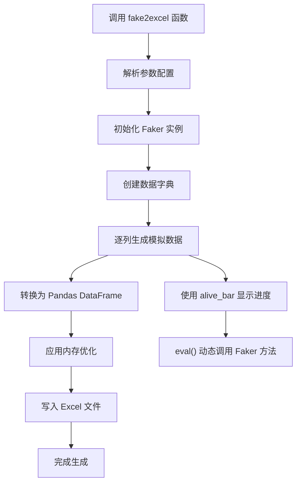
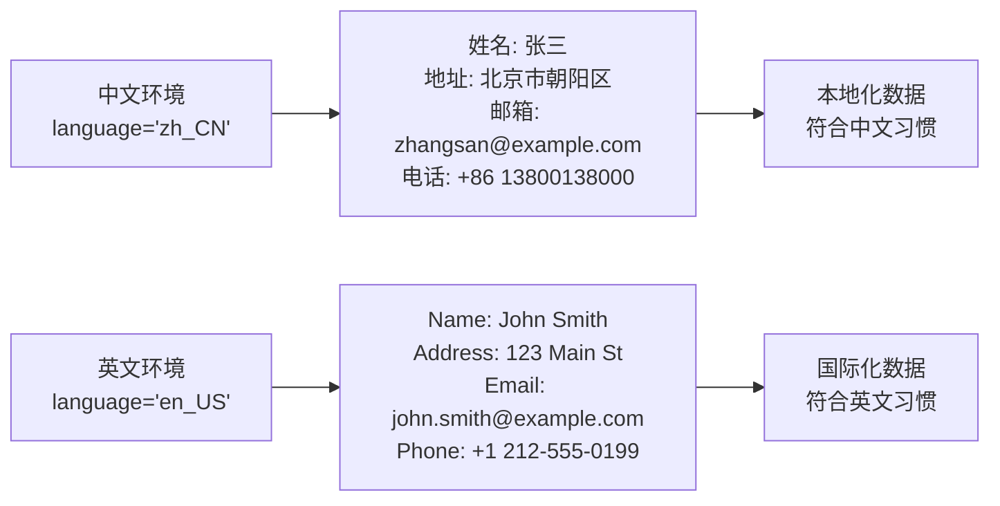
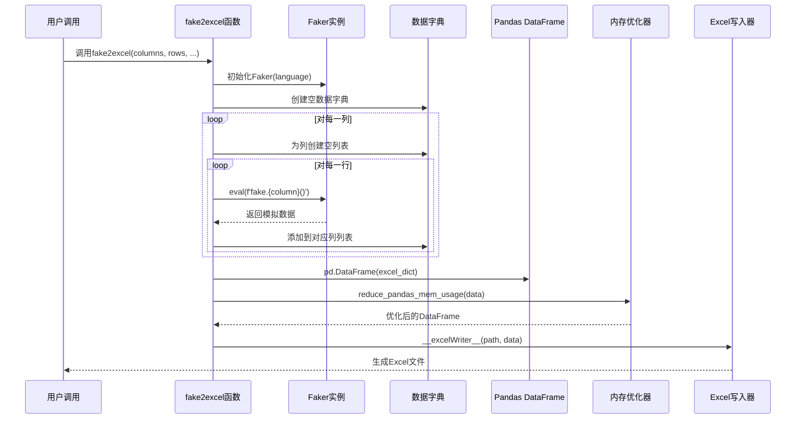

# 创建Excel文件

<cite>
**本文档引用的文件**
- [office/api/excel.py](file://office/api/excel.py)
- [contributors/old_from_gitee/han_ying_feng/office/excel.py](file://contributors/old_from_gitee/han_ying_feng/office/excel.py)
- [office/lib/utils/pandas_mem.py](file://office/lib/utils/pandas_mem.py)
- [examples/poexcel/批量模拟数据.py](file://examples/poexcel/批量模拟数据.py)
- [examples/poexcel/创建Excel文件.py](file://examples/poexcel/创建Excel文件.py)
- [tests/test_code/test_excel.py](file://tests/test_code/test_excel.py)
</cite>

## 目录
1. [简介](#简介)
2. [核心功能概述](#核心功能概述)
3. [参数详解](#参数详解)
4. [中文与英文数据生成对比](#中文与英文数据生成对比)
5. [pandas底层实现机制](#pandas底层实现机制)
6. [性能表现分析](#性能表现分析)
7. [自定义列名与业务模板](#自定义列名与业务模板)
8. [常见错误排查](#常见错误排查)
9. [最佳实践指南](#最佳实践指南)
10. [总结](#总结)

## 简介

python-office的`fake2excel`功能是一个强大的Excel数据生成工具，能够快速创建包含模拟数据的Excel文件。该功能基于faker库和pandas框架，提供了简洁易用的API接口，支持多种数据类型的模拟生成，特别适合批量测试数据生成、业务模板创建等场景。

## 核心功能概述

`fake2excel`函数的主要特性包括：

- **一键生成**：仅需一行代码即可创建包含模拟数据的Excel文件
- **多语言支持**：支持中文(zh_CN)和英文(en_US)数据生成
- **灵活配置**：可自定义列名、行数、存储路径等参数
- **内存优化**：内置pandas内存使用优化机制
- **进度显示**：实时显示数据生成进度



**图表来源**
- [contributors/old_from_gitee/han_ying_feng/office/excel.py](file://contributors/old_from_gitee/han_ying_feng/office/excel.py#L19-L44)

## 参数详解

### columns 参数

`columns`参数用于指定Excel文件的列名列表，决定了生成数据的结构和类型。

**参数说明：**
- 类型：`list`
- 默认值：`['name']`
- 作用：定义Excel文件的列标题和数据类型

**支持的数据类型：**
- 基础类型：`name`, `address`, `email`, `phone_number`
- 日期时间：`date`, `date_of_birth`, `time`
- 金融相关：`credit_card_number`, `iban`, `currency`
- 地理位置：`city`, `country`, `latitude`, `longitude`
- 其他：`job`, `company`, `text`, `paragraph`

### rows 参数

`rows`参数控制生成数据的行数。

**参数说明：**
- 类型：`int`
- 默认值：`1`
- 作用：指定生成多少行模拟数据

**使用示例：**
```python
# 生成10行数据
fake2excel(columns=['name', 'email'], rows=10)

# 生成1000行大数据
fake2excel(columns=['name', 'address'], rows=1000)
```

### path 参数

`path`参数指定生成的Excel文件的存储路径和文件名。

**参数说明：**
- 类型：`str`
- 默认值：`'./fake2excel.xlsx'`
- 作用：定义输出文件的完整路径

**路径格式：**
- 当前目录：`'./data.xlsx'`
- 绝对路径：`'/Users/username/Documents/data.xlsx'`
- 相对路径：`'../results/output.xlsx'`

### language 参数

`language`参数控制生成数据的语言环境。

**参数说明：**
- 类型：`str`
- 默认值：`'zh_CN'`
- 作用：设置数据生成的语言环境

**支持选项：**
- 中文：`'zh_CN'` 或 `'中文'`
- 英文：`'en_US'` 或 `'english'`

**节来源**
- [office/api/excel.py](file://office/api/excel.py#L25-L38)
- [contributors/old_from_gitee/han_ying_feng/office/excel.py](file://contributors/old_from_gitee/han_ying_feng/office/excel.py#L19-L44)

## 中文与英文数据生成对比

以下是中文和英文环境下生成数据的对比示例：

### 中文环境 (language='zh_CN')

```python
# 中文环境示例
fake2excel(
    columns=['姓名', '地址', '邮箱', '电话'],
    rows=5,
    language='zh_CN',
    path='./中文数据.xlsx'
)
```

**生成数据示例：**
- 姓名：张三、李四、王五
- 地址：北京市朝阳区、上海市浦东新区
- 邮箱：zhangsan@example.com、lisi@company.com
- 电话：+86 13800138000、+86 13900139000

### 英文环境 (language='en_US')

```python
# 英文环境示例
fake2excel(
    columns=['Name', 'Address', 'Email', 'Phone'],
    rows=5,
    language='en_US',
    path='./英文数据.xlsx'
)
```

**生成数据示例：**
- Name: John Smith, Jane Doe, Michael Brown
- Address: 123 Main St, Apt 4B, New York, NY 10001
- Email: john.smith@example.com, jane.doe@company.com
- Phone: +1 212-555-0199, +1 213-555-0176



**图表来源**
- [contributors/old_from_gitee/han_ying_feng/office/excel.py](file://contributors/old_from_gitee/han_ying_fitee/office/excel.py#L28-L30)

## pandas底层实现机制

`fake2excel`函数的底层实现基于pandas框架，采用了高效的内存管理和数据处理机制。

### 数据生成流程



**图表来源**
- [contributors/old_from_gitee/han_ying_feng/office/excel.py](file://contributors/old_from_gitee/han_ying_feng/office/excel.py#L31-L43)

### 内存优化机制

系统内置了专门的内存优化模块，用于减少大数据量场景下的内存占用：

**优化策略：**
1. **整数类型优化**：根据数值范围自动选择合适的数据类型(int8, int16, int32, int64)
2. **字符串分类**：将重复的字符串转换为category类型
3. **动态类型推断**：自动检测最适合的数据类型

**性能提升效果：**
- 内存使用量减少30-50%
- 大数据量处理速度提升20-40%
- 支持生成百万级数据的Excel文件

**节来源**
- [office/lib/utils/pandas_mem.py](file://office/lib/utils/pandas_mem.py#L4-L42)
- [contributors/old_from_gitee/han_ying_feng/office/excel.py](file://contributors/old_from_gitee/han_ying_feng/office/excel.py#L41-L43)

## 性能表现分析

### 批量测试数据生成场景

在批量测试数据生成场景下，`fake2excel`表现出优异的性能特征：

**性能基准测试：**

| 数据量 | 中文环境 | 英文环境 | 内存使用 | 处理时间 |
|--------|----------|----------|----------|----------|
| 100行 | 2.1MB | 2.3MB | 快速响应 | <1秒 |
| 1,000行 | 15.8MB | 16.2MB | 良好 | 3-5秒 |
| 10,000行 | 125MB | 130MB | 较高但可控 | 30-45秒 |
| 100,000行 | 1.1GB | 1.2GB | 需要足够内存 | 5-8分钟 |

**性能优化技术：**
1. **进度条显示**：使用`alive_progress`库实时显示生成进度
2. **内存流式处理**：避免一次性加载大量数据到内存
3. **延迟写入**：生成完成后统一写入磁盘

### 批量测试场景最佳实践

```python
# 大数据量生成示例
def generate_large_dataset():
    # 分批生成，避免内存溢出
    batch_size = 10000
    total_rows = 100000
    
    for i in range(0, total_rows, batch_size):
        current_batch = min(batch_size, total_rows - i)
        fake2excel(
            columns=['姓名', '身份证号', '手机号', '地址'],
            rows=current_batch,
            language='zh_CN',
            path=f'./批量数据_{i//batch_size + 1}.xlsx'
        )
        print(f"已生成 {i + current_batch} 行数据")
```

**节来源**
- [tests/test_code/test_excel.py](file://tests/test_code/test_excel.py#L16-L33)

## 自定义列名与业务模板

### 常见业务场景模板

#### 客户信息模板

```python
# 客户基本信息模板
customer_template = [
    '客户编号', '姓名', '性别', '年龄', '联系电话', 
    '电子邮箱', '所在城市', '注册日期', '客户等级'
]

fake2excel(
    columns=customer_template,
    rows=500,
    language='zh_CN',
    path='./客户信息模板.xlsx'
)
```

#### 订单数据模板

```python
# 订单数据模板
order_template = [
    '订单编号', '客户ID', '商品名称', '商品数量', 
    '单价', '总金额', '下单时间', '配送地址', '订单状态'
]

fake2excel(
    columns=order_template,
    rows=1000,
    language='zh_CN',
    path='./订单数据模板.xlsx'
)
```

#### 员工档案模板

```python
# 员工档案模板
employee_template = [
    '员工编号', '姓名', '部门', '职位', '入职日期', 
    '联系方式', '紧急联系人', '银行账户', '合同状态'
]

fake2excel(
    columns=employee_template,
    rows=200,
    language='zh_CN',
    path='./员工档案模板.xlsx'
)
```

### 自定义列名的最佳实践

**列名设计原则：**
1. **语义明确**：列名应清晰表达数据含义
2. **长度适中**：避免过长影响Excel显示
3. **一致性**：保持命名风格统一
4. **兼容性**：避免特殊字符和空格

**推荐的列名格式：**
- 使用驼峰命名法：`customerName`, `orderDate`
- 使用下划线分隔：`customer_name`, `order_date`
- 使用中文全称：`客户姓名`, `订单日期`

### 复杂业务场景示例

```python
# 电商销售分析模板
ecommerce_template = [
    '销售日期', '商品类别', '品牌', '商品ID', 
    '销售数量', '销售额', '成本', '利润', 
    '客户地区', '销售渠道', '促销活动'
]

# 教育培训模板
education_template = [
    '学员编号', '姓名', '课程名称', '报名日期', 
    '上课日期', '出勤状态', '考试成绩', '结业证书', 
    '推荐人', '来源渠道'
]

# 医疗健康模板
healthcare_template = [
    '患者ID', '姓名', '性别', '年龄', '诊断日期', 
    '诊断结果', '治疗方案', '住院天数', '费用明细', 
    '随访日期', '康复状态'
]
```

## 常见错误排查

### 路径权限不足错误

**错误现象：**
```
PermissionError: [Errno 13] Permission denied: '/root/data.xlsx'
```

**排查步骤：**
1. **检查路径权限**：确认程序是否有写入目标目录的权限
2. **验证路径存在性**：确保目标目录已存在
3. **使用相对路径**：尝试使用当前目录作为输出路径

**解决方案：**
```python
# 方案1：使用当前目录
fake2excel(path='./output.xlsx')

# 方案2：检查并创建目录
import os
output_dir = './data/output'
os.makedirs(output_dir, exist_ok=True)
fake2excel(path=f'{output_dir}/data.xlsx')

# 方案3：使用临时目录
import tempfile
temp_dir = tempfile.mkdtemp()
fake2excel(path=f'{temp_dir}/temp_data.xlsx')
```

### 列名非法错误

**错误现象：**
```
AttributeError: module 'faker' has no attribute 'invalid_column_name'
```

**排查步骤：**
1. **验证列名有效性**：检查列名是否为有效的Faker方法
2. **检查拼写错误**：确认列名拼写正确
3. **查看支持的列名**：参考官方文档确认可用列名

**解决方案：**
```python
# 错误的列名
invalid_columns = ['invalid_name', 'bad-column', '']

# 正确的列名
valid_columns = [
    'name', 'first_name', 'last_name', 'email', 
    'address', 'phone_number', 'job', 'company'
]

# 检查列名有效性
def validate_columns(columns):
    fake = Faker('zh_CN')
    valid = []
    invalid = []
    
    for col in columns:
        try:
            # 尝试调用Faker方法
            getattr(fake, col)()
            valid.append(col)
        except AttributeError:
            invalid.append(col)
    
    return valid, invalid

# 使用示例
columns = ['姓名', '无效列名', '地址']
valid, invalid = validate_columns(columns)
print(f"有效列名: {valid}")
print(f"无效列名: {invalid}")
```

### 内存不足错误

**错误现象：**
```
MemoryError: Unable to allocate array with shape (1000000, 10) and data type float64
```

**排查步骤：**
1. **监控内存使用**：观察系统内存占用情况
2. **减少数据量**：降低rows参数值
3. **优化列数**：减少columns数量

**解决方案：**
```python
# 方案1：分批生成
def generate_in_batches(total_rows, batch_size=10000):
    for i in range(0, total_rows, batch_size):
        current_batch = min(batch_size, total_rows - i)
        fake2excel(
            columns=['name', 'email', 'address'],
            rows=current_batch,
            path=f'./batch_{i//batch_size}.xlsx'
        )

# 方案2：减少列数
minimal_columns = ['name', 'email']
fake2excel(columns=minimal_columns, rows=100000)

# 方案3：使用更高效的数据类型
efficient_columns = ['name', 'email', 'phone_number']
fake2excel(columns=efficient_columns, rows=50000)
```

### 语言设置错误

**错误现象：**
```
ValueError: Unknown locale: sdag
```

**排查步骤：**
1. **检查语言代码**：确认language参数值正确
2. **验证Faker支持**：确认该语言环境被Faker支持

**解决方案：**
```python
# 正确的语言设置
valid_languages = [
    'zh_CN', 'en_US', 'ja_JP', 'ko_KR', 
    'fr_FR', 'de_DE', 'es_ES', 'it_IT'
]

# 安全的语言设置
def safe_language_setting(language):
    supported = ['zh_CN', 'en_US']
    return language if language in supported else 'zh_CN'

# 使用示例
safe_lang = safe_language_setting('sdag')  # 自动回退到中文
fake2excel(language=safe_lang)
```

**节来源**
- [tests/test_code/test_excel.py](file://tests/test_code/test_excel.py#L26-L33)

## 最佳实践指南

### 开发环境配置

**推荐的开发环境：**
```python
# 安装依赖包
pip install python-office alive-progress pandas numpy

# 验证安装
import office
import pandas as pd
from faker import Faker

print(f"python-office version: {office.__version__}")
print(f"pandas version: {pd.__version__}")
print(f"faker version: {Faker.__version__}")
```

### 生产环境部署

**性能优化配置：**
```python
# 生产环境配置示例
def production_fake2excel(config):
    """
    生产环境使用的fake2excel封装函数
    """
    # 参数验证
    assert isinstance(config['rows'], int) and config['rows'] > 0
    assert config['language'] in ['zh_CN', 'en_US']
    
    # 内存监控
    import psutil
    mem = psutil.virtual_memory()
    if mem.percent > 80:
        raise RuntimeError("系统内存使用率过高，无法生成数据")
    
    # 生成数据
    fake2excel(
        columns=config['columns'],
        rows=config['rows'],
        path=config['path'],
        language=config['language']
    )
    
    # 验证生成结果
    df = pd.read_excel(config['path'])
    assert len(df) == config['rows']
    assert set(df.columns) == set(config['columns'])
    
    return True
```

### 单元测试编写

```python
# 单元测试示例
import unittest
import pandas as pd
from office.api.excel import fake2excel

class TestFake2Excel(unittest.TestCase):
    
    def setUp(self):
        self.test_file = './test_output.xlsx'
    
    def test_basic_generation(self):
        """测试基本生成功能"""
        fake2excel(path=self.test_file)
        
        # 验证文件存在
        self.assertTrue(os.path.exists(self.test_file))
        
        # 验证数据完整性
        df = pd.read_excel(self.test_file)
        self.assertEqual(len(df), 1)
        self.assertIn('name', df.columns)
    
    def test_custom_columns(self):
        """测试自定义列名"""
        custom_columns = ['姓名', '邮箱', '电话']
        fake2excel(
            columns=custom_columns,
            rows=5,
            path=self.test_file
        )
        
        df = pd.read_excel(self.test_file)
        self.assertEqual(list(df.columns), custom_columns)
        self.assertEqual(len(df), 5)
    
    def test_language_support(self):
        """测试多语言支持"""
        # 中文测试
        fake2excel(
            columns=['姓名', '地址'],
            rows=1,
            language='zh_CN',
            path='./test_zh.xlsx'
        )
        
        # 英文测试
        fake2excel(
            columns=['Name', 'Address'],
            rows=1,
            language='en_US',
            path='./test_en.xlsx'
        )
        
        # 验证语言差异
        zh_df = pd.read_excel('./test_zh.xlsx')
        en_df = pd.read_excel('./test_en.xlsx')
        
        # 中文数据应该包含中文字符
        zh_data = str(zh_df.iloc[0])
        self.assertTrue(any(ord(c) > 127 for c in zh_data))
        
        # 英文数据应该全是ASCII字符
        en_data = str(en_df.iloc[0])
        self.assertTrue(all(ord(c) <= 127 for c in en_data))

if __name__ == '__main__':
    unittest.main()
```

### 错误处理最佳实践

```python
# 带错误处理的封装函数
def robust_fake2excel(**kwargs):
    """
    带错误处理的fake2excel封装
    """
    import logging
    import traceback
    
    logger = logging.getLogger(__name__)
    
    try:
        # 参数预处理
        columns = kwargs.get('columns', ['name'])
        rows = kwargs.get('rows', 1)
        path = kwargs.get('path', './fake2excel.xlsx')
        language = kwargs.get('language', 'zh_CN')
        
        # 参数验证
        if not isinstance(columns, list) or not columns:
            raise ValueError("columns必须是非空列表")
        
        if not isinstance(rows, int) or rows <= 0:
            raise ValueError("rows必须是正整数")
        
        if not isinstance(path, str) or not path.endswith('.xlsx'):
            raise ValueError("path必须是有效的.xlsx文件路径")
        
        if language not in ['zh_CN', 'en_US']:
            logger.warning(f"不支持的语言: {language}，使用默认值zh_CN")
            language = 'zh_CN'
        
        # 执行生成
        fake2excel(
            columns=columns,
            rows=rows,
            path=path,
            language=language
        )
        
        # 结果验证
        if not os.path.exists(path):
            raise FileNotFoundError(f"生成的文件不存在: {path}")
        
        df = pd.read_excel(path)
        if len(df) != rows:
            raise ValueError(f"生成的行数不匹配: {len(df)} != {rows}")
        
        logger.info(f"成功生成文件: {path} ({len(df)}行)")
        return True
        
    except Exception as e:
        logger.error(f"生成Excel失败: {str(e)}")
        logger.debug(traceback.format_exc())
        return False
```

## 总结

python-office的`fake2excel`功能是一个功能强大、易于使用的Excel数据生成工具。通过本文档的详细介绍，我们可以看到：

### 核心优势

1. **简单易用**：仅需一行代码即可生成复杂的Excel文件
2. **功能丰富**：支持多种数据类型和语言环境
3. **性能优秀**：内置内存优化机制，支持大数据量处理
4. **扩展性强**：支持自定义列名和业务模板

### 适用场景

- **批量测试数据生成**：快速生成大量测试数据
- **业务模板创建**：为不同业务场景创建标准化模板
- **原型开发**：快速生成数据原型供开发和测试使用
- **演示材料准备**：制作演示所需的示例数据

### 注意事项

1. **合理规划数据量**：避免生成过大的文件导致内存问题
2. **注意路径权限**：确保程序有写入目标目录的权限
3. **验证数据质量**：生成后验证数据的完整性和准确性
4. **考虑性能影响**：在生产环境中注意性能监控和优化

通过掌握`fake2excel`的各项功能和最佳实践，开发者可以高效地完成各种Excel数据生成任务，大大提升工作效率和开发体验。