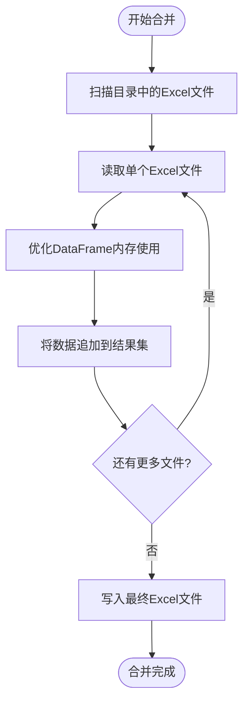

# 合并Excel文件

<cite>
**本文档引用的文件**   
- [excel.py](file://office/api/excel.py)
- [ExcelType.py](file://venv/Lib/site-packages/poexcel/core/ExcelType.py)
- [pandas_mem.py](file://office/lib/utils/pandas_mem.py)
- [合并多个Excel到一个Excel的不同sheet中.py](file://examples/poexcel/合并多个Excel到一个Excel的不同sheet中.py)
- [合并2个Excel的内容到一个sheet中.py](file://examples/poexcel/合并2个Excel的内容到一个sheet中.py)
</cite>

## 目录
1. [功能对比与适用场景](#功能对比与适用场景)
2. [调用示例与参数说明](#调用示例与参数说明)
3. [文件扫描与命名策略](#文件扫描与命名策略)
4. [内存管理与大数据处理](#内存管理与大数据处理)
5. [分批处理建议](#分批处理建议)

## 功能对比与适用场景

**merge2excel** 和 **merge2sheet** 是 python-office 库中两个核心的Excel合并功能，它们在数据组织方式和适用场景上有显著区别。

**merge2excel** 功能将目录中的多个Excel文件分别放入目标文件的不同工作表（sheet）中。每个源文件对应一个独立的工作表，工作表的名称通常基于源文件名生成。这种合并方式保持了原始数据的独立性，适合需要保留各部门或各来源数据独立性的场景，如部门报表整合、项目进度汇总等。通过这种方式，用户可以在一个工作簿中查看和比较不同来源的数据，同时保持数据的原始结构。

**merge2sheet** 功能则将所有源Excel文件的数据追加到目标文件的同一个工作表中。它会读取每个源文件的数据并将其逐行添加到目标工作表，形成一个连续的数据集。这种合并方式创建了一个统一的数据视图，非常适合需要对所有数据进行整体分析的场景，如销售数据汇总分析、用户行为数据整合等。通过将数据集中到一个工作表中，可以方便地使用Excel的筛选、排序和数据分析功能进行全局操作。

**Section sources**
- [excel.py](file://office/api/excel.py#L42-L54)
- [excel.py](file://office/api/excel.py#L75-L87)

## 调用示例与参数说明

以下是两个功能的典型调用示例：

使用 **merge2excel** 将多个Excel文件合并到一个文件的不同工作表中：
```python
import office
office.excel.merge2excel(dir_path=r'../../contributors/bulabean', output_file='test_merge2excel.xlsx')
```

使用 **merge2sheet** 将多个Excel文件的数据合并到一个工作表中：
```python
import poexcel
poexcel.merge2sheet(dir_path=r'D:\workplace\code\github\python-office\tests\test_files\excel\merge2sheet',
                    output_sheet_name=r'platform', output_excel_name=r'./output/merge2sheet')
```

**merge2excel** 函数接受两个主要参数：`dir_path` 指定包含源Excel文件的目录路径，`output_file` 指定合并后文件的名称和路径。**merge2sheet** 函数则有三个参数：`dir_path` 同样指定源文件目录，`output_sheet_name` 指定合并后工作表的名称，`output_excel_name` 指定输出文件的名称（不包含扩展名）。

**Section sources**
- [合并多个Excel到一个Excel的不同sheet中.py](file://examples/poexcel/合并多个Excel到一个Excel的不同sheet中.py#L1-L19)
- [合并2个Excel的内容到一个sheet中.py](file://examples/poexcel/合并2个Excel的内容到一个sheet中.py#L1-L27)

## 文件扫描与命名策略

两个合并功能都使用相似的文件扫描逻辑来发现和处理目录中的Excel文件。系统会递归扫描 `dir_path` 指定的目录，查找所有以 `.xlsx` 或 `.xls` 为扩展名的文件。在 `MainExcel` 类的 `getfile` 方法中，通过 `os.walk` 遍历目录树，并使用 `endswith` 方法过滤出Excel文件，将文件名和完整路径存储在字典中以便后续处理。

在命名策略方面，**merge2excel** 会将每个源文件的文件名（去掉扩展名）作为其在目标工作簿中工作表的名称。例如，名为 `sales_data.xlsx` 的文件会被合并到名为 `sales_data` 的工作表中。**merge2sheet** 的输出文件名由 `output_excel_name` 参数决定，系统会自动添加 `.xlsx` 扩展名。如果未指定输出文件名，`merge2sheet` 会使用默认名称 `merge2sheet.xlsx`，而 `merge2excel` 会使用 `merge2excel.xlsx`。

**Section sources**
- [ExcelType.py](file://venv/Lib/site-packages/poexcel/core/ExcelType.py#L74-L81)
- [ExcelType.py](file://venv/Lib/site-packages/poexcel/core/ExcelType.py#L142-L157)

## 内存管理与大数据处理

在处理大数据量的Excel文件合并时，**openpyxl** 和 **pandas** 在内存消耗方面表现出显著差异。`merge2sheet` 功能主要依赖 `pandas` 库来读取和合并数据，它会将整个数据集加载到内存中进行操作。对于大型文件，这可能导致较高的内存占用，甚至引发内存不足错误。相比之下，`merge2excel` 虽然也使用 `pandas`，但由于每个文件是独立处理并写入不同工作表，其内存峰值通常较低。

为了优化内存使用，系统提供了 `reduce_pandas_mem_usage` 函数，该函数位于 `pandas_mem.py` 文件中。此函数通过分析DataFrame中每列的数据类型和值范围，自动将数据类型转换为更节省内存的格式。例如，它会将占用8字节的 `int64` 类型转换为仅占用1字节的 `int8` 类型（如果数据范围允许），或将文本列转换为内存效率更高的 `category` 类型。这种优化可以显著减少大数据集的内存占用。



**Diagram sources **
- [ExcelType.py](file://venv/Lib/site-packages/poexcel/core/ExcelType.py#L117-L163)
- [pandas_mem.py](file://office/lib/utils/pandas_mem.py#L4-L41)

**Section sources**
- [ExcelType.py](file://venv/Lib/site-packages/poexcel/core/ExcelType.py#L117-L163)
- [pandas_mem.py](file://office/lib/utils/pandas_mem.py#L4-L41)

## 分批处理建议

对于处理大量或超大Excel文件的场景，建议采用分批处理策略以避免内存溢出。首先，可以通过 `reduce_pandas_mem_usage` 函数对每个文件进行内存优化，这是最基础的优化措施。其次，可以修改合并逻辑，不将所有文件一次性读入内存，而是采用流式处理方式：每次只读取一个文件，将其数据追加到输出文件中，然后释放该文件的内存，再处理下一个文件。

另一种有效的策略是限制单次处理的文件数量。可以编写一个包装函数，将大目录分割成多个小批次，逐个批次进行合并。例如，可以设置一个批次大小（如10个文件），每次只处理10个文件，生成一个中间合并文件，最后再将这些中间文件合并成最终结果。这种方法虽然增加了I/O操作，但能有效控制内存使用，确保程序稳定运行。

**Section sources**
- [pandas_mem.py](file://office/lib/utils/pandas_mem.py#L4-L41)
- [ExcelType.py](file://venv/Lib/site-packages/poexcel/core/ExcelType.py#L117-L163)