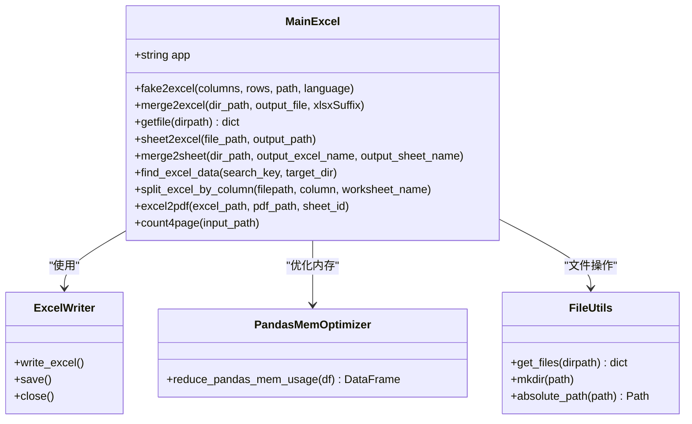
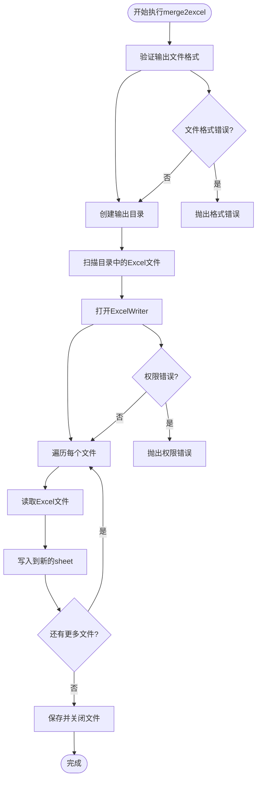
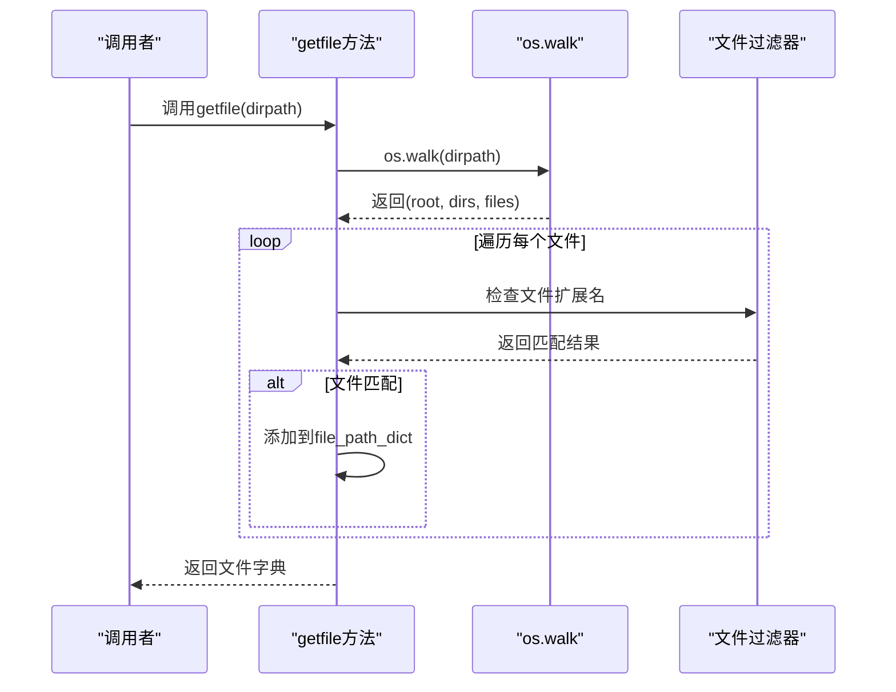
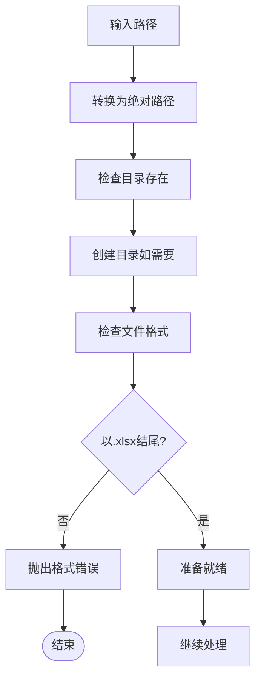
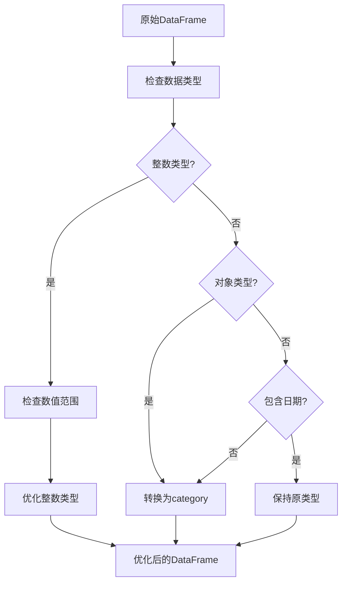
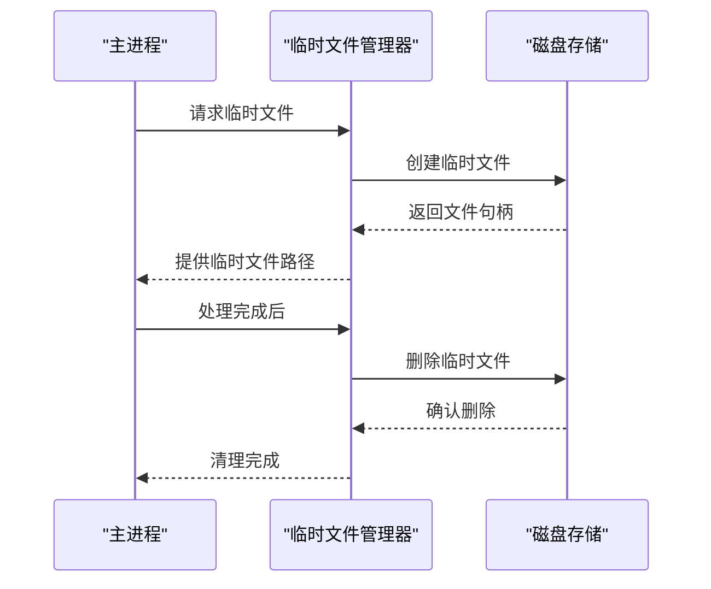
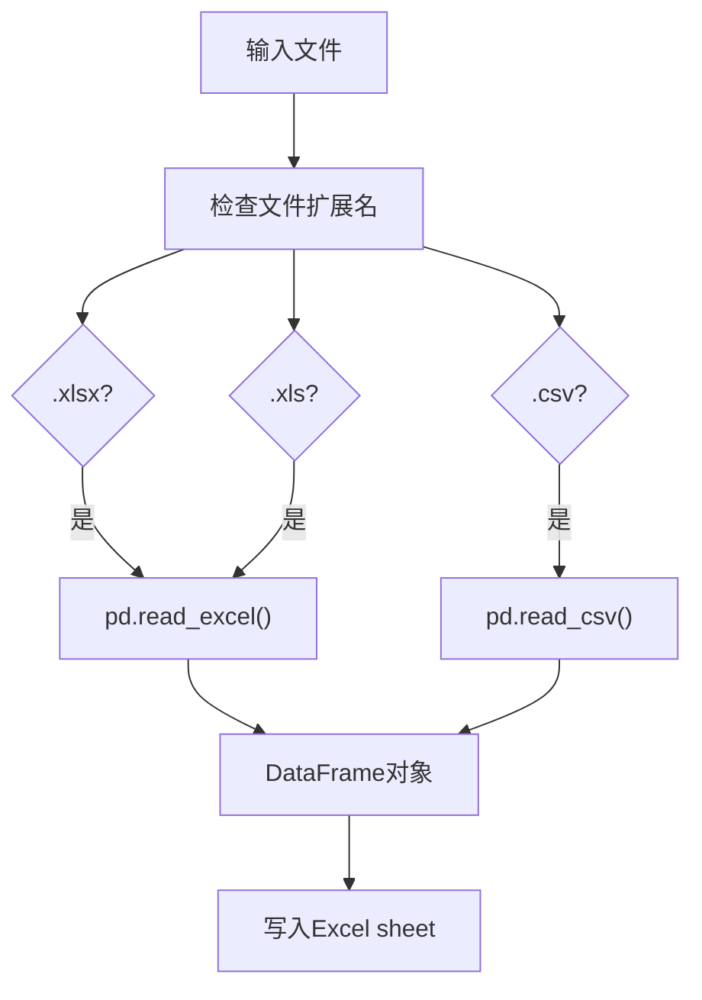

# 合并到不同Sheet功能详细说明

<cite>
**本文档引用的文件**
- [office/api/excel.py](file://office/api/excel.py)
- [poexcel/api/excel.py](file://venv/Lib/site-packages/poexcel/api/excel.py)
- [poexcel/core/ExcelType.py](file://venv/Lib/site-packages/poexcel/core/ExcelType.py)
- [office/lib/utils/pandas_mem.py](file://office/lib/utils/pandas_mem.py)
- [examples/poexcel/合并多个Excel到一个Excel的不同sheet中.py](file://examples/poexcel/合并多个Excel到一个Excel的不同sheet中.py)
- [tests/test_code/test_excel.py](file://tests/test_code/test_excel.py)
</cite>

## 目录
1. [功能概述](#功能概述)
2. [核心架构分析](#核心架构分析)
3. [merge2excel函数详解](#merge2excel函数详解)
4. [目录扫描机制](#目录扫描机制)
5. [输出文件控制策略](#输出文件控制策略)
6. [实际调用示例](#实际调用示例)
7. [性能优化分析](#性能优化分析)
8. [pandas集成机制](#pandas集成机制)
9. [文件格式兼容性](#文件格式兼容性)
10. [故障排除指南](#故障排除指南)

## 功能概述

`merge2excel`函数是python-office库中的核心功能之一，专门用于将多个Excel文件合并到一个Excel文件的不同sheet中。该功能支持多种文件格式（.xlsx和.csv），具备强大的目录扫描能力，并提供灵活的输出控制选项。

### 主要特性

- **多文件合并**：支持将指定目录下的所有Excel文件合并到一个文件的不同sheet中
- **格式兼容**：同时支持.xlsx和.csv格式文件的处理
- **智能命名**：自动使用文件名作为sheet名称，避免重复命名冲突
- **内存优化**：集成pandas内存优化机制，有效处理大型数据集
- **错误处理**：完善的异常处理机制，确保操作的稳定性

## 核心架构分析



**图表来源**
- [poexcel/core/ExcelType.py](file://venv/Lib/site-packages/poexcel/core/ExcelType.py#L18-L225)

**章节来源**
- [poexcel/core/ExcelType.py](file://venv/Lib/site-packages/poexcel/core/ExcelType.py#L18-L225)

## merge2excel函数详解

### 函数签名与参数说明

```python
def merge2excel(dir_path, output_file='merge2excel.xlsx'):
```

#### 参数详解

| 参数名 | 类型 | 默认值 | 说明 |
|--------|------|--------|------|
| `dir_path` | str | - | 包含多个Excel文件的目录路径 |
| `output_file` | str | 'merge2excel.xlsx' | 合并后的Excel文件路径 |

### 核心执行流程



**图表来源**
- [poexcel/core/ExcelType.py](file://venv/Lib/site-packages/poexcel/core/ExcelType.py#L50-L72)

### 实现细节分析

函数的核心实现在[`merge2excel`](file://venv/Lib/site-packages/poexcel/core/ExcelType.py#L50-L72)方法中，其执行步骤如下：

1. **路径处理**：将输出文件路径转换为绝对路径
2. **目录创建**：确保输出目录存在
3. **格式验证**：检查输出文件是否以.xlsx结尾
4. **文件扫描**：使用`getfile`方法扫描指定目录
5. **ExcelWriter初始化**：创建Excel写入器
6. **逐文件处理**：读取每个文件并写入对应sheet
7. **资源清理**：保存并关闭Excel文件

**章节来源**
- [poexcel/core/ExcelType.py](file://venv/Lib/site-packages/poexcel/core/ExcelType.py#L50-L72)

## 目录扫描机制

### getfile方法实现

[`getfile`](file://venv/Lib/site-packages/poexcel/core/ExcelType.py#L74-L81)方法负责扫描指定目录并收集符合条件的Excel文件：



**图表来源**
- [poexcel/core/ExcelType.py](file://venv/Lib/site-packages/poexcel/core/ExcelType.py#L74-L81)

### 扫描策略

1. **递归扫描**：使用`os.walk`递归遍历目录结构
2. **文件过滤**：只处理.xlsx和.csv格式文件
3. **路径构建**：使用`Path`对象构建完整文件路径
4. **字典存储**：以文件名为键，完整路径为值存储

### 支持的文件格式

| 文件扩展名 | 处理方式 | 说明 |
|------------|----------|------|
| `.xlsx` | pandas.read_excel() | 原生Excel格式 |
| `.xls` | pandas.read_excel() | 旧版Excel格式 |
| `.csv` | pandas.read_csv() | CSV格式文件 |

**章节来源**
- [poexcel/core/ExcelType.py](file://venv/Lib/site-packages/poexcel/core/ExcelType.py#L74-L81)

## 输出文件控制策略

### 路径解析与验证



**图表来源**
- [poexcel/core/ExcelType.py](file://venv/Lib/site-packages/poexcel/core/ExcelType.py#L56-L59)

### 命名策略

1. **文件名提取**：从完整路径中提取基础文件名
2. **扩展名处理**：自动添加.xlsx扩展名（如果缺失）
3. **路径规范化**：使用`Path.absolute()`确保路径正确性
4. **目录创建**：自动创建必要的输出目录

### 错误处理机制

- **权限错误**：检测输出文件是否被占用
- **格式错误**：验证输出文件必须以.xlsx结尾
- **路径错误**：处理无效或不存在的路径

**章节来源**
- [poexcel/core/ExcelType.py](file://venv/Lib/site-packages/poexcel/core/ExcelType.py#L56-L59)

## 实际调用示例

### 基础使用示例

#### 使用相对路径

```python
# 相对路径示例
import office
office.excel.merge2excel(
    dir_path='./data/excel_files',
    output_file='merged_report.xlsx'
)
```

#### 使用绝对路径

```python
# 绝对路径示例
import office
office.excel.merge2excel(
    dir_path='/home/user/data/excel_files',
    output_file='/tmp/output/combined.xlsx'
)
```

### 不同调用方式对比

| 调用方式 | 优势 | 劣势 | 适用场景 |
|----------|------|------|----------|
| 相对路径 | 项目内使用方便，可移植性强 | 需要了解项目结构 | 开发环境、脚本自动化 |
| 绝对路径 | 明确指定位置，避免路径问题 | 可移植性差 | 生产环境、部署脚本 |

### 示例文件组织结构

假设目录结构如下：
```
data/
├── sales_january.xlsx
├── sales_february.xlsx
├── sales_march.xlsx
└── financial_summary.csv
```

执行后生成的Excel文件包含：
- Sheet1: sales_january
- Sheet2: sales_february  
- Sheet3: sales_march
- Sheet4: financial_summary

**章节来源**
- [examples/poexcel/合并多个Excel到一个Excel的不同sheet中.py](file://examples/poexcel/合并多个Excel到一个Excel的不同sheet中.py#L1-L20)
- [tests/test_code/test_excel.py](file://tests/test_code/test_excel.py#L67-L77)

## 性能优化分析

### 内存优化机制

#### pandas内存优化

[`pandas_mem.py`](file://office/lib/utils/pandas_mem.py)模块提供了内存优化功能：



**图表来源**
- [office/lib/utils/pandas_mem.py](file://office/lib/utils/pandas_mem.py#L4-L42)

#### 优化策略

1. **整数类型优化**：根据数值范围选择合适的整数类型
2. **字符串优化**：将字符串列转换为category类型
3. **内存监控**：提供内存使用情况的监控功能
4. **自动转换**：透明地应用优化策略

### 性能瓶颈分析

#### 大量文件处理的挑战

| 挑战 | 影响因素 | 解决策略 |
|------|----------|----------|
| 内存占用 | 单个文件过大 | 分批处理，内存优化 |
| I/O性能 | 文件数量过多 | 并行处理，缓存机制 |
| CPU使用率 | 数据转换复杂度 | 算法优化，向量化操作 |
| 磁盘空间 | 中间文件累积 | 及时清理，流式处理 |

#### 临时文件管理



### 优化建议

1. **分批处理**：对于超大文件集，考虑分批处理
2. **内存监控**：定期检查内存使用情况
3. **并发处理**：利用多线程或多进程加速处理
4. **流式处理**：对于超大数据集，采用流式处理方式

**章节来源**
- [office/lib/utils/pandas_mem.py](file://office/lib/utils/pandas_mem.py#L4-L42)

## pandas集成机制

### 底层集成方式

#### ExcelWriter的使用

[`merge2excel`](file://venv/Lib/site-packages/poexcel/core/ExcelType.py#L62-L71)函数直接使用pandas的ExcelWriter：

```python
writer = pd.ExcelWriter(output_file)
for file, path in file_path_dict.items():
    df = pd.read_excel(path)
    df.to_excel(writer, sheet_name=file.split('.')[0], index=False)
writer._save()
```

#### pandas.concat的间接应用

虽然`merge2excel`不直接使用`pandas.concat`，但在相关功能中广泛使用：

```python
# 在merge2sheet中使用的类似模式
res = pd.concat(df_list)
```

### 集成优势

1. **标准化接口**：使用pandas标准的Excel处理接口
2. **格式兼容**：自动处理各种Excel格式
3. **性能优化**：利用pandas的内部优化机制
4. **错误处理**：继承pandas的错误处理能力

### 文件格式兼容性影响

#### 支持的格式特性

| 格式 | 读取支持 | 写入支持 | 特殊处理 |
|------|----------|----------|----------|
| .xlsx | ✅ | ✅ | 完全支持 |
| .xls | ✅ | ✅ | 需要xlrd/xlwt |
| .csv | ✅ | ✅ | 字符串处理 |

#### 兼容性注意事项

1. **编码问题**：CSV文件的字符编码处理
2. **数据类型**：Excel格式的数据类型限制
3. **公式处理**：公式在不同格式间的转换
4. **样式保留**：格式化信息的兼容性

**章节来源**
- [poexcel/core/ExcelType.py](file://venv/Lib/site-packages/poexcel/core/ExcelType.py#L62-L71)

## 文件格式兼容性

### 支持的文件格式

#### Excel格式
- **.xlsx**：现代Excel格式，完全支持
- **.xls**：传统Excel格式，部分功能受限

#### 文本格式
- **.csv**：逗号分隔值格式，自动识别分隔符

### 格式检测与处理



**图表来源**
- [poexcel/core/ExcelType.py](file://venv/Lib/site-packages/poexcel/core/ExcelType.py#L66-L69)

### 兼容性处理策略

1. **自动格式检测**：根据文件扩展名选择合适的读取方法
2. **错误恢复**：处理格式不匹配的情况
3. **数据类型转换**：确保数据在不同格式间的正确转换
4. **编码处理**：处理CSV文件的字符编码问题

### 最佳实践建议

- **统一格式**：建议使用.xlsx格式以获得最佳兼容性
- **数据验证**：在合并前验证源文件的数据完整性
- **备份策略**：重要数据处理前做好备份
- **测试验证**：在生产环境中先进行充分测试

**章节来源**
- [poexcel/core/ExcelType.py](file://venv/Lib/site-packages/poexcel/core/ExcelType.py#L66-L69)

## 故障排除指南

### 常见问题与解决方案

#### 权限问题

**问题描述**：输出文件被占用或没有写入权限

**解决方案**：
```python
# 检查文件是否被占用
import os
try:
    with open(output_file, 'a'):
        pass
except PermissionError:
    print("文件被占用，请关闭相关程序后再试")
```

#### 文件格式问题

**问题描述**：输出文件不是.xlsx格式

**解决方案**：
```python
# 自动添加.xlsx扩展名
if not output_file.endswith('.xlsx'):
    output_file += '.xlsx'
```

#### 内存不足问题

**问题描述**：处理大型文件时出现内存不足

**解决方案**：
1. 使用内存优化功能
2. 分批处理大型文件集
3. 增加系统内存或使用虚拟内存

#### 文件编码问题

**问题描述**：CSV文件出现编码错误

**解决方案**：
```python
# 指定正确的编码
df = pd.read_csv(path, encoding='utf-8-sig')
```

### 调试技巧

1. **启用详细日志**：增加调试信息输出
2. **分步测试**：单独测试每个功能模块
3. **数据验证**：验证输入数据的完整性和格式
4. **资源监控**：监控内存和CPU使用情况

### 性能监控指标

| 指标 | 正常范围 | 警告阈值 | 监控方法 |
|------|----------|----------|----------|
| 内存使用 | < 2GB | > 4GB | psutil.virtual_memory() |
| 处理时间 | < 1秒/MB | > 5秒/MB | time.time() |
| 文件大小 | 符合预期 | 异常增大 | os.path.getsize() |
| 错误率 | < 1% | > 5% | 异常捕获统计 |

通过以上全面的分析，我们可以看到`merge2excel`函数是一个设计精良、功能完备的Excel处理工具，它不仅提供了强大的文件合并能力，还具备良好的性能优化和错误处理机制。在实际使用中，用户应该根据具体需求选择合适的参数配置，并注意监控系统资源使用情况，以确保最佳的处理效果。