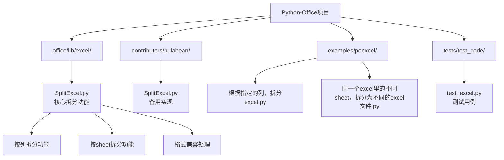
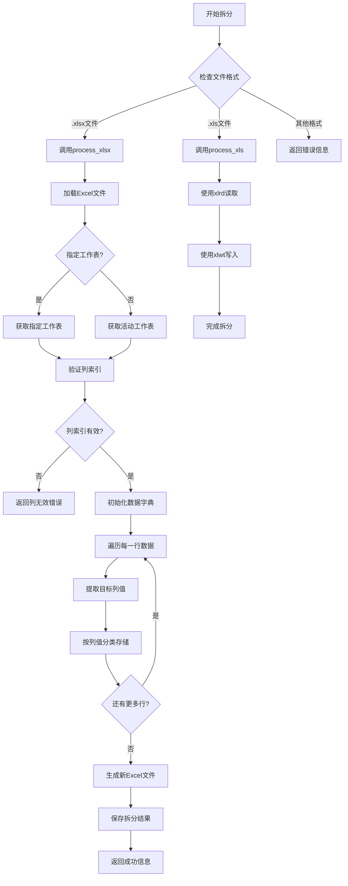
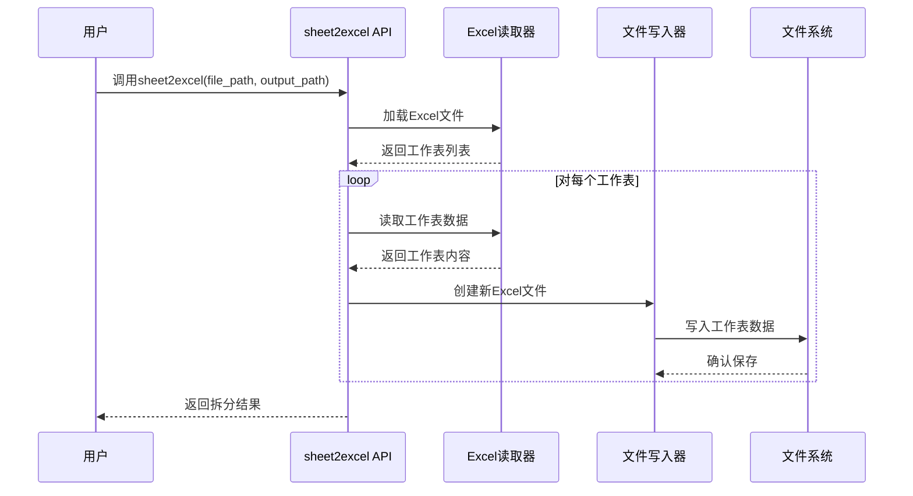
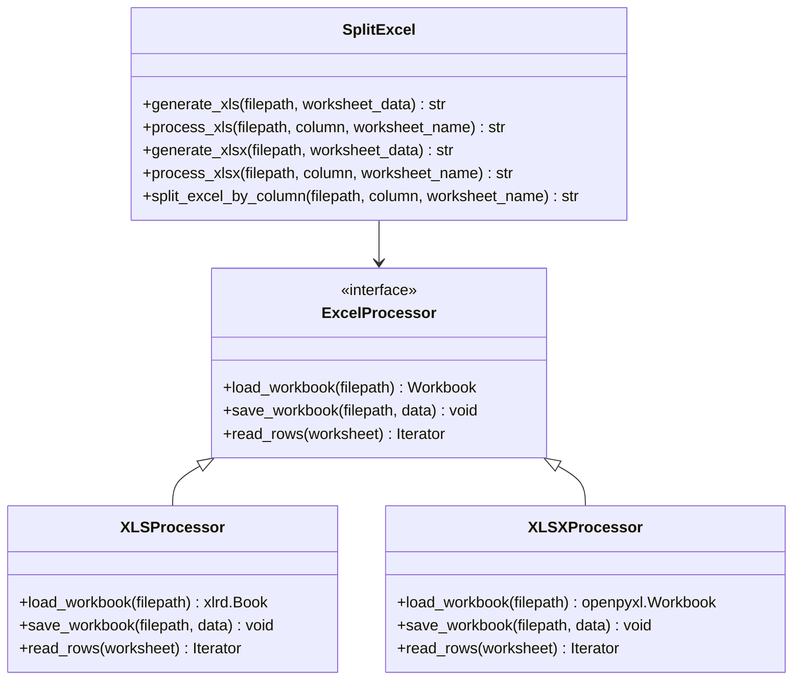
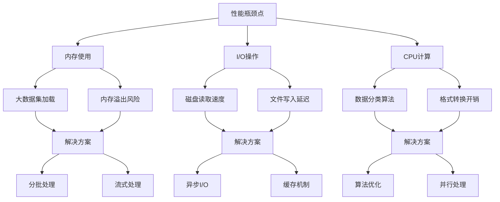
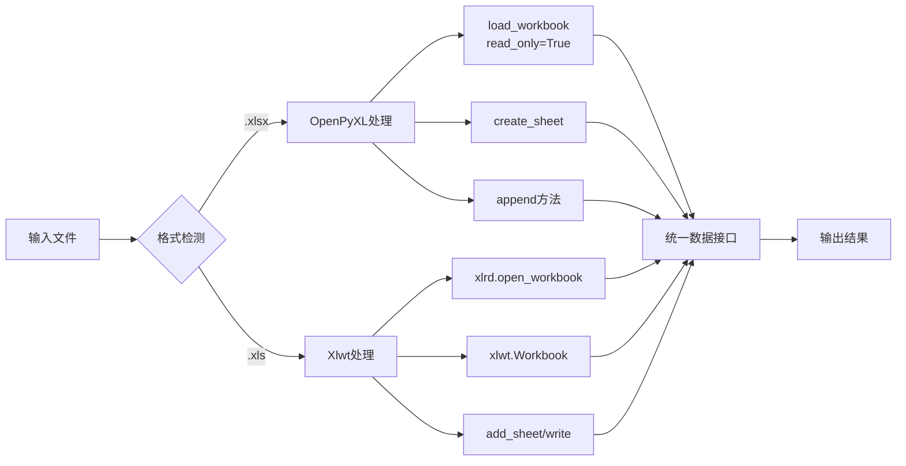

# Excel拆分功能全面解析

<cite>
**本文档引用的文件**
- [SplitExcel.py](file://office/lib/excel/SplitExcel.py)
- [SplitExcel.py](file://contributors/bulabean/SplitExcel.py)
- [excel.py](file://office/api/excel.py)
- [根据指定的列，拆分excel.py](file://examples/poexcel/根据指定的列，拆分excel.py)
- [同一个excel里的不同sheet，拆分为不同的excel文件.py](file://examples/poexcel/同一个excel里的不同sheet，拆分为不同的excel文件.py)
- [test_excel.py](file://tests/test_code/test_excel.py)
- [compatibility.py](file://office/compatibility.py)
</cite>

## 目录
1. [概述](#概述)
2. [项目结构分析](#项目结构分析)
3. [核心拆分模式](#核心拆分模式)
4. [详细功能分析](#详细功能分析)
5. [架构设计](#架构设计)
6. [性能优化策略](#性能优化策略)
7. [兼容性处理](#兼容性处理)
8. [最佳实践指南](#最佳实践指南)
9. [故障排除](#故障排除)
10. [总结](#总结)

## 概述

Python-Office项目提供了强大的Excel文件拆分功能，主要包含两种核心拆分模式：按sheet拆分（sheet2excel）和按列值拆分（split_excel_by_column）。这些功能专为处理大型Excel文件而设计，能够有效提高数据管理和分发效率。

### 主要特性

- **双格式支持**：同时支持`.xls`和`.xlsx`格式的Excel文件
- **灵活的拆分方式**：支持按工作表拆分和按列值拆分
- **高级配置选项**：支持指定工作表名称和列索引
- **性能优化**：针对大文件处理进行了专门优化
- **跨平台兼容**：支持Windows、macOS和Linux系统

## 项目结构分析



**图表来源**
- [SplitExcel.py](file://office/lib/excel/SplitExcel.py#L1-L144)
- [SplitExcel.py](file://contributors/bulabean/SplitExcel.py#L1-L141)

**章节来源**
- [SplitExcel.py](file://office/lib/excel/SplitExcel.py#L1-L144)
- [SplitExcel.py](file://contributors/bulabean/SplitExcel.py#L1-L141)

## 核心拆分模式

### 按列值拆分（split_excel_by_column）

按列值拆分是最常用的数据分离功能，特别适用于按地区、部门、类别等字段进行数据分离的场景。

#### 功能特点

- **基于列值分割**：根据指定列的值将数据拆分为多个文件
- **动态文件命名**：自动生成基于时间戳的新文件名
- **保持数据完整性**：确保每行数据完整地分配到对应文件
- **支持多种格式**：同时支持`.xls`和`.xlsx`格式

#### 参数说明

| 参数 | 类型 | 必需 | 描述 |
|------|------|------|------|
| filepath | str | 是 | 要拆分的Excel文件路径 |
| column | int | 是 | 按哪一列的内容进行拆分（从1开始计数） |
| worksheet_name | str | 否 | 指定工作表名称，默认为None表示第一个工作表 |

#### 使用示例

```python
# 基本用法
import poexcel
poexcel.split_excel_by_column(
    filepath='data.xlsx',
    column=3
)

# 指定工作表
poexcel.split_excel_by_column(
    filepath='data.xlsx',
    column=1,
    worksheet_name='销售数据'
)
```

### 按Sheet拆分（sheet2excel）

按Sheet拆分功能将同一个Excel文件中的不同工作表拆分为独立的Excel文件，适用于需要将不同业务模块分离的场景。

#### 功能特点

- **工作表级分离**：将每个工作表保存为独立的Excel文件
- **保持格式完整**：保留原始工作表的所有格式和样式
- **批量处理**：支持一次性处理包含多个工作表的Excel文件
- **灵活输出路径**：可指定输出目录

#### 参数说明

| 参数 | 类型 | 必需 | 描述 |
|------|------|------|------|
| file_path | str | 是 | 需要拆分的Excel文件路径 |
| output_path | str | 否 | 拆分后文件的输出目录，默认为当前目录 |

**章节来源**
- [SplitExcel.py](file://office/lib/excel/SplitExcel.py#L117-L136)
- [excel.py](file://office/api/excel.py#L59-L71)

## 详细功能分析

### 按列值拆分详细流程



**图表来源**
- [SplitExcel.py](file://office/lib/excel/SplitExcel.py#L84-L114)
- [SplitExcel.py](file://contributors/bulabean/SplitExcel.py#L83-L113)

### 按Sheet拆分详细流程



**图表来源**
- [excel.py](file://office/api/excel.py#L59-L71)

**章节来源**
- [SplitExcel.py](file://office/lib/excel/SplitExcel.py#L84-L114)
- [SplitExcel.py](file://contributors/bulabean/SplitExcel.py#L83-L113)

## 架构设计

### 模块化架构



**图表来源**
- [SplitExcel.py](file://office/lib/excel/SplitExcel.py#L9-L116)

### 数据流处理


**图表来源**
- [SplitExcel.py](file://office/lib/excel/SplitExcel.py#L42-L114)

**章节来源**
- [SplitExcel.py](file://office/lib/excel/SplitExcel.py#L1-L144)

## 性能优化策略

### 大文件处理优化

#### 1. 内存管理优化

对于大文件处理，系统采用了以下优化策略：

- **流式处理**：使用生成器模式逐行处理数据，避免一次性加载整个文件到内存
- **只读模式**：对`.xlsx`文件使用`read_only=True`模式，显著减少内存占用
- **数据类型优化**：自动处理空值和不同类型的数据

#### 2. 文件格式优化

| 优化策略 | XLS格式 | XLSX格式 |
|----------|---------|----------|
| 读取模式 | 标准模式 | 只读模式 |
| 内存占用 | 较高 | 较低 |
| 处理速度 | 中等 | 较快 |
| 功能支持 | 完整 | 部分受限 |

#### 3. 性能瓶颈分析



### 优化建议

1. **合理设置列索引**：避免选择包含大量重复值的列
2. **控制文件大小**：单个拆分文件建议不超过10MB
3. **使用SSD存储**：显著提升I/O性能
4. **监控内存使用**：及时释放不再需要的数据

**章节来源**
- [SplitExcel.py](file://office/lib/excel/SplitExcel.py#L95-L114)
- [compatibility.py](file://office/compatibility.py#L40-L72)

## 兼容性处理

### OpenPyXL与Xlwt兼容性

系统在处理不同Excel格式时采用了专门的兼容性处理机制：

#### 格式转换处理



**图表来源**
- [SplitExcel.py](file://office/lib/excel/SplitExcel.py#L9-L81)

#### 错误处理机制

系统实现了完善的错误处理机制：

- **文件格式验证**：检查文件扩展名和格式兼容性
- **列索引边界检查**：验证指定列索引的有效性
- **工作表存在性检查**：确认指定工作表的存在
- **内存不足处理**：优雅处理内存不足的情况

**章节来源**
- [SplitExcel.py](file://office/lib/excel/SplitExcel.py#L42-L134)
- [compatibility.py](file://office/compatibility.py#L1-L250)

## 最佳实践指南

### 使用场景推荐

#### 按列值拆分适用场景

1. **按地区拆分**：将全国销售数据按省份拆分
2. **按部门拆分**：将公司员工数据按部门拆分
3. **按产品线拆分**：将产品数据按类别拆分
4. **按时间拆分**：将时间序列数据按月份拆分

#### 按Sheet拆分适用场景

1. **业务模块分离**：将不同业务模块的数据分离
2. **报告生成**：为不同部门生成独立报告
3. **数据归档**：按年份或项目归档历史数据
4. **权限控制**：为不同用户组提供独立数据视图

### 参数配置最佳实践

#### 列索引规则

- **从1开始计数**：column参数必须从1开始，而不是0
- **有效性检查**：确保指定列索引在文件范围内
- **数据类型考虑**：选择适合分类的数据类型列

#### 工作表名称指定

- **精确匹配**：工作表名称区分大小写
- **特殊字符处理**：避免使用特殊字符作为工作表名称
- **默认行为**：不指定时使用第一个工作表

### 性能优化建议

1. **预处理数据**：在拆分前清理不必要的空白行和列
2. **批量操作**：对多个文件进行批量拆分时使用循环
3. **资源监控**：监控内存和磁盘使用情况
4. **错误恢复**：实现断点续传机制处理意外中断

**章节来源**
- [根据指定的列，拆分excel.py](file://examples/poexcel/根据指定的列，拆分excel.py#L1-L32)
- [同一个excel里的不同sheet，拆分为不同的excel文件.py](file://examples/poexcel/同一个excel里的不同sheet，拆分为不同的excel文件.py#L1-L24)

## 故障排除

### 常见问题及解决方案

#### 1. 文件格式错误

**问题描述**：文件格式不被支持或无法识别

**解决方案**：
```python
# 检查文件格式
if filepath.endswith('.xlsx'):
    # 处理xlsx文件
elif filepath.endswith('.xls'):
    # 处理xls文件
else:
    print("不支持的文件格式")
```

#### 2. 列索引超出范围

**问题描述**：指定的列索引大于文件实际列数

**解决方案**：
```python
# 在处理前检查列索引
if worksheet.max_column < column:
    return f"最大列数是{worksheet.max_column}，取不到第{column}列"
```

#### 3. 内存不足

**问题描述**：处理大文件时出现内存溢出

**解决方案**：
- 分批处理数据
- 使用流式处理模式
- 增加系统内存或使用虚拟内存

#### 4. 工作表不存在

**问题描述**：指定的工作表名称不存在

**解决方案**：
```python
# 检查工作表是否存在
if worksheet_name and worksheet_name not in workbook.sheetnames:
    return f"工作表'{worksheet_name}'不存在"
```

### 调试技巧

1. **启用详细日志**：添加详细的调试信息
2. **分步执行**：逐步验证每个处理步骤
3. **数据验证**：在关键节点验证数据完整性
4. **异常捕获**：完善异常处理机制

**章节来源**
- [SplitExcel.py](file://office/lib/excel/SplitExcel.py#L42-L134)
- [test_excel.py](file://tests/test_code/test_excel.py#L34-L57)

## 总结

Python-Office的Excel拆分功能提供了强大而灵活的数据处理能力，通过按列值拆分和按Sheet拆分两种核心模式，满足了不同场景下的数据管理需求。

### 主要优势

1. **功能全面**：支持两种主要的拆分模式
2. **格式兼容**：同时支持传统和现代Excel格式
3. **性能优化**：针对大文件处理进行了专门优化
4. **易于使用**：简洁的API设计，便于集成和使用
5. **稳定可靠**：完善的错误处理和兼容性机制

### 应用价值

- **提高工作效率**：自动化数据拆分过程
- **降低人工错误**：减少手动操作带来的错误
- **支持大规模处理**：能够处理大型Excel文件
- **促进数据治理**：支持更好的数据组织和管理

通过合理使用这些功能，可以显著提升Excel数据处理的效率和质量，为数据分析和业务决策提供强有力的支持。