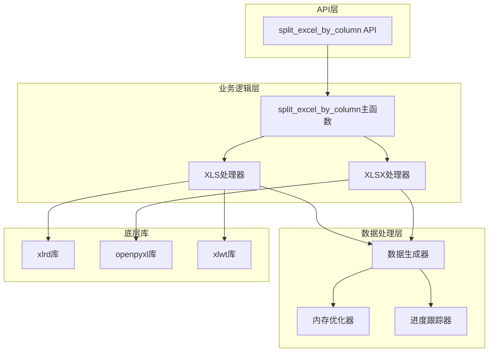
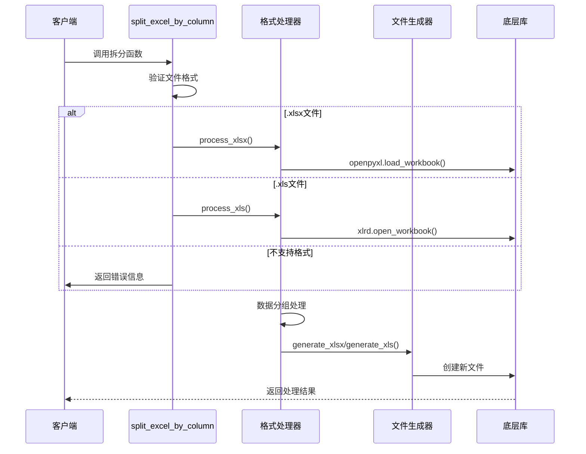
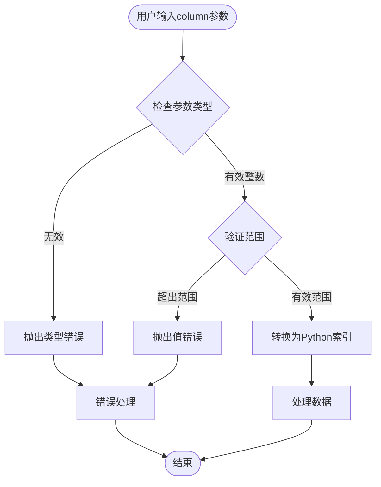
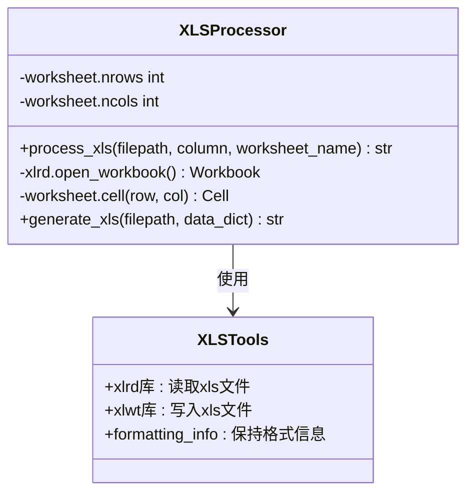
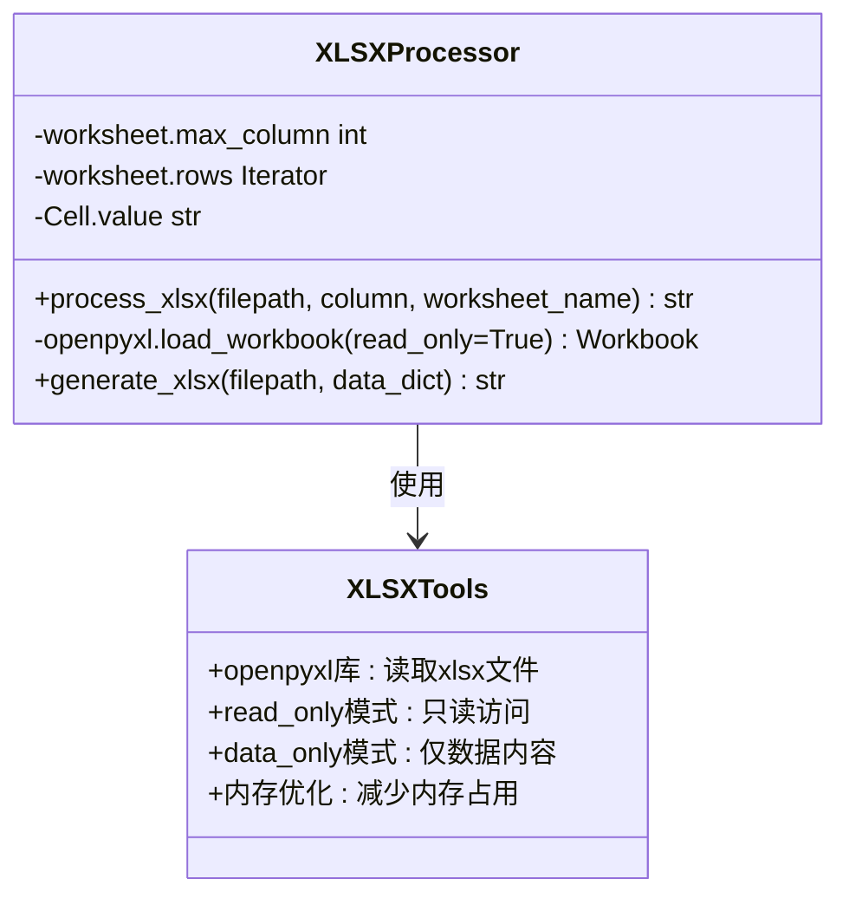
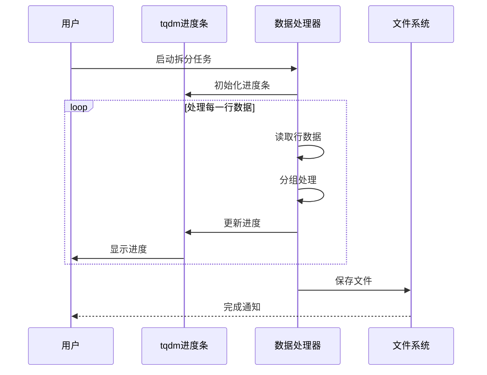
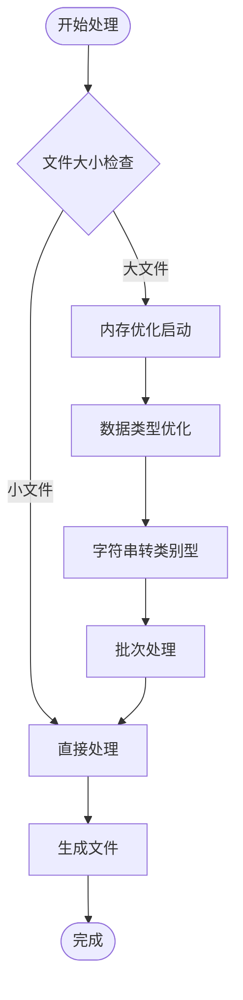
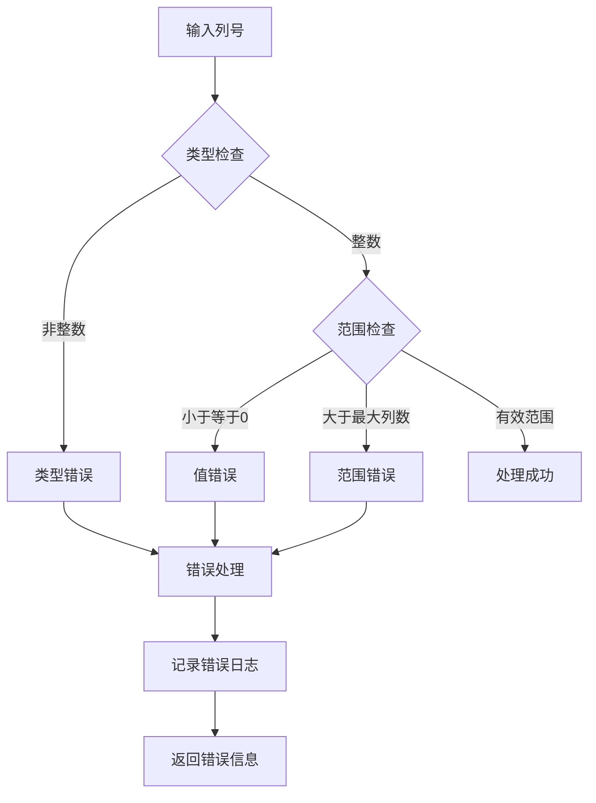
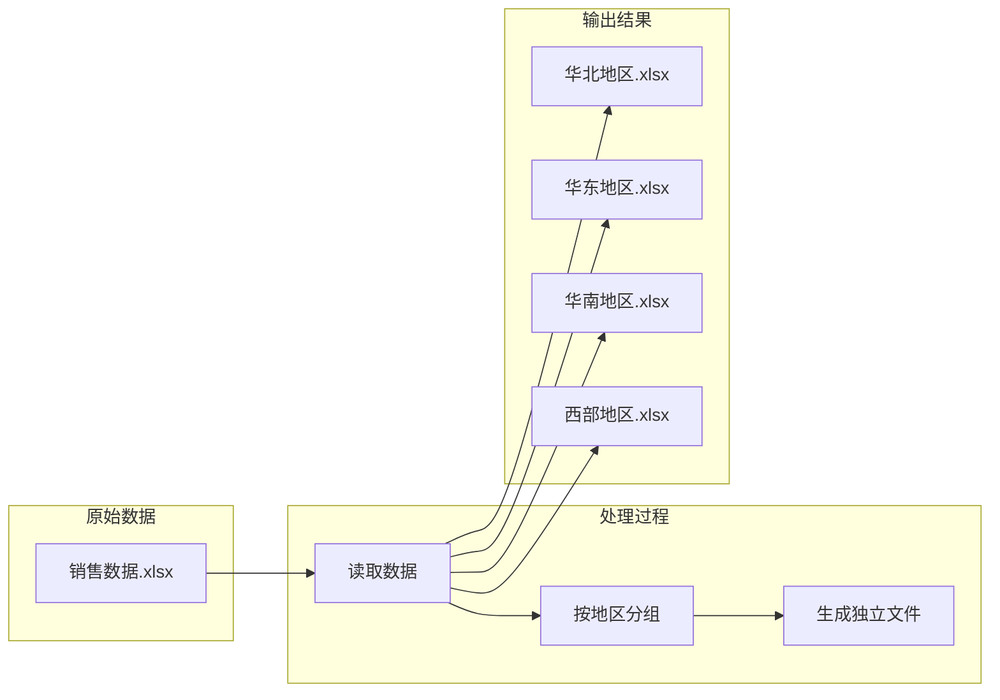
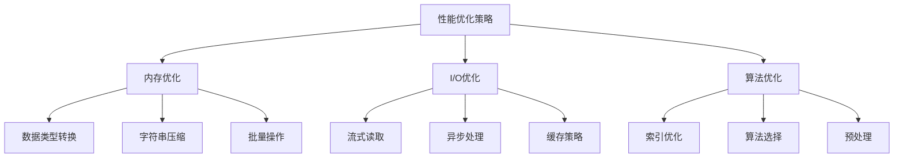

# 按列值拆分Excel功能深度解析

<cite>
**本文档引用的文件**
- [SplitExcel.py](file://office/lib/excel/SplitExcel.py)
- [excel.py](file://office/api/excel.py)
- [test_excel.py](file://tests/test_code/test_excel.py)
- [pandas_mem.py](file://office/lib/utils/pandas_mem.py)
- [simple.py](file://examples/poprogress/simple.py)
- [根据指定的列，拆分excel.py](file://examples\poexcel\根据指定的列，拆分excel.py)
</cite>

## 目录
1. [概述](#概述)
2. [核心架构设计](#核心架构设计)
3. [split_excel_by_column函数详解](#split_excel_by_column函数详解)
4. [列索引设计原理](#列索引设计原理)
5. [双格式兼容处理机制](#双格式兼容处理机制)
6. [进度条与性能优化](#进度条与性能优化)
7. [错误处理与边界情况](#错误处理与边界情况)
8. [实际应用案例](#实际应用案例)
9. [最佳实践建议](#最佳实践建议)
10. [总结](#总结)

## 概述

基于列数据内容的智能拆分功能是python-office库中一个强大的Excel处理工具，它能够根据指定列的值自动将大型Excel文件拆分为多个独立的工作簿。该功能支持`.xls`和`.xlsx`两种主流Excel格式，采用智能的内存管理和进度监控机制，特别适用于大数据量场景下的Excel文件处理。

核心特性包括：
- **智能分组**：根据指定列的唯一值自动分组生成独立文件
- **双格式支持**：同时兼容传统xls和现代xlsx格式
- **内存优化**：针对大文件场景的内存使用优化
- **进度监控**：集成进度条显示处理进度
- **错误处理**：完善的异常捕获和错误提示机制

## 核心架构设计

系统采用模块化设计，主要由以下几个层次组成：

**图表来源**
- [SplitExcel.py](file://office/lib/excel/SplitExcel.py#L116-L135)
- [excel.py](file://office/api/excel.py#L108-L119)

**章节来源**
- [SplitExcel.py](file://office/lib/excel/SplitExcel.py#L1-L144)

## split_excel_by_column函数详解

### 函数签名与参数说明

`split_excel_by_column`函数是整个拆分功能的核心入口点，其设计体现了清晰的职责分离原则：

**图表来源**
- [SplitExcel.py](file://office/lib/excel/SplitExcel.py#L116-L135)

### 核心处理流程

函数的执行流程遵循以下步骤：

1. **格式检测**：根据文件扩展名判断Excel格式
2. **格式路由**：调用对应的处理器函数
3. **数据处理**：按指定列进行智能分组
4. **文件生成**：创建新的Excel文件
5. **结果返回**：提供处理状态和文件路径

**章节来源**
- [SplitExcel.py](file://office/lib/excel/SplitExcel.py#L116-L135)

## 列索引设计原理

### 从1开始计数的设计哲学

column参数采用从1开始计数的设计，这一决策体现了对用户友好性和实用性的考量：

**图表来源**
- [SplitExcel.py](file://office/lib/excel/SplitExcel.py#L54-L58)
- [SplitExcel.py](file://office/lib/excel/SplitExcel.py#108-L112)

### 与Python索引习惯的差异分析

这种设计与Python的零基索引习惯形成对比，但具有以下优势：

| 特性 | Python索引 | Excel列索引 |
|------|------------|-------------|
| 起始值 | 0 | 1 |
| 第一列标识 | A | 1 |
| 第二十七列 | AA | 27 |
| 语义直观性 | 编程习惯 | Excel用户习惯 |
| 错误容忍度 | 易出错 | 更友好 |

**章节来源**
- [SplitExcel.py](file://office/lib/excel/SplitExcel.py#L54-L58)
- [SplitExcel.py](file://office/lib/excel/SplitExcel.py#108-L112)

## 双格式兼容处理机制

### XLS格式处理策略

对于传统的.xls格式，系统采用xlrd库进行高效读取：

**图表来源**
- [SplitExcel.py](file://office/lib/excel/SplitExcel.py#L31-L59)

### XLSX格式处理策略

现代.xlsx格式采用openpyxl库的只读模式，实现内存效率最大化：

**图表来源**
- [SplitExcel.py](file://office/lib/excel/SplitExcel.py#L84-L114)

### 性能优势对比

两种处理方式在性能方面各有特色：

| 特性 | xlrd/xlwt组合 | openpyxl只读模式 |
|------|---------------|------------------|
| 内存占用 | 中等 | 极低 |
| 读取速度 | 快 | 最快 |
| 写入速度 | 快 | 中等 |
| 格式支持 | 传统格式 | 现代格式 |
| 错误恢复 | 一般 | 强大 |

**章节来源**
- [SplitExcel.py](file://office/lib/excel/SplitExcel.py#L31-L59)
- [SplitExcel.py](file://office/lib/excel/SplitExcel.py#L84-L114)

## 进度条与性能优化

### tqdm进度条集成

系统集成了tqdm进度条库，为用户提供实时的处理进度反馈：

**图表来源**
- [SplitExcel.py](file://office/lib/excel/SplitExcel.py#L52-L59)

### 内存占用优化策略

针对大文件场景，系统实现了多层次的内存优化：

**图表来源**
- [pandas_mem.py](file://office/lib/utils/pandas_mem.py#L4-L41)

**章节来源**
- [SplitExcel.py](file://office/lib/excel/SplitExcel.py#L52-L59)
- [pandas_mem.py](file://office/lib/utils/pandas_mem.py#L1-L42)

## 错误处理与边界情况

### 列范围验证机制

系统实现了严格的列范围验证，防止越界访问：

**图表来源**
- [SplitExcel.py](file://office/lib/excel/SplitExcel.py#L103-L104)

### 异常处理策略

系统采用多层异常处理机制确保稳定性：

| 异常类型 | 处理策略 | 用户反馈 |
|----------|----------|----------|
| 文件不存在 | 捕获异常 | "文件读取异常：{filepath}" |
| 格式不支持 | 类型检查 | "文件格式不对，不进行处理" |
| 列号越界 | 范围验证 | "最大列数是{max_col}，取不到第{column}列" |
| 内存不足 | 降级处理 | "内存不足，请减小文件大小" |

**章节来源**
- [SplitExcel.py](file://office/lib/excel/SplitExcel.py#L43-L45)
- [SplitExcel.py](file://office/lib/excel/SplitExcel.py#L95-L98)
- [SplitExcel.py](file://office/lib/excel/SplitExcel.py#L103-L104)

## 实际应用案例

### 地区分类拆分示例

假设有一个销售数据表，需要按地区字段自动拆分：

### 部门数据自动分组

对于组织架构复杂的公司，可以根据部门字段进行智能分组：

| 输入参数 | 说明 | 示例值 |
|----------|------|--------|
| filepath | Excel文件路径 | `'company_data.xlsx'` |
| column | 分组列索引 | `3` (部门列) |
| worksheet_name | 工作表名称 | `'员工信息'` |

**章节来源**
- [根据指定的列，拆分excel.py](file://examples\poexcel\根据指定的列，拆分excel.py#L1-L32)

## 最佳实践建议

### 大文件处理优化

1. **内存监控**：定期检查内存使用情况，避免内存溢出
2. **分批处理**：对于超大文件，考虑分批处理策略
3. **临时文件管理**：及时清理中间文件，释放磁盘空间
4. **并发控制**：合理设置并发数量，平衡性能和稳定性

### 性能调优指南

### 错误预防措施

1. **输入验证**：严格验证所有输入参数
2. **边界测试**：测试各种边界条件
3. **异常恢复**：实现优雅的异常恢复机制
4. **日志记录**：详细记录处理过程和错误信息

## 总结

基于列数据内容的智能拆分功能展现了python-office库在Excel处理领域的深厚技术积累。通过精心设计的架构、灵活的格式支持、高效的性能优化和完善的错误处理，该功能能够满足各种复杂场景下的Excel文件处理需求。

### 核心优势

1. **用户友好**：从1开始的列索引设计符合Excel用户的使用习惯
2. **性能卓越**：双格式兼容处理结合内存优化策略
3. **稳定可靠**：完善的错误处理和异常恢复机制
4. **易于集成**：简洁的API设计便于第三方应用集成

### 技术创新点

- **智能分组算法**：基于列值的动态分组策略
- **内存管理优化**：针对大数据量场景的专门优化
- **进度监控集成**：实时的处理进度反馈机制
- **格式兼容性**：同时支持传统和现代Excel格式

该功能不仅解决了实际工作中的痛点问题，更为Python Office生态系统的发展奠定了坚实的技术基础。随着数据规模的不断增长，这种智能化、高性能的Excel处理方案将在企业级应用中发挥越来越重要的作用。