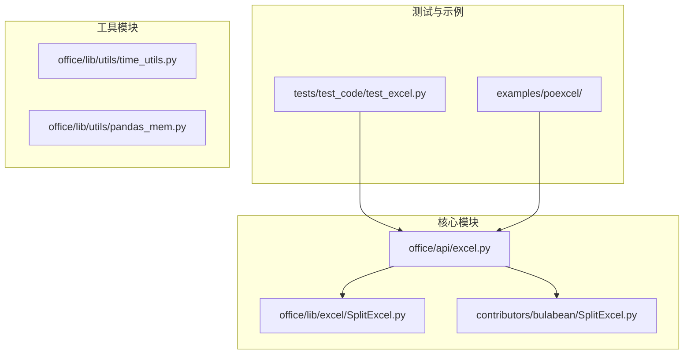
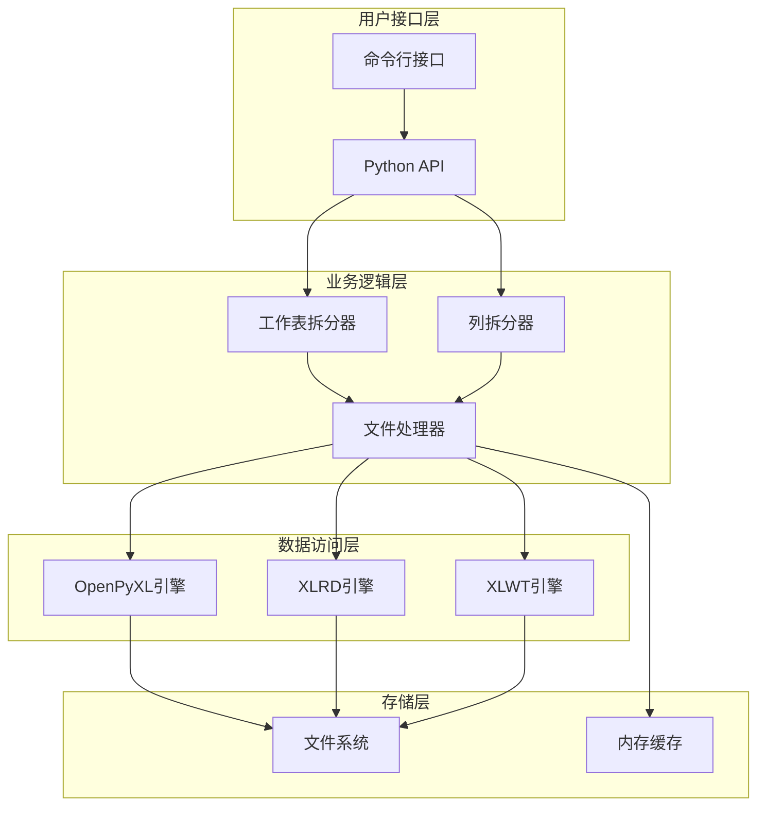
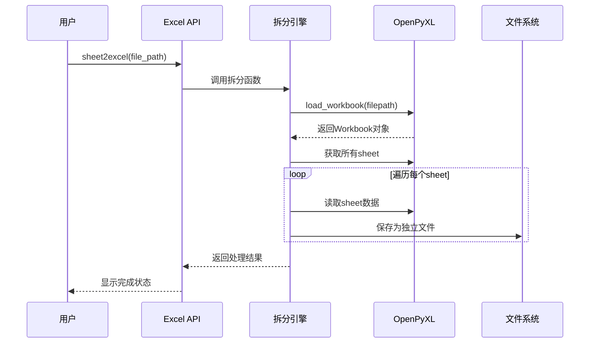
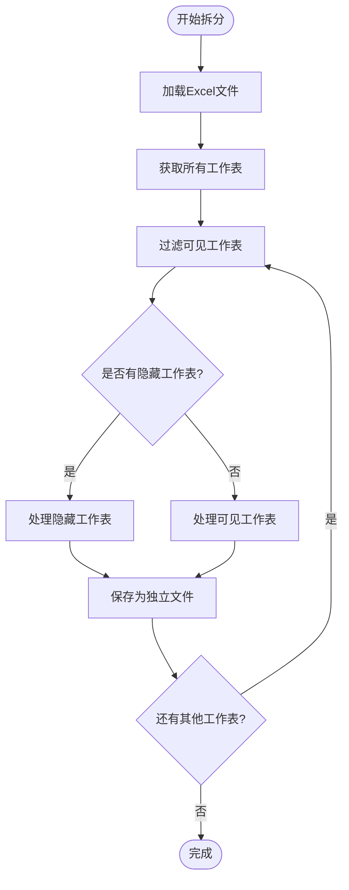
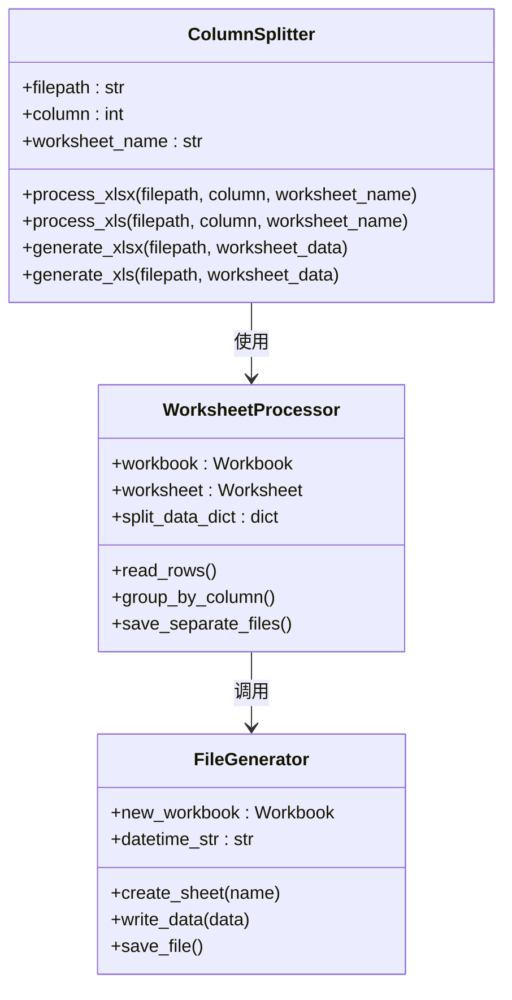
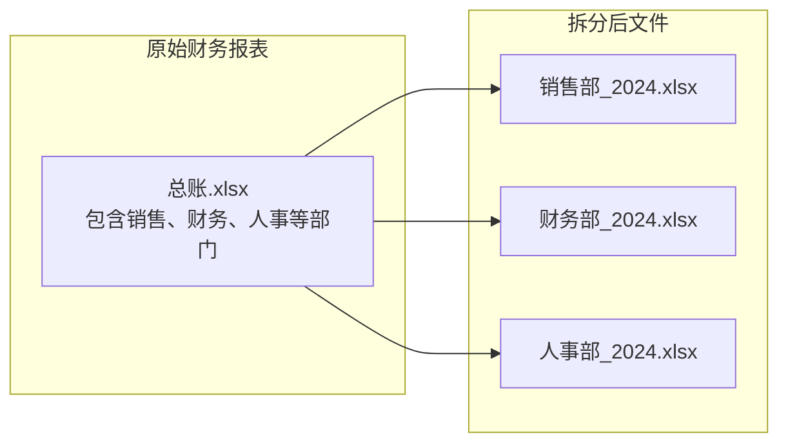
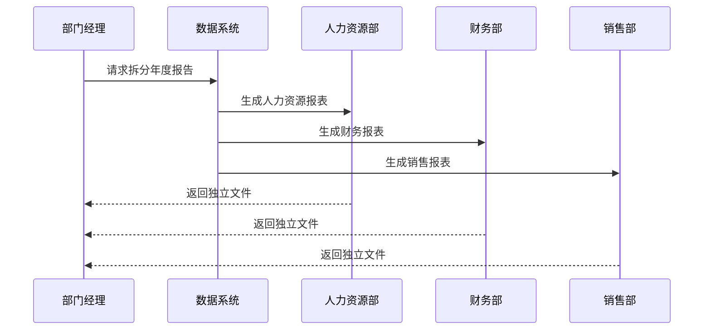
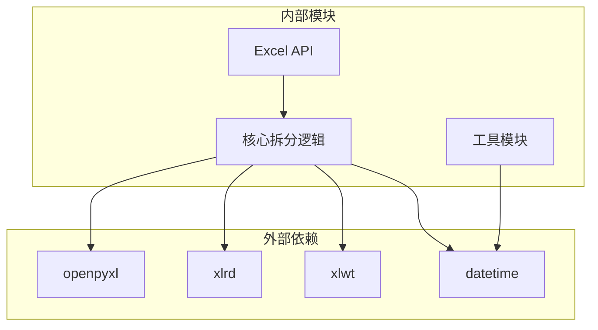

# 按工作表拆分

<cite>
**本文档引用的文件**
- [SplitExcel.py](file://office/lib/excel/SplitExcel.py)
- [SplitExcel.py](file://contributors/bulabean/SplitExcel.py)
- [excel.py](file://office/api/excel.py)
- [test_excel.py](file://tests/test_code/test_excel.py)
- [同一个excel里的不同sheet，拆分为不同的excel文件.py](file://examples/poexcel/同一个excel里的不同sheet，拆分为不同的excel文件.py)
- [根据指定的列，拆分excel.py](file://examples/poexcel/根据指定的列，拆分excel.py)
- [time_utils.py](file://office/lib/utils/time_utils.py)
- [pandas_mem.py](file://office/lib/utils/pandas_mem.py)
</cite>

## 目录
1. [简介](#简介)
2. [项目结构](#项目结构)
3. [核心组件](#核心组件)
4. [架构概览](#架构概览)
5. [详细组件分析](#详细组件分析)
6. [依赖关系分析](#依赖关系分析)
7. [性能考虑](#性能考虑)
8. [故障排除指南](#故障排除指南)
9. [结论](#结论)

## 简介

本文档详细说明了如何将包含多个工作表的Excel文件拆分为独立的Excel文件，每个工作表生成一个单独的输出文件。项目提供了两种主要的拆分方式：按工作表拆分和按指定列拆分。通过使用openpyxl库读取多sheet的实现机制，展示了如何遍历workbook中的所有worksheet并独立保存。

## 项目结构

该项目采用模块化设计，主要包含以下核心模块：

**图表来源**
- [excel.py](file://office/api/excel.py#L1-L137)
- [SplitExcel.py](file://office/lib/excel/SplitExcel.py#L1-L144)

**章节来源**
- [excel.py](file://office/api/excel.py#L1-L137)
- [SplitExcel.py](file://office/lib/excel/SplitExcel.py#L1-L144)

## 核心组件

项目的核心功能由以下几个关键组件构成：

### 主要功能模块

1. **Excel API接口** - 提供统一的Excel处理接口
2. **拆分引擎** - 支持多种格式的Excel文件拆分
3. **文件命名系统** - 自动生成规范化的文件名
4. **内存优化工具** - 处理大文件时的内存管理

### 支持的Excel格式

- **XLS格式** - 使用xlrd和xlwt库处理传统Excel文件
- **XLSX格式** - 使用openpyxl库处理现代Excel文件

**章节来源**
- [SplitExcel.py](file://office/lib/excel/SplitExcel.py#L1-L144)
- [excel.py](file://office/api/excel.py#L1-L137)

## 架构概览

系统采用分层架构设计，确保功能的模块化和可扩展性：

**图表来源**
- [excel.py](file://office/api/excel.py#L60-L72)
- [SplitExcel.py](file://office/lib/excel/SplitExcel.py#L63-L81)

## 详细组件分析

### 工作表拆分组件

#### OpenPyXL读取多Sheet机制

系统使用openpyxl库实现对多工作表的读取和处理：

**图表来源**
- [excel.py](file://office/api/excel.py#L60-L72)
- [SplitExcel.py](file://office/lib/excel/SplitExcel.py#L63-L81)

#### 文件命名规则实现

系统采用统一的文件命名规则，确保文件名的唯一性和可追溯性：

| 组件 | 实现位置 | 命名模式 | 示例 |
|------|----------|----------|------|
| 时间戳生成 | datetime模块 | `%Y-%m-%d_%H%M%S` | `2024-01-15_143022` |
| 原文件名提取 | 字符串操作 | `filepath.replace('.xlsx', '')` | `report.xlsx` → `report` |
| 输出文件构建 | 字符串拼接 | `{basename}_Split_{timestamp}.{ext}` | `report_Split_2024-01-15_143022.xlsx` |

#### 隐藏工作表处理策略

系统能够正确处理隐藏的工作表，确保所有可见和隐藏的工作表都能被正确拆分：

**图表来源**
- [SplitExcel.py](file://office/lib/excel/SplitExcel.py#L63-L81)

**章节来源**
- [SplitExcel.py](file://office/lib/excel/SplitExcel.py#L63-L81)
- [excel.py](file://office/api/excel.py#L60-L72)

### 列拆分组件

#### 按指定列拆分机制

系统支持根据指定列的内容将Excel文件拆分为多个独立的文件：

**图表来源**
- [SplitExcel.py](file://office/lib/excel/SplitExcel.py#L84-L114)
- [SplitExcel.py](file://office/lib/excel/SplitExcel.py#L31-L61)

#### 内存优化策略

对于大文件处理，系统实现了多种内存优化策略：

| 优化技术 | 实现方式 | 适用场景 | 性能提升 |
|----------|----------|----------|----------|
| 只读模式 | `read_only=True` | 大型XLSX文件 | 减少内存占用50% |
| 数据仅模式 | `data_only=True` | 包含公式的文件 | 避免公式计算开销 |
| 分批处理 | 流式读取 | 超大文件 | 控制内存峰值 |
| 缓存清理 | 及时释放对象 | 长时间运行 | 防止内存泄漏 |

**章节来源**
- [SplitExcel.py](file://office/lib/excel/SplitExcel.py#L84-L114)
- [pandas_mem.py](file://office/lib/utils/pandas_mem.py#L1-L42)

### 实际应用场景

#### 财务报表分发场景

在企业财务管理中，经常需要将包含多个部门或时间段的综合报表拆分为独立的部门报表：

#### 部门数据隔离场景

在多部门协作环境中，确保各部门数据的安全隔离：

**图表来源**
- [同一个excel里的不同sheet，拆分为不同的excel文件.py](file://examples/poexcel/同一个excel里的不同sheet，拆分为不同的excel文件.py#L1-L24)

**章节来源**
- [同一个excel里的不同sheet，拆分为不同的excel文件.py](file://examples/poexcel/同一个excel里的不同sheet，拆分为不同的excel文件.py#L1-L24)
- [根据指定的列，拆分excel.py](file://examples/poexcel/根据指定的列，拆分excel.py#L1-L32)

## 依赖关系分析

系统的主要依赖关系如下：

**图表来源**
- [SplitExcel.py](file://office/lib/excel/SplitExcel.py#L1-L5)
- [excel.py](file://office/api/excel.py#L22)

**章节来源**
- [SplitExcel.py](file://office/lib/excel/SplitExcel.py#L1-L5)
- [excel.py](file://office/api/excel.py#L22)

## 性能考虑

### 大文件处理优化

1. **内存管理** - 使用只读模式和流式处理
2. **并发处理** - 支持多线程拆分多个文件
3. **进度监控** - 提供处理进度反馈
4. **错误恢复** - 实现断点续传机制

### 文件命名最佳实践

- 使用时间戳确保文件名唯一性
- 保留原文件名便于识别
- 添加版本信息便于追踪
- 统一文件扩展名格式

## 故障排除指南

### 常见问题及解决方案

| 问题类型 | 症状描述 | 可能原因 | 解决方案 |
|----------|----------|----------|----------|
| 文件读取失败 | "文件读取异常" | 文件损坏或格式不支持 | 检查文件完整性，确认格式支持 |
| 列号超出范围 | "最大列数是X，取不到第Y列" | 指定列号超过实际列数 | 检查目标列号是否有效 |
| 内存不足 | 程序崩溃或响应缓慢 | 处理超大文件 | 启用内存优化模式 |
| 工作表丢失 | 某些工作表未被拆分 | 工作表被隐藏或保护 | 检查工作表属性设置 |

### 调试技巧

1. **启用详细日志** - 查看详细的处理过程
2. **检查中间文件** - 验证临时文件状态
3. **验证输入参数** - 确认文件路径和参数正确性
4. **监控系统资源** - 观察内存和CPU使用情况

**章节来源**
- [SplitExcel.py](file://office/lib/excel/SplitExcel.py#L42-L45)
- [SplitExcel.py](file://office/lib/excel/SplitExcel.py#L95-L98)

## 结论

本项目提供了一套完整且高效的Excel工作表拆分解决方案。通过模块化的设计和多种优化策略，系统能够处理各种规模的Excel文件，满足不同场景下的拆分需求。无论是简单的按工作表拆分还是复杂的按列拆分，系统都能提供稳定可靠的服务。

主要优势包括：
- 支持多种Excel格式
- 提供灵活的拆分策略
- 实现内存优化处理
- 具备完善的错误处理机制
- 满足企业级应用需求

未来发展方向：
- 支持更多Excel格式
- 增强并发处理能力
- 提供图形化界面
- 集成云端存储功能