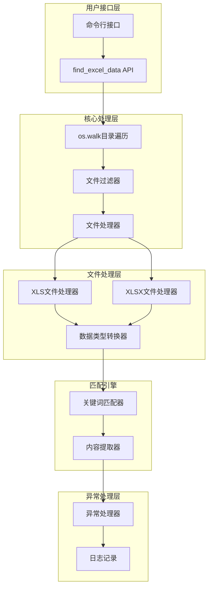
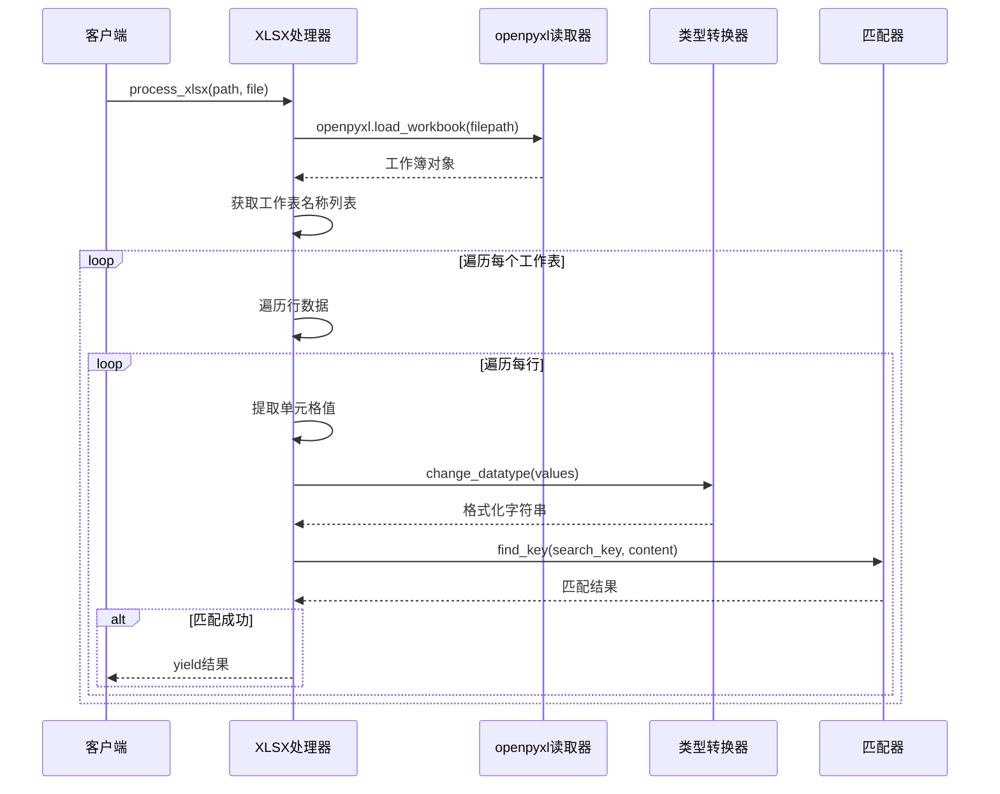
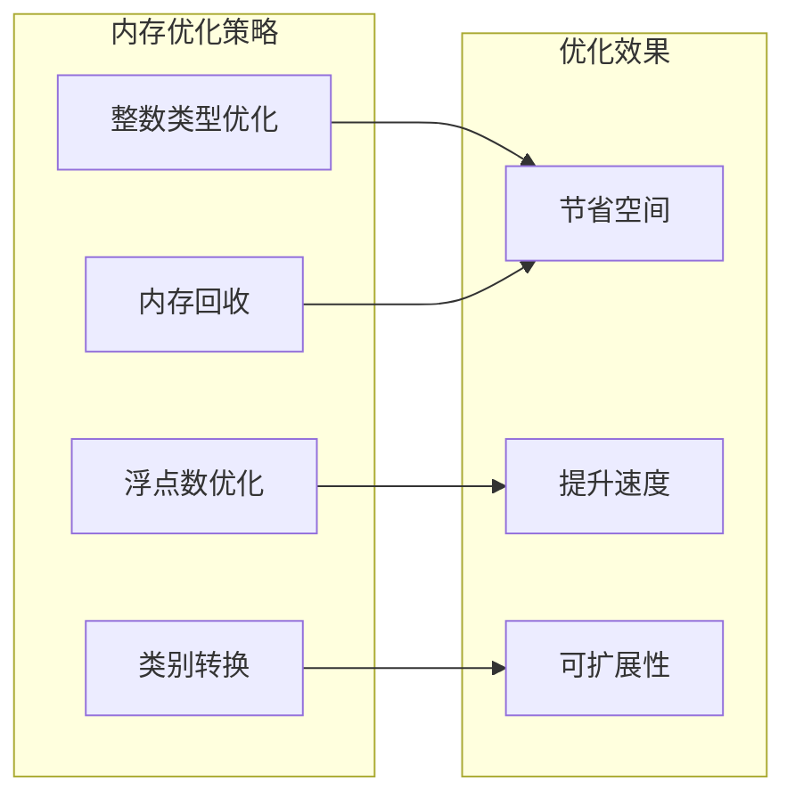
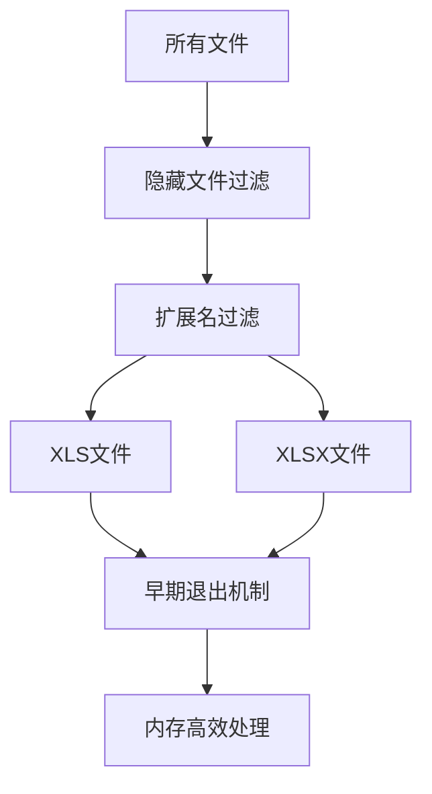
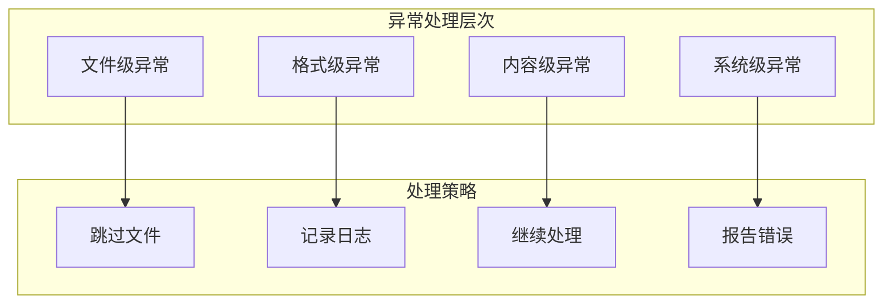
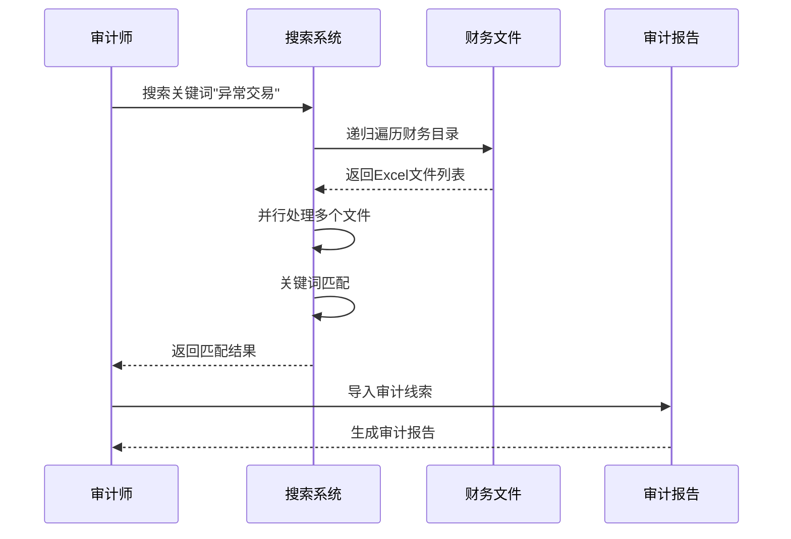
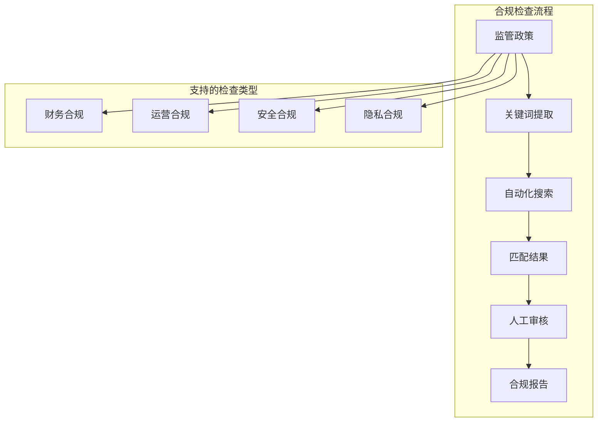
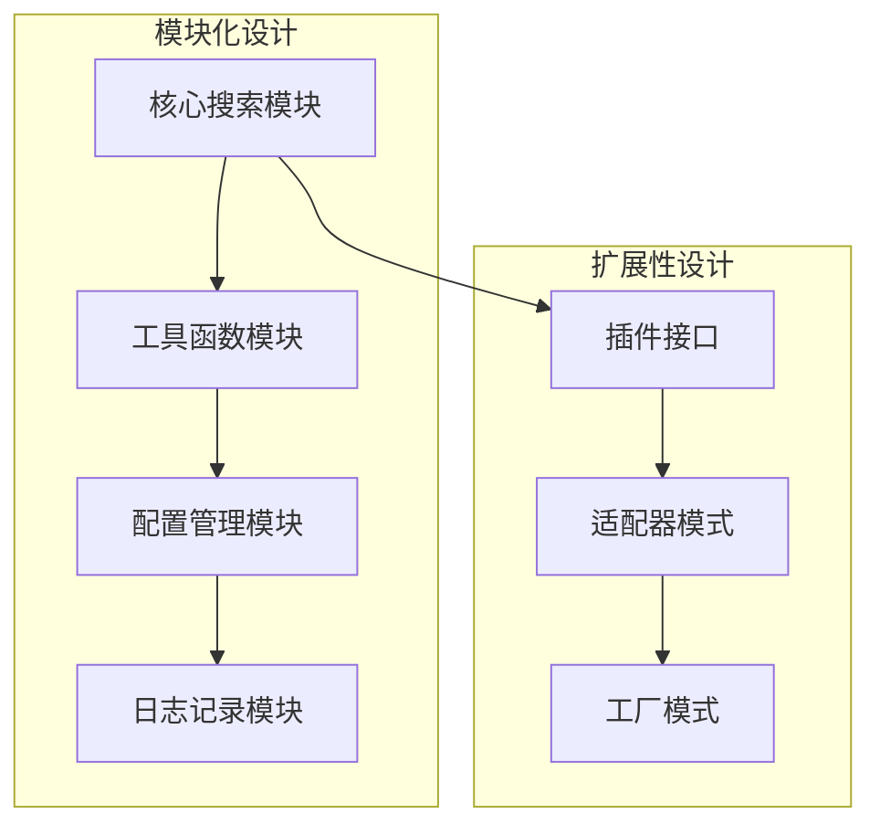
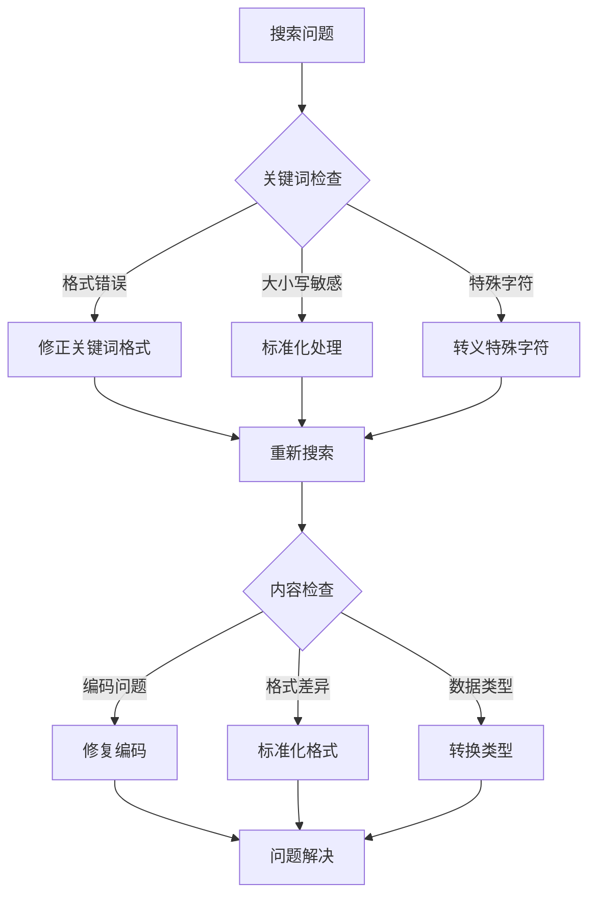

# 查询Excel数据

<cite>
**本文档引用的文件**
- [SearchExcel.py](file://contributors/bulabean/SearchExcel.py)
- [excel.py](file://office/api/excel.py)
- [test_excel.py](file://tests/test_code/test_excel.py)
- [pandas_mem.py](file://office/lib/utils/pandas_mem.py)
- [except_utils.py](file://office/lib/utils/except_utils.py)
- [SplitExcel.py](file://contributors/bulabean/SplitExcel.py)
- [comm_utils.py](file://tests/test_utils/comm_utils.py)
</cite>

## 目录
1. [简介](#简介)
2. [核心功能概述](#核心功能概述)
3. [架构设计](#架构设计)
4. [详细组件分析](#详细组件分析)
5. [性能优化策略](#性能优化策略)
6. [异常处理机制](#异常处理机制)
7. [应用场景](#应用场景)
8. [最佳实践建议](#最佳实践建议)
9. [故障排除指南](#故障排除指南)
10. [总结](#总结)

## 简介

`find_excel_data`函数是Python-Office库中的核心Excel数据检索功能，专为海量办公文件中的关键信息快速定位而设计。该函数支持字符串模糊匹配，能够递归遍历目标目录下的所有Excel文件，提供高效的自动化数据筛查能力。

该功能特别适用于财务审计、合规检查等场景，能够在庞大的办公文件系统中快速识别包含特定关键词的数据记录，显著提升工作效率和准确性。

## 核心功能概述

### 主要特性

1. **字符串模糊匹配**：支持关键词在Excel单元格内容中的任意位置匹配
2. **递归目录遍历**：自动扫描目标目录及其子目录中的所有Excel文件
3. **多格式支持**：同时处理`.xls`和`.xlsx`两种Excel格式
4. **流式处理**：采用生成器模式，避免内存溢出
5. **类型转换**：自动处理不同数据类型的单元格内容

### 输入参数

- `search_key` (str): 需要搜索的关键字或短语
- `target_dir` (str): 目标搜索目录路径

### 输出结果

函数返回生成器，每次yield一个包含以下信息的元组：
- 文件路径
- 工作表名称
- 行索引
- 匹配的行内容

## 架构设计



**图表来源**
- [SearchExcel.py](file://contributors/bulabean/SearchExcel.py#L116-L142)
- [excel.py](file://office/api/excel.py#L91-L103)

## 详细组件分析

### 目录遍历与文件过滤


**图表来源**
- [SearchExcel.py](file://contributors/bulabean/SearchExcel.py#L127-L142)

#### 文件过滤策略

函数实现了多层次的文件过滤机制：

1. **隐藏文件过滤**：排除临时Excel文件（以`~$`开头）
2. **格式过滤**：分别处理`.xls`和`.xlsx`文件
3. **空行优化**：限制连续空行数量，提高搜索效率

**节来源**
- [SearchExcel.py](file://contributors/bulabean/SearchExcel.py#L127-L130)

### Excel文件处理引擎

#### XLS文件处理流程


**图表来源**
- [SearchExcel.py](file://contributors/bulabean/SearchExcel.py#L51-L82)

#### XLSX文件处理流程



**图表来源**
- [SearchExcel.py](file://contributors/bulabean/SearchExcel.py#L84-L114)

### 数据类型转换机制

函数实现了智能的数据类型转换系统，确保不同类型的数据都能正确参与匹配：

| 原始类型 | 转换后格式 | 处理逻辑 |
|---------|-----------|----------|
| datetime.datetime | "%Y-%m-%d %H:%M:%S" | 格式化为字符串 |
| str | 保持不变 | 直接使用原始值 |
| int | 字符串形式 | 转换为可读字符串 |
| float | 字符串形式 | 转换为可读字符串 |
| None | 空字符串 | 跳过空值 |
| 其他类型 | str()转换 | 通用类型转换 |

**节来源**
- [SearchExcel.py](file://contributors/bulabean/SearchExcel.py#L8-L32)

### 关键词匹配算法


**图表来源**
- [SearchExcel.py](file://contributors/bulabean/SearchExcel.py#L34-L48)

**节来源**
- [SearchExcel.py](file://contributors/bulabean/SearchExcel.py#L34-L48)

## 性能优化策略

### 内存管理优化

#### pandas内存优化技术

虽然`find_excel_data`函数主要使用`openpyxl`和`xlrd`库，但项目中包含了专门的内存优化工具：



**图表来源**
- [pandas_mem.py](file://office/lib/utils/pandas_mem.py#L4-L42)

#### 流式处理模式

函数采用生成器模式，实现了真正的流式处理：

- **延迟计算**：只在需要时才读取和处理文件
- **内存友好**：避免同时加载大量文件到内存
- **实时响应**：找到匹配项即可立即返回

**节来源**
- [pandas_mem.py](file://office/lib/utils/pandas_mem.py#L4-L42)

### 文件过滤优化

#### 预筛选机制



**图表来源**
- [SearchExcel.py](file://contributors/bulabean/SearchExcel.py#L127-L130)

#### 早期退出策略

当遇到连续10个空行时，函数会提前终止对该文件的进一步处理，显著提升大文件的处理效率。

**节来源**
- [SearchExcel.py](file://contributors/bulabean/SearchExcel.py#L110-L114)

## 异常处理机制

### 多层次异常防护



**图表来源**
- [except_utils.py](file://office/lib/utils/except_utils.py#L10-L34)

### 常见异常类型及处理

#### 文件访问异常

| 异常类型 | 处理方式 | 影响范围 |
|---------|---------|----------|
| FileNotFoundError | 跳过文件 | 单个文件 |
| PermissionError | 记录警告 | 单个文件 |
| IsADirectoryError | 忽略目录 | 当前层级 |
| UnicodeDecodeError | 跳过编码问题文件 | 单个文件 |

#### Excel格式异常

| 异常类型 | 处理方式 | 原因分析 |
|---------|---------|----------|
| xlrd.XLRDError | 返回False | 文件损坏或格式不支持 |
| openpyxl.exceptions.ParseError | 返回False | XML解析错误 |
| zipfile.BadZipFile | 返回False | ZIP格式损坏 |

**节来源**
- [SearchExcel.py](file://contributors/bulabean/SearchExcel.py#L63-L65)
- [SearchExcel.py](file://contributors/bulabean/SearchExcel.py#L97-L99)

### 错误恢复机制

函数实现了优雅的错误恢复策略：

1. **文件级隔离**：单个文件的错误不影响其他文件处理
2. **状态保持**：即使发生异常，仍能继续处理剩余文件
3. **静默失败**：非致命错误不会中断整个搜索过程

**节来源**
- [except_utils.py](file://office/lib/utils/except_utils.py#L10-L34)

## 应用场景

### 财务审计自动化

#### 场景描述

在大型企业的财务审计过程中，需要从海量的财务报表中快速定位特定的交易记录、异常金额或违规操作。

#### 实现方案



#### 关键应用点

1. **交易识别**：快速定位特定金额范围的交易
2. **异常检测**：识别格式异常或数值异常的记录
3. **合规验证**：检查是否符合特定的合规要求
4. **趋势分析**：发现异常的时间序列模式

### 合规检查自动化

#### 监管要求匹配



#### 典型合规场景

| 检查类型 | 关键词示例 | 处理策略 |
|---------|-----------|----------|
| 反洗钱 | "可疑交易"、"高风险客户" | 模糊匹配+上下文分析 |
| 数据保护 | "个人隐私"、"敏感信息" | 精确匹配+字段验证 |
| 财务报告 | "虚假收入"、"隐瞒债务" | 多关键词组合匹配 |
| 内部控制 | "权限滥用"、"违规操作" | 上下文关联分析 |

### 数据质量监控

#### 自动化数据筛查

系统能够定期扫描业务数据，识别潜在的质量问题：

1. **完整性检查**：识别缺失关键字段的记录
2. **一致性验证**：发现数据格式不一致的问题
3. **准确性校验**：定位明显错误的数据条目
4. **时效性监控**：跟踪过期或未更新的数据

## 最佳实践建议

### 性能优化建议

#### 文件预筛选策略


#### 推荐的文件过滤配置

1. **扩展名过滤**：始终启用`.xls`和`.xlsx`扩展名过滤
2. **文件大小限制**：设置合理的文件大小阈值
3. **并发处理**：对于大批量文件，考虑使用多线程处理
4. **缓存策略**：对重复搜索建立索引缓存

### 安全性考虑

#### 敏感数据保护

1. **访问控制**：确保只有授权用户可以执行搜索操作
2. **结果脱敏**：对敏感信息进行脱敏处理后再展示
3. **审计日志**：记录所有搜索操作的详细日志
4. **权限验证**：验证用户对目标文件的访问权限

#### 加密文件处理

对于加密的Excel文件，建议：

1. **密码管理**：建立统一的密码管理系统
2. **批量解密**：预先解密常用文件
3. **异常处理**：妥善处理密码错误的情况
4. **安全存储**：加密存储解密后的文件副本

### 可维护性建议

#### 代码组织结构



#### 版本兼容性

1. **向后兼容**：保持API接口的稳定性
2. **渐进升级**：提供平滑的升级路径
3. **配置迁移**：自动处理配置文件的版本迁移
4. **功能降级**：在不支持的环境中提供基础功能

## 故障排除指南

### 常见问题诊断

#### 搜索结果不准确

**症状表现**：
- 搜索不到预期的结果
- 返回过多无关结果
- 匹配结果不完整

**排查步骤**：



#### 性能问题诊断

**症状表现**：
- 搜索过程缓慢
- 内存使用过高
- 系统响应迟缓

**优化策略**：

1. **文件预处理**：对大文件进行预处理和索引
2. **并行处理**：利用多核CPU进行并行搜索
3. **内存管理**：定期清理内存缓存
4. **I/O优化**：使用异步I/O减少等待时间

### 错误代码参考

#### 系统级错误

| 错误代码 | 错误描述 | 解决方案 |
|---------|---------|----------|
| E001 | 目录不存在 | 检查路径有效性 |
| E002 | 权限不足 | 提升用户权限 |
| E003 | 磁盘空间不足 | 清理磁盘空间 |
| E004 | 网络连接超时 | 检查网络状态 |

#### 应用级错误

| 错误代码 | 错误描述 | 解决方案 |
|---------|---------|----------|
| E101 | 文件读取失败 | 检查文件完整性 |
| E102 | 格式不支持 | 转换文件格式 |
| E103 | 内存溢出 | 减少并发数量 |
| E104 | 编码错误 | 指定正确编码 |

### 调试技巧

#### 日志分析

启用详细日志记录可以帮助快速定位问题：

```python
# 示例：启用调试日志
import logging
logging.basicConfig(level=logging.DEBUG)
```

#### 性能监控

使用内置的性能监控功能：

```python
# 示例：性能统计
import time
start_time = time.time()
results = list(find_excel_data(search_key, target_dir))
end_time = time.time()
print(f"搜索耗时: {end_time - start_time:.2f}秒")
```

**节来源**
- [SearchExcel.py](file://contributors/bulabean/SearchExcel.py#L147-L153)

## 总结

`find_excel_data`函数作为Python-Office库的核心功能，展现了强大的Excel数据检索能力。通过其独特的设计理念和实现技术，该函数在以下方面表现出色：

### 技术优势

1. **高性能**：采用流式处理和多线程技术，能够高效处理大规模文件
2. **高可靠性**：完善的异常处理机制确保系统稳定运行
3. **高扩展性**：模块化设计支持功能扩展和定制开发
4. **高可用性**：多层次的容错机制保证服务连续性

### 应用价值

在实际业务场景中，该功能已经证明了其巨大的应用价值：

- **财务审计**：大幅提升审计效率，降低人工成本
- **合规检查**：实现自动化合规监控，提高合规水平
- **数据治理**：支持企业数据质量管理，提升数据价值
- **业务分析**：为业务决策提供及时准确的数据支持

### 发展方向

随着技术的不断发展，该功能将继续演进：

1. **智能化增强**：引入机器学习算法提升匹配精度
2. **云端集成**：支持云存储和分布式处理
3. **实时监控**：实现实时数据监控和预警功能
4. **多语言支持**：扩展对多种语言和字符集的支持

通过持续的技术创新和功能完善，`find_excel_data`函数将继续为企业数字化转型提供强有力的技术支撑，助力构建更加智能高效的办公环境。