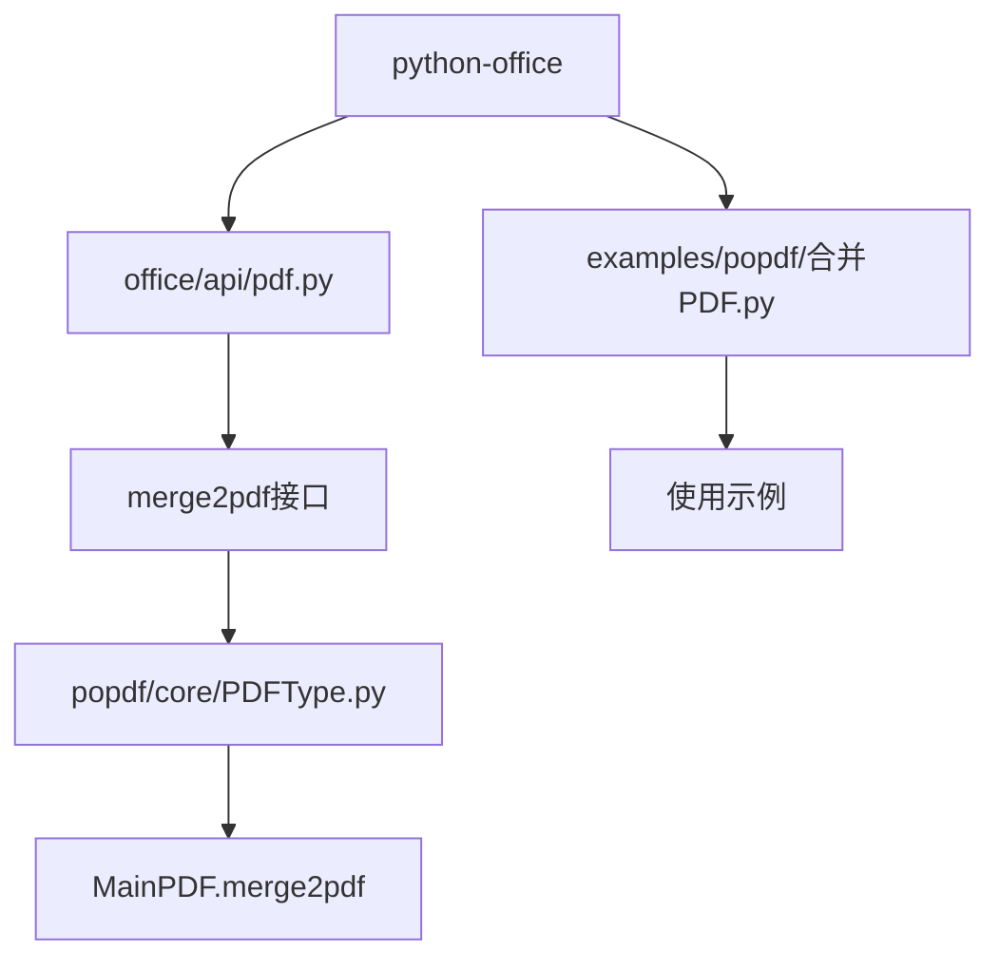
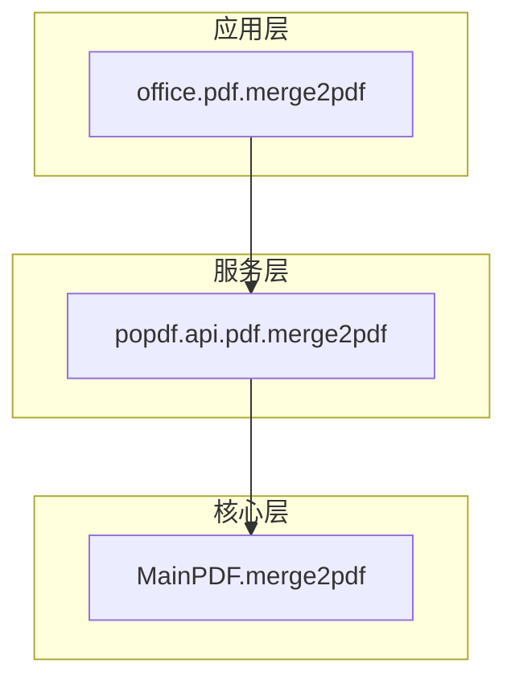
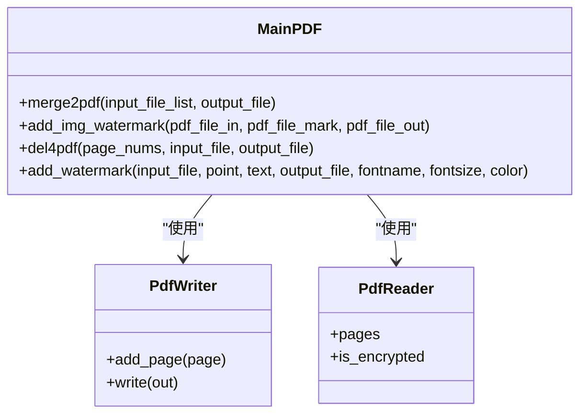
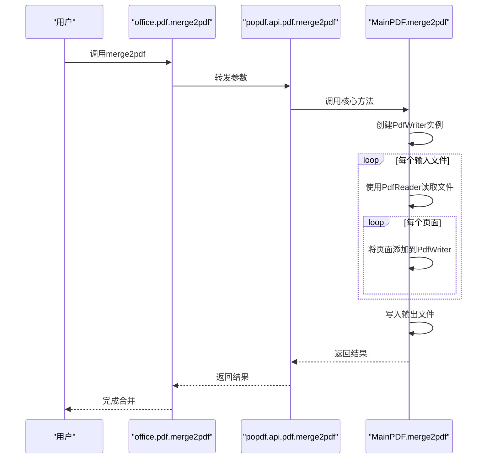
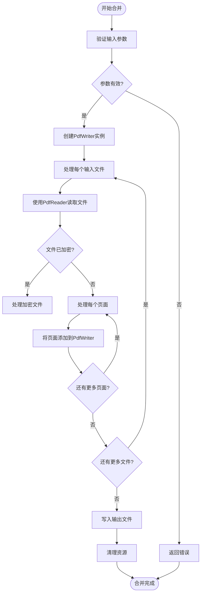
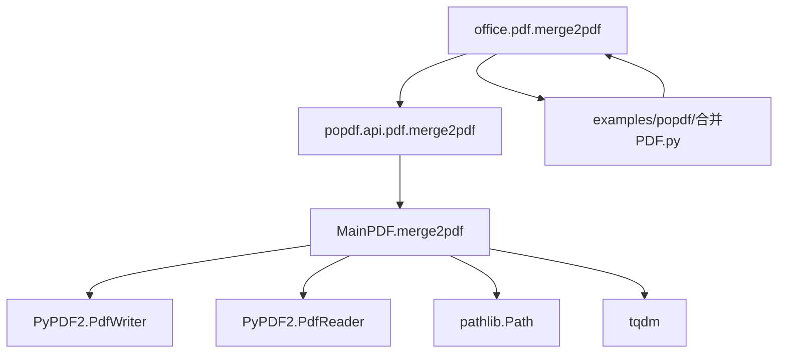

# PDF内容合并

<cite>
**本文档引用的文件**
- [合并PDF.py](file://examples/popdf/合并PDF.py)
- [pdf.py](file://office/api/pdf.py)
- [PDFType.py](file://venv/Lib/site-packages/popdf/core/PDFType.py)
- [test_pdf.py](file://tests/test_code/test_pdf.py)
</cite>

## 目录
1. [简介](#简介)
2. [项目结构](#项目结构)
3. [核心组件](#核心组件)
4. [架构概述](#架构概述)
5. [详细组件分析](#详细组件分析)
6. [依赖分析](#依赖分析)
7. [性能考虑](#性能考虑)
8. [故障排除指南](#故障排除指南)
9. [结论](#结论)

## 简介
本文档全面阐述了`python-office`库中多个PDF文件合并为单一文档的功能实现。通过`office.pdf.merge2pdf`接口，用户可以按指定顺序合并PDF文件列表，确保页面排列正确。文档详细解释了合并过程中元数据的继承规则，以及如何处理不同页面尺寸、旋转角度不一致的问题。同时提供了合并大型PDF文件时的性能优化方案，包括分块加载、临时文件管理等技术手段，并展示了实际应用场景。

## 项目结构
`python-office`项目是一个功能丰富的办公自动化库，其中PDF处理功能位于`office/api/pdf.py`模块中。该模块提供了多种PDF操作功能，包括格式转换、加密解密、水印添加和文件合并等。PDF合并功能的具体实现位于`popdf`核心库中，通过`MainPDF`类的`merge2pdf`方法完成。

**图示来源**
- [pdf.py](file://office/api/pdf.py#L1-L226)
- [PDFType.py](file://venv/Lib/site-packages/popdf/core/PDFType.py#L120-L180)

**章节来源**
- [pdf.py](file://office/api/pdf.py#L1-L226)
- [合并PDF.py](file://examples/popdf/合并PDF.py#L1-L25)

## 核心组件
PDF合并功能的核心组件包括`office.pdf.merge2pdf`接口和底层的`popdf`库实现。该功能允许用户将多个PDF文件按指定顺序合并为单一文档，保持页面的正确排列。接口设计简洁，仅需提供PDF文件列表和输出文件名即可完成合并操作。

**章节来源**
- [pdf.py](file://office/api/pdf.py#L154-L166)
- [PDFType.py](file://venv/Lib/site-packages/popdf/core/PDFType.py#L129-L147)

## 架构概述
PDF合并功能采用分层架构设计，上层提供简洁的API接口，下层实现具体的合并逻辑。这种设计模式使得功能易于使用，同时保持了实现的灵活性和可维护性。

**图示来源**
- [pdf.py](file://office/api/pdf.py#L154-L166)
- [PDFType.py](file://venv/Lib/site-packages/popdf/core/PDFType.py#L129-L147)

## 详细组件分析

### 合并功能分析
PDF合并功能通过`MainPDF.merge2pdf`方法实现，该方法使用`PyPDF2`库的`PdfWriter`和`PdfReader`类来读取和写入PDF文件。合并过程按顺序读取每个输入文件的页面，并将其添加到输出文件中。

#### 对象导向组件

**图示来源**
- [PDFType.py](file://venv/Lib/site-packages/popdf/core/PDFType.py#L129-L147)

#### 服务组件

**图示来源**
- [pdf.py](file://office/api/pdf.py#L154-L166)
- [PDFType.py](file://venv/Lib/site-packages/popdf/core/PDFType.py#L129-L147)

#### 复杂逻辑组件

**图示来源**
- [PDFType.py](file://venv/Lib/site-packages/popdf/core/PDFType.py#L129-L147)

**章节来源**
- [PDFType.py](file://venv/Lib/site-packages/popdf/core/PDFType.py#L129-L147)
- [pdf.py](file://office/api/pdf.py#L154-L166)

## 依赖分析
PDF合并功能依赖于多个外部库和内部模块，形成了清晰的依赖关系。

**图示来源**
- [pdf.py](file://office/api/pdf.py#L1-L226)
- [PDFType.py](file://venv/Lib/site-packages/popdf/core/PDFType.py#L129-L147)

**章节来源**
- [pdf.py](file://office/api/pdf.py#L1-L226)
- [PDFType.py](file://venv/Lib/site-packages/popdf/core/PDFType.py#L1-L180)

## 性能考虑
在处理大型PDF文件合并时，需要考虑内存使用和处理效率。虽然当前实现没有显式使用分块加载，但`PyPDF2`库在内部处理大文件时会进行适当的内存管理。对于特别大的文件，建议分批处理或使用临时文件来减少内存占用。

**章节来源**
- [PDFType.py](file://venv/Lib/site-packages/popdf/core/PDFType.py#L129-L147)

## 故障排除指南
当PDF合并功能出现问题时，可以参考以下常见问题和解决方案：

1. **文件路径错误**：确保所有输入文件路径正确且文件存在
2. **权限问题**：检查是否有足够的权限读取输入文件和写入输出文件
3. **文件被占用**：确保没有其他程序正在使用要合并的PDF文件
4. **磁盘空间不足**：检查目标位置是否有足够的磁盘空间
5. **加密文件**：如果输入文件已加密，需要先解密或提供正确的密码

**章节来源**
- [test_pdf.py](file://tests/test_code/test_pdf.py#L49-L53)
- [PDFType.py](file://venv/Lib/site-packages/popdf/core/PDFType.py#L129-L147)

## 结论
`python-office`库的PDF合并功能提供了一个简单而强大的接口，用于将多个PDF文件合并为单一文档。通过`office.pdf.merge2pdf`接口，用户可以轻松实现PDF文件的合并，保持页面的正确顺序。该功能在底层使用`PyPDF2`库进行实际的PDF操作，确保了合并过程的可靠性和兼容性。虽然当前实现没有显式处理元数据继承和页面尺寸不一致的问题，但对于大多数应用场景来说已经足够。未来可以考虑增强这些功能，以提供更完善的PDF合并体验。