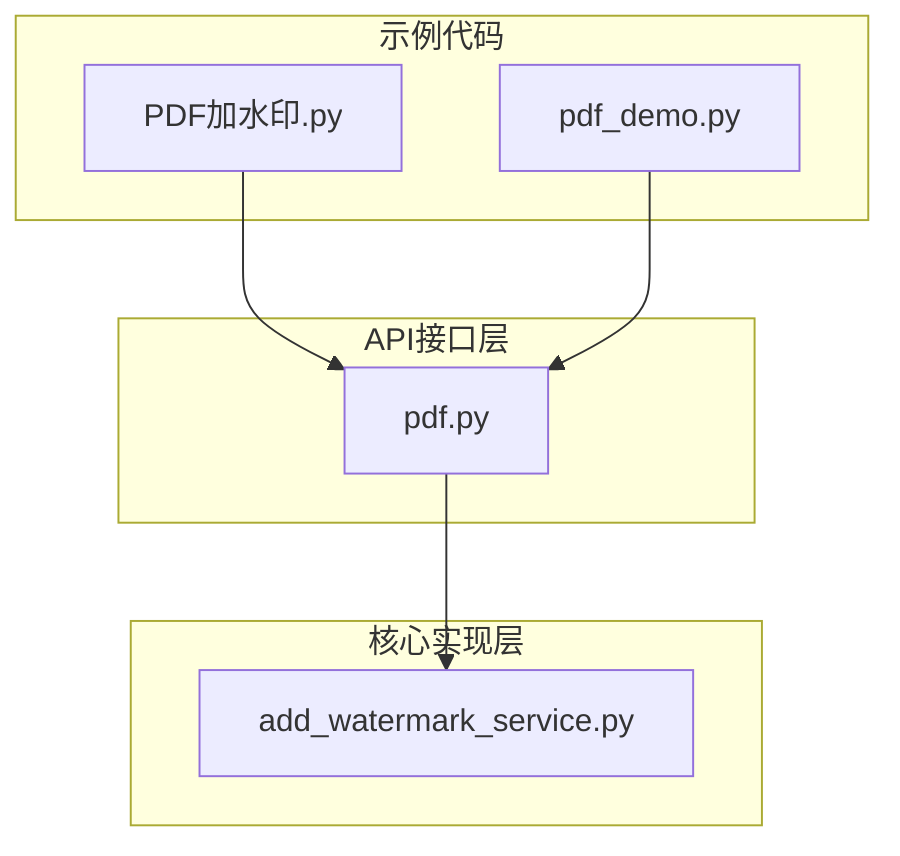
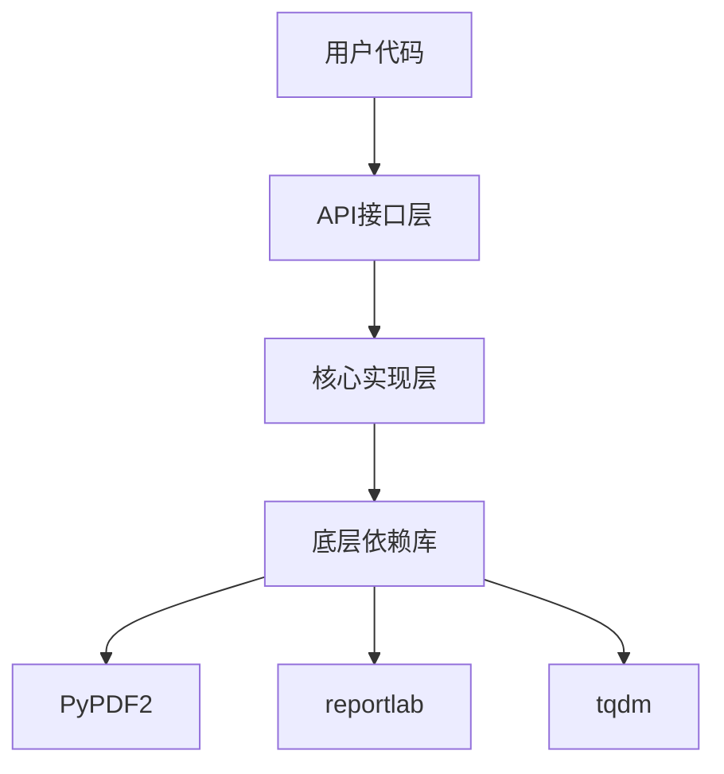
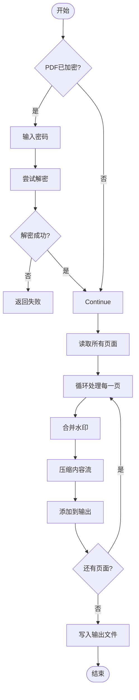
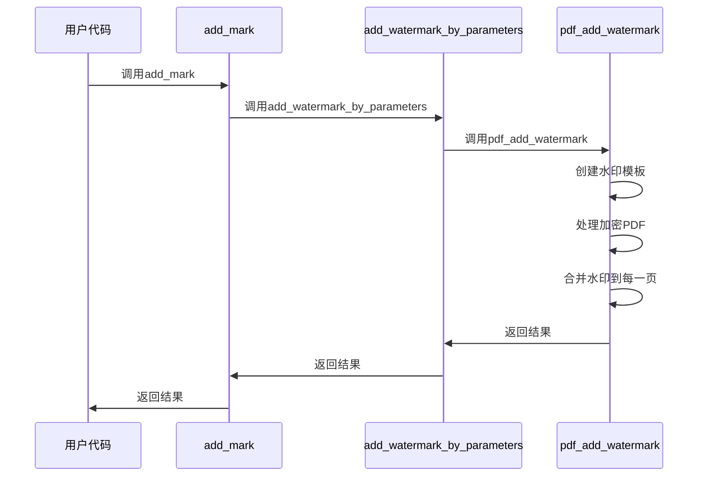
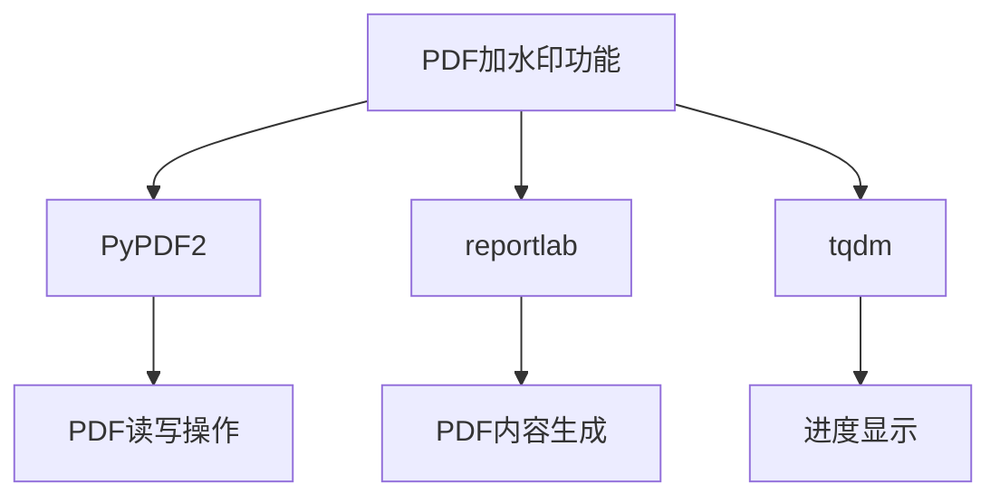

# PDF加水印

<cite>
**本文档引用的文件**
- [add_watermark_service.py](file://office/lib/pdf/add_watermark_service.py)
- [pdf.py](file://office/api/pdf.py)
- [PDF加水印.py](file://examples/popdf/PDF加水印.py)
- [pdf_demo.py](file://examples/popdf/pdf_demo.py)
</cite>

## 目录
1. [简介](#简介)
2. [项目结构](#项目结构)
3. [核心组件](#核心组件)
4. [架构概述](#架构概述)
5. [详细组件分析](#详细组件分析)
6. [依赖分析](#依赖分析)
7. [性能考虑](#性能考虑)
8. [故障排除指南](#故障排除指南)
9. [结论](#结论)

## 简介
本文档深入讲解如何使用`python-office`库为PDF文件添加文本或图像水印，防止未经授权的使用。通过`office.pdf.add_mark`接口演示水印内容、位置、透明度、旋转角度等参数的配置方法。说明水印叠加的技术原理，基于底层PDF操作库实现每页自动添加的机制。提供动态生成水印（如用户ID、时间戳）的高级用法，并讨论水印安全性与防去除策略。包含处理中文字符编码、字体缺失等常见问题的解决方案。

## 项目结构
`python-office`项目的PDF水印功能主要分布在`office`模块的`api`和`lib`子模块中。核心功能实现位于`office/lib/pdf/add_watermark_service.py`，而API接口则在`office/api/pdf.py`中定义。示例代码位于`examples/popdf/`目录下，包括`PDF加水印.py`和`pdf_demo.py`等文件。



**图示来源**
- [pdf.py](file://office/api/pdf.py)
- [add_watermark_service.py](file://office/lib/pdf/add_watermark_service.py)
- [PDF加水印.py](file://examples/popdf/PDF加水印.py)

**本节来源**
- [office/api/pdf.py](file://office/api/pdf.py)
- [office/lib/pdf/add_watermark_service.py](file://office/lib/pdf/add_watermark_service.py)

## 核心组件
PDF水印功能的核心组件包括水印创建服务和水印添加服务。`create_watermark`函数负责创建水印模板，`pdf_add_watermark`函数负责将水印应用到目标PDF文件。API层的`add_mark`和`add_watermark_by_parameters`函数提供了用户友好的接口。

**本节来源**
- [add_watermark_service.py](file://office/lib/pdf/add_watermark_service.py#L10-L72)
- [pdf.py](file://office/api/pdf.py#L196-L224)

## 架构概述
PDF水印功能的架构分为三层：API接口层、核心实现层和底层依赖库。API接口层提供简洁的函数调用，核心实现层处理具体的水印逻辑，底层依赖库（如PyPDF2和reportlab）负责PDF文件的实际操作。



**图示来源**
- [pdf.py](file://office/api/pdf.py)
- [add_watermark_service.py](file://office/lib/pdf/add_watermark_service.py)

## 详细组件分析

### 水印创建服务分析
水印创建服务负责生成水印模板PDF文件。该服务使用reportlab库创建包含指定文本的PDF文件，并设置字体、大小、旋转角度等属性。

```mermaid
classDiagram
class create_watermark {
+content : str
+return : PdfReader
+create_watermark(content : str) PdfReader
}
create_watermark : 使用 reportlab.pdfgen.canvas.Canvas 创建PDF
create_watermark : 使用 reportlab.pdfbase.ttfonts.TTFont 注册字体
create_watermark : 使用 C : /Windows/Fonts/simfang.ttf 字体文件
```

**图示来源**
- [add_watermark_service.py](file://office/lib/pdf/add_watermark_service.py#L10-L31)

### 水印添加服务分析
水印添加服务负责将水印模板应用到目标PDF文件的每一页。该服务使用PyPDF2库读取和写入PDF文件，并处理加密PDF的解密过程。



**图示来源**
- [add_watermark_service.py](file://office/lib/pdf/add_watermark_service.py#L34-L72)

### API接口分析
API接口层提供了用户友好的函数来调用底层水印功能。`add_mark`函数是主要的水印添加接口，它封装了复杂的参数处理和错误处理逻辑。



**图示来源**
- [pdf.py](file://office/api/pdf.py#L196-L208)
- [add_watermark_service.py](file://office/lib/pdf/add_watermark_service.py)

**本节来源**
- [add_watermark_service.py](file://office/lib/pdf/add_watermark_service.py)
- [pdf.py](file://office/api/pdf.py)

## 依赖分析
PDF水印功能依赖于多个第三方库，包括PyPDF2用于PDF文件操作，reportlab用于创建PDF内容，tqdm用于显示进度条。



**图示来源**
- [add_watermark_service.py](file://office/lib/pdf/add_watermark_service.py#L2-L7)

**本节来源**
- [add_watermark_service.py](file://office/lib/pdf/add_watermark_service.py)

## 性能考虑
在处理大型PDF文件时，水印添加操作可能会消耗较多内存和CPU资源。建议在处理前检查文件大小，并在必要时分批处理。使用`page.compress_content_streams()`方法可以有效减小输出文件大小。

## 故障排除指南
常见问题包括字体缺失、PDF加密和权限问题。对于中文水印，确保系统中安装了相应的中文字体文件（如simfang.ttf）。对于加密PDF，需要提供正确的密码才能添加水印。

**本节来源**
- [add_watermark_service.py](file://office/lib/pdf/add_watermark_service.py#L50-L58)

## 结论
`python-office`库提供了强大而灵活的PDF水印功能，通过简单的API调用即可实现复杂的水印添加需求。该功能支持文本和图像水印，可以自定义水印的外观和位置，并能处理加密PDF文件。通过合理使用这些功能，可以有效保护PDF文档的版权和防止未经授权的使用。