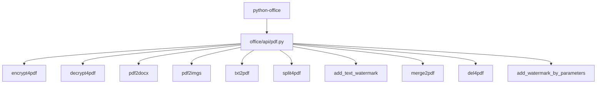
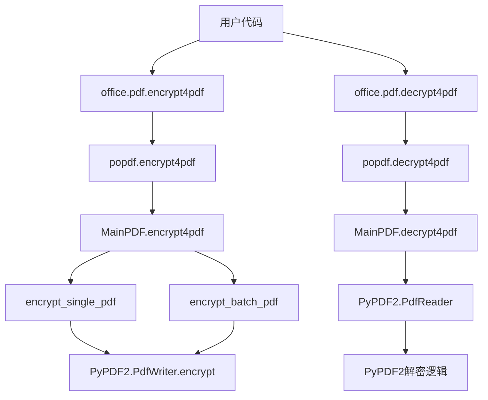
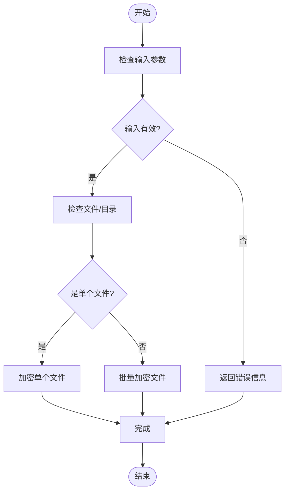
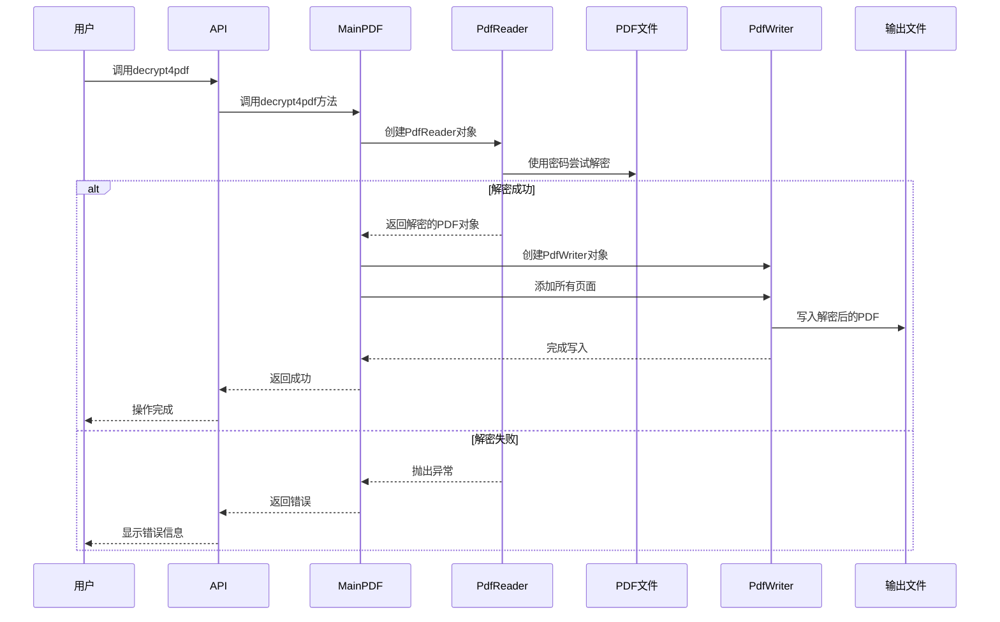
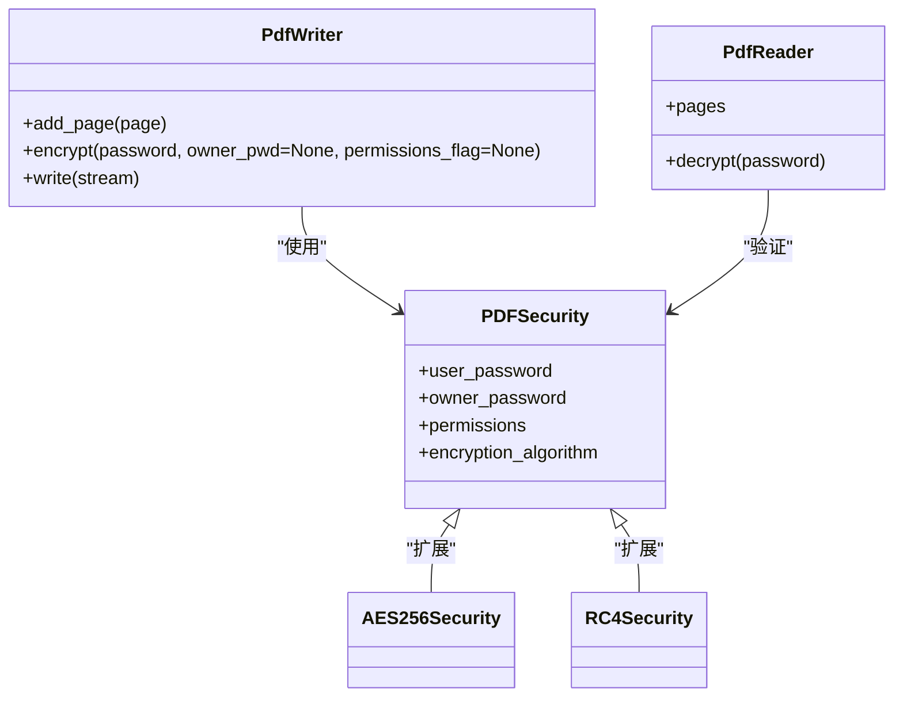
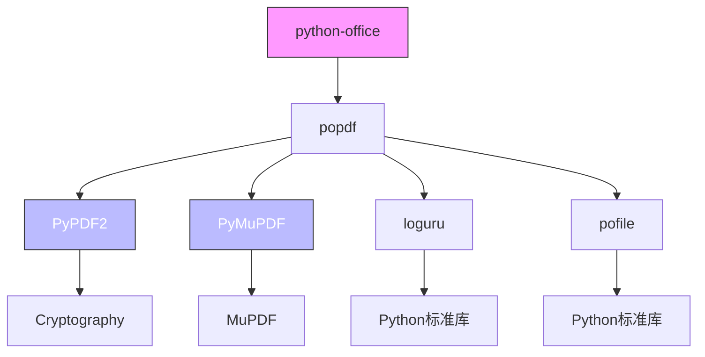
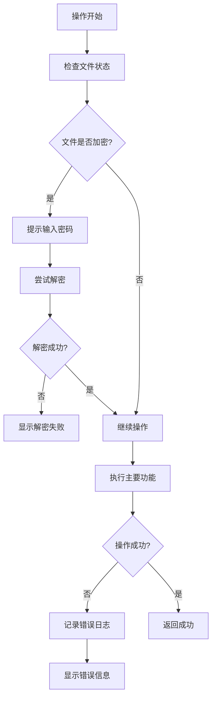

# PDF安全操作

<cite>
**本文档引用的文件**   
- [pdf.py](file://office/api/pdf.py)
- [PDF加密.py](file://examples/popdf/PDF加密.py)
- [PDF解密.py](file://examples/popdf/PDF解密.py)
- [encrypt4pdf_utils.py](file://venv/Lib/site-packages/popdf/lib/encrypt4pdf_utils.py)
- [PDFType.py](file://venv/Lib/site-packages/popdf/core/PDFType.py)
- [test_pdf.py](file://tests/test_code/test_pdf.py)
</cite>

## 目录
1. [简介](#简介)
2. [项目结构](#项目结构)
3. [核心组件](#核心组件)
4. [架构概述](#架构概述)
5. [详细组件分析](#详细组件分析)
6. [依赖分析](#依赖分析)
7. [性能考虑](#性能考虑)
8. [故障排除指南](#故障排除指南)
9. [结论](#结论)

## 简介
本文档详细讲解了`python-office`库中PDF文件的加密与解密功能实现。通过分析`office.pdf.encrypt4pdf`和`office.pdf.decrypt4pdf`接口，说明如何设置访问密码、控制文档权限，并演示处理加密失败、密码错误等异常情况的策略。文档结合代码示例展示了对单个和多个PDF文件进行安全保护的操作流程，解释了底层使用的PyPDF2库在权限控制方面的机制，并讨论了不同PDF阅读器对加密标准的兼容性问题。

## 项目结构
`python-office`项目是一个功能丰富的办公自动化库，其中PDF处理功能位于`office/api/pdf.py`模块中。该项目通过封装多个底层库（如PyPDF2、PyMuPDF）提供了简洁的API接口，使用户能够轻松实现PDF文件的各种操作。

**图表来源**
- [pdf.py](file://office/api/pdf.py)

**章节来源**
- [pdf.py](file://office/api/pdf.py)

## 核心组件
`python-office`库的PDF安全操作核心组件包括`encrypt4pdf`和`decrypt4pdf`两个主要接口，它们分别用于PDF文件的加密和解密操作。这些接口通过调用底层的`popdf`库实现具体功能，为用户提供了一个简单易用的API。

**章节来源**
- [pdf.py](file://office/api/pdf.py#L92-L130)

## 架构概述
`python-office`库的PDF安全操作架构采用分层设计，上层提供简洁的API接口，中层处理业务逻辑和参数验证，底层使用PyPDF2库实现具体的加密解密算法。

**图表来源**
- [pdf.py](file://office/api/pdf.py#L92-L130)
- [PDFType.py](file://venv/Lib/site-packages/popdf/core/PDFType.py#L99-L125)
- [encrypt4pdf_utils.py](file://venv/Lib/site-packages/popdf/lib/encrypt4pdf_utils.py)

**章节来源**
- [pdf.py](file://office/api/pdf.py#L92-L130)
- [PDFType.py](file://venv/Lib/site-packages/popdf/core/PDFType.py#L99-L125)

## 详细组件分析

### 加密功能分析
`encrypt4pdf`接口是`python-office`库中用于PDF文件加密的核心功能。该接口支持对单个文件或整个目录中的多个文件进行批量加密，为用户提供灵活的安全保护选项。

**图表来源**
- [encrypt4pdf_utils.py](file://venv/Lib/site-packages/popdf/lib/encrypt4pdf_utils.py#L16-L83)
- [PDFType.py](file://venv/Lib/site-packages/popdf/core/PDFType.py#L100-L108)

**章节来源**
- [encrypt4pdf_utils.py](file://venv/Lib/site-packages/popdf/lib/encrypt4pdf_utils.py#L16-L83)
- [PDFType.py](file://venv/Lib/site-packages/popdf/core/PDFType.py#L100-L108)

### 解密功能分析
`decrypt4pdf`接口用于解密受密码保护的PDF文件。该功能通过PyPDF2库的解密机制实现，能够处理单个文件或批量解密整个目录中的加密PDF文件。

**图表来源**
- [PDFType.py](file://venv/Lib/site-packages/popdf/core/PDFType.py#L110-L125)
- [pdf.py](file://office/api/pdf.py#L114-L130)

**章节来源**
- [PDFType.py](file://venv/Lib/site-packages/popdf/core/PDFType.py#L110-L125)

### 权限控制机制
`python-office`库通过PyPDF2库实现PDF文件的权限控制。虽然当前接口主要提供基本的密码保护功能，但底层的PyPDF2库支持更细粒度的权限设置，如禁止打印、禁止复制内容等。

**图表来源**
- [encrypt4pdf_utils.py](file://venv/Lib/site-packages/popdf/lib/encrypt4pdf_utils.py#L46)
- [PDFType.py](file://venv/Lib/site-packages/popdf/core/PDFType.py#L110-L125)

**章节来源**
- [encrypt4pdf_utils.py](file://venv/Lib/site-packages/popdf/lib/encrypt4pdf_utils.py#L46)

## 依赖分析
`python-office`库的PDF安全功能依赖于多个底层库，形成了一个完整的依赖链。这些依赖关系确保了功能的稳定性和兼容性。

**图表来源**
- [pdf.py](file://office/api/pdf.py#L25)
- [PDFType.py](file://venv/Lib/site-packages/popdf/core/PDFType.py#L6)
- [encrypt4pdf_utils.py](file://venv/Lib/site-packages/popdf/lib/encrypt4pdf_utils.py#L11)

**章节来源**
- [pdf.py](file://office/api/pdf.py#L25)
- [PDFType.py](file://venv/Lib/site-packages/popdf/core/PDFType.py#L6)

## 性能考虑
在处理大量PDF文件的加密解密操作时，性能是一个重要的考虑因素。`python-office`库通过批量处理机制和适当的内存管理来优化性能。

对于单个文件的加密操作，时间复杂度为O(n)，其中n是PDF文件的页数。批量处理时，总时间复杂度为O(m×n)，其中m是文件数量。库使用逐页处理的方式，避免了将整个大文件加载到内存中，从而减少了内存占用。

**章节来源**
- [encrypt4pdf_utils.py](file://venv/Lib/site-packages/popdf/lib/encrypt4pdf_utils.py#L34-L52)
- [PDFType.py](file://venv/Lib/site-packages/popdf/core/PDFType.py#L100-L108)

## 故障排除指南
在使用PDF加密解密功能时，可能会遇到各种异常情况。`python-office`库通过合理的错误处理机制帮助用户识别和解决这些问题。

常见的问题包括：
- 文件路径无效或不存在
- 密码错误导致解密失败
- 输出目录无写入权限
- 输入文件已被加密但未提供密码
- PDF文件损坏

库中的错误处理策略包括详细的错误日志记录和用户友好的错误信息提示。例如，在`encrypt4pdf_utils.py`中，当找不到PDF文件时会记录错误日志；在`add_watermark_service.py`中，当解密失败时会返回False并打印错误信息。

**图表来源**
- [add_watermark_service.py](file://office/lib/pdf/add_watermark_service.py#L50-L58)
- [encrypt4pdf_utils.py](file://venv/Lib/site-packages/popdf/lib/encrypt4pdf_utils.py#L27)

**章节来源**
- [add_watermark_service.py](file://office/lib/pdf/add_watermark_service.py#L50-L58)

## 结论
`python-office`库通过简洁的API接口提供了强大的PDF文件加密解密功能。该库基于PyPDF2等成熟的底层库，实现了稳定可靠的PDF安全操作。通过`encrypt4pdf`和`decrypt4pdf`接口，用户可以轻松地为PDF文件添加密码保护或移除现有保护。

该库的设计考虑了易用性、灵活性和错误处理，支持单个文件和批量操作，适用于各种办公自动化场景。虽然当前接口主要提供基本的密码保护功能，但其底层依赖的PyPDF2库支持更高级的权限控制选项，为未来的功能扩展留下了空间。

对于需要在Python项目中实现PDF安全操作的开发者来说，`python-office`库提供了一个高效、可靠的解决方案，大大简化了PDF文件保护的实现过程。