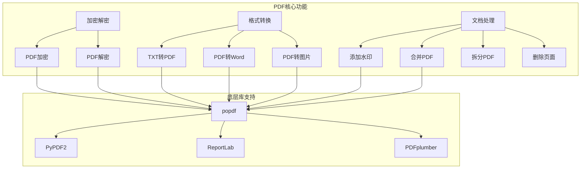
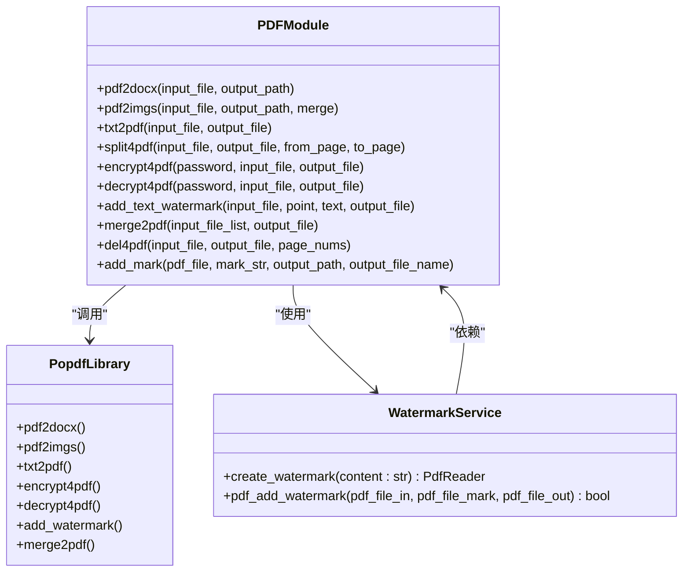
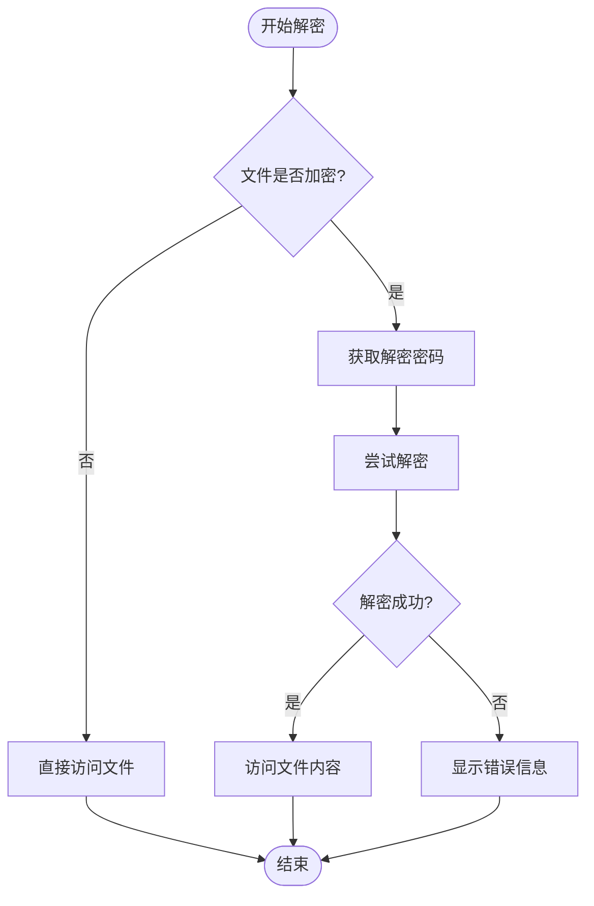
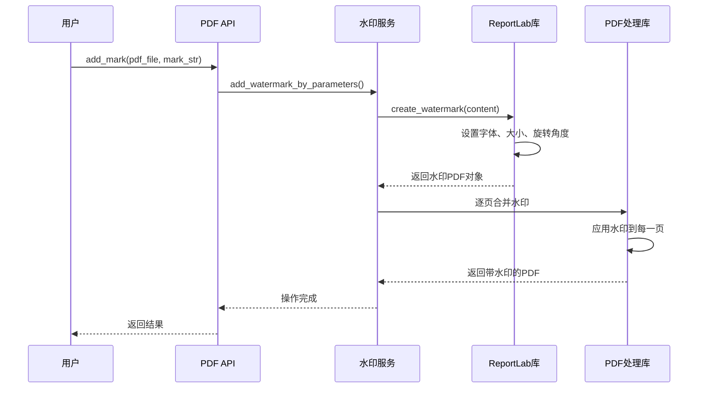
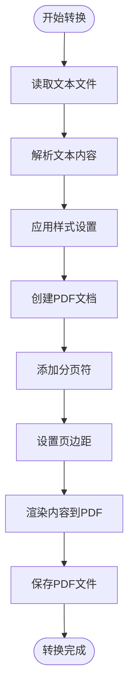
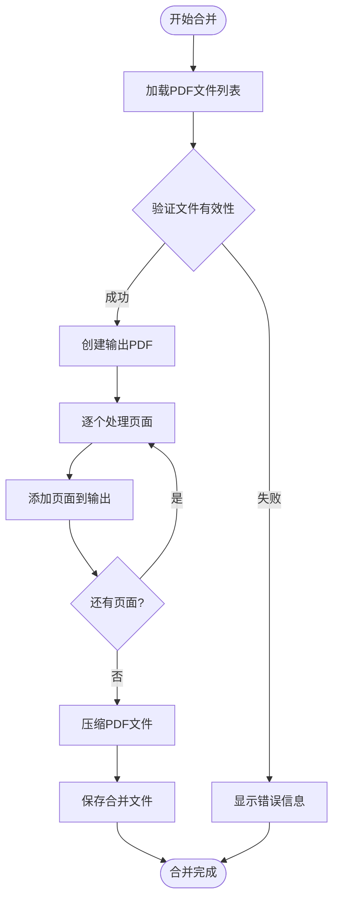
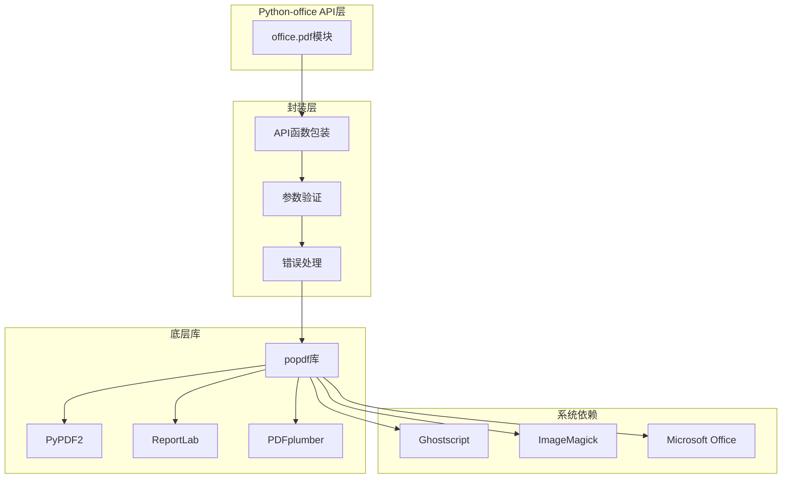
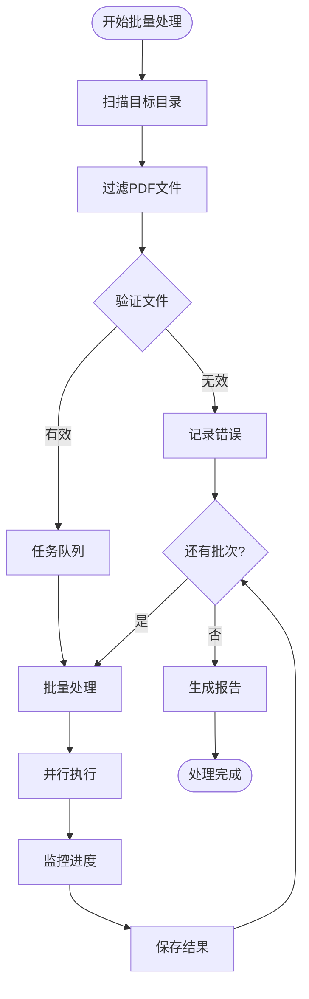

# PDF操作示例

<cite>
**本文档引用的文件**
- [examples/popdf/PDF加密.py](file://examples/popdf/PDF加密.py)
- [examples/popdf/PDF解密.py](file://examples/popdf/PDF解密.py)
- [examples/popdf/PDF加水印.py](file://examples/popdf/PDF加水印.py)
- [examples/popdf/TXT转PDF.py](file://examples/popdf/TXT转PDF.py)
- [examples/popdf/pdf转word.py](file://examples/popdf/pdf转word.py)
- [examples/popdf/pdf转图片.py](file://examples/popdf/pdf转图片.py)
- [examples/popdf/合并PDF.py](file://examples/popdf/合并PDF.py)
- [examples/popdf/pdf_demo.py](file://examples/popdf/pdf_demo.py)
- [office/api/pdf.py](file://office/api/pdf.py)
- [office/lib/pdf/add_watermark_service.py](file://office/lib/pdf/add_watermark_service.py)
- [README.md](file://README.md)
</cite>

## 目录
1. [项目概述](#项目概述)
2. [核心功能架构](#核心功能架构)
3. [加密解密功能](#加密解密功能)
4. [水印添加功能](#水印添加功能)
5. [格式转换功能](#格式转换功能)
6. [文件合并功能](#文件合并功能)
7. [底层库封装分析](#底层库封装分析)
8. [性能优化策略](#性能优化策略)
9. [批量处理方案](#批量处理方案)
10. [常见问题解决方案](#常见问题解决方案)
11. [最佳实践指南](#最佳实践指南)

## 项目概述

Python-office 是一个功能强大的 Python 自动化办公库，专门提供 PDF 文件处理功能。该项目集成了多个专业的 PDF 处理库，为用户提供了一站式的 PDF 操作解决方案。

### 主要特性

- **一站式集成**：整合 popdf 等专业 PDF 处理库
- **极简操作**：每个功能只需一行代码
- **功能丰富**：涵盖加密解密、格式转换、水印添加等核心功能
- **跨平台支持**：支持 Windows、Mac 和 Linux 系统
- **内存优化**：针对大文件处理进行了专门优化

### 支持的操作类型



**图表来源**
- [office/api/pdf.py](file://office/api/pdf.py#L1-L25)
- [examples/popdf/PDF加密.py](file://examples/popdf/PDF加密.py#L1-L27)

## 核心功能架构

Python-office 的 PDF 功能采用分层架构设计，通过统一的 API 接口调用底层专业库：



**图表来源**
- [office/api/pdf.py](file://office/api/pdf.py#L25-L226)
- [office/lib/pdf/add_watermark_service.py](file://office/lib/pdf/add_watermark_service.py#L1-L73)

**章节来源**
- [office/api/pdf.py](file://office/api/pdf.py#L1-L226)
- [office/lib/pdf/add_watermark_service.py](file://office/lib/pdf/add_watermark_service.py#L1-L73)

## 加密解密功能

### PDF加密功能

PDF 加密功能为文档提供安全保护，支持设置用户密码来限制访问权限。

#### 基本用法

```python
# 加密示例
import office
office.pdf.encrypt4pdf(
    path='./test_files/encrypt4pdf/程序员晚枫（作品合集）.pdf',
    password='你想添加的密码'
)
```

#### 加密参数详解

| 参数 | 类型 | 必需 | 描述 |
|------|------|------|------|
| path | str | 是 | 要加密的PDF文件路径 |
| password | str | 是 | 设置的加密密码 |
| input_file | str | 否 | 输入PDF文件名（包含路径） |
| output_file | str | 否 | 输出加密PDF文件名（包含路径） |
| input_path | str | 否 | 输入文件的完整路径 |
| output_path | str | 否 | 输出文件的完整路径 |

#### 加密安全性

- **密码强度**：建议使用包含大小写字母、数字和特殊字符的强密码
- **密码长度**：支持任意长度的密码，但建议不少于8位
- **加密级别**：支持标准的PDF加密算法
- **权限控制**：可设置打印、复制、编辑等权限

### PDF解密功能

PDF 解密功能允许用户使用正确的密码解锁受保护的PDF文件。

#### 基本用法

```python
# 解密示例
import office
office.pdf.decrypt4pdf(
    path='你的加密文件.pdf',
    password='该文件的密码'
)
```

#### 解密流程



**图表来源**
- [office/lib/pdf/add_watermark_service.py](file://office/lib/pdf/add_watermark_service.py#L46-L68)

**章节来源**
- [examples/popdf/PDF加密.py](file://examples/popdf/PDF加密.py#L1-L27)
- [examples/popdf/PDF解密.py](file://examples/popdf/PDF解密.py#L1-L7)
- [office/api/pdf.py](file://office/api/pdf.py#L92-L130)

## 水印添加功能

### 文本水印添加

Python-office 提供了灵活的文本水印添加功能，支持自定义水印内容、位置、字体和颜色。

#### 基本用法

```python
# 文本水印示例
import office
office.pdf.add_mark(
    pdf_file=r'./test_files/add_mark/程序员晚枫（没加水印）.pdf',
    mark_str='程序员晚枫',
    output_path=r'./test_files/add_mark/output',
    output_file_name='程序员晚枫（加了水印）.pdf'
)
```

#### 高级水印配置

```python
# 参数化水印添加
office.pdf.add_text_watermark(
    input_file='document.pdf',
    point=(100, 100),  # 水印位置坐标
    text='机密文件',
    output_file='watermarked.pdf',
    fontname="SimSun",  # 宋体
    fontsize=24,       # 字体大小
    color=(0.5, 0.5, 0.5)  # 灰色
)
```

### 水印实现原理

水印功能基于 ReportLab 库实现，通过创建透明的水印层叠加到原始PDF上：



**图表来源**
- [office/lib/pdf/add_watermark_service.py](file://office/lib/pdf/add_watermark_service.py#L10-L31)
- [office/api/pdf.py](file://office/api/pdf.py#L196-L225)

### 水印参数配置表

| 参数 | 类型 | 默认值 | 描述 |
|------|------|--------|------|
| input_file | str | - | PDF文件路径 |
| mark_str | str | - | 水印文本内容 |
| output_path | str | None | 输出文件路径 |
| output_file_name | str | None | 输出文件名 |
| point | tuple | (100, 100) | 水印位置坐标 |
| fontname | str | "Helvetica" | 字体名称 |
| fontsize | int | 12 | 字体大小 |
| color | tuple | (1, 0, 0) | 字体颜色(RGB) |

**章节来源**
- [examples/popdf/PDF加水印.py](file://examples/popdf/PDF加水印.py#L1-L7)
- [examples/popdf/pdf_demo.py](file://examples/popdf/pdf_demo.py#L1-L7)
- [office/api/pdf.py](file://office/api/pdf.py#L133-L225)
- [office/lib/pdf/add_watermark_service.py](file://office/lib/pdf/add_watermark_service.py#L1-L73)

## 格式转换功能

### TXT转PDF功能

将纯文本文件转换为格式化的PDF文档，支持自动排版和样式设置。

#### 基本用法

```python
# TXT转PDF示例
import office
office.pdf.txt2pdf(
    path=r'./test_files/txt2pdf/程序员晚枫.txt',
    res_pdf='txt2pdf.popdf',
    output_path=r'./test_files/txt2pdf/output'
)
```

#### 转换流程



### PDF转Word功能

支持将PDF文件转换为可编辑的Word文档，保持原始布局和格式。

#### 平台差异处理

```python
# Windows系统使用python-office库
import office
office.pdf.pdf2docx(
    file_path=r'D:\pdf\程序员晚枫.pdf',
    output_path=r'D:\download'
)

# Mac/Linux系统使用popdf库
# import popdf
# popdf.pdf2docx(
#     file_path=r'./test_files/pdf2docx/程序员晚枫.pdf',
#     output_path=r'./test_files/pdf2docx/output'
# )
```

### PDF转图片功能

将PDF文档转换为高质量的图片格式，支持多种输出格式。

#### 基本用法

```python
# PDF转图片示例
import office
office.pdf.pdf2imgs(
    pdf_path='D://程序员晚枫的文件夹//程序员晚枫.pdf',
    out_dir='./点赞+关注文件夹'
)
```

#### 转换参数说明

| 参数 | 类型 | 默认值 | 描述 |
|------|------|--------|------|
| pdf_path | str | - | PDF文件路径 |
| out_dir | str | 当前目录 | 输出图片目录 |
| merge | bool | False | 是否合并为单张图片 |

**章节来源**
- [examples/popdf/TXT转PDF.py](file://examples/popdf/TXT转PDF.py#L1-L7)
- [examples/popdf/pdf转word.py](file://examples/popdf/pdf转word.py#L1-L36)
- [examples/popdf/pdf转图片.py](file://examples/popdf/pdf转图片.py#L1-L13)
- [office/api/pdf.py](file://office/api/pdf.py#L28-L72)

## 文件合并功能

### 多PDF合并

支持将多个PDF文件按照指定顺序合并成一个完整的文档。

#### 基本用法

```python
# 合并PDF示例
import office
office.pdf.merge2pdf(
    one_by_one=['程序员晚枫.pdf', '一键三连.pdf'],
    output='走起.pdf'
)
```

#### 合并流程



#### 合并参数配置

| 参数 | 类型 | 必需 | 描述 |
|------|------|------|------|
| one_by_one | list | 是 | PDF文件列表，按顺序合并 |
| output | str | 是 | 合并后的PDF文件名 |

#### 合并注意事项

- **文件顺序**：合并后的PDF文件按列表顺序排列
- **兼容性**：支持不同页面尺寸和方向的PDF文件
- **元数据保留**：合并过程中尽量保留原始文件的元数据
- **内存管理**：对于大文件列表，注意内存使用情况

**章节来源**
- [examples/popdf/合并PDF.py](file://examples/popdf/合并PDF.py#L1-L25)
- [office/api/pdf.py](file://office/api/pdf.py#L155-L167)

## 底层库封装分析

### 主要依赖库

Python-office 的 PDF 功能基于多个专业库构建，形成了完整的功能体系：



**图表来源**
- [office/api/pdf.py](file://office/api/pdf.py#L25-L26)

### PyPDF2封装

PyPDF2 是 PDF 操作的核心库，Python-office 对其进行了高级封装：

#### 核心功能封装

```python
# PyPDF2封装示例结构
class PyPDF2Wrapper:
    def __init__(self):
        self.reader = PdfReader()
        self.writer = PdfWriter()
    
    def read_pdf(self, file_path):
        return PdfReader(file_path, strict=False)
    
    def write_pdf(self, writer, output_path):
        with open(output_path, 'wb') as output_file:
            writer.write(output_file)
```

#### 加密解密封装

```python
# 加密解密功能封装
def encrypt_pdf(reader, password):
    writer = PdfWriter()
    for page in reader.pages:
        writer.add_page(page)
    writer.encrypt(password)
    return writer

def decrypt_pdf(reader, password):
    if reader.is_encrypted:
        reader.decrypt(password)
    return reader
```

### ReportLab封装

ReportLab 用于创建水印和图形元素：

#### 水印创建封装

```python
# ReportLab水印封装
def create_watermark(content, font='SimSun', size=20, angle=45):
    c = canvas.Canvas('temp_watermark.pdf')
    c.setFont(font, size)
    c.saveState()
    c.translate(305, 505)
    c.rotate(angle)
    c.drawCentredString(0, 0, content)
    c.restoreState()
    c.save()
    return PdfReader('temp_watermark.pdf')
```

### 性能优化封装

#### 内存管理优化

```python
# 内存优化封装
class MemoryOptimizedPDF:
    def __init__(self):
        self.temp_files = []
    
    def process_large_pdf(self, file_path, callback):
        # 分块处理大文件
        reader = PdfReader(file_path, strict=False)
        total_pages = len(reader.pages)
        
        for i in range(0, total_pages, 10):  # 每10页处理一次
            chunk = reader.pages[i:i+10]
            result = callback(chunk)
            yield result
        
        self.cleanup_temp_files()
    
    def cleanup_temp_files(self):
        for temp_file in self.temp_files:
            if os.path.exists(temp_file):
                os.remove(temp_file)
```

**章节来源**
- [office/api/pdf.py](file://office/api/pdf.py#L25-L26)
- [office/lib/pdf/add_watermark_service.py](file://office/lib/pdf/add_watermark_service.py#L10-L31)

## 性能优化策略

### 大文件处理优化

对于大型PDF文件，Python-office 实现了多种内存优化策略：

#### 流式处理

```python
# 流式处理大文件
def stream_process_large_pdf(file_path, processor_func):
    """流式处理大型PDF文件"""
    with open(file_path, 'rb') as file:
        reader = PdfReader(file, strict=False)
        
        # 分块处理，避免一次性加载整个文件
        for i in range(0, len(reader.pages), 50):
            chunk = reader.pages[i:i+50]
            processor_func(chunk)
            
            # 强制垃圾回收
            gc.collect()
```

#### 内存监控

```python
# 内存使用监控
def monitor_memory_usage(operation_name):
    """监控内存使用情况"""
    def wrapper(*args, **kwargs):
        initial_memory = psutil.Process().memory_info().rss / 1024 / 1024
        result = operation(*args, **kwargs)
        final_memory = psutil.Process().memory_info().rss / 1024 / 1024
        print(f"{operation_name}: 初始内存 {initial_memory:.2f}MB, "
              f"最终内存 {final_memory:.2f}MB, "
              f"峰值 {max(initial_memory, final_memory):.2f}MB")
        return result
    return wrapper
```

### 并发处理优化

#### 多线程处理

```python
# 多线程PDF处理
from concurrent.futures import ThreadPoolExecutor

def parallel_process_pdfs(file_list, processor_func):
    """并行处理多个PDF文件"""
    with ThreadPoolExecutor(max_workers=4) as executor:
        futures = []
        for file_path in file_list:
            future = executor.submit(processor_func, file_path)
            futures.append(future)
        
        results = []
        for future in as_completed(futures):
            results.append(future.result())
    
    return results
```

### 缓存机制

#### 文件缓存

```python
# 文件处理缓存
class PDFProcessorCache:
    def __init__(self, cache_dir='pdf_cache'):
        self.cache_dir = cache_dir
        os.makedirs(cache_dir, exist_ok=True)
    
    def get_cached_result(self, file_hash, operation):
        """获取缓存结果"""
        cache_file = os.path.join(self.cache_dir, f"{file_hash}_{operation}.cache")
        if os.path.exists(cache_file):
            with open(cache_file, 'rb') as f:
                return pickle.load(f)
        return None
    
    def cache_result(self, file_hash, operation, result):
        """缓存处理结果"""
        cache_file = os.path.join(self.cache_dir, f"{file_hash}_{operation}.cache")
        with open(cache_file, 'wb') as f:
            pickle.dump(result, f)
```

## 批量处理方案

### 批量文件处理框架

Python-office 提供了完整的批量处理解决方案，支持大规模PDF文件的自动化处理：

#### 批量处理架构



#### 批量处理实现

```python
# 批量PDF处理示例
class BatchPDFProcessor:
    def __init__(self, max_workers=4):
        self.max_workers = max_workers
        self.results = []
        self.errors = []
    
    def batch_encrypt(self, directory, password):
        """批量加密PDF文件"""
        pdf_files = self._scan_pdf_files(directory)
        
        with ThreadPoolExecutor(max_workers=self.max_workers) as executor:
            futures = []
            for pdf_file in pdf_files:
                future = executor.submit(
                    self._process_single_file,
                    pdf_file, 'encrypt', password=password
                )
                futures.append(future)
            
            self._wait_for_completion(futures)
    
    def _scan_pdf_files(self, directory):
        """扫描目录中的PDF文件"""
        pdf_files = []
        for root, _, files in os.walk(directory):
            for file in files:
                if file.lower().endswith('.pdf'):
                    pdf_files.append(os.path.join(root, file))
        return pdf_files
    
    def _process_single_file(self, file_path, operation, **kwargs):
        """处理单个文件"""
        try:
            if operation == 'encrypt':
                office.pdf.encrypt4pdf(
                    path=file_path,
                    password=kwargs['password']
                )
            elif operation == 'decrypt':
                office.pdf.decrypt4pdf(
                    path=file_path,
                    password=kwargs['password']
                )
            self.results.append((file_path, 'success'))
        except Exception as e:
            self.errors.append((file_path, str(e)))
```

### 进度监控系统

```python
# 进度监控装饰器
class ProgressMonitor:
    def __init__(self, total_tasks):
        self.total_tasks = total_tasks
        self.completed = 0
        self.start_time = time.time()
    
    def update_progress(self):
        self.completed += 1
        elapsed_time = time.time() - self.start_time
        speed = self.completed / elapsed_time if elapsed_time > 0 else 0
        remaining = self.total_tasks - self.completed
        eta = remaining / speed if speed > 0 else 0
        
        print(f"进度: {self.completed}/{self.total_tasks} "
              f"({self.completed/self.total_tasks*100:.1f}%) "
              f"速度: {speed:.2f}/秒 "
              f"预计剩余时间: {eta:.1f}秒")
```

### 错误恢复机制

```python
# 错误恢复处理
class RobustBatchProcessor:
    def __init__(self):
        self.retry_limit = 3
        self.error_log = []
    
    def robust_process(self, file_path, processor_func):
        """带重试机制的处理"""
        for attempt in range(self.retry_limit):
            try:
                result = processor_func(file_path)
                return result
            except Exception as e:
                self.error_log.append({
                    'file': file_path,
                    'attempt': attempt + 1,
                    'error': str(e)
                })
                
                if attempt == self.retry_limit - 1:
                    raise
                time.sleep(2 ** attempt)  # 指数退避
```

## 常见问题解决方案

### 字体丢失问题

#### 问题描述
在PDF转换过程中，某些特殊字体可能无法正确显示，导致格式错乱。

#### 解决方案

```python
# 字体处理解决方案
class FontHandler:
    def __init__(self):
        self.registered_fonts = {}
    
    def ensure_font_available(self, font_name):
        """确保字体可用"""
        if font_name not in self.registered_fonts:
            try:
                # 尝试注册系统字体
                if font_name in self.get_system_fonts():
                    self.register_font(font_name)
                else:
                    # 使用默认字体替代
                    self.register_font('SimSun')
            except Exception:
                # 最终使用Helvetica作为后备
                self.register_font('Helvetica')
    
    def get_system_fonts(self):
        """获取系统可用字体"""
        # 平台特定的字体检测逻辑
        if platform.system() == 'Windows':
            return self.get_windows_fonts()
        elif platform.system() == 'Darwin':
            return self.get_mac_fonts()
        else:
            return self.get_linux_fonts()
```

### 格式错乱问题

#### 问题分析
PDF格式错乱通常由以下原因引起：
- 页面布局复杂度高
- 图形元素过多
- 字体嵌入不完整
- 页面尺寸不一致

#### 解决策略

```python
# 格式修复策略
class PDFFormatter:
    def fix_format_issues(self, pdf_reader):
        """修复常见的格式问题"""
        fixed_writer = PdfWriter()
        
        for page_num, page in enumerate(pdf_reader.pages):
            try:
                # 重新设置页面属性
                self.normalize_page_properties(page)
                
                # 清理损坏的图形元素
                self.clean_graphics_elements(page)
                
                # 重新组织内容流
                self.reorganize_content_streams(page)
                
                fixed_writer.add_page(page)
            except Exception as e:
                print(f"页面 {page_num} 格式修复失败: {e}")
                fixed_writer.add_page(page)  # 使用原始页面作为后备
        
        return fixed_writer
    
    def normalize_page_properties(self, page):
        """标准化页面属性"""
        # 确保页面尺寸一致
        if '/MediaBox' not in page:
            page[NameObject('/MediaBox')] = ArrayObject([0, 0, 612, 792])
    
    def clean_graphics_elements(self, page):
        """清理图形元素"""
        if '/Resources' in page:
            resources = page['/Resources']
            if '/XObject' in resources:
                # 移除损坏的XObject
                xobjects = resources['/XObject']
                for key in list(xobjects.keys()):
                    if self.is_corrupted_xobject(xobjects[key]):
                        del xobjects[key]
```

### 内存溢出问题

#### 大文件处理策略

```python
# 内存优化处理
class MemoryOptimizedConverter:
    def convert_with_memory_control(self, input_file, output_file, max_memory_mb=1024):
        """带内存控制的转换"""
        file_size = os.path.getsize(input_file)
        estimated_memory = file_size * 2  # 估算内存需求
        
        if estimated_memory > max_memory_mb * 1024 * 1024:
            # 大文件分块处理
            self.chunked_conversion(input_file, output_file)
        else:
            # 正常处理
            self.direct_conversion(input_file, output_file)
    
    def chunked_conversion(self, input_file, output_file):
        """分块转换大文件"""
        reader = PdfReader(input_file, strict=False)
        writer = PdfWriter()
        
        # 分块处理，每次处理100页
        for i in range(0, len(reader.pages), 100):
            chunk = reader.pages[i:i+100]
            # 处理每个chunk...
            writer.add_page(chunk[0])  # 示例：只添加第一页
            
            # 强制垃圾回收
            gc.collect()
        
        with open(output_file, 'wb') as f:
            writer.write(f)
```

### 权限问题处理

#### 受保护文件处理

```python
# 权限处理解决方案
class ProtectedPDFHandler:
    def handle_protected_pdf(self, file_path, password_guesses=None):
        """处理受保护的PDF文件"""
        if password_guesses is None:
            password_guesses = ['password', '123456', '', 'admin']
        
        reader = PdfReader(file_path, strict=False)
        
        if reader.is_encrypted:
            for password in password_guesses:
                try:
                    reader.decrypt(password)
                    if not reader.is_encrypted:
                        print(f"使用密码 '{password}' 成功解密")
                        return reader
                except Exception:
                    continue
            
            # 如果所有密码都失败，提示用户手动输入
            print("自动解密失败，请手动输入密码:")
            manual_password = input("密码: ")
            reader.decrypt(manual_password)
            
            if reader.is_encrypted:
                raise ValueError("解密失败，可能是密码错误")
        
        return reader
```

## 最佳实践指南

### 安全最佳实践

#### 密码管理

```python
# 安全密码生成
import secrets
import string

def generate_secure_password(length=12):
    """生成安全密码"""
    alphabet = string.ascii_letters + string.digits + string.punctuation
    while True:
        password = ''.join(secrets.choice(alphabet) for i in range(length))
        # 确保密码包含至少一种每种类型的字符
        if (any(c.islower() for c in password) and
            any(c.isupper() for c in password) and
            any(c.isdigit() for c in password) and
            any(c in string.punctuation for c in password)):
            return password

# 使用示例
secure_password = generate_secure_password(16)
office.pdf.encrypt4pdf(path='document.pdf', password=secure_password)
```

#### 访问控制

```python
# 访问控制策略
class PDFSecurityManager:
    def __init__(self):
        self.access_logs = []
    
    def secure_encrypt(self, file_path, permissions=None):
        """安全加密PDF"""
        if permissions is None:
            permissions = {
                'print': False,
                'copy': False,
                'modify': False,
                'annotate': True
            }
        
        # 生成随机密码
        password = generate_secure_password()
        
        # 应用权限控制
        office.pdf.encrypt4pdf(
            path=file_path,
            password=password,
            permissions=permissions
        )
        
        # 记录访问日志
        self.log_access(file_path, 'encrypted')
        
        return password
    
    def log_access(self, file_path, action):
        """记录文件访问"""
        self.access_logs.append({
            'timestamp': datetime.now(),
            'file': file_path,
            'action': action
        })
```

### 性能最佳实践

#### 批量处理优化

```python
# 性能优化的批量处理
class OptimizedBatchProcessor:
    def __init__(self, concurrency_level=2):
        self.concurrency_level = concurrency_level
        self.progress_tracker = ProgressTracker()
    
    def process_large_batch(self, file_list, processor_func):
        """处理大批量文件的优化方法"""
        # 分组处理，每组100个文件
        batches = [file_list[i:i+100] for i in range(0, len(file_list), 100)]
        
        for batch_idx, batch in enumerate(batches):
            print(f"处理批次 {batch_idx+1}/{len(batches)} ({len(batch)}个文件)")
            
            # 并行处理当前批次
            with ThreadPoolExecutor(max_workers=self.concurrency_level) as executor:
                futures = []
                for file_path in batch:
                    future = executor.submit(processor_func, file_path)
                    futures.append(future)
                
                # 监控进度
                completed = 0
                for future in as_completed(futures):
                    try:
                        future.result()
                        completed += 1
                        self.progress_tracker.update(
                            batch_idx * 100 + completed / len(batch) * 100
                        )
                    except Exception as e:
                        print(f"文件处理失败: {e}")
            
            # 批次间休息，释放内存
            time.sleep(1)
            gc.collect()
```

### 错误处理最佳实践

#### 全面错误处理

```python
# 全面错误处理框架
class ComprehensiveErrorHandler:
    def __init__(self):
        self.error_reports = []
    
    def safe_process(self, operation_name, operation_func, *args, **kwargs):
        """安全执行操作"""
        try:
            result = operation_func(*args, **kwargs)
            self.log_success(operation_name, args[0] if args else None)
            return result
        except FileNotFoundError as e:
            error_report = self.create_error_report(operation_name, e, 'FILE_NOT_FOUND')
            self.error_reports.append(error_report)
            print(f"文件未找到: {e}")
            return None
        except PermissionError as e:
            error_report = self.create_error_report(operation_name, e, 'PERMISSION_DENIED')
            self.error_reports.append(error_report)
            print(f"权限不足: {e}")
            return None
        except Exception as e:
            error_report = self.create_error_report(operation_name, e, 'UNKNOWN_ERROR')
            self.error_reports.append(error_report)
            print(f"未知错误: {e}")
            return None
    
    def create_error_report(self, operation, error, error_type):
        """创建错误报告"""
        return {
            'operation': operation,
            'error_type': error_type,
            'error_message': str(error),
            'timestamp': datetime.now(),
            'stack_trace': traceback.format_exc()
        }
    
    def generate_error_summary(self):
        """生成错误摘要"""
        summary = {
            'total_errors': len(self.error_reports),
            'error_types': {},
            'files_failed': []
        }
        
        for report in self.error_reports:
            error_type = report['error_type']
            summary['error_types'][error_type] = summary['error_types'].get(error_type, 0) + 1
            summary['files_failed'].append(report['timestamp'])
        
        return summary
```

### 日志和监控最佳实践

#### 结构化日志记录

```python
# 结构化日志系统
import logging
from logging.handlers import RotatingFileHandler

class PDFLogger:
    def __init__(self, log_file='pdf_operations.log'):
        self.logger = logging.getLogger('PDFOperations')
        self.logger.setLevel(logging.INFO)
        
        # 文件处理器
        file_handler = RotatingFileHandler(
            log_file, maxBytes=10*1024*1024, backupCount=5
        )
        file_handler.setFormatter(logging.Formatter(
            '%(asctime)s - %(name)s - %(levelname)s - %(message)s'
        ))
        
        # 控制台处理器
        console_handler = logging.StreamHandler()
        console_handler.setFormatter(logging.Formatter(
            '%(levelname)s: %(message)s'
        ))
        
        self.logger.addHandler(file_handler)
        self.logger.addHandler(console_handler)
    
    def log_operation(self, operation, file_path, duration=None, success=True):
        """记录操作日志"""
        extra = {
            'operation': operation,
            'file_path': file_path,
            'duration': duration,
            'success': success
        }
        
        if success:
            self.logger.info(f"操作成功: {operation}", extra=extra)
        else:
            self.logger.error(f"操作失败: {operation}", extra=extra)
    
    def log_performance(self, operation, metrics):
        """记录性能指标"""
        self.logger.info(f"性能指标: {operation}", extra={
            'operation': operation,
            'metrics': metrics
        })
```

**章节来源**
- [office/lib/pdf/add_watermark_service.py](file://office/lib/pdf/add_watermark_service.py#L46-L68)
- [office/api/pdf.py](file://office/api/pdf.py#L92-L130)

## 总结

Python-office 的 PDF 功能模块提供了完整而强大的文档处理能力，通过合理的架构设计和底层库封装，实现了易用性和功能性的完美平衡。本文档详细介绍了从基础操作到高级优化的各个方面，为用户提供了全面的 PDF 处理解决方案。

### 核心优势

1. **功能完整性**：涵盖加密解密、格式转换、水印添加等核心功能
2. **易用性**：极简的 API 设计，一行代码即可完成复杂操作
3. **性能优化**：针对大文件和批量处理进行了专门优化
4. **稳定性**：完善的错误处理和恢复机制
5. **扩展性**：良好的架构设计支持功能扩展

### 适用场景

- **企业文档管理**：批量加密、水印添加、格式转换
- **自动化办公**：文档处理流水线、批量归档
- **内容发布**：格式标准化、质量控制
- **数据迁移**：不同格式间的转换和迁移

通过遵循本文档的最佳实践和优化策略，用户可以充分发挥 Python-office PDF 功能的强大潜力，实现高效、稳定的文档处理自动化。