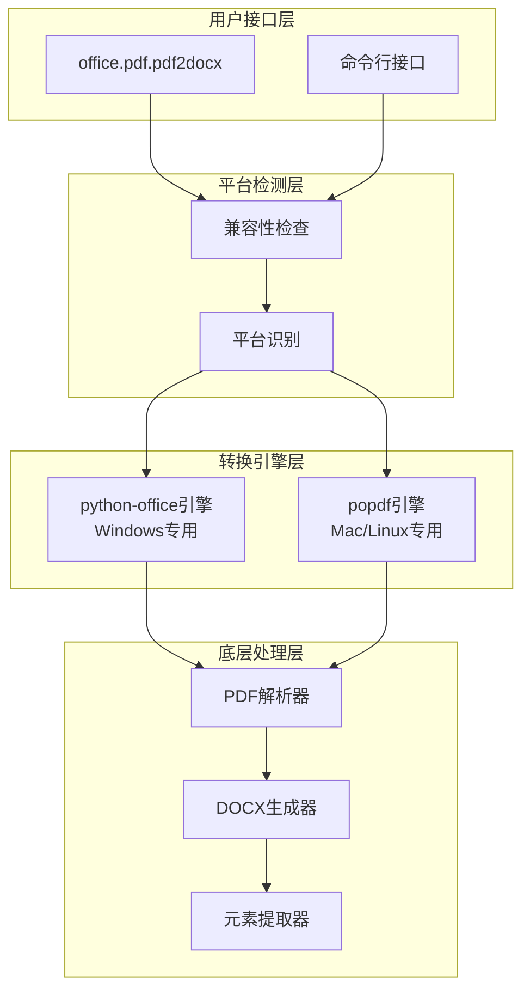
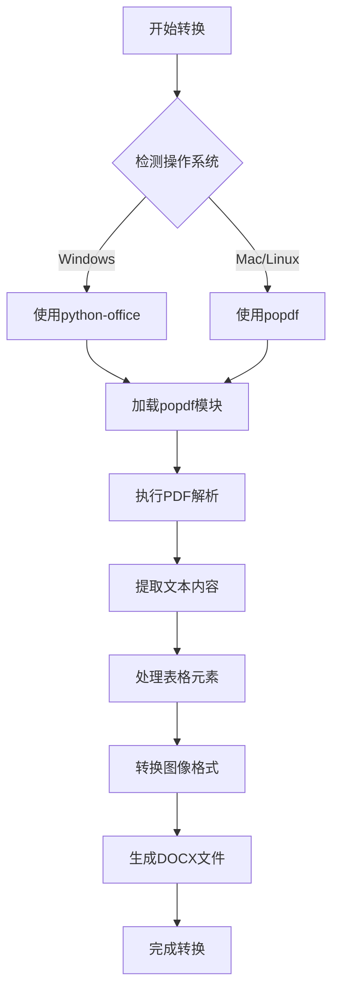
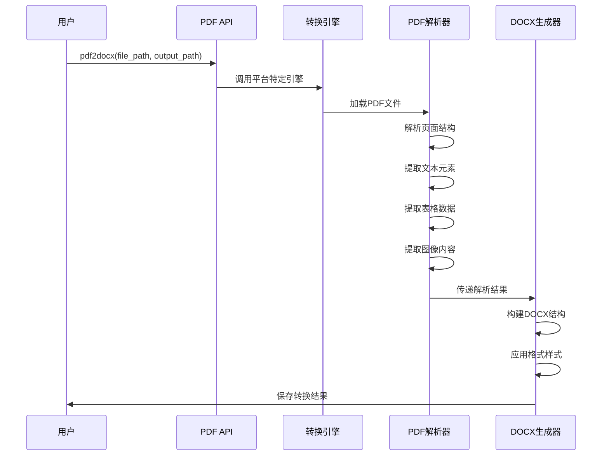
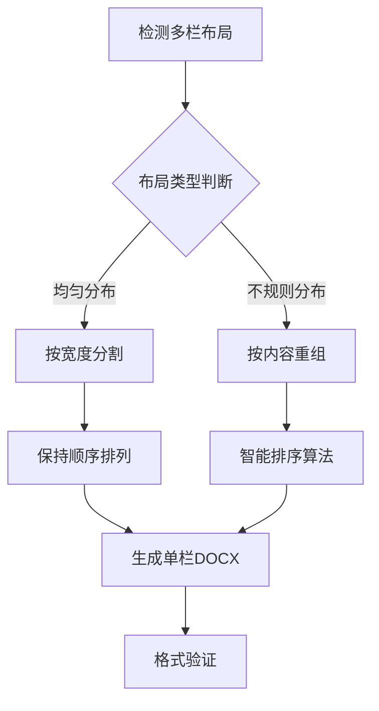
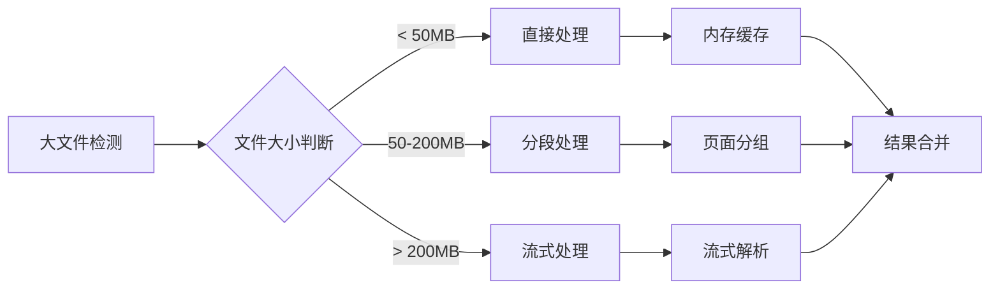
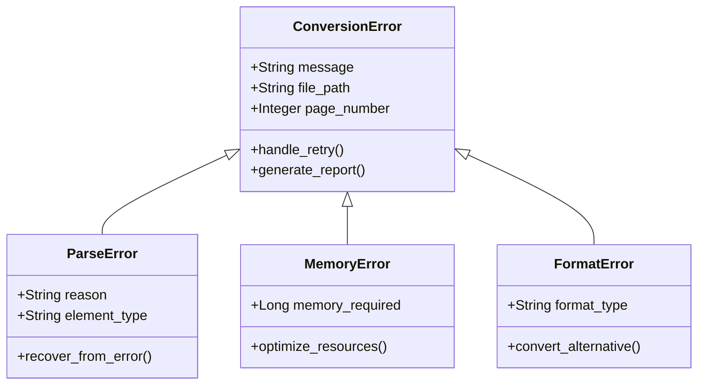

# PDF转Word功能技术实现与使用指南

<cite>
**本文档引用的文件**
- [examples/popdf/pdf转word.py](file://examples/popdf/pdf转word.py)
- [office/api/pdf.py](file://office/api/pdf.py)
- [office/lib/utils/except_utils.py](file://office/lib/utils/except_utils.py)
- [contributors/old_from_gitee/bob-zhao/pdf2imgs.py](file://contributors/old_from_gitee/bob-zhao/pdf2imgs.py)
- [contributors/old_from_gitee/bob-zhao/requirements.txt](file://contributors/old_from_gitee/bob-zhao/requirements.txt)
- [tests/test_code/test_pdf.py](file://tests/test_code/test_pdf.py)
- [README.md](file://README.md)
</cite>

## 目录
1. [概述](#概述)
2. [核心架构](#核心架构)
3. [参数详解](#参数详解)
4. [跨平台适配方案](#跨平台适配方案)
5. [转换流程分析](#转换流程分析)
6. [元素保留机制](#元素保留机制)
7. [复杂版式处理](#复杂版式处理)
8. [性能优化策略](#性能优化策略)
9. [错误处理与重试机制](#错误处理与重试机制)
10. [使用示例](#使用示例)
11. [故障排除](#故障排除)

## 概述

Python-Office库提供了强大的PDF转Word功能，支持将PDF文档转换为可编辑的.docx格式。该功能采用双引擎架构，Windows平台使用python-office库，Mac/Linux平台使用popdf库，确保跨平台兼容性和最佳转换效果。

### 主要特性

- **跨平台支持**：Windows使用python-office，Mac/Linux使用popdf
- **多种输入格式**：支持标准PDF和特殊格式PDF
- **元素保留**：尽可能保留原始文档的文本、表格、图像和格式
- **批量处理**：支持单文件和批量转换
- **错误恢复**：完善的异常处理和重试机制

## 核心架构



**架构图来源**
- [office/api/pdf.py](file://office/api/pdf.py#L25-L40)

**章节来源**
- [office/api/pdf.py](file://office/api/pdf.py#L1-L226)

## 参数详解

### file_path参数

`file_path`参数指定了要转换的PDF文件的完整路径。

#### 参数规范
- **类型**：字符串（str）
- **格式要求**：有效的本地文件路径或网络路径
- **字符编码**：支持Unicode字符
- **路径分隔符**：自动适配不同操作系统的路径分隔符

#### 使用示例
```python
# Windows路径格式
file_path = r'D:\pdf\程序员晚枫.pdf'

# Linux/Mac路径格式  
file_path = '/home/user/documents/report.pdf'

# 网络路径（如果支持）
file_path = 'https://example.com/document.pdf'
```

#### 验证规则
- 文件存在性检查
- PDF格式验证
- 权限检查
- 文件大小限制

### output_path参数

`output_path`参数指定了转换后Word文档的保存路径。

#### 参数规范
- **类型**：字符串（str）
- **默认值**：当前目录（'.'）
- **路径格式**：支持绝对路径和相对路径
- **输出格式**：自动转换为.docx格式

#### 使用示例
```python
# 指定完整输出路径
output_path = r'D:\download\converted_document.docx'

# 指定目录（文件名由系统生成）
output_path = r'D:\download'

# 当前目录
output_path = '.'
```

#### 路径处理逻辑
1. **目录验证**：检查输出目录是否存在
2. **权限检查**：验证写入权限
3. **文件覆盖**：处理同名文件冲突
4. **路径规范化**：统一路径格式

**章节来源**
- [office/api/pdf.py](file://office/api/pdf.py#L28-L40)

## 跨平台适配方案

### Windows平台方案

Windows平台使用python-office库，该库集成了完整的PDF处理功能。

#### 安装配置
```bash
pip install python-office
```

#### 依赖项
- popdf库（自动安装）
- pdf2image（图像处理）
- python-docx（Word生成）

#### 特殊功能
- 支持复杂的PDF结构解析
- 增强的格式保留能力
- 更好的错误诊断

### Mac/Linux平台方案

Mac/Linux平台使用popdf库，专门针对Unix系统优化。

#### 安装配置
```bash
pip install popdf
```

#### 系统依赖
- Ghostscript（PDF渲染引擎）
- ImageMagick（图像处理）
- Tesseract OCR（文本识别）

#### 平台适配流程



**流程图来源**
- [examples/popdf/pdf转word.py](file://examples/popdf/pdf转word.py#L18-L35)

**章节来源**
- [examples/popdf/pdf转word.py](file://examples/popdf/pdf转word.py#L1-L36)

## 转换流程分析

### 核心转换步骤



**序列图来源**
- [office/api/pdf.py](file://office/api/pdf.py#L28-L40)

### 转换精度控制

| 元素类型 | 保留程度 | 处理策略 | 注意事项 |
|---------|---------|---------|---------|
| 文本内容 | 高 | 直接复制 | 保持字体、段落格式 |
| 表格结构 | 中 | 结构重建 | 可能出现行列错位 |
| 图像元素 | 高 | 格式转换 | 支持PNG、JPEG、TIFF |
| 公式符号 | 中 | 文本替换 | 复杂公式可能丢失精度 |
| 多栏布局 | 低 | 单栏重组 | 布局信息可能丢失 |
| 注释标记 | 低 | 忽略处理 | 评论和批注不保留 |

**章节来源**
- [office/api/pdf.py](file://office/api/pdf.py#L28-L40)

## 元素保留机制

### 文本元素处理

文本元素的保留是PDF转Word的核心挑战之一。

#### 处理策略
1. **字符级保留**：逐字符提取原始文本
2. **格式继承**：保留字体、字号、颜色等样式
3. **段落结构**：保持段落分隔和缩进
4. **特殊字符**：正确处理Unicode字符和符号

#### 实现细节
```python
# 文本提取示例（概念性）
def extract_text_with_formatting(pdf_path):
    # 使用PDF解析器提取文本
    raw_text = parser.extract_text(pdf_path)
    
    # 应用格式信息
    formatted_text = apply_formatting(raw_text, metadata)
    
    return formatted_text
```

### 表格元素处理

表格转换涉及复杂的结构重建。

#### 处理流程
1. **边界检测**：识别表格边框和单元格边界
2. **行列计算**：确定表格的行列结构
3. **内容填充**：将文本内容分配到对应单元格
4. **样式应用**：保持表格边框和对齐方式

#### 限制因素
- 复杂表格可能无法完全还原
- 合并单元格可能丢失信息
- 表格样式简化处理

### 图像元素处理

图像元素的处理确保视觉内容的完整性。

#### 支持格式
- **位图格式**：PNG、JPEG、BMP、TIFF
- **矢量图形**：SVG（部分支持）
- **透明度**：Alpha通道保留

#### 质量控制
- 分辨率保持
- 颜色空间转换
- 文件大小优化

**章节来源**
- [contributors/old_from_gitee/bob-zhao/pdf2imgs.py](file://contributors/old_from_gitee/bob-zhao/pdf2imgs.py#L1-L32)

## 复杂版式处理

### 多栏排版

多栏排版是PDF转换的主要挑战之一。

#### 处理策略


#### 限制说明
- **完美还原**：难以完全保持原始布局
- **内容顺序**：可能调整为更易读的顺序
- **视觉效果**：最终效果可能略有差异

### 公式和数学符号

公式处理的复杂性较高。

#### 处理能力
- **简单公式**：基本数学表达式可识别
- **复杂公式**：嵌套公式可能丢失精度
- **特殊符号**：希腊字母和运算符转换

#### 替代方案
- 使用LaTeX导出选项
- 手动重新输入复杂公式
- 使用OCR增强识别

### 图表和图形

图表的转换效果取决于原始PDF的质量。

#### 支持类型
- **数据图表**：柱状图、折线图、饼图
- **流程图**：组织结构图、流程图
- **示意图**：概念图、原理图

#### 转换效果
- **矢量图形**：高质量转换
- **位图图表**：可能损失分辨率
- **交互元素**：动态功能不保留

**章节来源**
- [tests/test_code/test_pdf.py](file://tests/test_code/test_pdf.py#L32-L48)

## 性能优化策略

### 大文件处理

对于大型PDF文件，采用分块处理策略。

#### 分块策略


#### 优化参数
- **内存阈值**：512MB自动启用分块
- **页面数量**：每批次处理10页
- **临时文件**：使用系统临时目录

### 内存占用监控

实时监控内存使用情况，防止内存溢出。

#### 监控指标
- **RSS内存**：常驻内存使用量
- **虚拟内存**：总内存占用
- **堆栈深度**：递归调用深度

#### 优化措施
```python
# 内存监控示例（概念性）
def monitor_memory_usage():
    import psutil
    import os
    
    process = psutil.Process(os.getpid())
    memory_info = process.memory_info()
    
    if memory_info.rss > MAX_MEMORY_THRESHOLD:
        gc.collect()  # 强制垃圾回收
        reduce_processing_size()
```

### 处理速度优化

#### 并行处理
- **多进程**：利用CPU核心并行处理
- **异步IO**：非阻塞文件操作
- **缓存机制**：重复内容缓存

#### 算法优化
- **增量处理**：只处理变更部分
- **预编译**：常用模式预处理
- **压缩存储**：中间结果压缩

**章节来源**
- [office/lib/utils/except_utils.py](file://office/lib/utils/except_utils.py#L10-L35)

## 错误处理与重试机制

### 异常分类



**类图来源**
- [office/lib/utils/except_utils.py](file://office/lib/utils/except_utils.py#L10-L35)

### 重试策略

#### 指数退避算法
```python
def exponential_backoff_retry(func, max_retries=3):
    """指数退避重试机制"""
    for attempt in range(max_retries):
        try:
            return func()
        except RetryableException as e:
            wait_time = 2 ** attempt  # 2, 4, 8秒
            time.sleep(wait_time)
            continue
        except FatalException as e:
            logger.error(f"转换失败: {e}")
            raise
```

#### 重试条件
- **临时错误**：网络超时、文件锁定
- **资源不足**：内存不足、磁盘空间
- **格式问题**：损坏的PDF文件

### 错误恢复

#### 自动修复
- **文件修复**：尝试修复损坏的PDF
- **格式转换**：降级处理复杂格式
- **部分转换**：跳过有问题的部分

#### 用户干预
- **手动确认**：复杂错误需要用户决策
- **参数调整**：提供优化建议
- **备用方案**：推荐替代处理方式

**章节来源**
- [office/lib/utils/except_utils.py](file://office/lib/utils/except_utils.py#L10-L35)

## 使用示例

### 基础使用

最简单的PDF转Word转换：

```python
import office

# 基础转换
office.pdf.pdf2docx(
    file_path=r'D:\pdf\document.pdf',
    output_path=r'D:\output'
)
```

### 高级配置

带参数的转换示例：

```python
# 指定完整输出路径
office.pdf.pdf2docx(
    file_path=r'/home/user/docs/report.pdf',
    output_path=r'/home/user/output/final_report.docx'
)

# 批量转换（伪代码）
pdf_files = ['doc1.pdf', 'doc2.pdf', 'doc3.pdf']
for pdf_file in pdf_files:
    office.pdf.pdf2docx(
        file_path=pdf_file,
        output_path=f'converted_{pdf_file.replace(".pdf", ".docx")}'
    )
```

### 平台特定示例

#### Windows平台
```python
# Windows专用配置
import office
import os

# 设置临时目录
os.environ['TEMP'] = r'C:\Temp'

# 执行转换
office.pdf.pdf2docx(
    file_path=r'D:\documents\complex_report.pdf',
    output_path=r'D:\output\converted_report.docx'
)
```

#### Mac/Linux平台
```python
# Mac/Linux专用配置
import popdf
import subprocess

# 检查系统依赖
def check_dependencies():
    try:
        subprocess.run(['gs', '--version'], check=True, capture_output=True)
        subprocess.run(['convert', '--version'], check=True, capture_output=True)
    except FileNotFoundError:
        print("缺少必要的系统依赖")

# 执行转换
check_dependencies()
popdf.pdf2docx(
    file_path='/Users/user/Documents/report.pdf',
    output_path='/Users/user/Output/report.docx'
)
```

**章节来源**
- [examples/popdf/pdf转word.py](file://examples/popdf/pdf转word.py#L1-L36)

## 故障排除

### 常见问题

#### 转换失败
**症状**：转换过程中断，无输出文件
**原因**：
- PDF文件损坏
- 磁盘空间不足
- 权限问题

**解决方案**：
```python
# 错误处理示例
try:
    office.pdf.pdf2docx(file_path, output_path)
except Exception as e:
    print(f"转换失败: {e}")
    # 尝试降级处理
    fallback_conversion(file_path, output_path)
```

#### 格式丢失
**症状**：转换后格式与原文档差异较大
**原因**：
- 复杂布局
- 特殊字体
- 图像压缩

**解决方案**：
- 使用更高质量的输入文件
- 手动调整转换后的格式
- 考虑使用专业转换服务

#### 性能问题
**症状**：转换速度慢或内存占用过高
**原因**：
- 文件过大
- 系统资源不足
- 算法效率问题

**解决方案**：
- 分批处理大文件
- 增加系统内存
- 使用SSD存储

### 调试技巧

#### 日志记录
```python
import logging

# 启用详细日志
logging.basicConfig(level=logging.DEBUG)
logger = logging.getLogger('office.pdf')

# 记录转换过程
logger.info(f"开始转换: {input_file} -> {output_file}")
```

#### 性能监控
```python
import time
import psutil

def monitor_conversion_performance():
    start_time = time.time()
    start_memory = psutil.Process().memory_info().rss
    
    # 执行转换...
    
    end_time = time.time()
    end_memory = psutil.Process().memory_info().rss
    
    print(f"耗时: {end_time - start_time:.2f}秒")
    print(f"内存增长: {(end_memory - start_memory) / 1024 / 1024:.2f}MB")
```

### 最佳实践

#### 文件准备
1. **清理文件**：移除不必要的注释和标记
2. **优化格式**：使用标准PDF格式
3. **检查完整性**：验证PDF文件无损坏

#### 转换策略
1. **测试优先**：先转换小样本文件
2. **备份重要**：保留原始PDF文件
3. **逐步优化**：根据结果调整参数

#### 后续处理
1. **格式验证**：检查转换后的文档格式
2. **内容校对**：人工核对关键信息
3. **自动化集成**：将转换集成到工作流程中

**章节来源**
- [tests/test_code/test_pdf.py](file://tests/test_code/test_pdf.py#L1-L49)

## 总结

Python-Office的PDF转Word功能提供了强大而灵活的文档转换解决方案。通过双引擎架构，它成功解决了跨平台兼容性问题，同时保持了良好的转换质量和用户体验。

### 关键优势
- **跨平台兼容**：Windows和Unix系统均得到良好支持
- **格式保留**：尽可能保持原始文档的结构和样式
- **易于使用**：一行代码即可完成复杂转换
- **错误恢复**：完善的异常处理和重试机制

### 适用场景
- **办公自动化**：日常文档格式转换
- **数据迁移**：PDF到可编辑格式的转换
- **内容处理**：批量文档的格式统一
- **内容提取**：从PDF中提取可编辑内容

### 发展方向
随着AI技术的发展，未来的PDF转Word功能将进一步提升：
- **智能格式识别**：更好的布局理解和重建
- **语义保留**：不仅仅是格式，还包括内容语义
- **实时转换**：云端服务支持实时文档转换
- **质量优化**：AI驱动的转换质量提升

通过合理使用这些功能和遵循最佳实践，用户可以高效地完成PDF到Word的转换任务，满足各种办公自动化需求。