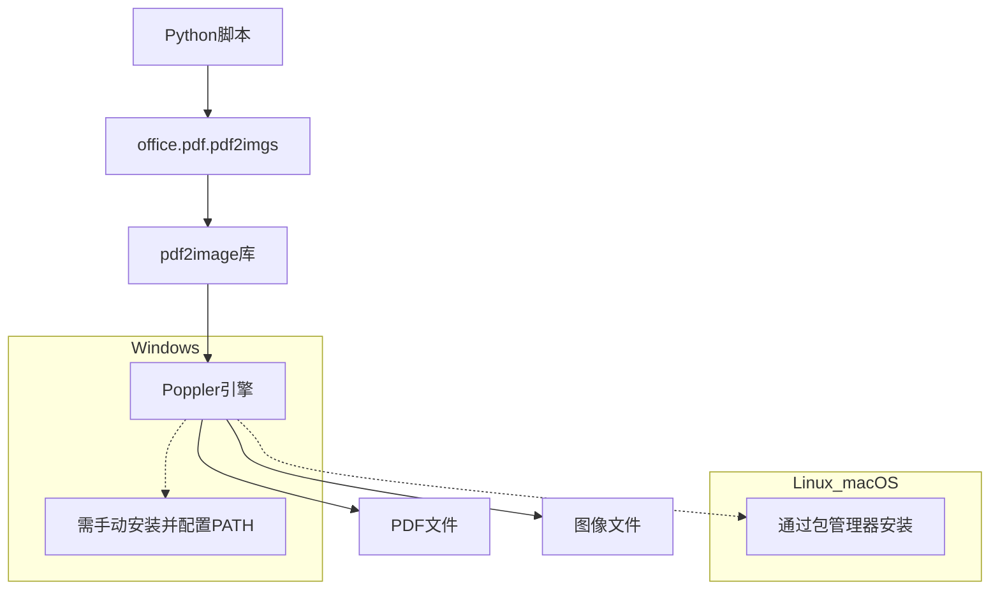

# PDF转图片

<cite>
**本文档引用的文件**
- [pdf.py](file://office/api/pdf.py#L42-L55)
- [pdf2imgs.py](file://contributors/old_from_gitee/bob-zhao/pdf2imgs.py#L1-L32)
- [test_pdf.py](file://tests/test_code/test_pdf.py#L26-L29)
- [pdf转图片.py](file://examples/popdf/pdf转图片.py#L1-L13)
- [requirements.txt](file://contributors/old_from_gitee/bob-zhao/requirements.txt#L1)
</cite>

## 目录
1. [简介](#简介)
2. [核心参数详解](#核心参数详解)
3. [图像配置选项](#图像配置选项)
4. [底层实现与平台依赖](#底层实现与平台依赖)
5. [性能优化建议](#性能优化建议)
6. [使用示例](#使用示例)
7. [结论](#结论)

## 简介
`office.pdf.pdf2imgs` 接口是 python-office 库中用于将 PDF 文档转换为图像文件的核心功能。该接口封装了底层的 PDF 处理逻辑，为用户提供了一个简单易用的 API，能够将 PDF 的每一页转换为高质量的图像文件，支持多种输出格式和配置选项。

**Section sources**
- [pdf.py](file://office/api/pdf.py#L42-L55)

## 核心参数详解

`office.pdf.pdf2imgs` 接口主要包含三个核心参数：`input_file`、`output_path` 和 `merge`。这些参数共同决定了转换过程的行为和输出结果。

### input_file 参数
`input_file` 参数指定要转换的源 PDF 文件的路径。该参数必须是一个有效的字符串路径，指向存在于文件系统中的 PDF 文件。接口会验证输入路径的有效性，并在文件不存在或路径无效时抛出相应的错误。

### output_path 参数
`output_path` 参数定义了转换后图像文件的输出目录。如果指定的目录不存在，接口会自动创建该目录。输出路径的组织结构通常会以 PDF 文件的名称为基础创建子目录，确保输出文件的有序管理。

### merge 参数
`merge` 参数是控制输出模式的关键开关，其布尔值决定了最终的输出形式：

- **merge=False（默认值）**：此模式下，PDF 文档的每一页都会被独立转换为一张单独的图像文件。这是最常用的模式，适用于需要对 PDF 的每一页进行单独处理或编辑的场景，例如文档归档、页面提取或批量图像处理。

- **merge=True**：在此模式下，PDF 的所有页面将被垂直堆叠并合并成一张连续的长图。这种模式特别适用于创建电子书预览、长篇报告的单页展示或需要在社交媒体上分享整个文档内容的场景。

**Section sources**
- [pdf.py](file://office/api/pdf.py#L42-L55)
- [pdf2imgs.py](file://contributors/old_from_gitee/bob-zhao/pdf2imgs.py#L1-L32)

## 图像配置选项

虽然核心接口的公开参数主要集中在文件路径和合并模式上，但其底层实现依赖于 `pdf2image` 库，该库支持丰富的图像配置选项。

### 图像分辨率
图像的分辨率（DPI）是影响输出质量的关键因素。更高的 DPI 值会产生更清晰、细节更丰富的图像，但同时也会显著增加文件大小和转换时间。虽然在 `office.pdf.pdf2imgs` 的顶层接口中可能未直接暴露 DPI 参数，但它通常在底层调用 `pdf2image.convert_from_path` 时使用默认或预设的 DPI 值。

### 图像格式选择
底层的 `pdf2image` 库支持多种图像格式，如 JPG 和 PNG。JPG 格式提供有损压缩，文件体积小，适合对质量要求不极端的场景；PNG 格式提供无损压缩，能保留更多图像细节，但文件体积较大。根据现有代码示例，该接口默认输出为 JPG 格式。

### 色彩模式
色彩模式（如 RGB、灰度）也由底层库处理。通常，转换会保持 PDF 原有的色彩信息，输出为全彩图像。对于只需要黑白内容的场景，可能需要在转换后进行额外的图像处理。

**Section sources**
- [pdf2imgs.py](file://contributors/old_from_gitee/bob-zhao/pdf2imgs.py#L30-L32)

## 底层实现与平台依赖

`office.pdf.pdf2imgs` 接口的功能实现严重依赖于第三方库 `pdf2image`，而 `pdf2image` 本身又依赖于一个名为 Poppler 的 PDF 渲染引擎。

### Poppler 依赖
Poppler 是一个开源的 PDF 渲染库，负责将 PDF 页面解析并栅格化为位图图像。`pdf2image` 库通过调用 Poppler 的命令行工具（如 `pdftoppm`）来完成实际的转换工作。

### 平台差异处理
不同操作系统对 Poppler 的依赖处理方式不同：
- **Windows**：用户通常需要手动下载并安装 Poppler，然后将其 `bin` 目录添加到系统的 `PATH` 环境变量中，以便 Python 脚本能够找到并调用相关可执行文件。
- **Linux/macOS**：可以通过系统的包管理器（如 Linux 上的 `apt` 或 `yum`，macOS 上的 `Homebrew`）方便地安装 Poppler，例如使用 `brew install poppler` 命令。

这种平台差异意味着在 Windows 环境下使用该功能前，必须确保 Poppler 已正确安装和配置。



**Diagram sources**
- [pdf2imgs.py](file://contributors/old_from_gitee/bob-zhao/pdf2imgs.py#L2)
- [requirements.txt](file://contributors/old_from_gitee/bob-zhao/requirements.txt#L1)

## 性能优化建议

对于大型 PDF 文件或批量转换任务，性能优化至关重要。

### 内存缓冲区管理
转换大型 PDF 时，一次性将所有页面加载到内存可能导致内存溢出。最佳实践是采用逐页处理的方式，即转换完一页后立即保存到磁盘并释放其内存，避免累积过多的图像对象。

### 临时文件清理
`pdf2image` 在转换过程中可能会生成临时文件。应确保在转换完成后，无论是成功还是失败，都能正确清理这些临时文件，防止磁盘空间被无谓占用。

### 并发处理限制
虽然并发处理可以加速批量转换，但应谨慎设置并发数。过多的并发进程会同时消耗大量 CPU、内存和 I/O 资源，可能导致系统性能下降甚至崩溃。建议根据系统的硬件配置（如 CPU 核心数、可用内存）来合理限制并发数量，例如设置为 CPU 核心数的 1-2 倍。

**Section sources**
- [pdf2imgs.py](file://contributors/old_from_gitee/bob-zhao/pdf2imgs.py#L30-L32)

## 使用示例

以下是一个典型的使用示例，展示了如何调用 `office.pdf.pdf2imgs` 接口：

```python
import office

office.pdf.pdf2imgs(
    pdf_path='D://文档//示例.pdf',
    out_dir='./输出图片'
)
```

此代码会将 `示例.pdf` 的每一页转换为 JPG 图像，并保存在 `./输出图片/示例/` 目录下，文件名为 `page0.jpg`、`page1.jpg` 等。

**Section sources**
- [pdf转图片.py](file://examples/popdf/pdf转图片.py#L7-L10)

## 结论

`office.pdf.pdf2imgs` 接口为 PDF 到图像的转换提供了一个简洁而强大的解决方案。通过理解其核心参数、底层依赖和性能考量，用户可以有效地将其集成到各种自动化工作流中，无论是用于文档数字化、内容提取还是创建视觉化报告。