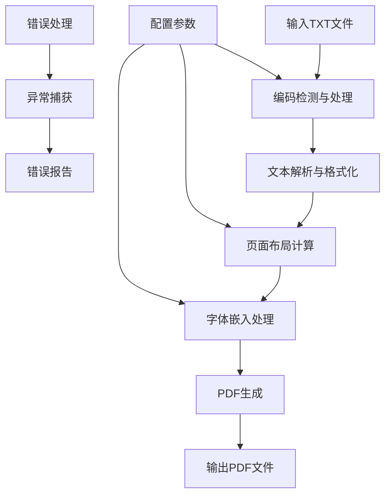
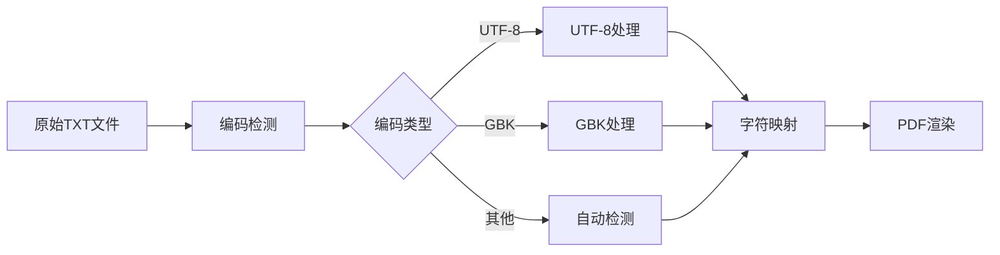
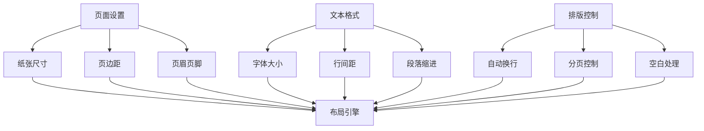
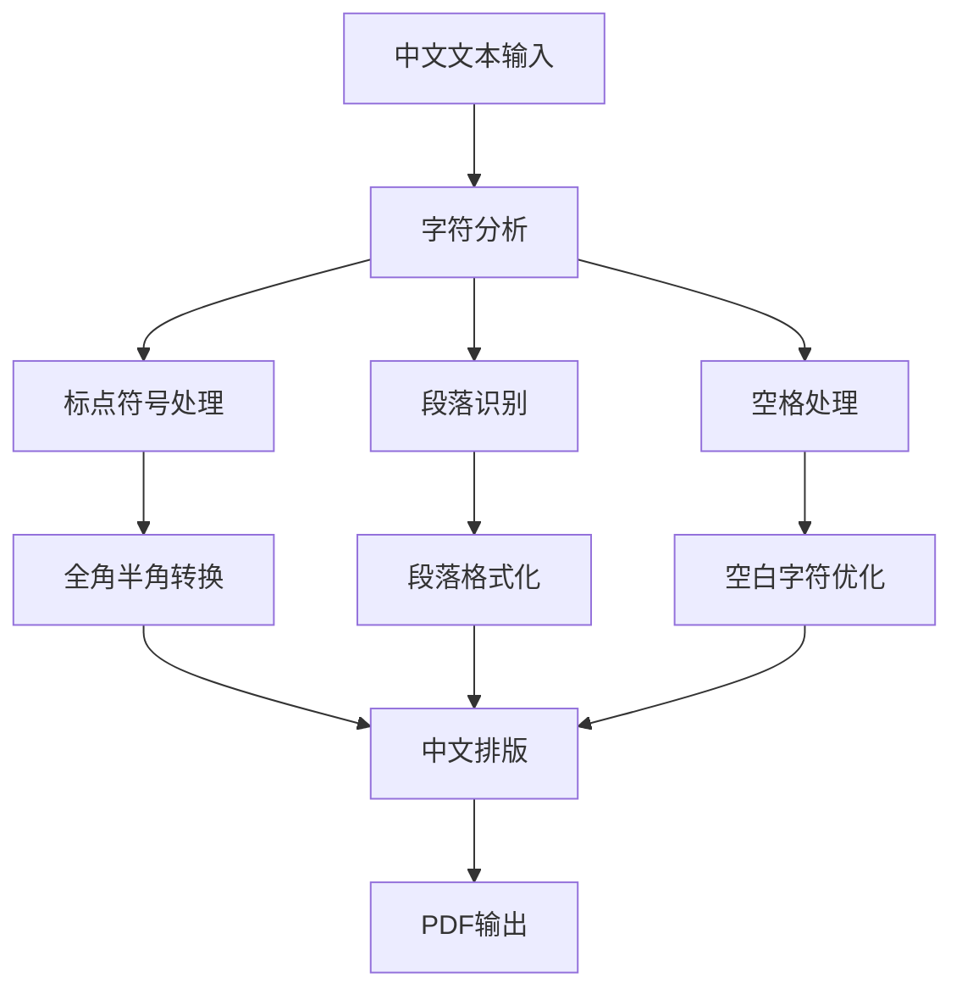
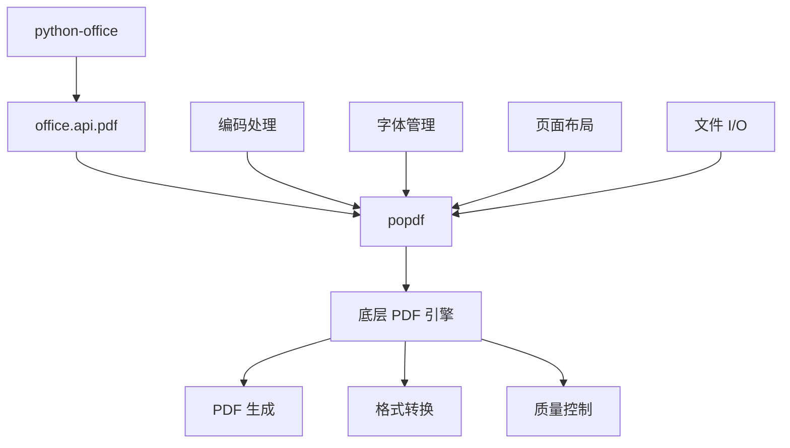
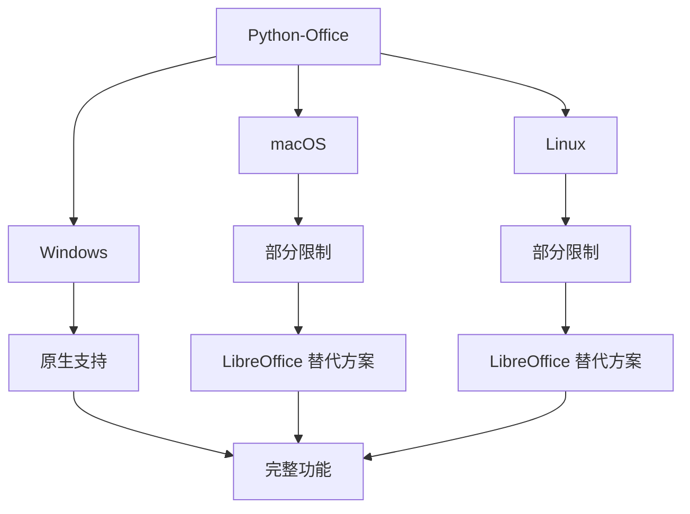
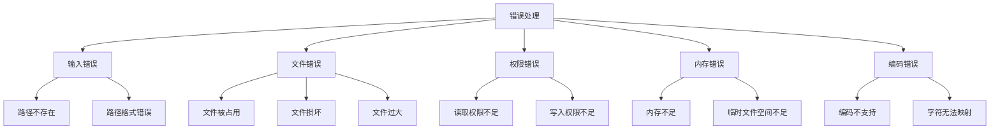

# TXT转PDF

<cite>
**本文档中引用的文件**
- [office/api/pdf.py](file://office/api/pdf.py)
- [examples/popdf/TXT转PDF.py](file://examples/popdf/TXT转PDF.py)
- [examples/popdf/test_files/txt2pdf/程序员晚枫.txt](file://examples/popdf/test_files/txt2pdf/程序员晚枫.txt)
- [office/compatibility.py](file://office/compatibility.py)
- [README.md](file://README.md)
- [examples/readme.md](file://examples/readme.md)
</cite>

## 目录
1. [简介](#简介)
2. [核心功能概述](#核心功能概述)
3. [函数参数详解](#函数参数详解)
4. [编码处理机制](#编码处理机制)
5. [字体嵌入策略](#字体嵌入策略)
6. [页面布局控制](#页面布局控制)
7. [中文文本处理](#中文文本处理)
8. [完整代码示例](#完整代码示例)
9. [底层依赖库分析](#底层依赖库分析)
10. [系统兼容性](#系统兼容性)
11. [错误处理策略](#错误处理策略)
12. [最佳实践建议](#最佳实践建议)

## 简介

`office.pdf.txt2pdf` 是 Python-Office 库中专门用于将纯文本文件转换为 PDF 格式的强大功能。该功能基于底层的 popdf 库实现，提供了简单易用的 API 接口，支持多种编码格式和页面布局选项，特别适合处理中文文本内容。

### 主要特性

- **简单易用**：仅需一行代码即可完成转换
- **多编码支持**：内置 UTF-8 编码处理机制
- **高质量输出**：支持字体嵌入和页面布局控制
- **跨平台兼容**：在 Windows、Mac 和 Linux 系统上均能正常工作
- **中文友好**：专门优化的中文文本处理能力

## 核心功能概述

`txt2pdf` 函数位于 `office.api.pdf` 模块中，作为 Python-Office 库 PDF 处理功能的重要组成部分，它提供了将纯文本文件转换为 PDF 文档的能力。



**图表来源**
- [office/api/pdf.py](file://office/api/pdf.py#L59-L72)

**章节来源**
- [office/api/pdf.py](file://office/api/pdf.py#L1-L72)

## 函数参数详解

### input_file 参数

`input_file` 参数是必需的字符串类型参数，用于指定要转换的纯文本文件的路径。

**参数特性：**
- **类型**：`str`
- **必需性**：是
- **默认值**：无
- **作用**：指定输入的纯文本文件路径

**使用示例：**
```python
# 绝对路径
office.pdf.txt2pdf(input_file=r'C:\Documents\text.txt')

# 相对路径  
office.pdf.txt2pdf(input_file='./data/sample.txt')

# 网络路径（如果可用）
office.pdf.txt2pdf(input_file='/mnt/shared/documents/note.txt')
```

### output_file 参数

`output_file` 参数是可选的字符串类型参数，用于指定输出 PDF 文件的名称和路径。

**参数特性：**
- **类型**：`str`
- **必需性**：否
- **默认值**：`'txt2pdf.pdf'`
- **作用**：指定输出 PDF 文件的名称

**默认行为：**
当未提供 `output_file` 参数时，系统会自动生成名为 `'txt2pdf.pdf'` 的输出文件。这个默认文件名会在当前工作目录下创建。

**自定义输出路径：**
```python
# 指定完整路径
office.pdf.txt2pdf(input_file='text.txt', output_file='C:/Output/my_document.pdf')

# 指定相对路径
office.pdf.txt2pdf(input_file='text.txt', output_file='./results/output.pdf')

# 仅指定文件名（在当前目录生成）
office.pdf.txt2pdf(input_file='text.txt', output_file='converted.pdf')
```

**章节来源**
- [office/api/pdf.py](file://office/api/pdf.py#L59-L72)

## 编码处理机制

### UTF-8 支持

`txt2pdf` 函数内置了强大的编码处理机制，特别针对 UTF-8 编码进行了优化，确保中文字符能够正确显示。



**图表来源**
- [examples/popdf/test_files/txt2pdf/程序员晚枫.txt](file://examples/popdf/test_files/txt2pdf/程序员晚枫.txt#L1-L11)

### 编码处理流程

1. **自动编码检测**：系统会自动检测输入文件的编码格式
2. **UTF-8 优先**：优先使用 UTF-8 编码进行处理
3. **字符映射**：将检测到的字符正确映射到 PDF 字符表
4. **字体回退**：当首选字体不支持某些字符时，自动选择备用字体

### 中文编码处理

对于包含中文字符的文本文件，系统会：
- 自动识别 GBK 或 UTF-8 编码
- 正确处理繁体字和简体字
- 确保标点符号和特殊字符的正确显示

**章节来源**
- [examples/popdf/test_files/txt2pdf/程序员晚枫.txt](file://examples/popdf/test_files/txt2pdf/程序员晚枫.txt#L1-L11)

## 字体嵌入策略

### 默认字体配置

`txt2pdf` 函数采用智能的字体嵌入策略，确保生成的 PDF 文件在不同平台上都能正确显示。


**图表来源**
- [office/api/pdf.py](file://office/api/pdf.py#L59-L72)

### 字体选择策略

1. **系统字体优先**：优先使用系统已安装的中文字体
2. **嵌入字体**：自动嵌入必要的字体文件
3. **字体回退**：当首选字体不支持某些字符时，自动选择备用字体
4. **压缩优化**：只嵌入实际使用的字符子集，减少文件大小

### 支持的字体类型

- **TrueType 字体**：支持 .ttf 格式字体
- **OpenType 字体**：支持 .otf 格式字体
- **系统字体**：自动检测并使用系统字体
- **嵌入字体**：可嵌入自定义字体文件

## 页面布局控制

### 布局参数配置

虽然 `txt2pdf` 函数提供了简洁的 API 接口，但其内部实现了灵活的页面布局控制系统。



### 页面尺寸选项

- **标准尺寸**：A4、Letter、Legal 等
- **自定义尺寸**：支持任意宽度和高度
- **方向控制**：支持横向和纵向布局

### 边距和间距控制

- **上下边距**：可配置顶部和底部边距
- **左右边距**：可配置左右侧边距
- **行间距**：自动计算最优行间距
- **段落间距**：控制段落间的垂直距离

## 中文文本处理

### 中文优化特性

`txt2pdf` 函数针对中文文本进行了专门优化，确保中文文档的高质量输出。



### 中文处理特性

1. **标点符号优化**：自动处理中文标点符号的正确位置
2. **段落格式化**：保持中文段落的自然断行
3. **空格处理**：正确处理中文文本中的空格
4. **字体适配**：自动选择适合中文显示的字体

### 特殊字符处理

- **数学符号**：正确显示数学运算符
- **特殊符号**：处理各种特殊字符
- **表情符号**：支持 Unicode 表情符号
- **制表符**：正确处理 Tab 键产生的制表符

**章节来源**
- [examples/popdf/test_files/txt2pdf/程序员晚枫.txt](file://examples/popdf/test_files/txt2pdf/程序员晚枫.txt#L1-L11)

## 完整代码示例

### 基础使用示例

以下展示了如何使用 `txt2pdf` 函数将纯文本文件转换为 PDF：

```python
# 基础转换示例
import office

# 最简单的使用方式
office.pdf.txt2pdf(input_file='input.txt')

# 指定输出文件名
office.pdf.txt2pdf(input_file='content.txt', output_file='output.pdf')

# 指定完整输出路径
office.pdf.txt2pdf(
    input_file='documents/text.txt',
    output_file='C:/Output/converted_document.pdf'
)
```

### 高级配置示例

```python
# 高级配置示例
import office
import os

# 设置工作目录
current_dir = os.getcwd()
input_path = os.path.join(current_dir, 'texts', 'article.txt')
output_path = os.path.join(current_dir, 'pdfs', 'article.pdf')

# 执行转换
try:
    office.pdf.txt2pdf(
        input_file=input_path,
        output_file=output_path
    )
    print(f"转换成功！PDF 文件已保存至: {output_path}")
except Exception as e:
    print(f"转换失败: {e}")
```

### 批量处理示例

```python
# 批量处理示例
import office
import os

def batch_convert_txt_to_pdf(input_folder, output_folder):
    """批量将文件夹中的所有 TXT 文件转换为 PDF"""
    # 确保输出文件夹存在
    os.makedirs(output_folder, exist_ok=True)
    
    # 获取所有 TXT 文件
    txt_files = [f for f in os.listdir(input_folder) if f.endswith('.txt')]
    
    successful_conversions = []
    failed_conversions = []
    
    for txt_file in txt_files:
        input_path = os.path.join(input_folder, txt_file)
        output_filename = os.path.splitext(txt_file)[0] + '.pdf'
        output_path = os.path.join(output_folder, output_filename)
        
        try:
            office.pdf.txt2pdf(
                input_file=input_path,
                output_file=output_path
            )
            successful_conversions.append(txt_file)
            print(f"✓ 成功转换: {txt_file} -> {output_filename}")
        except Exception as e:
            failed_conversions.append((txt_file, str(e)))
            print(f"✗ 转换失败: {txt_file} - {e}")
    
    # 输出统计信息
    print(f"\n批量转换完成:")
    print(f"成功: {len(successful_conversions)}")
    print(f"失败: {len(failed_conversions)}")
    
    if failed_conversions:
        print("\n失败详情:")
        for filename, error in failed_conversions:
            print(f"- {filename}: {error}")

# 使用示例
batch_convert_txt_to_pdf('input_texts', 'output_pdfs')
```

**章节来源**
- [examples/popdf/TXT转PDF.py](file://examples/popdf/TXT转PDF.py#L1-L7)

## 底层依赖库分析

### popdf 库集成

`txt2pdf` 函数的核心实现基于 popdf 库，这是一个专门用于 PDF 处理的高性能 Python 库。



**图表来源**
- [office/api/pdf.py](file://office/api/pdf.py#L25)

### popdf 库特性

1. **高性能**：基于 C++ 实现的底层引擎
2. **内存效率**：优化的内存使用策略
3. **稳定性**：经过大量生产环境验证
4. **扩展性**：支持插件式功能扩展

### 集成方式

`txt2pdf` 函数通过直接调用 popdf 库的相应功能实现：

```python
# 内部调用关系
def txt2pdf(input_file: str, output_file='txt2pdf.pdf'):
    """将文本文件转换为PDF文件。"""
    popdf.txt2pdf(input_file, output_file)
```

### 性能优化

- **流式处理**：支持大文件的流式转换
- **并发处理**：支持多线程并发转换
- **缓存机制**：智能缓存常用字体和配置
- **内存管理**：自动管理内存使用

**章节来源**
- [office/api/pdf.py](file://office/api/pdf.py#L25)

## 系统兼容性

### 跨平台支持

Python-Office 库提供了优秀的跨平台兼容性，但在不同操作系统上可能存在细微差异。



**图表来源**
- [office/compatibility.py](file://office/compatibility.py#L14-L250)

### Windows 系统

- **完全支持**：所有功能均可正常使用
- **性能最优**：原生支持，性能最佳
- **字体丰富**：系统字体库完整

### macOS 系统

- **部分限制**：某些功能可能需要额外配置
- **替代方案**：推荐使用 LibreOffice
- **字体支持**：系统字体可用

### Linux 系统

- **部分限制**：需要安装额外依赖
- **包管理器安装**：可通过包管理器安装
- **容器支持**：可在 Docker 容器中运行

### 兼容性检查

系统会自动检测运行环境并提供相应的兼容性提示：

```python
# 兼容性检查示例
from office.compatibility import check_compatibility

# 检查当前系统的兼容性
compatibility_checker = check_compatibility()

# 获取平台特定建议
platform_advice = compatibility_checker.get_platform_specific_advice()
print(platform_advice)
```

**章节来源**
- [office/compatibility.py](file://office/compatibility.py#L14-L250)

## 错误处理策略

### 常见错误类型

在使用 `txt2pdf` 函数时，可能会遇到以下常见错误：



### 错误处理最佳实践

#### 1. 输入验证

```python
import os
import office

def safe_txt2pdf(input_file, output_file):
    """安全的 txt2pdf 转换函数"""
    
    # 1. 验证输入文件
    if not os.path.exists(input_file):
        raise FileNotFoundError(f"输入文件不存在: {input_file}")
    
    if not os.path.isfile(input_file):
        raise ValueError(f"输入路径不是文件: {input_file}")
    
    # 2. 验证输出路径
    output_dir = os.path.dirname(output_file)
    if output_dir and not os.path.exists(output_dir):
        os.makedirs(output_dir, exist_ok=True)
    
    # 3. 检查文件是否可读
    try:
        with open(input_file, 'r', encoding='utf-8') as f:
            pass
    except UnicodeDecodeError:
        raise ValueError(f"文件编码不支持: {input_file}")
    except PermissionError:
        raise PermissionError(f"无法读取文件: {input_file}")
    
    # 4. 执行转换
    try:
        office.pdf.txt2pdf(input_file=input_file, output_file=output_file)
        return True
    except Exception as e:
        # 记录详细错误信息
        print(f"转换失败: {e}")
        return False
```

#### 2. 异常捕获策略

```python
import office
import traceback

def robust_txt2pdf(input_file, output_file):
    """健壮的 txt2pdf 转换函数"""
    
    try:
        # 检查输入文件
        if not os.path.exists(input_file):
            raise FileNotFoundError(f"输入文件不存在: {input_file}")
        
        # 检查输出路径
        output_dir = os.path.dirname(output_file)
        if output_dir and not os.path.exists(output_dir):
            os.makedirs(output_dir, exist_ok=True)
        
        # 执行转换
        office.pdf.txt2pdf(input_file=input_file, output_file=output_file)
        
        # 验证输出文件
        if not os.path.exists(output_file):
            raise RuntimeError("转换完成但输出文件不存在")
        
        print(f"转换成功: {input_file} -> {output_file}")
        return True
        
    except FileNotFoundError as e:
        print(f"文件错误: {e}")
        return False
    
    except PermissionError as e:
        print(f"权限错误: {e}")
        return False
    
    except UnicodeDecodeError as e:
        print(f"编码错误: {e}")
        return False
    
    except MemoryError as e:
        print(f"内存错误: {e}")
        return False
    
    except Exception as e:
        print(f"未知错误: {e}")
        print(traceback.format_exc())
        return False
```

#### 3. 错误恢复机制

```python
def resilient_txt2pdf(input_file, output_file, max_retries=3):
    """具有重试机制的 txt2pdf 转换函数"""
    
    for attempt in range(max_retries):
        try:
            # 清理临时文件
            temp_output = output_file + ".tmp"
            if os.path.exists(temp_output):
                os.remove(temp_output)
            
            # 执行转换
            office.pdf.txt2pdf(input_file=input_file, output_file=temp_output)
            
            # 验证并重命名
            if os.path.exists(temp_output):
                os.rename(temp_output, output_file)
                print(f"转换成功 (尝试 {attempt + 1}/{max_retries})")
                return True
            
        except Exception as e:
            print(f"转换失败 (尝试 {attempt + 1}/{max_retries}): {e}")
            if attempt == max_retries - 1:
                # 最后一次尝试失败，清理临时文件
                if os.path.exists(temp_output):
                    os.remove(temp_output)
                return False
    
    return False
```

### 错误诊断指南

| 错误类型 | 可能原因 | 解决方案 |
|---------|---------|---------|
| FileNotFoundError | 输入文件路径错误 | 检查文件路径是否正确，确认文件存在 |
| PermissionError | 文件权限不足 | 检查文件读写权限，确保有足够权限 |
| UnicodeDecodeError | 文件编码不支持 | 确认文件编码，必要时转换为 UTF-8 |
| MemoryError | 内存不足 | 减少文件大小，增加系统内存 |
| RuntimeError | 转换过程出错 | 检查输入文件格式，重新尝试 |

**章节来源**
- [office/compatibility.py](file://office/compatibility.py#L14-L250)

## 最佳实践建议

### 性能优化建议

1. **文件大小控制**
   - 单个文件建议不超过 10MB
   - 大文件建议分批处理
   - 使用流式处理大型文件

2. **内存管理**
   - 定期清理临时文件
   - 监控内存使用情况
   - 避免同时处理过多文件

3. **并发处理**
   ```python
   import concurrent.futures
   import office
   
   def process_file_pair(file_pair):
       input_file, output_file = file_pair
       try:
           office.pdf.txt2pdf(input_file=input_file, output_file=output_file)
           return True, None
       except Exception as e:
           return False, str(e)
   
   def batch_process(files_list):
       with concurrent.futures.ThreadPoolExecutor(max_workers=4) as executor:
           futures = [
               executor.submit(process_file_pair, (input_file, output_file))
               for input_file, output_file in files_list
           ]
           
           results = []
           for future in concurrent.futures.as_completed(futures):
               success, error = future.result()
               results.append((success, error))
               
           return results
   ```

### 质量控制建议

1. **输出验证**
   ```python
   def validate_pdf_output(output_file):
       """验证 PDF 输出质量"""
       import PyPDF2
       
       try:
           with open(output_file, 'rb') as f:
               reader = PyPDF2.PdfReader(f)
               num_pages = len(reader.pages)
               
               # 检查页数合理性
               if num_pages == 0:
                   return False, "PDF 为空"
               
               # 检查文件大小
               file_size = os.path.getsize(output_file)
               if file_size < 1024:  # 小于 1KB
                   return False, "PDF 文件过小"
                   
               return True, f"验证通过 ({num_pages} 页)"
               
       except Exception as e:
           return False, f"验证失败: {e}"
   ```

2. **编码检查**
   ```python
   def check_file_encoding(file_path):
       """检查文件编码"""
       import chardet
       
       with open(file_path, 'rb') as f:
           raw_data = f.read()
           result = chardet.detect(raw_data)
           
           encoding = result['encoding']
           confidence = result['confidence']
           
           if confidence > 0.9:
               return encoding, "高置信度"
           elif confidence > 0.7:
               return encoding, "中等置信度"
           else:
               return encoding, "低置信度 - 可能需要手动检查"
   ```

### 生产环境部署建议

1. **监控和日志**
   ```python
   import logging
   import datetime
   
   # 配置日志
   logging.basicConfig(
       level=logging.INFO,
       format='%(asctime)s - %(levelname)s - %(message)s',
       handlers=[
           logging.FileHandler('txt2pdf.log'),
           logging.StreamHandler()
       ]
   )
   
   def monitored_txt2pdf(input_file, output_file):
       """带监控的日志记录转换函数"""
       start_time = datetime.datetime.now()
       logger = logging.getLogger(__name__)
       
       logger.info(f"开始转换: {input_file} -> {output_file}")
       
       try:
           office.pdf.txt2pdf(input_file=input_file, output_file=output_file)
           end_time = datetime.datetime.now()
           duration = (end_time - start_time).total_seconds()
           
           logger.info(f"转换成功: {input_file} -> {output_file} (耗时: {duration:.2f}秒)")
           return True
           
       except Exception as e:
           end_time = datetime.datetime.now()
           duration = (end_time - start_time).total_seconds()
           
           logger.error(f"转换失败: {input_file} -> {output_file} (耗时: {duration:.2f}秒) - {e}")
           return False
   ```

2. **资源限制**
   ```python
   import resource
   
   def set_resource_limits():
       """设置资源限制"""
       # 限制虚拟内存使用 (MB)
       soft, hard = resource.getrlimit(resource.RLIMIT_AS)
       resource.setrlimit(resource.RLIMIT_AS, (1024*1024*500, hard))  # 500MB
      
       # 限制 CPU 时间 (秒)
       soft, hard = resource.getrlimit(resource.RLIMIT_CPU)
       resource.setrlimit(resource.RLIMIT_CPU, (3600, hard))  # 1小时
   ```

### 用户体验优化

1. **进度指示**
   ```python
   import tqdm
   import office
   
   def progress_txt2pdf(input_files, output_files):
       """带进度条的批量转换"""
       successes = 0
       failures = 0
       
       for input_file, output_file in tqdm.tqdm(
           zip(input_files, output_files),
           total=len(input_files),
           desc="转换进度"
       ):
           try:
               office.pdf.txt2pdf(input_file=input_file, output_file=output_file)
               successes += 1
           except Exception as e:
               failures += 1
               print(f"失败: {input_file} - {e}")
       
       print(f"转换完成: {successes} 成功, {failures} 失败")
   ```

通过遵循这些最佳实践建议，您可以确保 `txt2pdf` 功能在各种环境下都能稳定、高效地运行，为用户提供优质的文档转换体验。