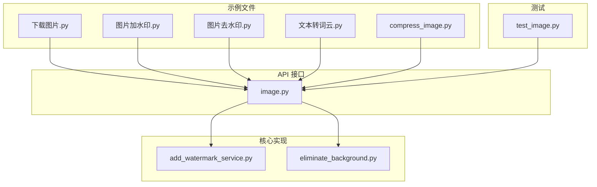
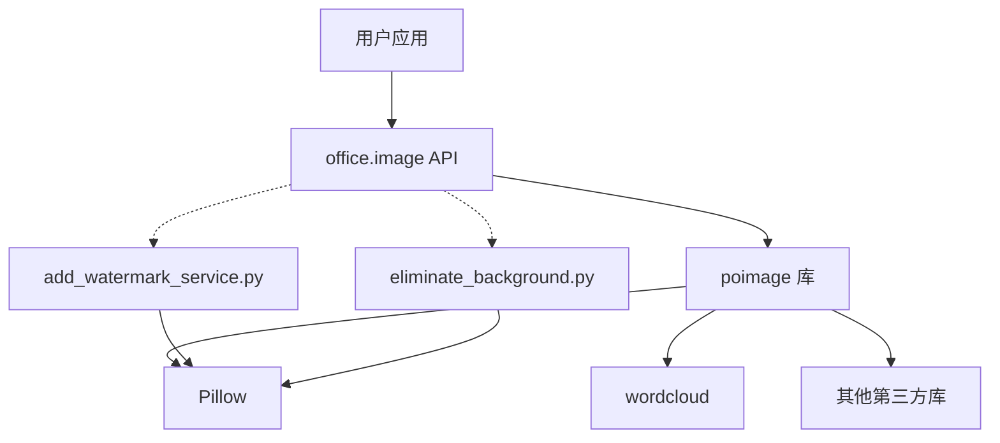
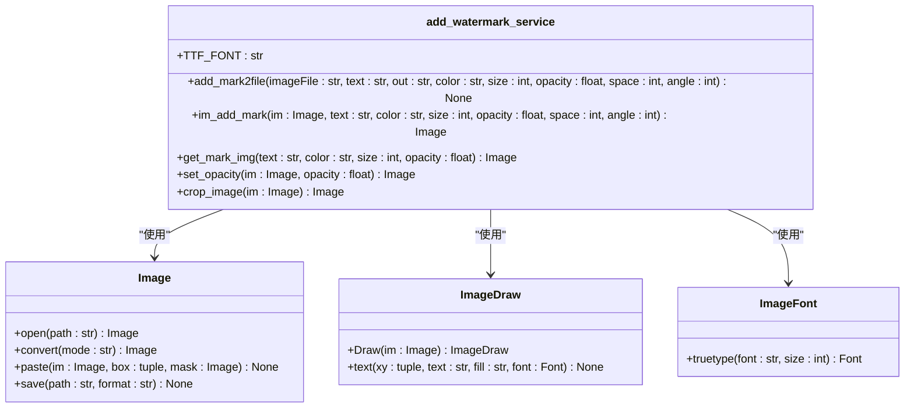
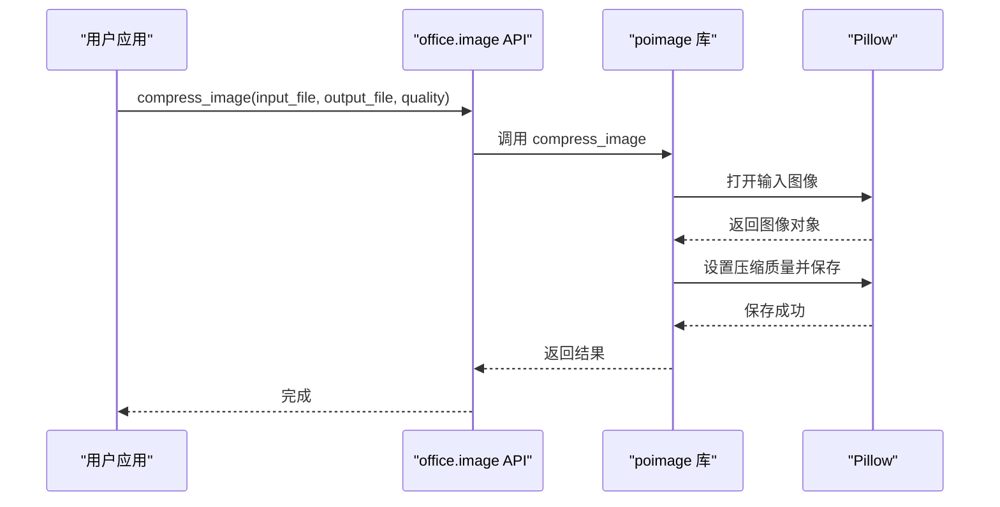
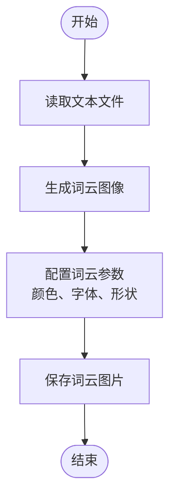
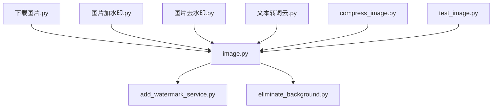

# 图像处理示例

<cite>
**本文档中引用的文件**  
- [下载图片.py](file://examples/poimage/下载图片.py)
- [图片加水印.py](file://examples/poimage/图片加水印.py)
- [图片去水印.py](file://examples/poimage/图片去水印.py)
- [文本转词云.py](file://examples/poimage/文本转词云.py)
- [compress_image.py](file://examples/poimage_demo/compress_image.py)
- [image.py](file://office/api/image.py)
- [add_watermark_service.py](file://office/lib/image/add_watermark_service.py)
- [eliminate_background.py](file://office/lib/image/eliminate_background.py)
- [test_image.py](file://tests/test_code/test_image.py)
- [数据可视化-文章转图云.py](file://examples/pydatav/数据可视化-文章转图云.py)
</cite>

## 目录
1. [简介](#简介)
2. [项目结构](#项目结构)
3. [核心功能组件](#核心功能组件)
4. [系统架构概览](#系统架构概览)
5. [详细组件分析](#详细组件分析)
6. [依赖关系分析](#依赖关系分析)
7. [性能优化建议](#性能优化建议)
8. [故障排查指南](#故障排查指南)
9. [结论](#结论)

## 简介
本文档系统化介绍了 `python-office` 项目中的图像处理功能，涵盖图片下载、加/去水印、压缩和词云生成等常见需求。文档详细说明了 Pillow、wordcloud 等库的集成方式，解释了如何调整水印透明度、位置和大小，以及词云的字体、颜色和形状配置。同时提供了批量处理图片的性能优化建议，并演示了如何结合 OCR 或 NLP 预处理生成高质量词云。文档还包含了处理不同图像格式（JPEG、PNG）的兼容性说明。

## 项目结构
`python-office` 项目的图像处理功能主要分布在 `examples/poimage` 和 `office/api/image.py` 模块中。核心功能通过 `poimage` 库实现，并通过 `office` 包装器提供统一的 API 接口。测试文件位于 `tests/test_code/test_image.py`，确保各项功能的正确性。

**图示来源**  
- [下载图片.py](file://examples/poimage/下载图片.py)
- [图片加水印.py](file://examples/poimage/图片加水印.py)
- [图片去水印.py](file://examples/poimage/图片去水印.py)
- [文本转词云.py](file://examples/poimage/文本转词云.py)
- [compress_image.py](file://examples/poimage_demo/compress_image.py)
- [image.py](file://office/api/image.py)
- [add_watermark_service.py](file://office/lib/image/add_watermark_service.py)
- [eliminate_background.py](file://office/lib/image/eliminate_background.py)
- [test_image.py](file://tests/test_code/test_image.py)

**本节来源**  
- [examples/poimage](file://examples/poimage)
- [office/api/image.py](file://office/api/image.py)
- [office/lib/image](file://office/lib/image)
- [tests/test_code/test_image.py](file://tests/test_code/test_image.py)

## 核心功能组件
本项目提供了完整的图像处理解决方案，包括图片下载、加/去水印、压缩和词云生成等核心功能。所有功能通过简洁的 API 调用实现，用户无需深入了解底层实现细节即可快速集成到自己的应用中。

**本节来源**  
- [image.py](file://office/api/image.py#L1-L153)
- [下载图片.py](file://examples/poimage/下载图片.py#L1-L37)
- [图片加水印.py](file://examples/poimage/图片加水印.py#L1-L25)

## 系统架构概览
`python-office` 的图像处理模块采用分层架构设计，上层提供简洁的 API 接口，中层进行功能调度，底层实现具体的图像处理算法。这种设计模式提高了代码的可维护性和可扩展性。

**图示来源**  
- [image.py](file://office/api/image.py#L1-L153)
- [add_watermark_service.py](file://office/lib/image/add_watermark_service.py#L1-L140)
- [eliminate_background.py](file://office/lib/image/eliminate_background.py#L1-L72)

## 详细组件分析

### 图片下载功能分析
`down4img` 函数提供了从网络下载图片的功能，支持自定义输出路径、文件名和类型。该功能通过调用 `poimage.down4img` 实现，封装了网络请求和文件保存的复杂性。

**本节来源**  
- [下载图片.py](file://examples/poimage/下载图片.py#L1-L37)
- [image.py](file://office/api/image.py#L76-L92)

### 加水印功能分析
加水印功能允许用户为图片添加文字水印，支持自定义水印内容、颜色、大小、透明度、间距和角度。核心实现位于 `add_watermark_service.py` 文件中，使用 Pillow 库进行图像处理。

#### 类图

**图示来源**  
- [add_watermark_service.py](file://office/lib/image/add_watermark_service.py#L1-L140)
- [Pillow 文档](https://pillow.readthedocs.io/)

**本节来源**  
- [图片加水印.py](file://examples/poimage/图片加水印.py#L1-L25)
- [image.py](file://office/api/image.py#L35-L53)
- [add_watermark_service.py](file://office/lib/image/add_watermark_service.py#L1-L140)

### 去水印功能分析
去水印功能通过 `del_watermark` 函数实现，能够从图片中移除水印并保存处理后的图片。该功能同样基于 Pillow 库，通过图像像素操作实现水印去除。

**本节来源**  
- [图片去水印.py](file://examples/poimage/图片去水印.py#L1-L12)
- [image.py](file://office/api/image.py#L140-L152)

### 图像压缩功能分析
图像压缩功能通过 `compress_image` 函数实现，允许用户调整图片质量和文件大小。该功能通过控制 JPEG 压缩质量参数来平衡图像质量和文件体积。

#### 序列图

**图示来源**  
- [compress_image.py](file://examples/poimage_demo/compress_image.py#L1-L8)
- [image.py](file://office/api/image.py#L5-L17)

**本节来源**  
- [compress_image.py](file://examples/poimage_demo/compress_image.py#L1-L8)
- [image.py](file://office/api/image.py#L5-L17)

### 词云生成功能分析
词云生成功能通过 `txt2wordcloud` 函数实现，能够将文本文件转换为可视化词云图片。该功能基于 wordcloud 库，支持自定义背景颜色和输出文件名。

#### 流程图

**图示来源**  
- [文本转词云.py](file://examples/poimage/文本转词云.py#L1-L15)
- [数据可视化-文章转图云.py](file://examples/pydatav/数据可视化-文章转图云.py#L1-L10)

**本节来源**  
- [文本转词云.py](file://examples/poimage/文本转词云.py#L1-L15)
- [image.py](file://office/api/image.py#L94-L107)
- [数据可视化-文章转图云.py](file://examples/pydatav/数据可视化-文章转图云.py#L1-L10)

## 依赖关系分析
图像处理模块的依赖关系清晰，上层 API 依赖于底层实现模块，测试模块依赖于 API 接口。这种依赖结构确保了代码的模块化和可测试性。

**图示来源**  
- [image.py](file://office/api/image.py#L1-L153)
- [add_watermark_service.py](file://office/lib/image/add_watermark_service.py#L1-L140)
- [eliminate_background.py](file://office/lib/image/eliminate_background.py#L1-L72)
- [test_image.py](file://tests/test_code/test_image.py#L1-L44)

**本节来源**  
- [image.py](file://office/api/image.py#L1-L153)
- [add_watermark_service.py](file://office/lib/image/add_watermark_service.py#L1-L140)
- [eliminate_background.py](file://office/lib/image/eliminate_background.py#L1-L72)
- [test_image.py](file://tests/test_code/test_image.py#L1-L44)

## 性能优化建议
1. **批量处理**：对于大量图片的处理任务，建议使用循环或并发处理，避免单个文件处理的开销。
2. **内存管理**：处理大尺寸图片时，注意及时释放图像对象，避免内存泄漏。
3. **缓存机制**：对于重复处理的图片，可以考虑使用缓存机制，避免重复计算。
4. **并行处理**：利用多核 CPU 的优势，对独立的图片处理任务进行并行化。
5. **参数优化**：根据实际需求调整压缩质量、水印参数等，平衡效果和性能。

**本节来源**  
- [image.py](file://office/api/image.py#L1-L153)
- [add_watermark_service.py](file://office/lib/image/add_watermark_service.py#L1-L140)

## 故障排查指南
1. **路径问题**：确保输入和输出路径正确，特别是路径中包含中文字符时可能会出现问题。
2. **依赖缺失**：确认 Pillow、wordcloud 等依赖库已正确安装。
3. **文件格式**：检查输入文件格式是否支持，JPEG 和 PNG 格式通常兼容性最好。
4. **权限问题**：确保程序有读写指定目录的权限。
5. **内存不足**：处理大尺寸图片时可能出现内存不足错误，建议分块处理或降低图片尺寸。

**本节来源**  
- [test_image.py](file://tests/test_code/test_image.py#L1-L44)
- [image.py](file://office/api/image.py#L1-L153)

## 结论
`python-office` 项目提供了全面且易用的图像处理功能，涵盖了从基础的图片下载到高级的词云生成等多种需求。通过清晰的 API 设计和模块化的代码结构，用户可以快速集成这些功能到自己的应用中。项目还提供了完善的测试用例，确保了功能的稳定性和可靠性。对于需要处理图像的 Python 开发者来说，这是一个非常有价值的工具库。