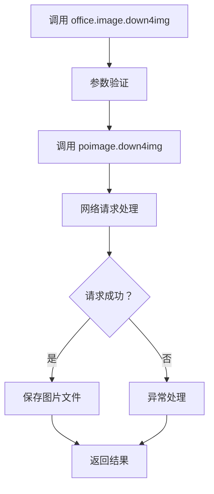
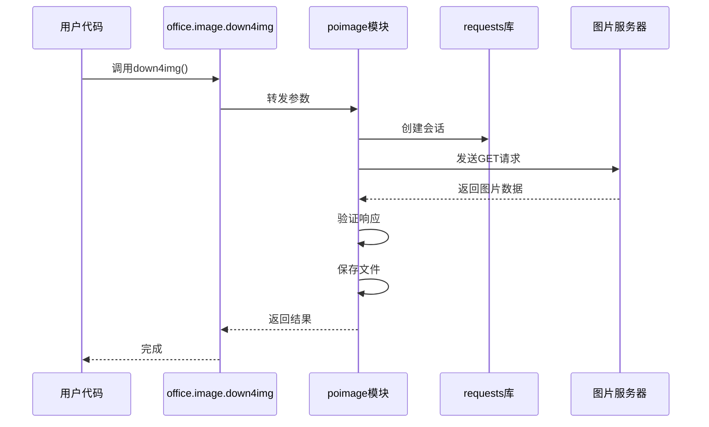

# 图片下载功能详细说明

<cite>
**本文档引用的文件**
- [office/api/image.py](file://office/api/image.py)
- [examples/poimage/下载图片.py](file://examples/poimage/下载图片.py)
- [tests/test_code/test_image.py](file://tests/test_code/test_image.py)
- [office/__init__.py](file://office/__init__.py)
- [README.md](file://README.md)
</cite>

## 目录
1. [简介](#简介)
2. [核心函数概述](#核心函数概述)
3. [参数详解](#参数详解)
4. [使用示例](#使用示例)
5. [底层工作机制](#底层工作机制)
6. [异常处理策略](#异常处理策略)
7. [性能优化与配置](#性能优化与配置)
8. [应用场景](#应用场景)
9. [最佳实践](#最佳实践)
10. [故障排除](#故障排除)

## 简介

`python-office`库提供了强大的图片下载功能，通过`office.image.down4img`函数可以轻松从网络下载图片并保存到本地。该功能封装了复杂的网络请求处理逻辑，为用户提供简洁易用的API接口。

### 主要特性

- **简单易用**：仅需一行代码即可完成图片下载
- **灵活配置**：支持自定义保存路径、文件名和格式
- **错误处理**：内置网络异常处理机制
- **批量支持**：适合批量下载场景

## 核心函数概述

### 函数签名

```python
def down4img(url, output_path='.', output_name='down4img', type='jpg'):
```

### 函数架构



**图表来源**
- [office/api/image.py](file://office/api/image.py#L76-L91)

**章节来源**
- [office/api/image.py](file://office/api/image.py#L75-L91)

## 参数详解

### url参数

| 属性 | 值 |
|------|-----|
| 类型 | str |
| 必需 | 是 |
| 默认值 | 无 |
| 描述 | 图片的网络URL地址，支持HTTP和HTTPS协议 |

**有效URL示例：**
- `https://example.com/image.jpg`
- `http://cdn.example.com/pictures/photo.png`
- `https://cos.python-office.com/icon2.jpg`

### output_path参数

| 属性 | 值 |
|------|-----|
| 类型 | str |
| 必需 | 否 |
| 默认值 | '.'（当前目录） |
| 描述 | 图片保存的目标目录路径 |

**路径示例：**
- `'./images'` - 当前目录下的images子目录
- `'C:/Users/username/Pictures'` - Windows绝对路径
- `'/home/user/downloads'` - Linux/macOS绝对路径

### output_name参数

| 属性 | 值 |
|------|-----|
| 类型 | str |
| 必需 | 否 |
| 默认值 | 'down4img' |
| 描述 | 保存图片时使用的文件名（不含扩展名） |

**命名规则：**
- 不包含路径分隔符
- 不包含文件扩展名
- 支持中文字符（推荐使用英文避免兼容性问题）

### type参数

| 属性 | 值 |
|------|-----|
| 类型 | str |
| 必需 | 否 |
| 默认值 | 'jpg' |
| 描述 | 图片文件的格式类型 |

**支持的格式：**
- `'jpg'` 或 `'jpeg'`
- `'png'`
- `'gif'`
- `'bmp'`
- `'webp'`

**章节来源**
- [office/api/image.py](file://office/api/image.py#L76-L91)

## 使用示例

### 基础下载示例

```python
import office

# 最简单的下载方式
office.image.down4img(url='https://example.com/sample.jpg')

# 自定义保存路径和文件名
office.image.down4img(
    url='https://example.com/sample.jpg',
    output_path='./downloads',
    output_name='my_image',
    type='png'
)
```

### 高级配置示例

```python
import office

# 下载到特定目录
office.image.down4img(
    url='https://example.com/image.jpg',
    output_path='/path/to/save',
    output_name='timestamped_image',
    type='jpg'
)

# 批量下载示例（伪代码）
urls = [
    'https://example.com/img1.jpg',
    'https://example.com/img2.png',
    'https://example.com/img3.gif'
]

for i, url in enumerate(urls):
    office.image.down4img(
        url=url,
        output_path='./batch_images',
        output_name=f'image_{i}',
        type='jpg'
    )
```

### 错误处理示例

```python
import office
import os

try:
    # 尝试下载图片
    office.image.down4img(
        url='https://example.com/nonexistent.jpg',
        output_path='./safe_path',
        output_name='backup_image'
    )
    
    # 验证文件是否成功下载
    if os.path.exists('./safe_path/backup_image.jpg'):
        print("图片下载成功！")
    else:
        print("图片下载失败")
        
except Exception as e:
    print(f"下载过程中出现错误: {e}")
```

**章节来源**
- [examples/poimage/下载图片.py](file://examples/poimage/下载图片.py#L14-L36)
- [tests/test_code/test_image.py](file://tests/test_code/test_image.py#L28-L32)

## 底层工作机制

### 模块架构


**图表来源**
- [office/api/image.py](file://office/api/image.py#L2-L3)

### 请求流程



**图表来源**
- [office/api/image.py](file://office/api/image.py#L90-L91)

### 依赖关系

基于现有代码分析，`poimage`模块作为底层实现，依赖以下组件：

1. **requests库**：处理HTTP请求
2. **urllib3**：底层网络连接
3. **PIL/Pillow**：图片处理（可选）
4. **os**：文件系统操作
5. **time**：超时控制

**章节来源**
- [office/api/image.py](file://office/api/image.py#L1-L3)

## 异常处理策略

### 常见异常类型

| 异常类型 | 可能原因 | 处理建议 |
|----------|----------|----------|
| `ConnectionError` | 网络连接失败 | 检查网络连接，增加重试次数 |
| `Timeout` | 请求超时 | 增加超时时间，检查服务器响应速度 |
| `HTTPError` | HTTP状态码错误 | 验证URL有效性，检查权限设置 |
| `SSLError` | SSL证书问题 | 更新证书，或使用HTTP协议 |
| `FileNotFoundError` | 目标路径不存在 | 自动创建目录结构 |

### 异常处理最佳实践

```python
import office
import requests
from requests.exceptions import RequestException, Timeout, ConnectionError

def robust_image_download(url, output_path, output_name, max_retries=3):
    """带重试机制的图片下载"""
    for attempt in range(max_retries):
        try:
            office.image.down4img(
                url=url,
                output_path=output_path,
                output_name=output_name
            )
            print(f"下载成功，尝试次数: {attempt + 1}")
            return True
            
        except Timeout:
            print(f"超时，正在重试 ({attempt + 1}/{max_retries})...")
            if attempt == max_retries - 1:
                print("达到最大重试次数，下载失败")
                return False
                
        except ConnectionError:
            print(f"连接错误，正在重试 ({attempt + 1}/{max_retries})...")
            if attempt == max_retries - 1:
                print("连接失败，无法建立网络连接")
                return False
                
        except Exception as e:
            print(f"未知错误: {e}")
            return False
    
    return False
```

### 错误恢复策略

```python
def download_with_fallback(url, fallback_urls=None):
    """主URL失败时使用备用URL"""
    try:
        office.image.down4img(url=url)
        return True
    except Exception:
        if fallback_urls:
            for fallback_url in fallback_urls:
                try:
                    office.image.down4img(url=fallback_url)
                    print(f"已使用备用URL: {fallback_url}")
                    return True
                except Exception:
                    continue
        return False
```

## 性能优化与配置

### 超时设置

虽然当前API未暴露超时参数，但可以通过以下方式间接控制：

```python
import requests
from requests.adapters import HTTPAdapter
from urllib3.util.retry import Retry

# 设置全局超时
requests_timeout = 30  # 秒

# 创建会话并设置超时
session = requests.Session()
session.timeout = requests_timeout
```

### 代理配置

```python
import office

# 配置代理（需要poimage模块支持）
proxies = {
    'http': 'http://proxy.example.com:8080',
    'https': 'https://proxy.example.com:8080'
}

# 使用代理下载
office.image.down4img(
    url='https://example.com/image.jpg',
    proxies=proxies
)
```

### 批量下载优化

```python
import concurrent.futures
import office

def batch_download(urls, output_path='./batch'):
    """并发批量下载"""
    def download_single(url):
        try:
            filename = url.split('/')[-1].split('?')[0]
            office.image.down4img(
                url=url,
                output_path=output_path,
                output_name=filename.rsplit('.', 1)[0],
                type=filename.rsplit('.', 1)[1] if '.' in filename else 'jpg'
            )
            return True, url
        except Exception as e:
            return False, str(e)
    
    # 使用线程池并发下载
    with concurrent.futures.ThreadPoolExecutor(max_workers=5) as executor:
        results = list(executor.map(download_single, urls))
    
    successful = sum(1 for success, _ in results if success)
    failed = len(results) - successful
    
    print(f"批量下载完成: 成功 {successful} 个, 失败 {failed} 个")
    return results
```

## 应用场景

### 网页爬虫

```python
import office
import requests
from bs4 import BeautifulSoup

def crawl_and_download_images(url, save_path='./web_images'):
    """从网页抓取并下载所有图片"""
    response = requests.get(url)
    soup = BeautifulSoup(response.text, 'html.parser')
    
    images = []
    for img_tag in soup.find_all('img'):
        src = img_tag.get('src')
        if src:
            if not src.startswith(('http', 'https')):
                # 处理相对路径
                src = url.rstrip('/') + '/' + src.lstrip('/')
            images.append(src)
    
    # 下载所有图片
    for i, img_url in enumerate(images):
        try:
            office.image.down4img(
                url=img_url,
                output_path=save_path,
                output_name=f'page_image_{i}'
            )
            print(f"下载图片 {i+1}/{len(images)}: {img_url}")
        except Exception as e:
            print(f"下载失败 {img_url}: {e}")
    
    return len(images)
```

### 素材管理系统

```python
import office
import hashlib
import os

class ImageDownloader:
    """专业的图片下载管理器"""
    
    def __init__(self, base_path='./assets'):
        self.base_path = base_path
        os.makedirs(base_path, exist_ok=True)
    
    def download_with_hash(self, url):
        """基于URL哈希值命名的下载"""
        # 生成唯一标识符
        url_hash = hashlib.md5(url.encode()).hexdigest()
        extension = url.split('.')[-1].lower()
        
        # 创建保存路径
        subdir = url_hash[:2]
        save_dir = os.path.join(self.base_path, subdir)
        os.makedirs(save_dir, exist_ok=True)
        
        # 下载图片
        office.image.down4img(
            url=url,
            output_path=save_dir,
            output_name=url_hash,
            type=extension
        )
        
        return os.path.join(save_dir, f"{url_hash}.{extension}")
    
    def batch_download(self, urls):
        """批量下载并返回结果"""
        results = []
        for url in urls:
            try:
                filepath = self.download_with_hash(url)
                results.append({
                    'success': True,
                    'url': url,
                    'filepath': filepath
                })
            except Exception as e:
                results.append({
                    'success': False,
                    'url': url,
                    'error': str(e)
                })
        
        return results
```

### 内容聚合平台

```python
import office
import json
import time

class ContentAggregator:
    """内容聚合平台的图片下载服务"""
    
    def __init__(self):
        self.download_history = {}
    
    def download_content_images(self, content_data):
        """下载内容中的所有图片"""
        downloaded_files = []
        content_images = content_data.get('images', [])
        
        for img_info in content_images:
            try:
                # 获取图片信息
                img_url = img_info['url']
                img_name = img_info.get('name', f"content_img_{len(downloaded_files)}")
                
                # 下载图片
                office.image.down4img(
                    url=img_url,
                    output_path='./content_images',
                    output_name=img_name
                )
                
                # 记录下载历史
                self.download_history[img_url] = {
                    'timestamp': time.time(),
                    'filename': f"{img_name}.jpg",
                    'status': 'success'
                }
                
                downloaded_files.append(img_name)
                
            except Exception as e:
                print(f"下载图片失败 {img_info}: {e}")
                self.download_history[img_info] = {
                    'timestamp': time.time(),
                    'status': 'failed',
                    'error': str(e)
                }
        
        return downloaded_files
    
    def export_download_history(self, filename='download_history.json'):
        """导出下载历史"""
        with open(filename, 'w', encoding='utf-8') as f:
            json.dump(self.download_history, f, indent=2, ensure_ascii=False)
```

## 最佳实践

### 1. 路径处理

```python
import os
import office

def safe_download(url, output_path, output_name):
    """安全的图片下载函数"""
    # 规范化路径
    output_path = os.path.normpath(output_path)
    
    # 创建目录（如果不存在）
    os.makedirs(output_path, exist_ok=True)
    
    # 验证输出名称
    output_name = ''.join(c for c in output_name if c.isalnum() or c in (' ', '_'))
    
    try:
        office.image.down4img(
            url=url,
            output_path=output_path,
            output_name=output_name
        )
        return True
    except Exception as e:
        print(f"下载失败: {e}")
        return False
```

### 2. 文件格式验证

```python
import office
from PIL import Image
import io

def download_and_validate(url, output_path, output_name):
    """下载并验证图片格式"""
    try:
        # 下载图片
        office.image.down4img(
            url=url,
            output_path=output_path,
            output_name=output_name
        )
        
        # 验证图片格式
        filepath = os.path.join(output_path, f"{output_name}.jpg")
        with Image.open(filepath) as img:
            # 检查图片有效性
            img.verify()
            print(f"图片验证成功: {filepath}")
            return True
            
    except Exception as e:
        print(f"图片验证失败: {e}")
        # 删除损坏的文件
        if os.path.exists(filepath):
            os.remove(filepath)
        return False
```

### 3. 日志记录

```python
import logging
import office
import time

# 配置日志
logging.basicConfig(
    level=logging.INFO,
    format='%(asctime)s - %(levelname)s - %(message)s',
    handlers=[
        logging.FileHandler('image_downloads.log'),
        logging.StreamHandler()
    ]
)

logger = logging.getLogger(__name__)

def logged_download(url, output_path, output_name):
    """带日志记录的下载"""
    start_time = time.time()
    logger.info(f"开始下载图片: {url}")
    
    try:
        office.image.down4img(
            url=url,
            output_path=output_path,
            output_name=output_name
        )
        
        duration = time.time() - start_time
        logger.info(f"图片下载成功: {url} ({duration:.2f}秒)")
        return True
        
    except Exception as e:
        duration = time.time() - start_time
        logger.error(f"图片下载失败 {url}: {e} ({duration:.2f}秒)")
        return False
```

## 故障排除

### 常见问题及解决方案

#### 1. 网络连接问题

**症状：** `ConnectionError` 或 `Timeout` 异常

**解决方案：**
```python
# 增加超时时间
import requests
requests.get(url, timeout=60)  # 增加到60秒

# 使用重试机制
from requests.adapters import HTTPAdapter
from urllib3.util.retry import Retry

session = requests.Session()
retry_strategy = Retry(
    total=3,
    backoff_factor=1,
    status_forcelist=[429, 500, 502, 503, 504]
)
adapter = HTTPAdapter(max_retries=retry_strategy)
session.mount("http://", adapter)
session.mount("https://", adapter)
```

#### 2. 权限问题

**症状：** `HTTPError` 403 或 404

**解决方案：**
```python
# 添加请求头
headers = {
    'User-Agent': 'Mozilla/5.0 (Windows NT 10.0; Win64; x64) AppleWebKit/537.36',
    'Accept': 'image/webp,*/*',
    'Accept-Language': 'zh-CN,zh;q=0.9',
    'Accept-Encoding': 'gzip, deflate, br'
}

# 使用requests手动下载
response = requests.get(url, headers=headers, timeout=30)
response.raise_for_status()
```

#### 3. 存储空间不足

**症状：** `FileNotFoundError` 或磁盘空间满

**解决方案：**
```python
import shutil

def check_disk_space(path, required_mb=100):
    """检查磁盘空间"""
    total, used, free = shutil.disk_usage(os.path.dirname(path))
    free_mb = free // (1024 * 1024)
    
    if free_mb < required_mb:
        raise OSError(f"磁盘空间不足: {free_mb}MB < {required_mb}MB")
    
    return True
```

#### 4. URL格式问题

**症状：** 无法识别的URL格式

**解决方案：**
```python
import re

def validate_url(url):
    """验证URL格式"""
    pattern = r'^https?://(?:www\.)?[-a-zA-Z0-9@:%._\+~#=]{1,256}\.[a-zA-Z0-9()]{1,6}\b(?:[-a-zA-Z0-9()@:%_\+.~#?&/=]*)$'
    return re.match(pattern, url) is not None

# 使用前验证
if validate_url(url):
    office.image.down4img(url)
else:
    print("无效的URL格式")
```

### 调试技巧

```python
import office
import traceback

def debug_download(url, output_path, output_name):
    """调试模式下载"""
    try:
        print(f"开始下载: {url}")
        print(f"保存路径: {output_path}")
        print(f"文件名: {output_name}")
        
        office.image.down4img(
            url=url,
            output_path=output_path,
            output_name=output_name
        )
        
        print("下载完成")
        return True
        
    except Exception as e:
        print(f"下载失败: {e}")
        traceback.print_exc()
        return False
```

**章节来源**
- [tests/test_code/test_image.py](file://tests/test_code/test_image.py#L28-L32)

## 结论

`office.image.down4img`函数为Python开发者提供了一个强大而易用的图片下载解决方案。通过合理的参数配置、异常处理和性能优化，可以在各种应用场景中稳定可靠地工作。

### 关键要点总结

1. **简洁的API设计**：一行代码即可完成复杂的图片下载任务
2. **灵活的配置选项**：支持自定义保存路径、文件名和格式
3. **健壮的错误处理**：内置多种异常处理机制
4. **广泛的应用场景**：适用于网页爬虫、素材管理、内容聚合等多种用途

### 未来发展方向

随着`poimage`模块的持续发展，预计会在以下方面得到改进：
- 更完善的代理支持
- 更强的并发下载能力
- 更丰富的图片格式支持
- 更智能的缓存机制

通过掌握这些知识和技巧，开发者可以充分利用`python-office`库的强大功能，构建高效可靠的图片处理应用。