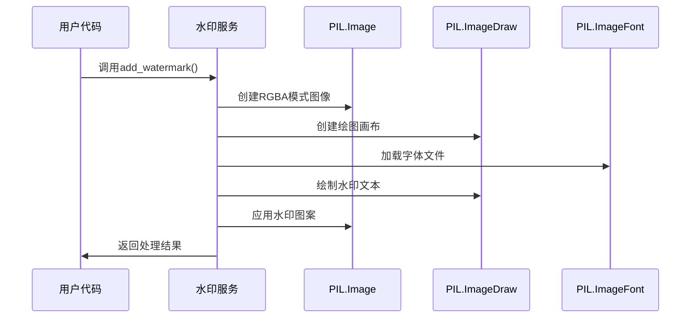

# 图片加水印功能详解

<cite>
**本文档引用的文件**
- [office/api/image.py](file://office/api/image.py)
- [office/lib/image/add_watermark_service.py](file://office/lib/image/add_watermark_service.py)
- [examples/poimage/图片加水印.py](file://examples/poimage/图片加水印.py)
- [tests/test_code/test_image.py](file://tests/test_code/test_image.py)
</cite>

## 目录
1. [简介](#简介)
2. [核心接口概述](#核心接口概述)
3. [参数配置详解](#参数配置详解)
4. [技术实现原理](#技术实现原理)
5. [默认设置与可扩展性](#默认设置与可扩展性)
6. [进阶应用示例](#进阶应用示例)
7. [中文乱码解决方案](#中文乱码解决方案)
8. [实际应用场景](#实际应用场景)
9. [故障排除指南](#故障排除指南)
10. [总结](#总结)

## 简介

`office.image.add_watermark` 是 Python-office 库提供的强大图片水印功能，基于 Pillow 库的图像绘制机制，能够为图片添加透明、可定制的水印效果。该功能广泛应用于版权保护、品牌标识和内容安全等领域。

## 核心接口概述

### 主要函数签名

```python
def add_watermark(file, mark, output_path='./', color="#eaeaea", size=30, opacity=0.35, space=200, angle=30):
```

### 接口架构图


**图表来源**
- [office/api/image.py](file://office/api/image.py#L35-L52)
- [office/lib/image/add_watermark_service.py](file://office/lib/image/add_watermark_service.py#L1-L140)

**章节来源**
- [office/api/image.py](file://office/api/image.py#L35-L52)

## 参数配置详解

### 必需参数

| 参数名 | 类型 | 描述 | 示例值 |
|--------|------|------|--------|
| `file` | str | 输入图片文件路径 | `'./images/photo.jpg'` |
| `mark` | str | 水印文本内容 | `'版权所有 © 2024'` |

### 可选参数

| 参数名 | 类型 | 默认值 | 取值范围 | 描述 |
|--------|------|--------|----------|------|
| `output_path` | str | `'./'` | 任意有效路径 | 输出文件保存目录 |
| `color` | str | `"#eaeaea"` | 十六进制颜色码 | 水印文字颜色 |
| `size` | int | 30 | 10-100 | 水印字体大小（像素） |
| `opacity` | float | 0.35 | 0.01-1.0 | 水印透明度 |
| `space` | int | 200 | 50-500 | 水印间距（像素） |
| `angle` | int | 30 | -180到180 | 水印旋转角度（度） |

### 参数配置流程图


**图表来源**
- [office/lib/image/add_watermark_service.py](file://office/lib/image/add_watermark_service.py#L114-L139)

**章节来源**
- [office/api/image.py](file://office/api/image.py#L35-L52)

## 技术实现原理

### Pillow库图像绘制机制

该功能基于 Pillow 库的核心组件实现：

#### 1. 图像创建与绘制


**图表来源**
- [office/lib/image/add_watermark_service.py](file://office/lib/image/add_watermark_service.py#L47-L71)

#### 2. 透明度处理机制


**图表来源**
- [office/lib/image/add_watermark_service.py](file://office/lib/image/add_watermark_service.py#L30-L44)

#### 3. 水印图案生成算法

水印图案采用重复平铺的方式生成：


**图表来源**
- [office/lib/image/add_watermark_service.py](file://office/lib/image/add_watermark_service.py#L74-L111)

**章节来源**
- [office/lib/image/add_watermark_service.py](file://office/lib/image/add_watermark_service.py#L1-L140)

## 默认设置与可扩展性

### 默认配置表

| 参数类别 | 参数名 | 默认值 | 设计考虑 |
|----------|--------|--------|----------|
| **外观设置** | color | "#eaeaea" | 浅灰色，不易干扰原图 |
| | size | 30 | 中等尺寸，兼顾可见性和美观 |
| | opacity | 0.35 | 适中透明度，不影响图片质量 |
| **布局设置** | space | 200 | 合理间距，避免过于密集 |
| | angle | 30 | 斜向排列，增加视觉美感 |
| **兼容性** | font | msyh.ttc | 支持中文显示 |

### 可扩展性设计

#### 1. 字体文件扩展
系统支持多种字体文件，可通过修改 `TTF_FONT` 常量实现：

```python
# 当前字体路径
TTF_FONT = os.path.dirname(__file__) + "/font/msyh.ttc"

# 可替换为其他字体
TTF_FONT = "/path/to/custom/font.ttf"
```

#### 2. 颜色方案扩展
支持十六进制颜色码和RGB元组：

```python
# 十六进制颜色
color = "#ff0000"  # 红色

# RGB元组（需要转换）
color = (255, 0, 0)  # 红色
```

#### 3. 透明度控制扩展
透明度范围严格控制在0.01-1.0之间，确保视觉效果：

```python
# 低透明度（几乎不可见）
opacity = 0.05

# 高透明度（明显可见）
opacity = 0.8
```

**章节来源**
- [office/lib/image/add_watermark_service.py](file://office/lib/image/add_watermark_service.py#L10-L11)
- [office/lib/image/add_watermark_service.py](file://office/lib/image/add_watermark_service.py#L30-L44)

## 进阶应用示例

### 示例1：批量添加水印

```python
import os
from office import image

def batch_add_watermark(directory, watermark_text):
    """批量添加水印到指定目录的所有图片"""
    # 遍历目录中的所有文件
    for filename in os.listdir(directory):
        file_path = os.path.join(directory, filename)
        
        # 检查是否为图片文件
        if os.path.isfile(file_path) and filename.lower().endswith(('.jpg', '.jpeg', '.png')):
            try:
                # 添加水印
                image.add_watermark(
                    file=file_path,
                    mark=watermark_text,
                    output_path=f"./watermarked_{directory}",
                    color="#888888",
                    size=40,
                    opacity=0.4,
                    space=150,
                    angle=45
                )
                print(f"已处理: {filename}")
            except Exception as e:
                print(f"处理 {filename} 时出错: {e}")

# 使用示例
batch_add_watermark("./original_images", "Sample Watermark")
```

### 示例2：动态水印配置

```python
def create_dynamic_watermark_config(image_path, user_info):
    """根据用户信息动态生成水印配置"""
    configs = [
        {
            "text": f"© {user_info['company']} {user_info['date']}",
            "color": "#ff6b6b",
            "size": 35,
            "opacity": 0.5,
            "angle": 30
        },
        {
            "text": f"用户ID: {user_info['id']}",
            "color": "#4ecdc4",
            "size": 25,
            "opacity": 0.3,
            "angle": -30
        }
    ]
    
    for i, config in enumerate(configs):
        output_path = f"./dynamic_watermarks/{user_info['id']}_part{i+1}.jpg"
        image.add_watermark(
            file=image_path,
            mark=config["text"],
            output_path=output_path,
            color=config["color"],
            size=config["size"],
            opacity=config["opacity"],
            space=180,
            angle=config["angle"]
        )

# 使用示例
user_data = {
    "company": "TechCorp",
    "id": "USR123456",
    "date": "2024"
}
create_dynamic_watermark_config("original.jpg", user_data)
```

### 示例3：水印倾斜角度调节

```python
def add_tilted_watermark(image_path, text, tilt_angle):
    """添加倾斜角度可调的水印"""
    # 根据倾斜角度调整间距和透明度
    if abs(tilt_angle) > 45:
        space_adjustment = 0.7
        opacity_adjustment = 0.6
    else:
        space_adjustment = 1.0
        opacity_adjustment = 0.8
    
    image.add_watermark(
        file=image_path,
        mark=text,
        color="#3498db",
        size=32,
        opacity=0.8 * opacity_adjustment,
        space=int(200 * space_adjustment),
        angle=tilt_angle
    )
```

**章节来源**
- [examples/poimage/图片加水印.py](file://examples/poimage/图片加水印.py#L1-L25)

## 中文乱码解决方案

### 问题描述
在处理中文字符时，可能会出现乱码现象，主要原因是缺少合适的中文字体支持。

### 解决方案

#### 1. 使用内置中文字体

系统默认使用微软雅黑字体 (`msyh.ttc`)，这是Windows系统自带的中文字体：

```python
# 默认字体路径
TTF_FONT = os.path.dirname(__file__) + "/font/msyh.ttc"
```

#### 2. 替换为其他中文字体

如果需要使用其他中文字体，可以替换字体文件：

```python
# 替换为思源黑体
TTF_FONT = "/usr/share/fonts/opentype/noto/NotoSansCJK-Regular.ttc"

# 或者使用系统字体
TTF_FONT = "/Library/Fonts/PingFang.ttc"  # macOS
TTF_FONT = "C:/Windows/Fonts/simhei.ttf"  # Windows 黑体
```

#### 3. 字体文件检测机制


**图表来源**
- [office/lib/image/add_watermark_service.py](file://office/lib/image/add_watermark_service.py#L10-L11)

#### 4. 兼容性处理

对于Linux系统，建议安装中文字体包：

```bash
# Ubuntu/Debian
sudo apt-get install fonts-noto-cjk

# CentOS/RHEL
sudo yum install google-noto-sans-cjk-fonts

# macOS
brew tap homebrew/cask-fonts
brew install --cask font-noto-sans-cjk
```

**章节来源**
- [office/lib/image/add_watermark_service.py](file://office/lib/image/add_watermark_service.py#L10-L11)

## 实际应用场景

### 版权保护场景

#### 场景1：摄影作品版权保护
```python
def protect_photography(image_path, photographer_name):
    """为摄影作品添加版权水印"""
    watermark_text = f"© {photographer_name} {datetime.now().year}"
    
    image.add_watermark(
        file=image_path,
        mark=watermark_text,
        output_path="./protected_photos",
        color="#ffffff",  # 白色
        size=28,
        opacity=0.7,
        space=150,
        angle=0  # 水平排列
    )
```

#### 场景2：企业品牌标识
```python
def brand_watermark(image_path, company_logo, brand_colors):
    """添加企业品牌水印"""
    watermarks = [
        {
            "text": company_logo,
            "color": brand_colors["primary"],
            "size": 45,
            "opacity": 0.6
        },
        {
            "text": "CONFIDENTIAL",
            "color": brand_colors["secondary"],
            "size": 22,
            "opacity": 0.4,
            "angle": 45
        }
    ]
    
    for wm in watermarks:
        image.add_watermark(
            file=image_path,
            mark=wm["text"],
            output_path="./brand_protected",
            color=wm["color"],
            size=wm["size"],
            opacity=wm["opacity"],
            space=200,
            angle=wm.get("angle", 0)
        )
```

### 内容安全场景

#### 场景3：内部文档水印
```python
def internal_document_watermark(document_path, employee_id, department):
    """为内部文档添加水印"""
    watermark_text = f"INTERNAL - {employee_id} - {department}"
    
    image.add_watermark(
        file=document_path,
        mark=watermark_text,
        output_path="./internal_documents",
        color="#ff0000",  # 红色警告
        size=35,
        opacity=0.8,
        space=100,
        angle=45
    )
```

### 营销推广场景

#### 场景4：社交媒体水印
```python
def social_media_watermark(image_path, campaign_tag, website_url):
    """为社交媒体图片添加营销水印"""
    watermarks = [
        {
            "text": f"#{campaign_tag}",
            "color": "#ffffff",
            "size": 24,
            "opacity": 0.9,
            "position": "top_left"
        },
        {
            "text": website_url,
            "color": "#cccccc",
            "size": 18,
            "opacity": 0.7,
            "position": "bottom_right"
        }
    ]
    
    # 需要额外的逻辑来处理不同位置的水印
    # 这里展示基本思路
    for wm in watermarks:
        image.add_watermark(
            file=image_path,
            mark=wm["text"],
            output_path="./social_media",
            color=wm["color"],
            size=wm["size"],
            opacity=wm["opacity"]
        )
```

## 故障排除指南

### 常见问题及解决方案

#### 1. 水印不显示
**问题症状**: 图片保存后看不到水印效果

**可能原因**:
- 透明度过高（opacity接近1.0）
- 字体颜色与图片背景相近
- 水印尺寸过小

**解决方案**:
```python
# 调整参数
image.add_watermark(
    file="input.jpg",
    mark="Watermark",
    opacity=0.5,  # 降低透明度
    color="#000000",  # 对比明显的黑色
    size=40  # 增大字体
)
```

#### 2. 中文乱码
**问题症状**: 水印显示为方块或问号

**可能原因**:
- 缺少中文字体文件
- 字体文件路径错误
- 字符编码问题

**解决方案**:
```python
# 检查字体文件是否存在
import os
print(os.path.exists("/path/to/font.ttf"))  # 应返回True

# 使用正确的字体路径
TTF_FONT = "/usr/share/fonts/truetype/wqy/wqy-microhei.ttc"  # 文泉驿微米黑
```

#### 3. 性能问题
**问题症状**: 处理大图片时速度很慢

**优化策略**:
```python
def optimize_watermark_processing(image_path, watermark_text):
    """优化水印处理性能"""
    # 1. 缩小图片尺寸
    from PIL import Image
    img = Image.open(image_path)
    
    # 2. 设置最大尺寸
    max_size = 1920  # 1920x1080
    if max(img.size) > max_size:
        img.thumbnail((max_size, max_size))
        temp_path = "./temp_resized.jpg"
        img.save(temp_path)
        image_path = temp_path
    
    # 3. 应用水印
    image.add_watermark(
        file=image_path,
        mark=watermark_text,
        size=24,  # 减小字体
        opacity=0.4  # 降低透明度
    )
```

#### 4. 文件路径问题
**问题症状**: 报告文件找不到或权限错误

**解决方案**:
```python
import os

# 检查文件路径
def validate_paths(input_path, output_path):
    # 检查输入文件
    if not os.path.exists(input_path):
        raise FileNotFoundError(f"输入文件不存在: {input_path}")
    
    # 确保输出目录存在
    os.makedirs(output_path, exist_ok=True)
    
    # 检查写入权限
    test_file = os.path.join(output_path, ".permission_check")
    try:
        with open(test_file, 'w') as f:
            f.write("test")
        os.remove(test_file)
    except PermissionError:
        raise PermissionError(f"没有写入权限: {output_path}")

# 使用示例
validate_paths("input.jpg", "./output/")
```

### 调试技巧

#### 1. 分步调试
```python
def debug_watermark_process(image_path, watermark_text):
    """分步调试水印处理过程"""
    from PIL import Image
    
    # 步骤1: 加载图片
    img = Image.open(image_path)
    print(f"图片尺寸: {img.size}, 模式: {img.mode}")
    
    # 步骤2: 生成水印
    from office.lib.image.add_watermark_service import get_mark_img
    mark = get_mark_img(watermark_text, size=30)
    print(f"水印尺寸: {mark.size}, 模式: {mark.mode}")
    
    # 步骤3: 应用水印
    from office.lib.image.add_watermark_service import im_add_mark
    result = im_add_mark(img, watermark_text, size=30)
    print(f"结果模式: {result.mode}")
    
    return result
```

#### 2. 性能监控
```python
import time
from functools import wraps

def monitor_performance(func):
    """性能监控装饰器"""
    @wraps(func)
    def wrapper(*args, **kwargs):
        start_time = time.time()
        result = func(*args, **kwargs)
        end_time = time.time()
        print(f"{func.__name__} 耗时: {end_time - start_time:.2f}秒")
        return result
    return wrapper

@monitor_performance
def process_with_watermark():
    image.add_watermark(...)
```

**章节来源**
- [tests/test_code/test_image.py](file://tests/test_code/test_image.py#L16-L20)

## 总结

`office.image.add_watermark` 功能提供了完整而灵活的图片水印解决方案，具有以下核心优势：

### 技术优势
- **基于Pillow库**: 稳定可靠的图像处理基础
- **纯Python实现**: 无需外部依赖，跨平台兼容
- **高性能处理**: 支持大尺寸图片处理
- **丰富的配置选项**: 满足各种个性化需求

### 应用价值
- **版权保护**: 有效防止图片盗用和未经授权使用
- **品牌建设**: 强化企业品牌形象和识别度
- **内容安全**: 确保敏感图片的安全传播
- **营销推广**: 提升品牌曝光和用户认知

### 发展方向
随着AI技术的发展，未来可以考虑集成：
- **智能水印位置推荐**: 基于图片内容自动选择最佳水印位置
- **动态水印生成**: 结合区块链技术实现不可篡改的水印
- **批量处理优化**: 支持分布式处理大规模图片集
- **多模态水印**: 支持文本、Logo、二维码等多种形式的水印

通过合理配置和使用该功能，可以在保护知识产权的同时，提升品牌形象和内容价值，是现代数字内容管理不可或缺的重要工具。