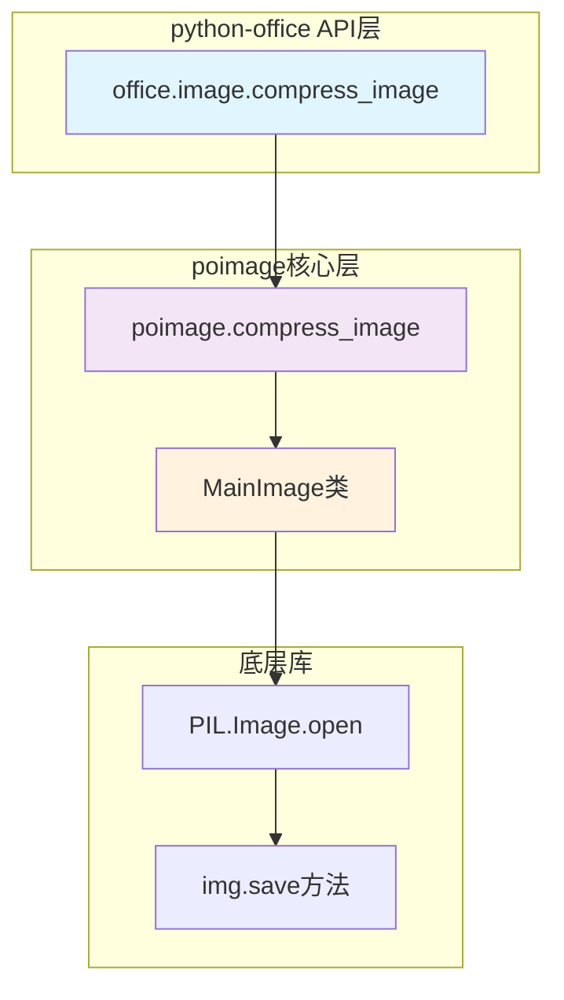
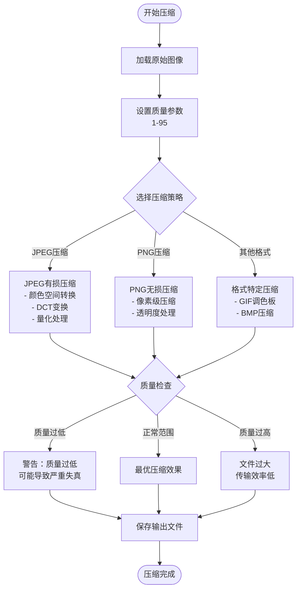
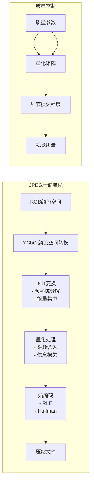

# 图片压缩

<cite>
**本文档引用的文件**
- [office/api/image.py](file://office/api/image.py)
- [examples/poimage_demo/compress_image.py](file://examples/poimage_demo/compress_image.py)
- [venv/Lib/site-packages/poimage/api/image.py](file://venv/Lib/site-packages/poimage/api/image.py)
- [venv/Lib/site-packages/poimage/core/ImageType.py](file://venv/Lib/site-packages/poimage/core/ImageType.py)
- [tests/test_code/test_image.py](file://tests/test_code/test_image.py)
- [README.md](file://README.md)
</cite>

## 目录
1. [简介](#简介)
2. [核心功能概述](#核心功能概述)
3. [compress_image函数详解](#compress_image函数详解)
4. [参数详细说明](#参数详细说明)
5. [压缩质量与文件大小的关系](#压缩质量与文件大小的关系)
6. [底层压缩算法原理](#底层压缩算法原理)
7. [使用示例](#使用示例)
8. [批量压缩脚本设计](#批量压缩脚本设计)
9. [应用场景与最佳实践](#应用场景与最佳实践)
10. [注意事项与建议](#注意事项与建议)
11. [故障排除指南](#故障排除指南)

## 简介

python-office库提供了强大的图片压缩功能，通过`office.image.compress_image()`函数实现高质量的图像文件压缩。该功能基于PIL（Python Imaging Library）和OpenCV技术栈，支持多种图像格式的有损压缩，特别适用于Web资源优化、移动端适配和存储空间优化等场景。

## 核心功能概述

python-office的图片压缩功能具有以下特点：
- **简单易用**：仅需一行代码即可完成图像压缩
- **高质量压缩**：在保证视觉效果的前提下最大化压缩比
- **灵活配置**：支持自定义压缩质量参数
- **广泛兼容**：支持主流图像格式（JPEG、PNG、GIF等）
- **批量处理**：可扩展为批量压缩解决方案

## compress_image函数详解

### 函数签名

```python
office.image.compress_image(input_file: str, output_file: str, quality: int)
```

### 功能描述

该函数通过调用底层的`poimage.compress_image()`实现图像文件的压缩处理，主要作用是减小图像文件的存储空间，同时尽量保持视觉质量。

### 架构图



**图表来源**
- [office/api/image.py](file://office/api/image.py#L5-L17)
- [venv/Lib/site-packages/poimage/api/image.py](file://venv/Lib/site-packages/poimage/api/image.py#L76-L77)
- [venv/Lib/site-packages/poimage/core/ImageType.py](file://venv/Lib/site-packages/poimage/core/ImageType.py#L22-L32)

**章节来源**
- [office/api/image.py](file://office/api/image.py#L5-L17)
- [venv/Lib/site-packages/poimage/api/image.py](file://venv/Lib/site-packages/poimage/api/image.py#L76-L77)

## 参数详细说明

### input_file参数

| 属性 | 描述 |
|------|------|
| 类型 | `str` |
| 必需 | 是 |
| 格式要求 | 支持绝对路径或相对路径 |
| 文件格式 | JPEG、PNG、GIF、BMP等常见图像格式 |
| 示例 | `'C:/images/photo.jpg'` 或 `'./images/photo.jpg'` |

**功能说明**：指定需要压缩的输入图像文件路径。系统会自动检测文件格式并应用相应的压缩策略。

### output_file参数

| 属性 | 描述 |
|------|------|
| 类型 | `str` |
| 必需 | 是 |
| 格式要求 | 目标文件路径，支持绝对和相对路径 |
| 自动推导 | 如果未指定扩展名，系统会根据输入文件自动推导 |
| 示例 | `'compressed_photo.jpg'` 或 `'./output/compressed.jpg'` |

**功能说明**：指定压缩后图像的保存路径。输出格式通常与输入格式相同，但也可以转换为其他格式。

### quality参数

| 属性 | 描述 |
|------|------|
| 类型 | `int` |
| 取值范围 | 0 到 95（实际有效范围） |
| 推荐范围 | 60-85（平衡质量和大小） |
| 默认值 | 75（PIL默认值） |
| 影响因素 | 数值越高，质量越好，文件越大 |

**功能说明**：控制压缩质量的关键参数，直接影响压缩比和视觉效果。

**章节来源**
- [office/api/image.py](file://office/api/image.py#L8-L11)
- [venv/Lib/site-packages/poimage/core/ImageType.py](file://venv/Lib/site-packages/poimage/core/ImageType.py#L23-L28)

## 压缩质量与文件大小的关系

### 质量等级对照表

| 质量等级 | 数值范围 | 文件大小影响 | 视觉效果 | 适用场景 |
|----------|----------|--------------|----------|----------|
| 极低质量 | 1-20 | 最大压缩比 | 明显失真 | 存储受限场景 |
| 低质量 | 21-40 | 较大压缩 | 可接受失真 | 移动端预览 |
| 中等质量 | 41-60 | 中等压缩 | 轻微失真 | Web展示 |
| 高质量 | 61-80 | 较小压缩 | 基本无失真 | 打印用途 |
| 极高质量 | 81-95 | 最小压缩 | 几乎无失真 | 设计用途 |

### 压缩效果对比流程图



**图表来源**
- [venv/Lib/site-packages/poimage/core/ImageType.py](file://venv/Lib/site-packages/poimage/core/ImageType.py#L22-L32)

**章节来源**
- [examples/poimage_demo/compress_image.py](file://examples/poimage_demo/compress_image.py#L7)

## 底层压缩算法原理

### JPEG有损压缩机制

python-office主要基于PIL库的JPEG压缩实现，其工作原理如下：



**图表来源**
- [venv/Lib/site-packages/poimage/core/ImageType.py](file://venv/Lib/site-packages/poimage/core/ImageType.py#L22-L32)

### 压缩算法特性

| 特性 | 描述 | 影响因素 |
|------|------|----------|
| 有损压缩 | 通过量化减少数据量 | 质量参数控制 |
| 频率域处理 | 利用人眼视觉特性 | DCT变换 |
| 量化控制 | 关键系数保留，次要系数舍弃 | 量化步长 |
| 熵编码 | 进一步压缩冗余信息 | RLE + Huffman |

**章节来源**
- [venv/Lib/site-packages/poimage/core/ImageType.py](file://venv/Lib/site-packages/poimage/core/ImageType.py#L22-L32)

## 使用示例

### 基础压缩示例

```python
# 基本压缩用法
import office

# 压缩单张图片
office.image.compress_image(
    input_file=r'C:\images\original.jpg',
    output_file=r'C:\images\compressed.jpg',
    quality=75
)
```

### 高级配置示例

```python
# 高质量压缩示例
office.image.compress_image(
    input_file='photo.jpg',
    output_file='high_quality.jpg',
    quality=90  # 保留更多细节
)

# 移动端优化压缩
office.image.compress_image(
    input_file='large_photo.jpg',
    output_file='mobile_ready.jpg',
    quality=50  # 平衡质量和大小
)
```

### 错误处理示例

```python
import office
import os

try:
    # 检查文件是否存在
    input_path = 'photo.jpg'
    if not os.path.exists(input_path):
        raise FileNotFoundError(f"输入文件不存在: {input_path}")
    
    # 执行压缩
    office.image.compress_image(
        input_file=input_path,
        output_file='compressed.jpg',
        quality=60
    )
    
    print("图片压缩成功完成！")
    
except Exception as e:
    print(f"压缩失败: {e}")
```

**章节来源**
- [examples/poimage_demo/compress_image.py](file://examples/poimage_demo/compress_image.py#L5-L7)
- [tests/test_code/test_image.py](file://tests/test_code/test_image.py#L23-L26)

## 批量压缩脚本设计

### 单线程批量处理

```python
import os
import office

def batch_compress_images(input_folder, output_folder, quality=75):
    """
    批量压缩指定文件夹中的所有图片
    
    Args:
        input_folder (str): 输入文件夹路径
        output_folder (str): 输出文件夹路径
        quality (int): 压缩质量，1-95
    """
    # 创建输出文件夹
    os.makedirs(output_folder, exist_ok=True)
    
    # 获取所有图片文件
    image_extensions = ['.jpg', '.jpeg', '.png', '.bmp', '.gif']
    image_files = [
        f for f in os.listdir(input_folder) 
        if os.path.splitext(f)[1].lower() in image_extensions
    ]
    
    # 批量处理
    for filename in image_files:
        input_path = os.path.join(input_folder, filename)
        output_path = os.path.join(output_folder, filename)
        
        try:
            office.image.compress_image(
                input_file=input_path,
                output_file=output_path,
                quality=quality
            )
            print(f"已压缩: {filename}")
        except Exception as e:
            print(f"压缩失败 {filename}: {e}")

# 使用示例
batch_compress_images(
    input_folder='C:/images/original',
    output_folder='C:/images/compressed',
    quality=65
)
```

### 多线程批量处理

```python
import os
import office
import concurrent.futures
from pathlib import Path

def compress_single_image(args):
    """压缩单张图片的函数"""
    input_path, output_path, quality = args
    try:
        office.image.compress_image(
            input_file=str(input_path),
            output_file=str(output_path),
            quality=quality
        )
        return True, input_path.name
    except Exception as e:
        return False, f"{input_path.name}: {str(e)}"

def parallel_batch_compress(input_folder, output_folder, quality=75, max_workers=4):
    """
    并行批量压缩图片
    
    Args:
        input_folder (str): 输入文件夹
        output_folder (str): 输出文件夹
        quality (int): 压缩质量
        max_workers (int): 最大并发数
    """
    # 创建输出文件夹
    output_path = Path(output_folder)
    output_path.mkdir(parents=True, exist_ok=True)
    
    # 收集需要处理的文件
    image_files = []
    for ext in ['.jpg', '.jpeg', '.png']:
        image_files.extend(Path(input_folder).glob(f'*{ext}'))
    
    # 准备参数
    tasks = [(file, output_path / file.name, quality) for file in image_files]
    
    # 并行处理
    successful = 0
    failed = 0
    
    with concurrent.futures.ThreadPoolExecutor(max_workers=max_workers) as executor:
        future_to_file = {
            executor.submit(compress_single_image, task): task[0].name 
            for task in tasks
        }
        
        for future in concurrent.futures.as_completed(future_to_file):
            success, result = future.result()
            if success:
                successful += 1
                print(f"✓ 成功: {result}")
            else:
                failed += 1
                print(f"✗ 失败: {result}")
    
    print(f"\n批量压缩完成:")
    print(f"成功: {successful} 张")
    print(f"失败: {failed} 张")

# 使用示例
parallel_batch_compress(
    input_folder='D:/images/source',
    output_folder='D:/images/compressed',
    quality=70,
    max_workers=8
)
```

### 智能质量调节脚本

```python
import os
import office
from PIL import Image

def smart_compress(input_path, output_path, target_size_kb=500):
    """
    智能压缩：根据目标文件大小动态调整质量
    
    Args:
        input_path (str): 输入文件路径
        output_path (str): 输出文件路径
        target_size_kb (int): 目标文件大小（KB）
    """
    # 初始质量设置
    quality = 95
    min_quality = 10
    max_quality = 95
    
    # 计算初始文件大小
    initial_size = os.path.getsize(input_path) / 1024  # KB
    print(f"原始文件大小: {initial_size:.2f} KB")
    
    # 逐步降低质量直到达到目标大小
    while quality >= min_quality:
        try:
            office.image.compress_image(
                input_file=input_path,
                output_file=output_path,
                quality=quality
            )
            
            compressed_size = os.path.getsize(output_path) / 1024  # KB
            print(f"质量 {quality}% -> 文件大小: {compressed_size:.2f} KB")
            
            if compressed_size <= target_size_kb:
                print(f"✓ 达到目标大小: {compressed_size:.2f} KB")
                return True
                
            # 质量递减
            quality -= 5
            
        except Exception as e:
            print(f"压缩失败 (质量 {quality}%): {e}")
            quality -= 10
            if quality < min_quality:
                break
    
    # 如果无法达到目标大小，使用最小质量
    print(f"⚠ 无法达到目标大小，使用最低质量 {min_quality}%")
    office.image.compress_image(
        input_file=input_path,
        output_file=output_path,
        quality=min_quality
    )
    return False

# 使用示例
smart_compress(
    input_path='large_photo.jpg',
    output_path='optimized.jpg',
    target_size_kb=300
)
```

## 应用场景与最佳实践

### Web资源优化

```python
# Web页面图片优化
def optimize_for_web(image_path, device_type='desktop'):
    """
    针对不同设备优化图片质量
    """
    if device_type == 'mobile':
        # 移动设备优化
        office.image.compress_image(
            input_file=image_path,
            output_file=f"mobile_{os.path.basename(image_path)}",
            quality=40  # 移动端优先考虑传输速度
        )
    elif device_type == 'tablet':
        # 平板设备平衡
        office.image.compress_image(
            input_file=image_path,
            output_file=f"tablet_{os.path.basename(image_path)}",
            quality=60
        )
    else:
        # 桌面设备优化显示质量
        office.image.compress_image(
            input_file=image_path,
            output_file=f"desktop_{os.path.basename(image_path)}",
            quality=85
        )

# 使用示例
optimize_for_web('hero_image.jpg', device_type='mobile')
```

### 移动端适配

```python
# 移动端图片处理流程
def mobile_optimized_workflow(original_path):
    """
    移动端图片优化工作流
    """
    # 第一阶段：基础压缩
    office.image.compress_image(
        input_file=original_path,
        output_file='stage1_compressed.jpg',
        quality=50
    )
    
    # 第二阶段：进一步优化
    office.image.compress_image(
        input_file='stage1_compressed.jpg',
        output_file='stage2_optimized.jpg',
        quality=30
    )
    
    # 清理临时文件
    os.remove('stage1_compressed.jpg')
    
    return 'stage2_optimized.jpg'
```

### 社交媒体发布

```python
# 社交媒体平台优化
def social_media_optimization(image_path, platform='instagram'):
    """
    针对不同社交媒体平台的图片优化
    """
    platform_configs = {
        'instagram': {'quality': 80, 'max_size': 10},
        'twitter': {'quality': 75, 'max_size': 5},
        'facebook': {'quality': 85, 'max_size': 8},
        'wechat': {'quality': 60, 'max_size': 3}
    }
    
    config = platform_configs.get(platform, platform_configs['instagram'])
    
    office.image.compress_image(
        input_file=image_path,
        output_file=f"{platform}_{os.path.basename(image_path)}",
        quality=config['quality']
    )
    
    return f"{platform}_{os.path.basename(image_path)}"
```

### 性能优化建议

| 场景 | 推荐质量 | 处理速度 | 文件大小 | 适用性 |
|------|----------|----------|----------|--------|
| 实时上传 | 40-50 | 快速 | 小 | 移动应用 |
| 网页展示 | 60-75 | 中等 | 中等 | PC网站 |
| 打印出版 | 85-95 | 慢 | 大 | 设计软件 |
| 存储归档 | 30-40 | 最快 | 最小 | 数据库 |

## 注意事项与建议

### 原始文件保护

```python
# 压缩前备份原始文件
def backup_and_compress(original_path, compressed_path, quality=75):
    """
    压缩前备份原始文件
    """
    # 创建备份文件夹
    backup_folder = os.path.join(os.path.dirname(original_path), 'backup')
    os.makedirs(backup_folder, exist_ok=True)
    
    # 备份原始文件
    original_filename = os.path.basename(original_path)
    backup_path = os.path.join(backup_folder, f"original_{original_filename}")
    
    import shutil
    shutil.copy2(original_path, backup_path)
    print(f"原始文件已备份至: {backup_path}")
    
    # 执行压缩
    office.image.compress_image(
        input_file=original_path,
        output_file=compressed_path,
        quality=quality
    )
    
    return compressed_path
```

### 质量参数选择指南

```python
# 质量参数选择决策树
def recommend_quality(image_type, usage_context):
    """
    根据图像类型和使用场景推荐质量参数
    
    Args:
        image_type (str): 图像类型 ('photo', 'graphic', 'text', 'mixed')
        usage_context (str): 使用场景 ('web', 'print', 'mobile', 'archive')
    """
    # 质量推荐矩阵
    quality_matrix = {
        'photo': {
            'web': 70,
            'print': 90,
            'mobile': 50,
            'archive': 30
        },
        'graphic': {
            'web': 80,
            'print': 95,
            'mobile': 60,
            'archive': 40
        },
        'text': {
            'web': 90,
            'print': 95,
            'mobile': 70,
            'archive': 50
        },
        'mixed': {
            'web': 75,
            'print': 90,
            'mobile': 55,
            'archive': 35
        }
    }
    
    return quality_matrix.get(image_type, {}).get(usage_context, 75)

# 使用示例
quality = recommend_quality('photo', 'web')
print(f"推荐质量参数: {quality}")
```

### 错误处理最佳实践

```python
import logging
from pathlib import Path

# 配置日志记录
logging.basicConfig(
    level=logging.INFO,
    format='%(asctime)s - %(levelname)s - %(message)s'
)

def robust_compress(input_path, output_path, quality=75):
    """
    带完整错误处理的压缩函数
    """
    try:
        # 验证输入文件
        input_path = Path(input_path)
        if not input_path.exists():
            raise FileNotFoundError(f"输入文件不存在: {input_path}")
        
        if not input_path.is_file():
            raise ValueError(f"输入路径不是文件: {input_path}")
        
        # 验证输出路径
        output_path = Path(output_path)
        output_parent = output_path.parent
        output_parent.mkdir(parents=True, exist_ok=True)
        
        # 验证质量参数
        if not (1 <= quality <= 95):
            raise ValueError(f"质量参数必须在1-95范围内: {quality}")
        
        # 执行压缩
        office.image.compress_image(
            input_file=str(input_path),
            output_file=str(output_path),
            quality=quality
        )
        
        # 验证输出文件
        if not output_path.exists():
            raise RuntimeError(f"压缩失败，输出文件不存在: {output_path}")
        
        # 计算压缩率
        original_size = input_path.stat().st_size
        compressed_size = output_path.stat().st_size
        compression_ratio = (original_size - compressed_size) / original_size * 100
        
        logging.info(f"压缩完成: {input_path.name}")
        logging.info(f"原始大小: {original_size/1024:.2f} KB")
        logging.info(f"压缩后大小: {compressed_size/1024:.2f} KB")
        logging.info(f"压缩率: {compression_ratio:.1f}%")
        
        return True, f"压缩成功，节省 {compression_ratio:.1f}%"
        
    except FileNotFoundError as e:
        logging.error(f"文件错误: {e}")
        return False, f"文件错误: {e}"
    
    except ValueError as e:
        logging.error(f"参数错误: {e}")
        return False, f"参数错误: {e}"
    
    except Exception as e:
        logging.error(f"未知错误: {e}")
        return False, f"压缩失败: {e}"
```

## 故障排除指南

### 常见问题及解决方案

| 问题症状 | 可能原因 | 解决方案 |
|----------|----------|----------|
| 压缩后文件过大 | 质量参数过高 | 降低quality参数（建议60-80） |
| 压缩后质量差 | 质量参数过低 | 提高质量参数（建议70-90） |
| 文件损坏 | 输入文件格式不支持 | 检查文件格式，转换为支持的格式 |
| 内存不足 | 图像过大 | 分块处理或降低分辨率 |
| 权限错误 | 输出路径无写权限 | 更改输出路径或修改权限 |

### 调试工具

```python
def debug_compression(input_path, output_path, quality=75):
    """
    调试压缩过程的详细信息
    """
    import sys
    import traceback
    
    try:
        # 获取图像信息
        from PIL import Image
        img = Image.open(input_path)
        width, height = img.size
        mode = img.mode
        format_type = img.format
        
        print(f"图像信息:")
        print(f"  尺寸: {width}x{height}")
        print(f"  模式: {mode}")
        print(f"  格式: {format_type}")
        print(f"  质量: {quality}")
        
        # 执行压缩
        office.image.compress_image(
            input_file=input_path,
            output_file=output_path,
            quality=quality
        )
        
        # 验证输出
        if os.path.exists(output_path):
            original_size = os.path.getsize(input_path)
            compressed_size = os.path.getsize(output_path)
            
            print(f"\n压缩结果:")
            print(f"  原始文件大小: {original_size} 字节")
            print(f"  压缩后大小: {compressed_size} 字节")
            print(f"  压缩率: {((original_size-compressed_size)/original_size)*100:.1f}%")
            
            return True
        else:
            print("错误: 输出文件不存在")
            return False
            
    except Exception as e:
        print(f"调试信息:")
        print(f"  错误类型: {type(e).__name__}")
        print(f"  错误消息: {str(e)}")
        print(f"  跟踪信息:")
        traceback.print_exc()
        return False

# 使用示例
debug_compression('test.jpg', 'debug_compressed.jpg', quality=60)
```

### 性能监控

```python
import time
import psutil
import os

def monitor_compression_performance(input_path, output_path, quality=75):
    """
    监控压缩过程的性能指标
    """
    start_time = time.time()
    start_memory = psutil.Process(os.getpid()).memory_info().rss / 1024 / 1024  # MB
    
    try:
        office.image.compress_image(
            input_file=input_path,
            output_file=output_path,
            quality=quality
        )
        
        end_time = time.time()
        end_memory = psutil.Process(os.getpid()).memory_info().rss / 1024 / 1024  # MB
        
        print(f"性能指标:")
        print(f"  处理时间: {end_time - start_time:.2f} 秒")
        print(f"  内存变化: {end_memory - start_memory:.2f} MB")
        print(f"  CPU使用率: {psutil.cpu_percent():.1f}%")
        
        return True
        
    except Exception as e:
        print(f"性能监控错误: {e}")
        return False

# 使用示例
monitor_compression_performance('large_image.jpg', 'compressed.jpg', quality=70)
```

**章节来源**
- [tests/test_code/test_image.py](file://tests/test_code/test_image.py#L23-L26)

## 结论

python-office的图片压缩功能提供了强大而灵活的图像处理能力。通过合理配置quality参数，可以在文件大小和视觉质量之间找到最佳平衡点。对于不同的应用场景，建议采用相应的质量策略：

- **Web应用**：质量60-75，平衡加载速度和显示效果
- **移动端应用**：质量40-60，优先考虑传输效率
- **打印出版**：质量85-95，确保最高质量输出
- **存储归档**：质量30-50，在保证可读性的前提下最大化压缩比

记住始终做好原始文件备份，并根据具体需求调整压缩策略。通过批量处理和智能质量调节，可以显著提高大规模图像处理的效率。