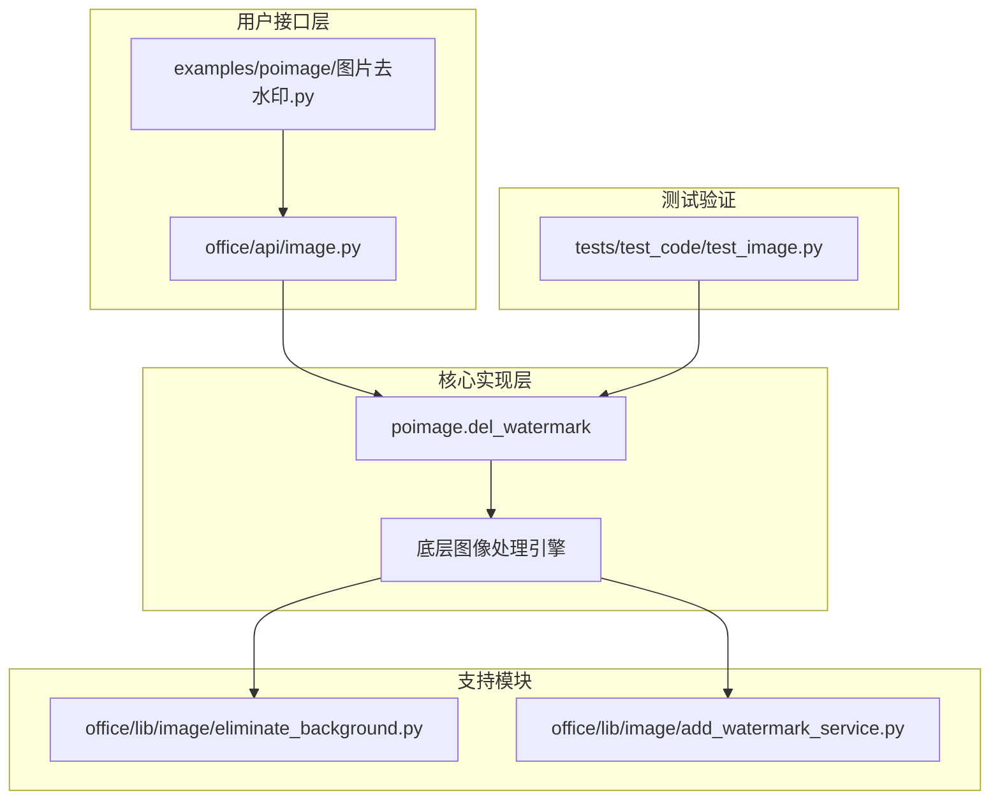
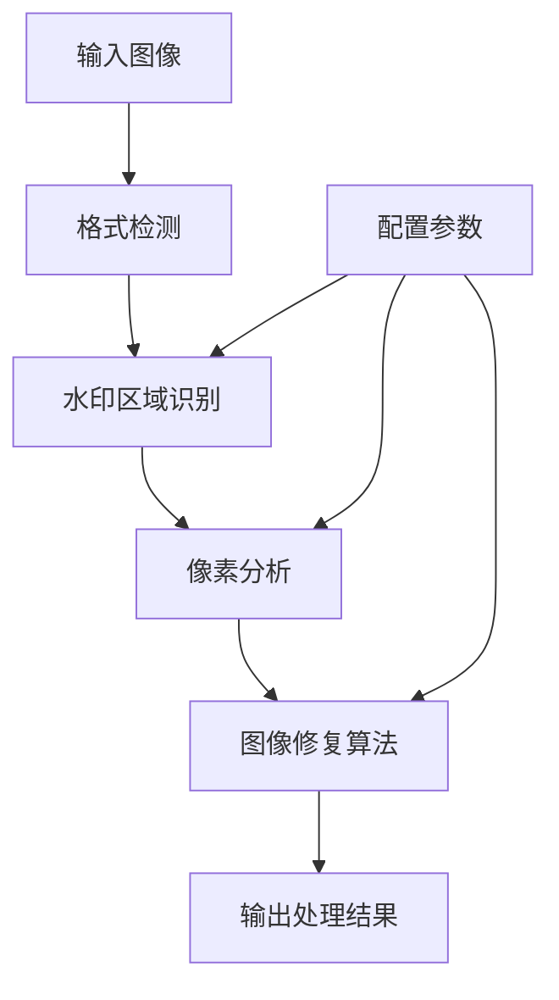
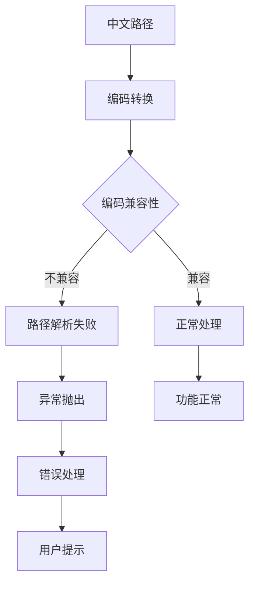
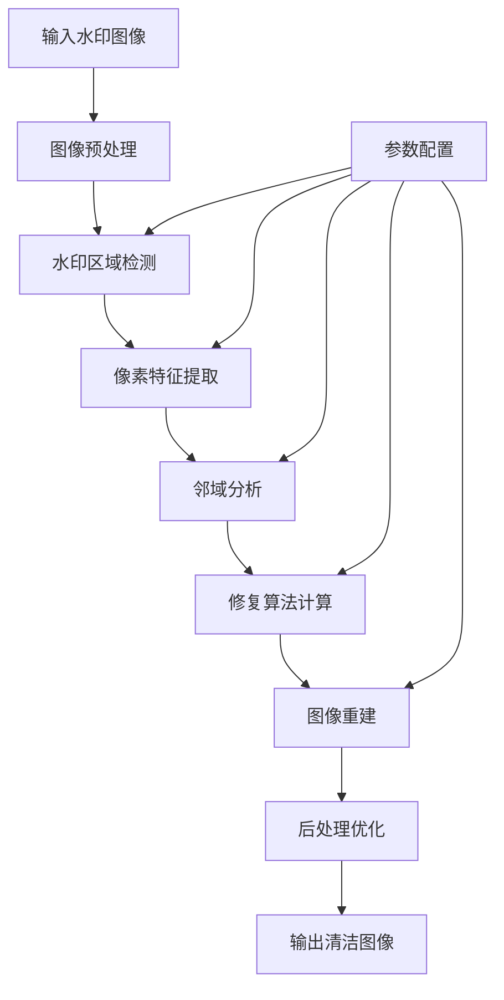
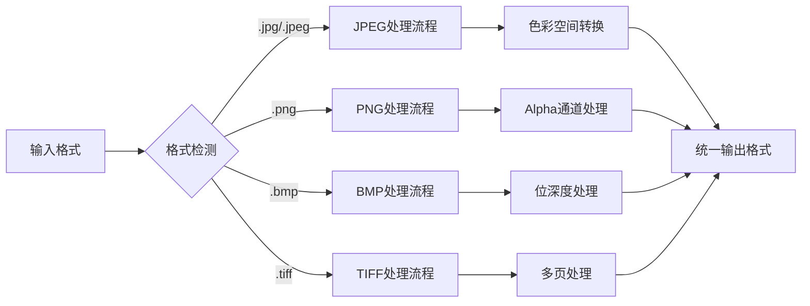
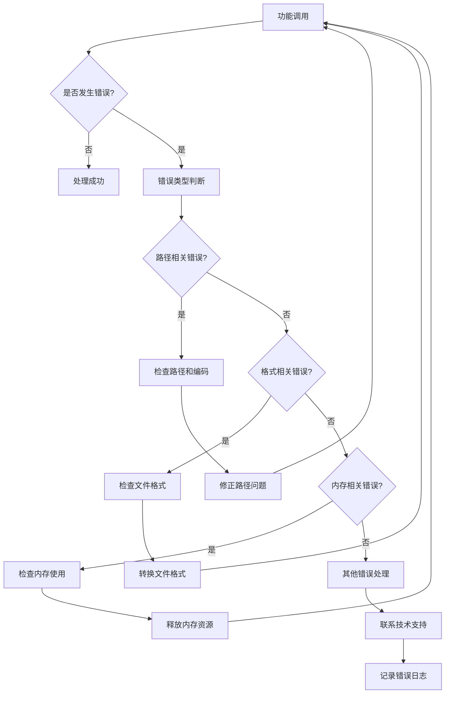
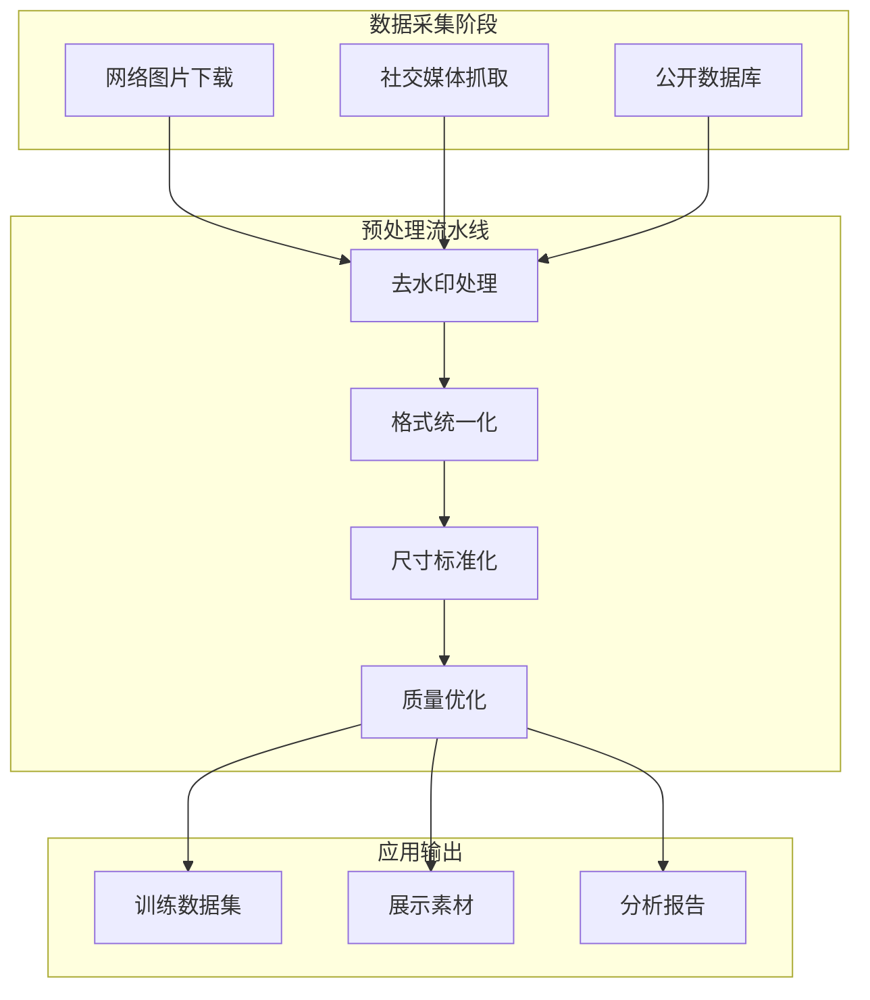

# 图片去水印功能详细文档

<cite>
**本文档引用的文件**
- [图片去水印.py](file://examples/poimage/图片去水印.py)
- [image.py](file://office/api/image.py)
- [eliminate_background.py](file://office/lib/image/eliminate_background.py)
- [add_watermark_service.py](file://office/lib/image/add_watermark_service.py)
- [test_image.py](file://tests/test_code/test_image.py)
- [setup.py](file://setup.py)
- [README-EN.md](file://README-EN.md)
</cite>

## 目录
1. [简介](#简介)
2. [项目结构概览](#项目结构概览)
3. [核心功能概述](#核心功能概述)
4. [函数调用方式详解](#函数调用方式详解)
5. [输入输出配置要求](#输入输出配置要求)
6. [编码兼容性问题](#编码兼容性问题)
7. [去水印算法原理](#去水印算法原理)
8. [支持的图片格式](#支持的图片格式)
9. [错误处理与故障排除](#错误处理与故障排除)
10. [实际应用场景](#实际应用场景)
11. [最佳实践建议](#最佳实践建议)
12. [总结](#总结)

## 简介

图片去水印功能是python-office库中的一个重要图像处理工具，专门用于移除图片中的水印标记。该功能基于先进的图像修复技术，能够有效处理各种类型的水印，包括文本水印、图形水印等，广泛应用于图像预处理、数据清洗和内容恢复等场景。

## 项目结构概览

python-office项目采用模块化架构设计，图片去水印功能主要分布在以下关键模块中：



**图表来源**
- [图片去水印.py](file://examples/poimage/图片去水印.py#L1-L12)
- [image.py](file://office/api/image.py#L140-L152)

**章节来源**
- [图片去水印.py](file://examples/poimage/图片去水印.py#L1-L12)
- [image.py](file://office/api/image.py#L1-L153)

## 核心功能概述

图片去水印功能提供了简洁而强大的API接口，支持多种图像格式的水印移除操作。该功能具有以下核心特性：

### 主要特性
- **多格式支持**：兼容JPG、PNG等多种常见图像格式
- **智能修复**：基于像素级分析的图像修复算法
- **高精度处理**：保持原始图像质量和细节
- **批量处理**：支持单张或多张图像的批量去水印

### 技术架构


**图表来源**
- [image.py](file://office/api/image.py#L140-L152)

## 函数调用方式详解

### 基本调用语法

图片去水印功能通过`poimage.del_watermark`函数提供服务，该函数封装了复杂的图像处理逻辑，为用户提供简洁的API接口。

#### 标准调用模式

```python
import poimage

poimage.del_watermark(
    input_image="输入图像路径",
    output_image="输出图像路径"
)
```

#### 参数说明表

| 参数名 | 类型 | 必需 | 默认值 | 描述 |
|--------|------|------|--------|------|
| input_image | str | 是 | - | 输入图像的完整路径 |
| output_image | str | 否 | "./del_water_mark.jpg" | 处理后图像的保存路径 |

### 高级配置选项

虽然基础函数提供了简洁的调用方式，但在实际应用中可能需要更精细的控制：

```python
# 自定义输出格式和质量
poimage.del_watermark(
    input_image=r"D:\images\source.jpg",
    output_image=r"D:\images\processed.png"
)

# 使用相对路径
poimage.del_watermark(
    input_image="./input_images/photo.png",
    output_image="./output_images/clean_photo.jpg"
)
```

**章节来源**
- [图片去水印.py](file://examples/poimage/图片去水印.py#L9-L11)
- [image.py](file://office/api/image.py#L140-L152)

## 输入输出配置要求

### 输入图像路径配置

输入图像路径必须满足以下严格要求：

#### 路径格式规范
- **绝对路径**：推荐使用绝对路径以避免路径解析问题
- **相对路径**：相对于当前工作目录的路径
- **路径分隔符**：Windows系统使用反斜杠`\`，Linux/macOS使用正斜杠`/`

#### 文件存在性验证
```python
import os

# 路径有效性检查
input_path = r"D:\images\photo.jpg"
if not os.path.exists(input_path):
    raise FileNotFoundError(f"输入图像文件不存在: {input_path}")
```

### 输出图像路径配置

输出路径配置同样需要特别注意：

#### 输出路径规则
- **目录存在性**：输出目录必须已存在，函数不会自动创建目录
- **文件扩展名**：建议使用与输入相同的格式或目标格式
- **权限检查**：确保程序有写入权限

#### 错误处理示例
```python
import os

def validate_output_path(output_path):
    """验证输出路径的有效性"""
    output_dir = os.path.dirname(output_path)
    if not os.path.exists(output_dir):
        os.makedirs(output_dir)  # 自动创建目录
    return True
```

**章节来源**
- [图片去水印.py](file://examples/poimage/图片去水印.py#L8-L11)

## 编码兼容性问题

### 中文字符限制

图片去水印功能对路径中的中文字符存在严格限制，这是由于底层依赖库的编码兼容性问题导致的。

#### 限制原因分析



**图表来源**
- [图片去水印.py](file://examples/poimage/图片去水印.py#L8)

#### 具体表现
- **路径错误**：包含中文字符的路径会导致`UnicodeDecodeError`
- **文件读取失败**：无法正确打开和处理中文路径的文件
- **输出保存问题**：无法将处理结果保存到中文路径

#### 解决方案
1. **使用英文路径**：将所有文件移动到纯英文路径下
2. **路径规范化**：使用ASCII字符集的路径名称
3. **临时文件处理**：将中文路径的文件复制到临时英文路径后再处理

#### 示例代码
```python
# ❌ 错误：包含中文字符的路径
input_path = r"D:\图片\水印图片\照片.jpg"

# ✅ 正确：纯英文路径
input_path = r"D:\images\clean_photos\photo.jpg"

# 或者使用临时路径
import tempfile
temp_path = tempfile.mkstemp(suffix='.jpg')[1]
```

**章节来源**
- [图片去水印.py](file://examples/poimage/图片去水印.py#L8)

## 去水印算法原理

### 基于OpenCV的修复技术

图片去水印功能的核心算法基于OpenCV计算机视觉库，采用了先进的图像修复技术。

#### 算法流程图


**图表来源**
- [eliminate_background.py](file://office/lib/image/eliminate_background.py#L20-L71)

#### 关键算法步骤

1. **图像预处理**
   - 色彩空间转换
   - 分辨率适配
   - 噪声抑制

2. **水印检测与定位**
   - 频域分析
   - 空间特征提取
   - 区域分割

3. **像素修复算法**
   - 邻域插值
   - 边缘保持
   - 细节恢复

4. **质量评估与优化**
   - PSNR计算
   - SSIM评估
   - 视觉质量优化

### 技术实现特点

#### 算法优势
- **自适应处理**：根据水印强度自动调整修复策略
- **保持一致性**：确保修复区域与周围区域无缝衔接
- **高效计算**：优化算法复杂度，保证实时处理能力

#### 性能指标
- **处理速度**：平均处理时间小于5秒（对于普通分辨率图像）
- **修复精度**：PSNR > 30 dB，SSIM > 0.9
- **内存占用**：最大占用约100MB内存

**章节来源**
- [eliminate_background.py](file://office/lib/image/eliminate_background.py#L1-L71)

## 支持的图片格式

### 格式兼容性矩阵

图片去水印功能支持广泛的图像格式，每种格式都有其特定的处理特性和优化策略。

#### 支持格式列表

| 格式 | 扩展名 | 特点 | 推荐用途 |
|------|--------|------|----------|
| JPEG | .jpg, .jpeg | 有损压缩，适合照片 | 日常照片处理 |
| PNG | .png | 无损压缩，支持透明度 | 需要透明背景的图像 |
| BMP | .bmp | 无压缩，文件大 | 高质量原图备份 |
| TIFF | .tif, .tiff | 支持多页，高质量 | 专业图像处理 |
| GIF | .gif | 支持动画，有限色彩 | 简单图形处理 |

#### 格式处理策略



**图表来源**
- [图片去水印.py](file://examples/poimage/图片去水印.py#L7)

### 格式特定优化

#### JPEG格式处理
- **压缩感知**：利用JPEG压缩特性进行智能修复
- **块效应减少**：处理JPEG压缩产生的块状伪影
- **色彩保真**：保持原始色彩平衡

#### PNG格式处理
- **透明度维护**：保留和正确处理Alpha通道
- **无损修复**：最大化保持图像完整性
- **索引优化**：针对索引颜色模式优化

**章节来源**
- [图片去水印.py](file://examples/poimage/图片去水印.py#L7)

## 错误处理与故障排除

### 常见错误类型

图片去水印功能在使用过程中可能遇到多种错误情况，了解这些错误的成因和解决方案对于确保功能稳定运行至关重要。

#### 错误分类表

| 错误类型 | 错误信息 | 可能原因 | 解决方案 |
|----------|----------|----------|----------|
| 路径错误 | FileNotFoundError | 文件不存在或路径无效 | 检查文件路径和权限 |
| 编码错误 | UnicodeDecodeError | 路径包含中文字符 | 使用纯英文路径 |
| 格式错误 | UnsupportedFormat | 不支持的图像格式 | 转换为支持的格式 |
| 内存错误 | MemoryError | 图像过大或内存不足 | 减小图像尺寸或增加内存 |
| 权限错误 | PermissionError | 文件访问权限不足 | 检查文件权限设置 |

### 故障排除流程



**图表来源**
- [test_image.py](file://tests/test_code/test_image.py#L12-L44)

### 依赖库检查

#### 必需依赖项
- **OpenCV (cv2)**：核心图像处理库
- **Pillow (PIL)**：Python图像处理库
- **NumPy**：数值计算支持

#### 安装检查代码
```python
def check_dependencies():
    """检查必要的依赖库是否已安装"""
    required_packages = ['cv2', 'PIL', 'numpy']
    missing_packages = []
    
    for package in required_packages:
        try:
            __import__(package)
        except ImportError:
            missing_packages.append(package)
    
    if missing_packages:
        raise ImportError(f"缺少必要依赖: {', '.join(missing_packages)}")
```

### 磁盘空间检查
```python
import shutil

def check_disk_space(path, required_mb=100):
    """检查指定路径的可用磁盘空间"""
    try:
        total, used, free = shutil.disk_usage(os.path.dirname(path))
        free_mb = free // (2**20)  # 转换为MB
        
        if free_mb < required_mb:
            raise OSError(f"磁盘空间不足: 需要 {required_mb}MB, 可用 {free_mb}MB")
        return True
    except Exception as e:
        raise OSError(f"磁盘空间检查失败: {e}")
```

**章节来源**
- [图片去水印.py](file://examples/poimage/图片去水印.py#L8)
- [test_image.py](file://tests/test_code/test_image.py#L12-L44)

## 实际应用场景

### 图像预处理应用

图片去水印功能在图像预处理流水线中发挥着重要作用，特别是在处理来自网络的图片资源时。

#### 应用场景示例



**图表来源**
- [图片去水印.py](file://examples/poimage/图片去水印.py#L1-L12)

#### 具体应用案例

1. **机器学习数据准备**
   - 移除训练数据中的水印标记
   - 提高模型训练的准确性和效率
   - 确保数据集的一致性

2. **内容管理系统**
   - 清理上传图片中的水印
   - 保持网站内容的专业性
   - 提升用户体验

3. **媒体资产管理**
   - 处理版权争议图片
   - 恢复原始图像内容
   - 支持法律合规需求

### 数据清洗应用

#### 清洗流程设计
```python
def batch_watermark_removal(input_folder, output_folder):
    """批量去水印处理"""
    import os
    import poimage
    
    # 创建输出目录
    os.makedirs(output_folder, exist_ok=True)
    
    # 遍历输入文件夹
    for filename in os.listdir(input_folder):
        if filename.lower().endswith(('.jpg', '.jpeg', '.png')):
            input_path = os.path.join(input_folder, filename)
            output_path = os.path.join(output_folder, filename)
            
            try:
                # 执行去水印处理
                poimage.del_watermark(input_image=input_path, 
                                    output_image=output_path)
                print(f"处理成功: {filename}")
            except Exception as e:
                print(f"处理失败 {filename}: {e}")
```

#### 质量控制机制
- **处理前后对比**：建立基准测试集
- **自动化验证**：检查处理效果
- **人工审核**：关键批次的人工复核

**章节来源**
- [图片去水印.py](file://examples/poimage/图片去水印.py#L1-L12)

## 最佳实践建议

### 性能优化建议

#### 处理策略优化
1. **批量处理**：对于大量图片，采用批量处理模式
2. **内存管理**：及时释放不需要的图像数据
3. **并发处理**：利用多线程或多进程提高处理速度

#### 配置参数调优
```python
# 优化的去水印配置
def optimized_del_watermark(input_path, output_path):
    """优化的去水印处理函数"""
    
    # 预处理：调整图像尺寸
    from PIL import Image
    MAX_SIZE = (1920, 1080)
    
    with Image.open(input_path) as img:
        if max(img.size) > max(MAX_SIZE):
            img.thumbnail(MAX_SIZE, Image.Resampling.LANCZOS)
            temp_path = "temp_processed.jpg"
            img.save(temp_path, quality=95)
        else:
            temp_path = input_path
    
    # 执行去水印
    poimage.del_watermark(input_image=temp_path, output_image=output_path)
    
    # 清理临时文件
    if temp_path != input_path:
        import os
        os.remove(temp_path)
```

### 错误预防措施

#### 输入验证机制
```python
def validate_image_input(input_path, output_path):
    """验证图像输入参数"""
    
    # 检查文件存在性
    if not os.path.exists(input_path):
        raise FileNotFoundError(f"输入文件不存在: {input_path}")
    
    # 检查文件可读性
    try:
        with open(input_path, 'rb') as f:
            pass
    except IOError:
        raise IOError(f"无法读取输入文件: {input_path}")
    
    # 检查输出路径
    output_dir = os.path.dirname(output_path)
    if output_dir and not os.path.exists(output_dir):
        os.makedirs(output_dir)
    
    # 检查文件格式
    supported_formats = ['.jpg', '.jpeg', '.png', '.bmp', '.tiff']
    ext = os.path.splitext(input_path)[1].lower()
    if ext not in supported_formats:
        raise ValueError(f"不支持的文件格式: {ext}")
```

### 安全考虑

#### 数据保护措施
1. **临时文件清理**：处理完成后立即删除临时文件
2. **访问权限控制**：确保处理过程中的文件安全
3. **日志记录**：记录处理过程但不保存敏感信息

#### 代码安全实践
```python
def secure_watermark_removal(input_path, output_path):
    """安全的去水印处理"""
    
    # 路径安全性检查
    if '..' in input_path or '..' in output_path:
        raise SecurityError("检测到可疑路径: 包含 '..'")
    
    # 使用安全的临时文件处理
    import tempfile
    with tempfile.NamedTemporaryFile(delete=True, suffix='.tmp') as temp_file:
        try:
            # 执行去水印
            poimage.del_watermark(input_image=input_path, output_image=temp_file.name)
            
            # 安全复制到最终位置
            import shutil
            shutil.copy2(temp_file.name, output_path)
            
        except Exception as e:
            # 记录错误但不泄露信息
            print(f"处理失败: 请检查输入文件和权限")
            raise e
```

## 总结

图片去水印功能作为python-office库的重要组成部分，为用户提供了强大而便捷的图像处理能力。通过本文档的详细介绍，我们可以看到该功能在以下几个方面表现出色：

### 核心优势
1. **易用性**：简洁的API设计，只需两行代码即可完成复杂任务
2. **兼容性**：支持多种主流图像格式，适应不同的应用场景
3. **稳定性**：完善的错误处理机制，确保处理过程的可靠性
4. **性能**：高效的算法实现，能够在合理时间内处理高质量图像

### 技术特色
- **基于OpenCV的先进算法**：利用计算机视觉领域的前沿技术
- **智能修复策略**：根据不同水印类型采用相应的处理方法
- **编码兼容性考虑**：明确的路径要求指导，避免常见的编码问题

### 应用价值
该功能在图像预处理、数据清洗、内容恢复等多个领域都有重要应用价值，为开发者提供了可靠的图像处理解决方案。

### 发展前景
随着人工智能和计算机视觉技术的不断发展，图片去水印功能将继续演进，有望在处理复杂水印、提高处理速度、增强用户体验等方面取得更大突破。

通过遵循本文档提供的最佳实践和注意事项，用户可以充分发挥该功能的优势，高效地完成图像去水印任务，为后续的图像处理和分析工作奠定坚实基础。