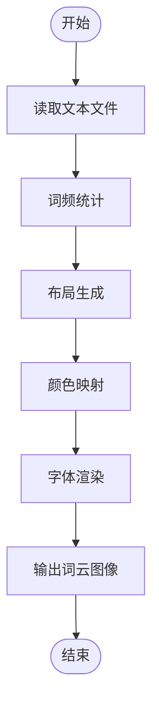

# 文本转词云

<cite>
**本文档中引用的文件**
- [文本转词云.py](file://examples/poimage/文本转词云.py)
- [数据可视化-文章转图云.py](file://examples/pydatav/数据可视化-文章转图云.py)
- [image.py](file://office/api/image.py)
- [test.txt](file://examples/pydatav/txt2wordcloud/test.txt)
- [instruction_url.py](file://office/lib/decorator_utils/instruction_url.py)
</cite>

## 目录
1. [简介](#简介)
2. [功能概述](#功能概述)
3. [核心流程分析](#核心流程分析)
4. [调用方式与参数说明](#调用方式与参数说明)
5. [自定义配置](#自定义配置)
6. [中文文本处理最佳实践](#中文文本处理最佳实践)
7. [应用场景](#应用场景)
8. [结论](#结论)

## 简介
`poimage.txt2wordcloud` 函数是 python-office 项目中的一个实用工具，用于将纯文本内容自动生成可视化词云图像。该功能基于 `wordcloud` 库实现，能够从文本中提取关键词并以视觉化的方式展示词语的重要性。通过词云图像，用户可以快速识别文本中的高频词汇和主题。

**Section sources**
- [image.py](file://office/api/image.py#L94-L106)

## 功能概述
`txt2wordcloud` 函数的主要功能是读取指定的文本文件，统计词频，并生成对应的词云图像。该函数封装了词频统计、布局生成、颜色映射和字体渲染等核心流程，使得用户无需深入了解底层实现即可轻松创建专业的词云图。

该功能支持多种自定义选项，包括背景颜色、输出文件名以及词云形状等，满足不同场景下的需求。此外，通过集成 NLP 工具如 jieba 分词，还可以有效处理中文文本，提升词云的质量和可读性。

**Section sources**
- [image.py](file://office/api/image.py#L94-L106)
- [instruction_url.py](file://office/lib/decorator_utils/instruction_url.py#L30)

## 核心流程分析
`txt2wordcloud` 的工作流程主要包括以下几个步骤：

1. **文本读取**：从指定的文件路径读取文本内容。
2. **词频统计**：对文本进行分词处理，并统计每个词语的出现频率。
3. **布局生成**：根据词频数据，使用算法确定每个词语在图像中的位置和大小。
4. **颜色映射**：为不同的词语分配颜色，增强视觉效果。
5. **字体渲染**：将词语绘制到图像上，生成最终的词云图。

这些步骤由 `wordcloud` 库自动完成，用户只需提供文本文件和必要的参数即可。



**Diagram sources**
- [image.py](file://office/api/image.py#L94-L106)

**Section sources**
- [image.py](file://office/api/image.py#L94-L106)

## 调用方式与参数说明
`txt2wordcloud` 函数的调用方式非常简单，主要参数如下：

- `filename` (str): 文本文件的路径，必需参数。
- `color` (str, optional): 词云的背景颜色，默认为 "white"。
- `result_file` (str, optional): 生成的词云图像文件名，默认为 "your_wordcloud.png"。

示例代码：
```python
import poimage
poimage.txt2wordcloud(filename='path/to/text.txt', color='black', result_file='wordcloud.jpg')
```

**Section sources**
- [文本转词云.py](file://examples/poimage/文本转词云.py#L12-L14)
- [数据可视化-文章转图云.py](file://examples/pydatav/数据可视化-文章转图云.py#L6-L9)

## 自定义配置
为了满足不同需求，`txt2wordcloud` 支持多种自定义配置：

- **词云形状**：可以通过 mask 参数指定自定义形状的图像作为词云的轮廓。
- **背景色**：通过 `color` 参数设置背景颜色，支持常见的颜色名称或十六进制颜色码。
- **字体**：可以指定特定的字体文件，以支持不同的语言和风格。
- **停用词列表**：提供停用词列表，排除不希望出现在词云中的词语。

这些配置使得生成的词云更加个性化和专业化。

**Section sources**
- [image.py](file://office/api/image.py#L94-L106)

## 中文文本处理最佳实践
在处理中文文本时，直接使用 `txt2wordcloud` 可能会导致分词不准确的问题。因此，推荐结合 NLP 工具如 jieba 进行预处理。具体步骤如下：

1. 使用 jieba 对中文文本进行分词。
2. 将分词结果保存为新的文本文件。
3. 调用 `txt2wordcloud` 函数处理预处理后的文本。

这种方法可以显著提高词云的质量，确保关键词的准确性和完整性。

**Section sources**
- [test.txt](file://examples/pydatav/txt2wordcloud/test.txt)

## 应用场景
`txt2wordcloud` 在多个领域都有广泛的应用价值：

- **舆情分析**：通过分析社交媒体或新闻报道中的文本，快速识别公众关注的热点话题。
- **报告生成**：在撰写报告时，使用词云图直观展示关键信息，增强报告的可读性和说服力。
- **市场研究**：分析客户反馈或评论，了解消费者的需求和偏好。

这些应用不仅提升了数据分析的效率，还增强了信息传达的效果。

**Section sources**
- [数据可视化-文章转图云.py](file://examples/pydatav/数据可视化-文章转图云.py#L5-L9)

## 结论
`poimage.txt2wordcloud` 是一个强大且易用的工具，能够将纯文本转换为直观的词云图像。通过集成 `wordcloud` 库，它实现了词频统计、布局生成、颜色映射和字体渲染等核心功能。同时，支持多种自定义配置和中文文本处理的最佳实践，使其在舆情分析、报告生成等领域具有重要的应用价值。

**Section sources**
- [image.py](file://office/api/image.py#L94-L106)
- [instruction_url.py](file://office/lib/decorator_utils/instruction_url.py#L30)