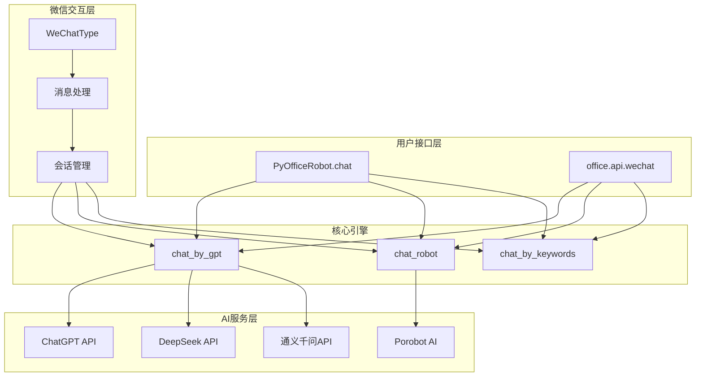
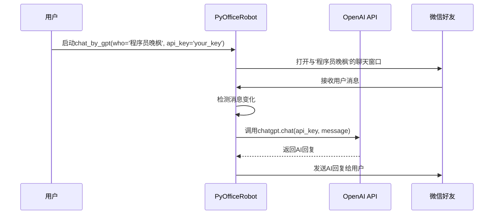
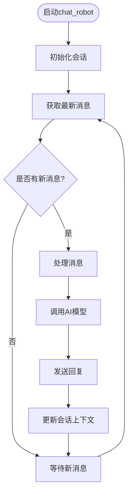
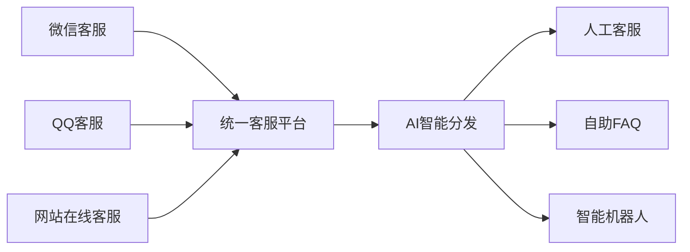

# AI集成与智能对话

<cite>
**本文档引用的文件**
- [011-chat_chatgpt.py](file://examples/PyOfficeRobot/011-chat_chatgpt.py)
- [012、智能聊天.py](file://examples/PyOfficeRobot/012、智能聊天.py)
- [chat.py](file://venv/Lib/site-packages/PyOfficeRobot/api/chat.py)
- [wechat.py](file://office/api/wechat.py)
- [porobot/chat.py](file://examples/porobot/chat.py)
- [@AutomationLog.txt](file://examples/PyOfficeRobot/@AutomationLog.txt)
- [README.md](file://README.md)
</cite>

## 目录
1. [项目概述](#项目概述)
2. [核心架构](#核心架构)
3. [ChatGPT集成实现](#chatgpt集成实现)
4. [智能聊天机器人](#智能聊天机器人)
5. [配置指南](#配置指南)
6. [安全建议](#安全建议)
7. [应用场景](#应用场景)
8. [故障排除](#故障排除)
9. [扩展方向](#扩展方向)
10. [总结](#总结)

## 项目概述

PyOfficeRobot是一个功能强大的Python自动化办公库，其中包含了先进的AI集成能力，特别是与ChatGPT和智能聊天机器人的深度集成。该项目旨在为用户提供开箱即用的AI对话解决方案，无需复杂的配置即可实现智能交互。

### 主要特性

- **多AI模型支持**：支持ChatGPT、DeepSeek、通义千问等多种AI模型
- **实时对话中转**：通过API密钥连接OpenAI服务，实现实时对话中转
- **持续会话管理**：智能聊天接口封装逻辑，支持持续会话上下文管理
- **多种部署模式**：支持独立版本和集成版本两种使用方式

## 核心架构

PyOfficeRobot的AI集成采用模块化设计，主要包含以下几个核心组件：



**图表来源**
- [chat.py](file://venv/Lib/site-packages/PyOfficeRobot/api/chat.py#L81-L193)
- [wechat.py](file://office/api/wechat.py#L6-L95)

## ChatGPT集成实现

### 011-chat_chatgpt.py详解

该文件展示了如何通过API密钥连接OpenAI服务，实现与特定微信好友的实时对话中转。

#### 核心实现逻辑



**图表来源**
- [011-chat_chatgpt.py](file://examples/PyOfficeRobot/011-chat_chatgpt.py#L1-L9)
- [chat.py](file://venv/Lib/site-packages/PyOfficeRobot/api/chat.py#L81-L105)

#### 关键参数配置

| 参数 | 类型 | 默认值 | 描述 |
|------|------|--------|------|
| who | str | 必需 | 微信好友的昵称或备注名 |
| api_key | str | 必需 | OpenAI API密钥 |
| model_engine | str | "text-davinci-002" | 使用的GPT模型引擎 |
| max_tokens | int | 1024 | 最大生成令牌数 |
| temperature | float | 0.5 | 控制输出随机性 |
| top_p | float | 1 | 核采样参数 |
| frequency_penalty | float | 0.0 | 频率惩罚系数 |
| presence_penalty | float | 0.6 | 存在惩罚系数 |

**节来源**
- [chat.py](file://venv/Lib/site-packages/PyOfficeRobot/api/chat.py#L81-L105)

### API密钥管理

#### 获取API密钥步骤

1. **访问OpenAI官网**：前往 https://platform.openai.com/
2. **注册账号**：使用邮箱注册或现有账户登录
3. **进入API密钥页面**：导航到"API Keys"选项卡
4. **创建新密钥**：点击"Create new secret key"按钮
5. **复制密钥**：将生成的API密钥复制并妥善保管

#### 密钥安全存储

```python
# 推荐的安全做法
import os
from dotenv import load_dotenv

# 加载环境变量
load_dotenv()

# 从环境变量获取API密钥
api_key = os.getenv('OPENAI_API_KEY')

# 使用密钥启动ChatGPT集成
PyOfficeRobot.chat.chat_by_gpt(
    who='程序员晚枫',
    api_key=api_key
)
```

## 智能聊天机器人

### 012、智能聊天.py实现

该文件展示了如何使用Porobot AI实现智能聊天功能，支持持续会话上下文管理。

#### chat_robot接口封装逻辑



**图表来源**
- [012、智能聊天.py](file://examples/PyOfficeRobot/012、智能聊天.py#L1-L8)
- [chat.py](file://venv/Lib/site-packages/PyOfficeRobot/api/chat.py#L108-L128)

#### 会话上下文管理

智能聊天机器人具备以下会话管理特性：

- **状态保持**：维持对话历史，支持连续对话
- **上下文感知**：理解对话背景和语境
- **记忆功能**：记住用户偏好和重要信息
- **个性化响应**：根据用户特征调整回复风格

**节来源**
- [chat.py](file://venv/Lib/site-packages/PyOfficeRobot/api/chat.py#L108-L128)

## 配置指南

### 环境准备

#### 安装PyOfficeRobot

```bash
# 使用阿里云镜像源加速安装
pip install -i https://mirrors.aliyun.com/pypi/simple/ PyOfficeRobot -U
```

#### 依赖项检查

确保系统满足以下要求：
- Python 3.7+
- Windows 10/11 (推荐)
- 微信客户端（非网页版）

### 基础配置

#### 1. 微信好友识别

```python
# 设置对话对象
who = '程序员晚枫'  # 微信好友的昵称或备注名

# 支持特殊字符的用户名
who_special = '每天进步一点点'  # 包含特殊字符的用户名
```

#### 2. API密钥配置

```python
# 方法一：直接传入密钥（不推荐）
PyOfficeRobot.chat.chat_by_gpt(
    who='程序员晚枫',
    api_key='sk-your-api-key-here'
)

# 方法二：环境变量方式（推荐）
import os
os.environ['OPENAI_API_KEY'] = 'sk-your-api-key-here'

# 使用环境变量
PyOfficeRobot.chat.chat_by_gpt(
    who='程序员晚枫'
)
```

#### 3. 模型参数调优

```python
# 高质量对话配置
PyOfficeRobot.chat.chat_by_gpt(
    who='程序员晚枫',
    api_key='your_key',
    model_engine="gpt-4",
    temperature=0.7,
    max_tokens=2048,
    top_p=0.9,
    frequency_penalty=0.1,
    presence_penalty=0.2
)

# 快速响应配置
PyOfficeRobot.chat.chat_by_gpt(
    who='程序员晚枫',
    api_key='your_key',
    model_engine="gpt-3.5-turbo",
    temperature=0.3,
    max_tokens=512
)
```

### 高级配置选项

#### 多模型切换

```python
# DeepSeek模型
PyOfficeRobot.chat.chat_by_deepseek(
    who='程序员晚枫',
    api_key='your_deepseek_key'
)

# 通义千问模型
PyOfficeRobot.chat.chat_by_zhipu(
    who='程序员晚枫',
    key='your_zhipu_key',
    model='glm-4'
)
```

**节来源**
- [chat.py](file://venv/Lib/site-packages/PyOfficeRobot/api/chat.py#L173-L193)

## 安全建议

### 密钥保护

#### 1. 环境变量管理

```python
# .env文件内容
OPENAI_API_KEY=sk-your-secret-key
DEEPSEEK_API_KEY=your-deepseek-key
ZHIPU_API_KEY=your-zhipu-key

# Python代码
from dotenv import load_dotenv
import os

load_dotenv()
api_key = os.getenv('OPENAI_API_KEY')
```

#### 2. 密钥轮换策略

```python
# 实现密钥轮换机制
import random
from datetime import datetime, timedelta

class APICredentialManager:
    def __init__(self):
        self.credentials = [
            {'key': 'key1', 'expires': None},
            {'key': 'key2', 'expires': None},
            {'key': 'key3', 'expires': None}
        ]
    
    def get_active_key(self):
        now = datetime.now()
        for cred in self.credentials:
            if not cred['expires'] or now < cred['expires']:
                return cred['key']
        return self._rotate_keys()
    
    def _rotate_keys(self):
        # 实现密钥轮换逻辑
        pass
```

### 请求日志脱敏

#### 日志过滤配置

```python
# 自定义日志处理器
import logging
import re

class APILogsFilter(logging.Filter):
    def filter(self, record):
        # 过滤API密钥和敏感信息
        message = record.getMessage()
        # 移除API密钥
        message = re.sub(r'sk-[a-zA-Z0-9]{48}', '[REDACTED]', message)
        # 移除其他敏感信息
        message = re.sub(r'\b\d{10,}\b', '[REDACTED]', message)
        record.msg = message
        return True

# 添加过滤器到日志记录器
logger = logging.getLogger()
logger.addFilter(APILogsFilter())
```

### 网络安全

#### 1. 代理配置

```python
import requests
from requests.adapters import HTTPAdapter
from urllib3.util.retry import Retry

# 配置代理和重试机制
session = requests.Session()
retry_strategy = Retry(
    total=3,
    backoff_factor=1,
    status_forcelist=[429, 500, 502, 503, 504],
)

adapter = HTTPAdapter(max_retries=retry_strategy)
session.mount("http://", adapter)
session.mount("https://", adapter)

# 设置代理
proxies = {
    'http': 'http://proxy.example.com:8080',
    'https': 'https://proxy.example.com:8080',
}
session.proxies.update(proxies)
```

#### 2. SSL证书验证

```python
# 禁用SSL验证（仅测试环境）
requests.packages.urllib3.disable_warnings()
response = requests.get(
    'https://api.openai.com/v1/chat/completions',
    verify=False
)

# 生产环境应启用SSL验证
response = requests.get(
    'https://api.openai.com/v1/chat/completions',
    verify=True
)
```

## 应用场景

### 智能客服系统

#### 企业客服自动化

```python
# 企业客服配置
company_keywords = {
    "产品咨询": "您好，关于我们的产品，您可以查看官网的产品介绍。",
    "技术支持": "技术支持团队会在24小时内回复您的问题。",
    "订单查询": "请提供订单号，我们将为您查询最新状态。",
    "售后服务": "售后服务热线：400-xxx-xxxx"
}

# 启动企业客服
PyOfficeRobot.chat.chat_by_keywords(
    who='客户服务中心',
    keywords=company_keywords
)
```

#### 多渠道客服集成



### 个人助理应用

#### 日程管理助手

```python
# 个人助理配置
personal_assistant = {
    "今天有什么安排": "您今天的日程如下：\n9:00-10:00 团队会议\n10:30-12:00 项目开发",
    "提醒事项": "以下是您的提醒事项：\n1. 下午3点与张经理的电话会议\n2. 明天上午10点的项目汇报",
    "天气情况": "今天北京晴，气温18-25℃，空气质量良好。",
    "备忘录": "您有以下备忘事项：\n1. 购买生日礼物\n2. 整理工作台"
}

# 启动个人助理
PyOfficeRobot.chat.chat_by_keywords(
    who='个人助理',
    keywords=personal_assistant
)
```

#### 学习辅导助手

```python
# 学习辅导配置
learning_assistant = {
    "数学题": "这道数学题的解法是...\n[详细解答过程]",
    "英语语法": "英语语法要点：\n1. 时态使用\n2. 名词复数形式\n3. 形容词比较级",
    "编程问题": "编程问题解答：\n[代码示例]\n[详细解释]",
    "学习计划": "建议的学习计划：\n1. 每天2小时专业学习\n2. 1小时英语练习\n3. 30分钟体育锻炼"
}
```

### 教育培训场景

#### 在线教育助手

```python
# 教育培训配置
edu_assistant = {
    "课程内容": "本周课程内容：\n1. Python基础语法\n2. 数据结构与算法\n3. Web开发入门",
    "作业辅导": "作业辅导：\n[具体题目解答]\n[解题思路分析]",
    "考试准备": "考试复习重点：\n1. 重点章节回顾\n2. 典型例题练习\n3. 模拟考试安排",
    "学习资源": "推荐学习资源：\n1. 在线课程链接\n2. 参考书籍推荐\n3. 实践项目建议"
}
```

**节来源**
- [003-根据关键词回复.py](file://examples/PyOfficeRobot/003-根据关键词回复.py#L1-L15)

## 故障排除

### 常见问题及解决方案

#### 1. API密钥无效

**问题症状**：
- 认证失败错误
- 401 Unauthorized响应
- API调用被拒绝

**解决方案**：
```python
# 验证API密钥有效性
import openai

def validate_api_key(api_key):
    try:
        openai.api_key = api_key
        # 尝试简单的API调用
        response = openai.Completion.create(
            engine="text-davinci-002",
            prompt="test",
            max_tokens=1
        )
        return True
    except openai.error.AuthenticationError:
        return False
    except Exception as e:
        print(f"验证过程中出现错误: {e}")
        return False

# 使用示例
if not validate_api_key('your_api_key'):
    print("API密钥无效，请检查后重试")
```

#### 2. 速率限制问题

**问题症状**：
- 429 Too Many Requests错误
- 请求被临时阻止
- 响应延迟过高

**解决方案**：
```python
import time
import openai
from openai.error import RateLimitError

def chat_with_retry(message, max_retries=3):
    for attempt in range(max_retries):
        try:
            response = openai.ChatCompletion.create(
                model="gpt-3.5-turbo",
                messages=[{"role": "user", "content": message}]
            )
            return response.choices[0].message.content
        except RateLimitError:
            wait_time = 2 ** attempt  # 指数退避
            print(f"达到速率限制，等待 {wait_time} 秒后重试...")
            time.sleep(wait_time)
        except Exception as e:
            print(f"发生错误: {e}")
            break
    return "抱歉，当前无法处理您的请求，请稍后再试。"
```

#### 3. 微信连接问题

**问题症状**：
- 无法找到指定联系人
- 消息发送失败
- 会话列表获取超时

**解决方案**：
```python
# 检查微信连接状态
def check_wechat_connection():
    try:
        # 尝试获取会话列表
        wx.GetSessionList()
        sessions = wx.GetAllMessage
        if sessions:
            return True
        else:
            print("未找到任何会话，请确认微信已登录")
            return False
    except Exception as e:
        print(f"微信连接异常: {e}")
        return False

# 重试机制
def connect_with_retry(max_attempts=3):
    for attempt in range(max_attempts):
        if check_wechat_connection():
            print("微信连接成功")
            return True
        print(f"尝试 {attempt + 1}/{max_attempts} 连接微信...")
        time.sleep(5)
    print("微信连接失败，请检查微信是否正常运行")
    return False
```

#### 4. 内存泄漏问题

**问题症状**：
- 程序运行一段时间后内存占用过高
- 响应速度变慢
- 系统资源耗尽

**解决方案**：
```python
import gc
import psutil
import threading

class MemoryMonitor(threading.Thread):
    def __init__(self, threshold_mb=1000):
        super().__init__()
        self.threshold = threshold_mb * 1024 * 1024
        self.stop_event = threading.Event()
    
    def run(self):
        while not self.stop_event.is_set():
            memory_usage = psutil.Process().memory_info().rss
            if memory_usage > self.threshold:
                print(f"内存使用过高: {memory_usage / 1024 / 1024:.2f} MB")
                gc.collect()  # 强制垃圾回收
            time.sleep(60)  # 每分钟检查一次
    
    def stop(self):
        self.stop_event.set()

# 使用内存监控
monitor = MemoryMonitor()
monitor.start()

# 在程序结束时停止监控
# monitor.stop()
```

**节来源**
- [@AutomationLog.txt](file://examples/PyOfficeRobot/@AutomationLog.txt#L1-L84)

## 扩展方向

### 单轮/多轮对话限制

当前实现存在以下对话模式限制：

#### 单轮对话模式
- **特点**：每次用户提问都需要重新构建上下文
- **适用场景**：简单问答、一次性查询
- **性能优势**：响应速度快，资源消耗低

#### 多轮对话模式
- **特点**：保持对话历史，支持连续交互
- **适用场景**：复杂咨询、项目协作、教育培训
- **技术挑战**：上下文管理、状态同步、内存控制

### 可能的扩展方向

#### 1. 上下文持久化

```python
# 对话历史持久化
import json
from datetime import datetime

class ConversationManager:
    def __init__(self, storage_path='conversations.json'):
        self.storage_path = storage_path
        self.conversations = self._load_conversations()
    
    def save_conversation(self, user_id, messages):
        self.conversations[user_id] = {
            'messages': messages,
            'timestamp': datetime.now().isoformat(),
            'message_count': len(messages)
        }
        self._save_conversations()
    
    def get_conversation(self, user_id):
        return self.conversations.get(user_id, {}).get('messages', [])
    
    def _load_conversations(self):
        try:
            with open(self.storage_path, 'r', encoding='utf-8') as f:
                return json.load(f)
        except FileNotFoundError:
            return {}
    
    def _save_conversations(self):
        with open(self.storage_path, 'w', encoding='utf-8') as f:
            json.dump(self.conversations, f, ensure_ascii=False, indent=2)
```

#### 2. 多模态对话支持

```python
# 多模态对话处理
class MultimodalChatHandler:
    def __init__(self):
        self.image_processor = ImageProcessor()
        self.audio_processor = AudioProcessor()
    
    def process_input(self, input_data):
        if isinstance(input_data, dict):
            if 'text' in input_data:
                return self.process_text(input_data['text'])
            elif 'image' in input_data:
                return self.process_image(input_data['image'])
            elif 'audio' in input_data:
                return self.process_audio(input_data['audio'])
        return "无法处理的输入格式"
    
    def process_image(self, image_data):
        # 图像分析和描述
        analysis = self.image_processor.analyze(image_data)
        return f"图像分析结果: {analysis}"
    
    def process_audio(self, audio_data):
        # 语音转文字
        transcription = self.audio_processor.transcribe(audio_data)
        return self.process_text(transcription)
```

#### 3. 智能路由系统

```python
# 智能对话路由
class IntelligentRouter:
    def __init__(self):
        self.rules = []
    
    def add_rule(self, condition, handler):
        self.rules.append((condition, handler))
    
    def route(self, message, user_context):
        for condition, handler in self.rules:
            if condition(message, user_context):
                return handler(message, user_context)
        return self.default_handler(message, user_context)
    
    def default_handler(self, message, user_context):
        return "抱歉，我暂时无法处理这个问题。"
```

#### 4. 个性化定制

```python
# 用户画像和个性化
class PersonalizationEngine:
    def __init__(self):
        self.user_profiles = {}
    
    def update_profile(self, user_id, interaction_data):
        if user_id not in self.user_profiles:
            self.user_profiles[user_id] = {
                'preferences': {},
                'behavior_patterns': [],
                'interaction_history': []
            }
        
        profile = self.user_profiles[user_id]
        profile['interaction_history'].append(interaction_data)
        self._analyze_behavior(profile)
    
    def get_personalized_response(self, user_id, message):
        profile = self.user_profiles.get(user_id, {})
        preferences = profile.get('preferences', {})
        
        # 基于用户偏好生成个性化响应
        if 'preferred_tone' in preferences:
            tone = preferences['preferred_tone']
            return self._generate_tone_specific_response(message, tone)
        return self._default_response(message)
```

## 总结

PyOfficeRobot的AI集成能力为开发者提供了强大而灵活的智能对话解决方案。通过ChatGPT和智能聊天机器人的深度集成，用户可以轻松实现各种智能化应用场景。

### 核心优势

1. **易用性**：一行代码即可启动AI对话功能
2. **灵活性**：支持多种AI模型和配置选项
3. **稳定性**：完善的错误处理和重试机制
4. **安全性**：专业的密钥管理和日志脱敏

### 最佳实践建议

1. **安全第一**：始终使用环境变量存储API密钥
2. **性能优化**：合理配置模型参数和缓存策略
3. **用户体验**：提供清晰的错误提示和帮助信息
4. **持续监控**：建立完善的日志记录和性能监控体系

### 未来展望

随着AI技术的不断发展，PyOfficeRobot将继续扩展其AI集成能力，为用户提供更加智能、高效、安全的自动化办公解决方案。我们期待看到更多创新的应用场景和功能扩展，共同推动AI技术在办公领域的普及和发展。