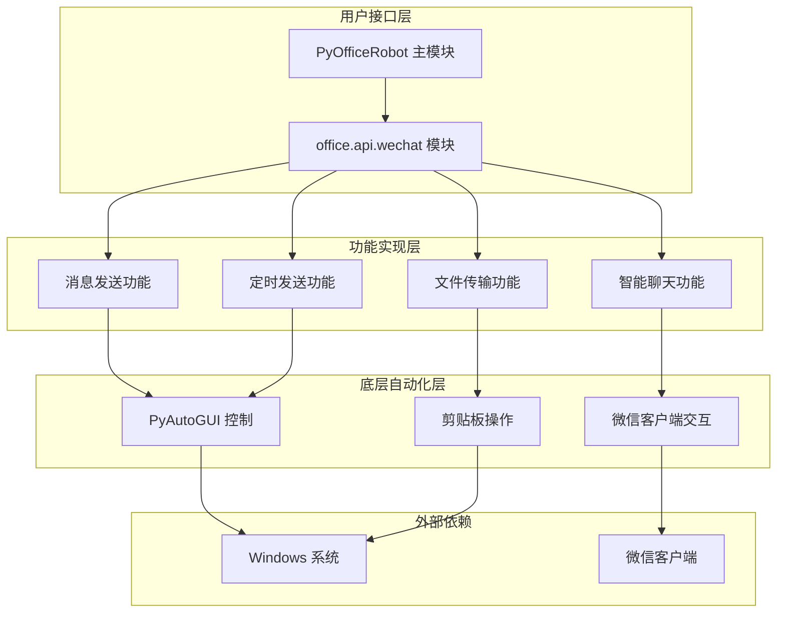
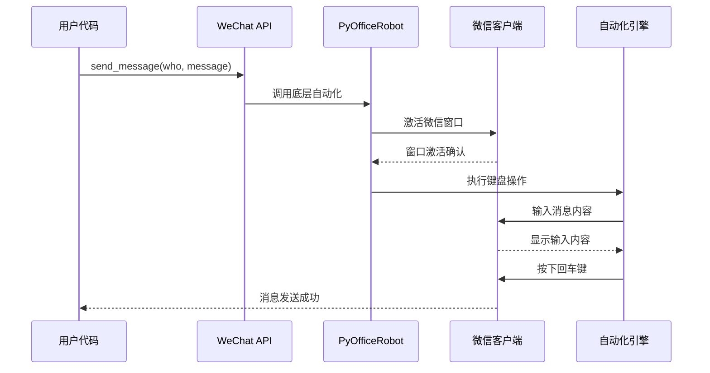
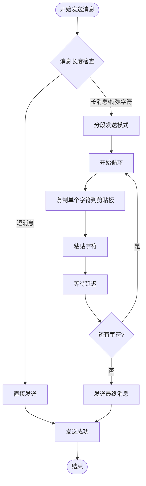
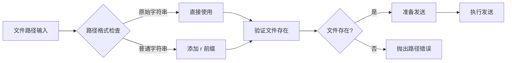
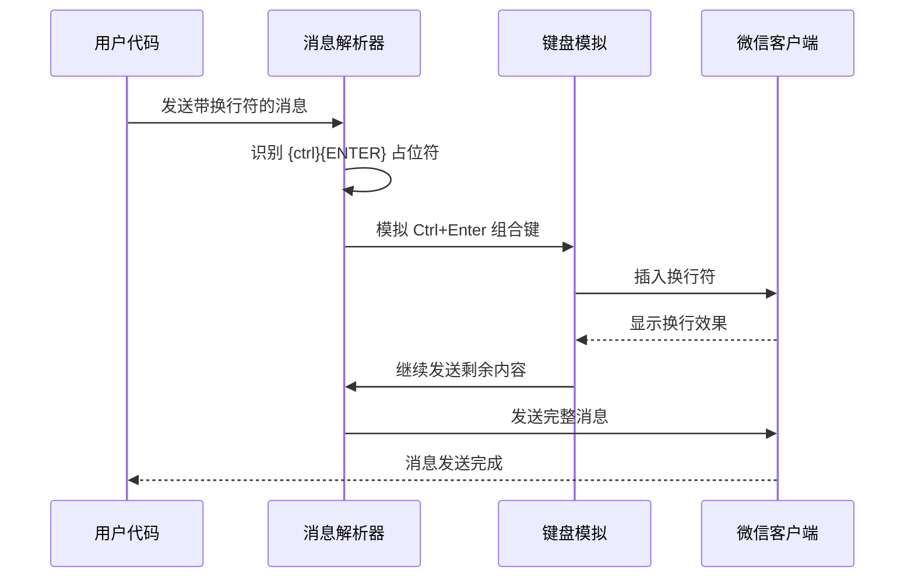
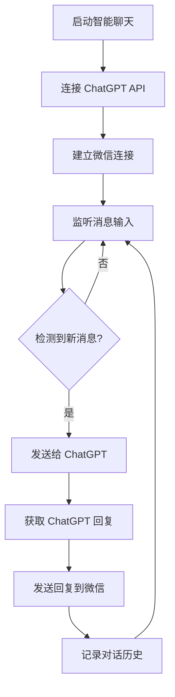
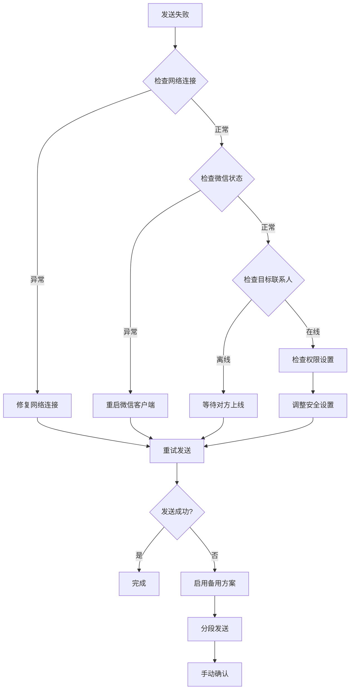
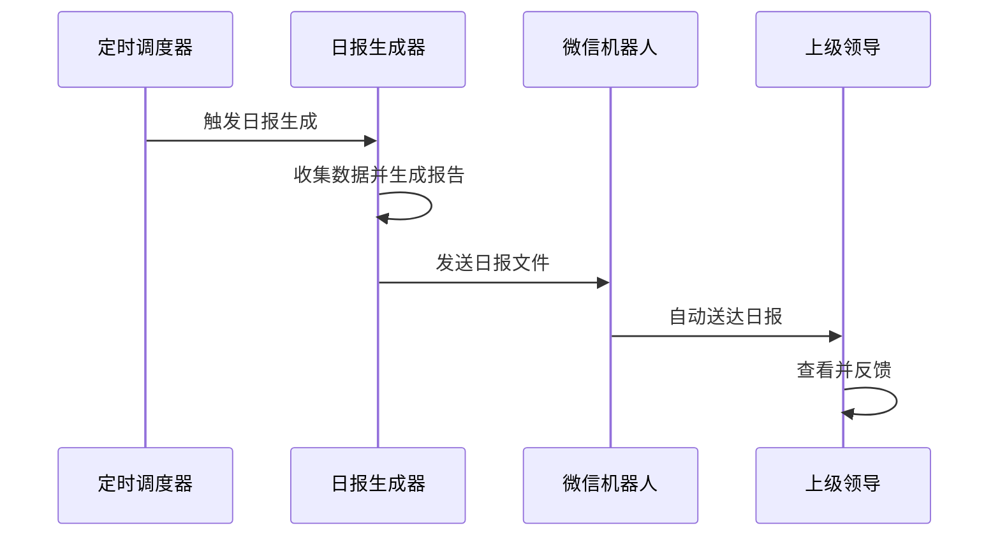
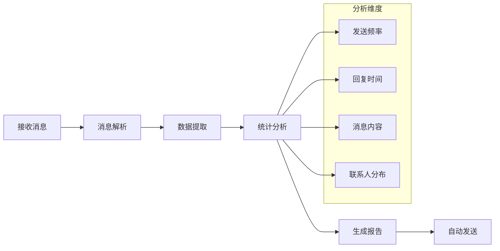

# 基础通信功能

<cite>
**本文档引用的文件**
- [001-发一条信息.py](file://examples/PyOfficeRobot/001-发一条信息.py)
- [002-发文件.py](file://examples/PyOfficeRobot/002-发文件.py)
- [008-发消息换行.py](file://examples/PyOfficeRobot/008-发消息换行.py)
- [wechat.py](file://office/api/wechat.py)
- [test_wechat.py](file://tests/test_code/test_wechat.py)
- [README.md](file://README.md)
</cite>

## 目录
1. [简介](#简介)
2. [项目架构](#项目架构)
3. [核心功能概述](#核心功能概述)
4. [发送纯文本消息](#发送纯文本消息)
5. [发送文件](#发送文件)
6. [消息换行功能](#消息换行功能)
7. [高级功能](#高级功能)
8. [错误处理与故障排除](#错误处理与故障排除)
9. [实际应用场景](#实际应用场景)
10. [最佳实践](#最佳实践)

## 简介

Python Office 提供了一套强大的微信自动化通信功能，通过 PyOfficeRobot 库实现了无需网页版微信即可操作微信的功能。该系统采用底层自动化技术，能够精确控制微信客户端界面元素，实现消息发送、文件传输等自动化操作。

### 主要特性

- **跨平台兼容**：支持 Windows 系统下的微信客户端自动化
- **多种消息类型**：支持纯文本、富文本、文件等多种消息格式
- **高精度控制**：基于控件定位的精确消息发送机制
- **灵活配置**：支持定时发送、批量操作等功能
- **错误恢复**：具备完善的错误处理和重试机制

## 项目架构



**图表来源**
- [wechat.py](file://office/api/wechat.py#L1-L95)
- [001-发一条信息.py](file://examples/PyOfficeRobot/001-发一条信息.py#L1-L52)

## 核心功能概述

微信自动化通信功能主要包含以下核心模块：

### 功能模块表

| 功能模块 | 方法名称 | 描述 | 参数要求 | 返回值 |
|---------|---------|------|---------|--------|
| 消息发送 | `send_message()` | 发送纯文本消息 | `who`: 接收人名称<br>`message`: 消息内容 | 无返回值 |
| 文件发送 | `send_file()` | 发送各种类型文件 | `who`: 接收人名称<br>`file`: 文件路径 | 无返回值 |
| 定时发送 | `send_message_by_time()` | 指定时间发送消息 | `who`: 接收人名称<br>`message`: 消息内容<br>`time`: 发送时间 | 无返回值 |
| 关键词回复 | `chat_by_keywords()` | 基于关键词自动回复 | `who`: 联系人名称<br>`keywords`: 关键词列表 | 无返回值 |
| 智能聊天 | `chat_robot()` | 与指定联系人智能对话 | `who`: 联系人名称(可选) | 无返回值 |
| 消息接收 | `receive_message()` | 接收并保存消息 | `who`: 发送人(默认文件传输助手)<br>`txt`: 输出文件名<br>`output_path`: 保存路径 | 无返回值 |

**章节来源**
- [wechat.py](file://office/api/wechat.py#L6-L94)

## 发送纯文本消息

### 基础消息发送

最简单的消息发送功能通过 `PyOfficeRobot.chat.send_message()` 实现，支持基本的文本消息发送。

#### 核心实现原理



**图表来源**
- [001-发一条信息.py](file://examples/PyOfficeRobot/001-发一条信息.py#L46-L52)
- [wechat.py](file://office/api/wechat.py#L6-L16)

#### 参数配置方法

| 参数名称 | 类型 | 必需 | 描述 | 示例值 |
|---------|------|------|------|--------|
| `who` | str | 是 | 接收人昵称或备注名 | `'小红书：程序员晚枫'` |
| `message` | str | 是 | 要发送的消息内容 | `'你好，这是一条测试消息'` |

#### Emoji 表情支持

系统支持完整的 Unicode 表情符号，包括但不限于：
- ✨ 星星表情
- 🌤️ 天气表情
- ☕ 咖啡表情
- 📧 邮件表情

**章节来源**
- [001-发一条信息.py](file://examples/PyOfficeRobot/001-发一条信息.py#L7-L52)
- [wechat.py](file://office/api/wechat.py#L6-L16)

### 高级消息发送功能

对于复杂的文本格式和特殊字符，系统提供了增强版的消息发送功能。

#### 分段发送机制

当遇到特殊字符或长文本时，系统会自动采用分段发送策略：



**图表来源**
- [001-发一条信息.py](file://examples/PyOfficeRobot/001-发一条信息.py#L36-L43)

## 发送文件

### 文件发送功能

文件发送功能支持多种文件类型的传输，包括图片、文档、压缩包等。

#### 支持的文件类型

| 文件类型 | 扩展名示例 | 大小限制 | 特殊说明 |
|---------|-----------|---------|---------|
| 图片文件 | `.jpg`, `.png`, `.gif`, `.bmp` | 通常无限制 | 支持各种格式的图片 |
| 文档文件 | `.docx`, `.pdf`, `.txt`, `.xlsx` | 通常无限制 | 需要微信客户端支持预览 |
| 压缩文件 | `.zip`, `.rar`, `.7z` | 通常无限制 | 支持大文件传输 |
| 音频文件 | `.mp3`, `.wav`, `.aac` | 通常无限制 | 支持在线播放 |
| 视频文件 | `.mp4`, `.avi`, `.mov` | 通常无限制 | 支持在线播放 |

#### 文件路径配置



**图表来源**
- [002-发文件.py](file://examples/PyOfficeRobot/002-发文件.py#L1-L8)

**章节来源**
- [002-发文件.py](file://examples/PyOfficeRobot/002-发文件.py#L1-L8)
- [wechat.py](file://office/api/wechat.py#L46-L56)

## 消息换行功能

### 换行实现机制

微信自动化系统支持在消息中插入换行符，实现多行文本的发送。

#### 换行语法

系统使用特殊的占位符语法来实现换行：

```python
message = "第一行内容" + "{ctrl}{ENTER}" + "第二行内容"
```

#### 换行工作流程



**图表来源**
- [008-发消息换行.py](file://examples/PyOfficeRobot/008-发消息换行.py#L6-L7)

**章节来源**
- [008-发消息换行.py](file://examples/PyOfficeRobot/008-发消息换行.py#L1-L8)

## 高级功能

### 定时发送功能

系统支持精确到秒的定时消息发送，适用于日程提醒、定时通知等场景。

#### 定时发送参数

| 参数 | 类型 | 格式要求 | 示例 |
|------|------|---------|------|
| `who` | str | 接收人名称 | `'每天进步一点点'` |
| `message` | str | 消息内容 | `'早安，新的一天开始了！'` |
| `time` | str | 24小时制时间 | `'08:30:00'` |

### 智能聊天功能

集成 ChatGPT 的智能对话功能，实现与指定联系人的自然语言交互。

#### 智能聊天工作流程



**章节来源**
- [wechat.py](file://office/api/wechat.py#L19-L94)

## 错误处理与故障排除

### 常见问题及解决方案

#### 1. 微信客户端未启动

**问题描述**：程序无法找到微信窗口，导致发送失败。

**解决方案**：
- 确保微信客户端已完全启动并显示在桌面上
- 检查任务栏中是否有微信图标
- 确认微信不是最小化状态

#### 2. 消息发送失败

**问题描述**：调用发送接口后消息未能成功发送。

**解决方案**：


#### 3. 文件路径错误

**问题描述**：指定的文件路径不存在或格式不正确。

**解决方案**：
- 使用原始字符串前缀 `r` 来避免转义字符问题
- 确认文件路径的正确性
- 检查文件是否被其他程序占用

#### 4. 权限不足

**问题描述**：程序无法访问微信客户端或执行自动化操作。

**解决方案**：
- 以管理员权限运行 Python 脚本
- 检查 Windows UAC 设置
- 确认杀毒软件没有阻止自动化操作

### 故障排除检查清单

| 检查项目 | 检查方法 | 预期结果 |
|---------|---------|---------|
| 微信客户端状态 | 查看任务栏图标 | 微信图标可见且正常 |
| 网络连接 | 测试互联网访问 | 网络连接正常 |
| 文件路径 | 验证文件存在 | 文件路径有效 |
| 权限设置 | 检查程序权限 | 具有足够的系统权限 |
| 自动化支持 | 测试简单操作 | 能够执行基本键盘操作 |

**章节来源**
- [001-发一条信息.py](file://examples/PyOfficeRobot/001-发一条信息.py#L33-L43)

## 实际应用场景

### 自动通知系统

#### 日报自动发送



#### 项目进度通知

系统可以设置定时任务，在特定时间自动向相关人员发送项目进度报告，确保信息及时传达。

### 批量消息处理

#### 客户服务自动化

对于客服场景，系统可以：
- 自动响应常见问题
- 根据关键词触发预设回复
- 记录客户咨询历史
- 转接复杂问题给人工客服

#### 内部沟通优化

在企业内部应用：
- 自动生成会议纪要
- 自动分发重要通知
- 批量发送培训资料
- 自动统计工作完成情况

### 数据收集与分析

#### 消息统计功能



**章节来源**
- [test_wechat.py](file://tests/test_code/test_wechat.py#L16-L20)

## 最佳实践

### 性能优化建议

#### 1. 消息发送优化

- **批量发送控制**：避免过于频繁的消息发送，建议每次发送间隔至少1秒
- **文件大小控制**：对于大文件传输，考虑分包发送或使用云存储链接
- **网络稳定性**：在网络不稳定环境下，增加发送重试机制

#### 2. 资源管理

- **内存使用**：及时释放大型文件的内存占用
- **进程监控**：定期检查自动化进程的资源消耗
- **异常处理**：完善异常捕获和资源清理机制

### 安全注意事项

#### 1. 数据保护

- **敏感信息过滤**：避免发送包含敏感个人信息的消息
- **文件安全**：对发送的文件进行病毒扫描
- **访问控制**：限制自动化程序的系统访问权限

#### 2. 隐私保护

- **消息记录**：谨慎处理消息内容的本地存储
- **用户同意**：确保所有自动化操作都获得用户授权
- **审计日志**：记录重要的自动化操作以便追溯

### 开发调试指南

#### 1. 调试技巧

- **日志记录**：启用详细的执行日志以便问题排查
- **断点调试**：在关键位置设置断点观察变量状态
- **单元测试**：编写针对各个功能模块的单元测试

#### 2. 版本兼容性

- **微信版本适配**：关注微信客户端更新对自动化功能的影响
- **系统兼容性**：测试不同 Windows 版本的兼容性
- **依赖管理**：定期更新相关依赖库版本

**章节来源**
- [README.md](file://README.md#L47-L150)

## 结论

Python Office 的微信自动化通信功能提供了一个强大而灵活的解决方案，通过 PyOfficeRobot 库的封装，使得复杂的微信自动化操作变得简单易用。从基础的消息发送到高级的智能聊天，从文件传输到定时任务，系统涵盖了日常工作中的各种通信需求。

随着微信客户端的不断更新，该自动化系统也在持续改进，通过完善的错误处理机制和灵活的配置选项，确保了在各种环境下的稳定运行。对于需要自动化办公解决方案的用户来说，这是一个值得信赖的选择。