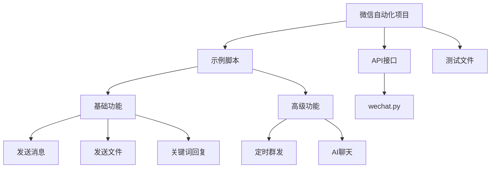

# 微信自动化示例

<cite>
**本文档中引用的文件**  
- [001-发一条信息.py](file://examples/PyOfficeRobot/001-发一条信息.py)
- [002-发文件.py](file://examples/PyOfficeRobot/002-发文件.py)
- [003-根据关键词回复.py](file://examples/PyOfficeRobot/003-根据关键词回复.py)
- [004-定时发送.py](file://examples/PyOfficeRobot/004-定时发送.py)
- [009-批量加好友.py](file://examples/PyOfficeRobot/009-批量加好友.py)
- [010-定时群发.py](file://examples/PyOfficeRobot/010-定时群发.py)
- [011-chat_chatgpt.py](file://examples/PyOfficeRobot/011-chat_chatgpt.py)
- [012、智能聊天.py](file://examples/PyOfficeRobot/012、智能聊天.py)
- [wechat.py](file://office/api/wechat.py)
- [@AutomationLog.txt](file://examples/PyOfficeRobot/@AutomationLog.txt)
- [content.txt](file://examples/PyOfficeRobot/010-定时群发的资料/content.txt)
- [005-自定义功能.py](file://examples/PyOfficeRobot/005-自定义功能.py)
- [readme.md](file://examples/readme.md)
</cite>

## 目录
1. [简介](#简介)
2. [项目结构](#项目结构)
3. [核心功能详解](#核心功能详解)
4. [AI集成机制](#ai集成机制)
5. [配置与运行方式](#配置与运行方式)
6. [常见问题与解决方案](#常见问题与解决方案)
7. [应用场景](#应用场景)
8. [结论](#结论)

## 简介
本项目提供了一系列微信自动化脚本，旨在帮助用户实现消息自动发送、文件传输、关键词回复、定时群发、批量加好友等操作。通过调用PyOfficeRobot库，这些脚本能够模拟人工操作，提升工作效率。特别地，脚本011-chat_chatgpt.py和012、智能聊天.py集成了AI能力，实现了基于ChatGPT的智能对话功能。

## 项目结构
项目主要包含以下目录：
- `examples/PyOfficeRobot/`：存放各类微信自动化示例脚本
- `office/api/wechat.py`：封装了微信相关功能的API接口
- `contributors/`：贡献者提供的其他工具脚本
- `gui/qtpy/`：图形界面相关代码
- `tests/`：测试用例

核心微信自动化脚本位于`examples/PyOfficeRobot/`目录下，每个脚本对应一个具体功能。



**图源**
- [001-发一条信息.py](file://examples/PyOfficeRobot/001-发一条信息.py)
- [wechat.py](file://office/api/wechat.py)

## 核心功能详解

### 基础消息发送
使用`001-发一条信息.py`脚本可实现向指定联系人发送文本消息。脚本支持普通文本及Emoji表情符号的发送。

**代码关键点：**
- 使用`PyOfficeRobot.chat.send_message()`方法发送消息
- 通过`pyperclip`和`pyautogui`库实现剪贴板复制和键盘粘贴操作
- 包含异常处理机制，确保消息发送的稳定性

**节源**
- [001-发一条信息.py](file://examples/PyOfficeRobot/001-发一条信息.py)

### 文件传输
`002-发文件.py`脚本用于向指定联系人发送本地文件。支持任意类型的文件传输。

**注意事项：**
- Windows系统中文件路径需使用原始字符串（前缀r）
- 需要确保文件路径正确且可访问

**节源**
- [002-发文件.py](file://examples/PyOfficeRobot/002-发文件.py)

### 关键词自动回复
`003-根据关键词回复.py`脚本实现了基于关键词的自动回复功能。当收到特定关键词时，自动回复预设内容。

**配置方式：**
```python
keywords = {
    "我要报名": "你好，这是报名链接：www.python-office.com",
    "点赞了吗？": "点了",
}
```

**节源**
- [003-根据关键词回复.py](file://examples/PyOfficeRobot/003-根据关键词回复.py)

### 定时消息发送
`004-定时发送.py`脚本可在指定时间自动发送消息。适用于提醒、通知等场景。

**参数说明：**
- `who`：接收人昵称或备注
- `message`：发送内容
- `time`：发送时间（24小时制）

**节源**
- [004-定时发送.py](file://examples/PyOfficeRobot/004-定时发送.py)

### 批量加好友
`009-批量加好友.py`脚本支持批量添加微信好友。通过配置微信号和备注信息，实现一键添加。

**注意：** 该功能存在已知BUG，因微信控件变更导致。

**节源**
- [009-批量加好友.py](file://examples/PyOfficeRobot/009-批量加好友.py)

### 定时群发
`010-定时群发.py`脚本结合`010-定时群发的资料/content.txt`中的内容，实现定时群发消息功能。

**数据源：**
- 消息内容存储在`content.txt`文件中
- 通过`PyOfficeRobot.group.send()`方法执行群发

**节源**
- [010-定时群发.py](file://examples/PyOfficeRobot/010-定时群发.py)
- [content.txt](file://examples/PyOfficeRobot/010-定时群发的资料/content.txt)

## AI集成机制

### 011-chat_chatgpt.py 实现原理
该脚本通过集成OpenAI的ChatGPT API，实现智能化的聊天回复功能。

**核心代码：**
```python
PyOfficeRobot.chat.chat_by_gpt(who='程序员晚枫', api_key='你的api_key')
```

**工作机制：**
1. 监听指定联系人的消息
2. 将收到的消息作为输入发送给ChatGPT API
3. 获取AI生成的回复内容
4. 自动将回复发送给对方

**节源**
- [011-chat_chatgpt.py](file://examples/PyOfficeRobot/011-chat_chatgpt.py)

### 012、智能聊天.py 实现原理
此脚本提供了更高级的智能聊天功能，无需手动配置API密钥。

**特点：**
- 一行代码即可启动智能聊天机器人
- 内部封装了AI对话逻辑
- 支持上下文记忆

**调用方式：**
```python
PyOfficeRobot.chat.chat_robot(who='每天进步一点点')
```

**节源**
- [012、智能聊天.py](file://examples/PyOfficeRobot/012、智能聊天.py)

## 配置与运行方式

### 环境准备
1. 安装依赖库：
```bash
pip install -i https://mirrors.aliyun.com/pypi/simple/ PyOfficeRobot -U
```

2. 确保微信客户端已登录并保持运行

### 配置步骤
1. 修改脚本中的接收人名称（who参数）
2. 根据需要调整消息内容或文件路径
3. 对于AI功能，需在011-chat_chatgpt.py中配置有效的API密钥

### 运行方法
直接运行对应的Python脚本文件：
```bash
python 001-发一条信息.py
```

**节源**
- [readme.md](file://examples/readme.md)

## 常见问题与解决方案

### 登录失败
**问题表现：** 脚本无法识别微信窗口或操作失败

**解决方案：**
1. 确保微信客户端已成功登录
2. 将微信窗口置于前台
3. 检查是否有弹窗或更新提示遮挡界面

### 消息发送限制
**问题表现：** 频繁发送消息导致功能失效

**应对策略：**
1. 避免短时间内发送大量消息
2. 增加发送间隔时间
3. 分批处理消息发送任务

### 控件识别失败
**问题表现：** 脚本报错"Find Control Timeout"

**原因分析：** 微信客户端界面更新导致控件定位失效

**解决方法：**
1. 查看`@AutomationLog.txt`日志文件获取详细错误信息
2. 等待PyOfficeRobot库更新以适配新版微信
3. 临时使用旧版微信客户端

**节源**
- [@AutomationLog.txt](file://examples/PyOfficeRobot/@AutomationLog.txt)

## 应用场景

### 客服自动化
- 自动回复常见问题
- 7x24小时在线服务
- 提高响应速度和客户满意度

### 营销推广
- 定时发送促销信息
- 批量添加潜在客户
- 自动化营销活动执行

### 团队协作
- 定时发送工作提醒
- 自动化日报/周报发送
- 文件批量分发

## 结论
本系列微信自动化脚本为个人和企业用户提供了强大的自动化工具集。从基础的消息发送到高级的AI集成，覆盖了多种实际应用场景。尽管部分功能存在兼容性问题，但整体架构清晰，易于扩展和维护。建议用户根据实际需求选择合适的脚本，并注意遵守微信使用规范，避免过度自动化带来的账号风险。