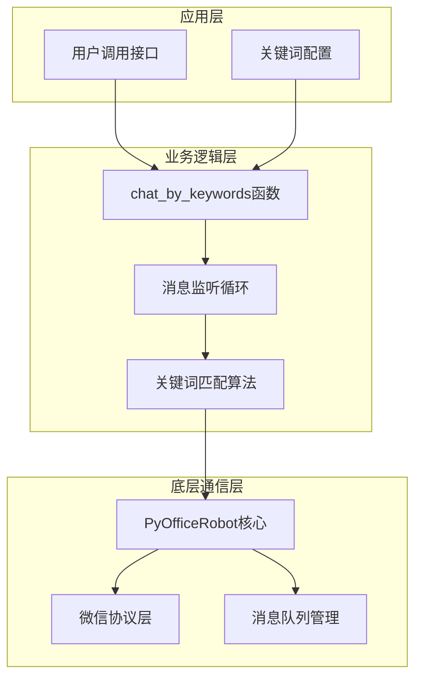
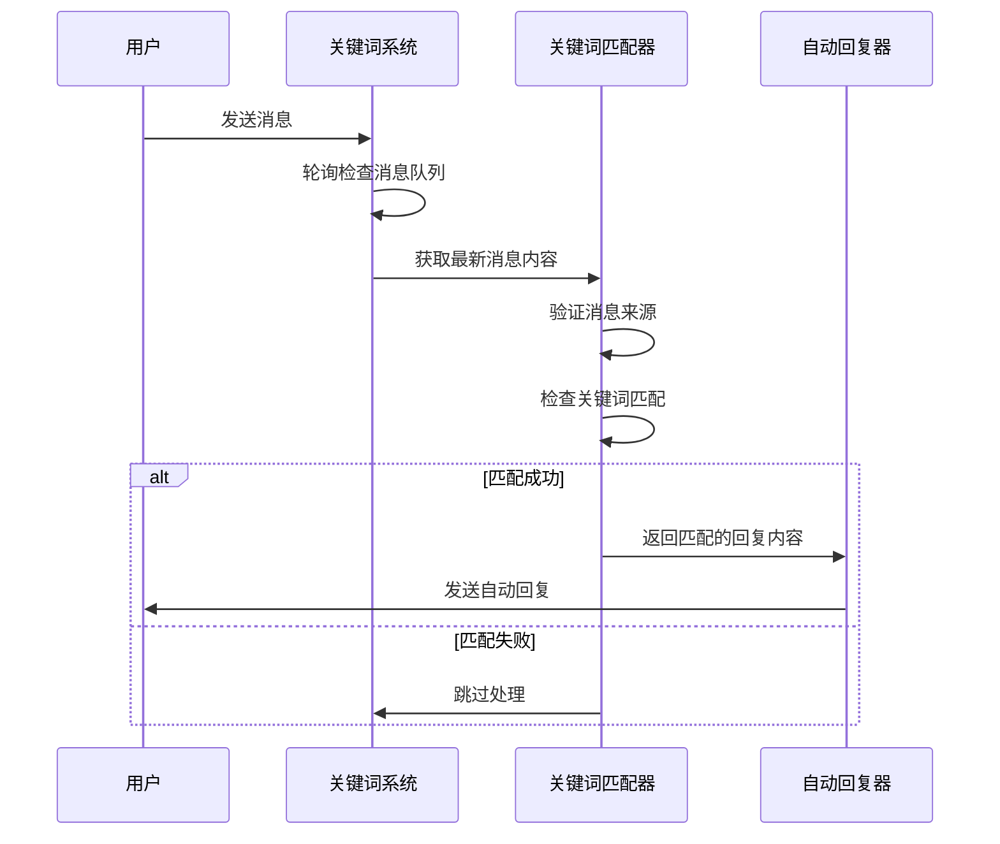
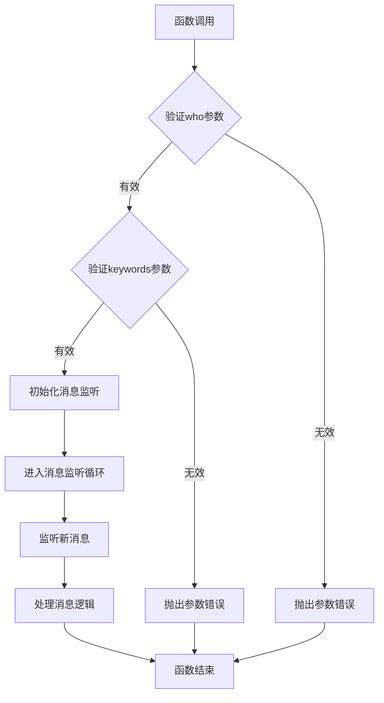
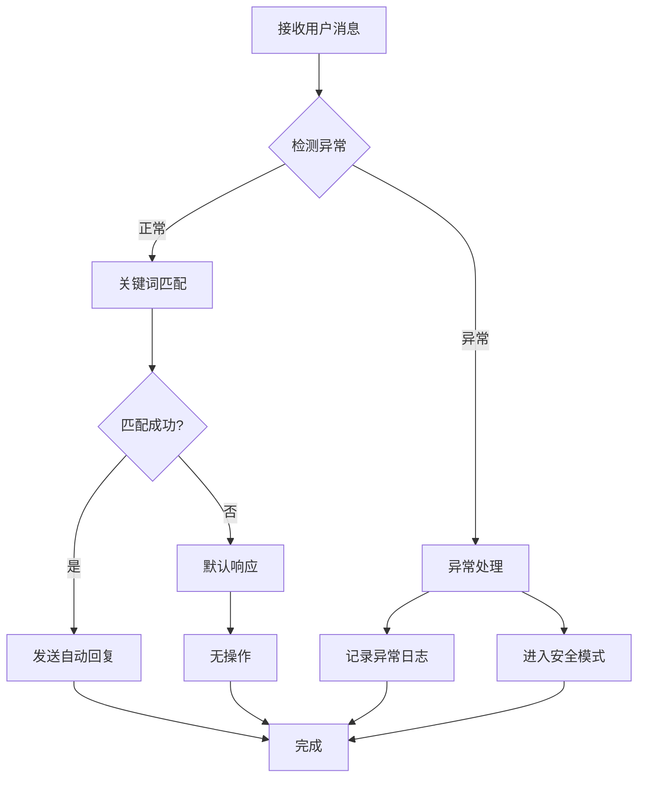

# 关键词自动回复功能详细文档

<cite>
**本文档引用的文件**
- [wechat.py](file://office/api/wechat.py)
- [chat.py](file://venv/Lib/site-packages/PyOfficeRobot/api/chat.py)
- [group.py](file://venv/Lib/site-packages/PyOfficeRobot/api/group.py)
- [003-根据关键词回复.py](file://examples/PyOfficeRobot/003-根据关键词回复.py)
- [005-自定义功能.py](file://examples/PyOfficeRobot/005-自定义功能.py)
- [instruction_url.py](file://office/lib/decorator_utils/instruction_url.py)
- [except_utils.py](file://office/lib/utils/except_utils.py)
- [CONST.py](file://office/lib/conf/CONST.py)
</cite>

## 目录
1. [简介](#简介)
2. [核心架构](#核心架构)
3. [功能实现机制](#功能实现机制)
4. [配置字典结构](#配置字典结构)
5. [函数参数详解](#函数参数详解)
6. [应用场景示例](#应用场景示例)
7. [高级用法建议](#高级用法建议)
8. [异常处理策略](#异常处理策略)
9. [性能优化提示](#性能优化提示)
10. [故障排除指南](#故障排除指南)

## 简介

关键词自动回复功能（chat_by_keywords）是Python Office项目中基于PyOfficeRobot底层库实现的一个智能聊天功能。该功能通过建立关键词与回复内容的映射关系，能够自动识别用户消息中的关键词并作出相应回复，广泛应用于客服系统、自动应答场景和智能聊天机器人。

## 核心架构

关键词自动回复功能采用分层架构设计，主要包含以下组件：



**图表来源**
- [wechat.py](file://office/api/wechat.py#L32-L44)
- [chat.py](file://venv/Lib/site-packages/PyOfficeRobot/api/chat.py#L31-L51)

**章节来源**
- [wechat.py](file://office/api/wechat.py#L1-L95)
- [chat.py](file://venv/Lib/site-packages/PyOfficeRobot/api/chat.py#L1-L193)

## 功能实现机制

### 基础关键词匹配机制

关键词自动回复的核心实现基于轮询机制，通过持续监听消息队列来检测新的消息内容：



**图表来源**
- [chat.py](file://venv/Lib/site-packages/PyOfficeRobot/api/chat.py#L35-L50)

### 消息过滤机制

系统实现了多层消息过滤机制，确保只处理有效的用户消息：

| 过滤条件 | 描述 | 实现位置 |
|---------|------|----------|
| 消息来源验证 | 确保消息来自指定联系人 | `friend_name == who` |
| 内容重复检测 | 避免重复回复同一消息 | `receive_msg != temp_msg` |
| 关键词存在性检查 | 验证消息内容是否包含预设关键词 | `receive_msg in keywords.keys()` |
| 自动回复防护 | 跳过系统自动回复消息 | 特殊标记检测 |

**章节来源**
- [chat.py](file://venv/Lib/site-packages/PyOfficeRobot/api/chat.py#L38-L48)

## 配置字典结构

### 基础字典格式

关键词自动回复功能使用Python字典结构来配置关键词与回复内容的映射关系：

```python
# 基础配置示例
keywords = {
    "关键词1": "回复内容1",
    "关键词2": "回复内容2",
    "关键词3": "回复内容3"
}
```

### 高级配置模式

#### 动态内容生成
系统支持动态生成回复内容，如密码生成、链接构建等：

```python
# 使用office工具生成动态内容
keywords = {
    "我要报名": "你好，这是报名链接：www.python-office.com",
    "来个密码": office.tools.passwordtools(),  # 自动生成8位随机密码
    "获取帮助": generate_help_document()      # 调用自定义函数生成内容
}
```

#### 多语言支持
通过字典结构实现多语言回复：

```python
# 多语言配置
multilingual_keywords = {
    "help": "Help content in English",
    "帮助": "帮助内容（中文）",
    "ヘルプ": "ヘルプ内容（日文）"
}
```

**章节来源**
- [003-根据关键词回复.py](file://examples/PyOfficeRobot/003-根据关键词回复.py#L7-L12)
- [005-自定义功能.py](file://examples/PyOfficeRobot/005-自定义功能.py#L8-L11)

## 函数参数详解

### 主要参数说明

#### who参数（联系人名称）
- **类型**: `str`
- **作用**: 指定要进行自动回复的目标联系人或群组名称
- **要求**: 必须与微信中的实际联系人名称完全匹配
- **示例**: `'抖音：程序员晚枫'`, `'Python技术交流群'`

#### keywords参数（关键词字典）
- **类型**: `dict`
- **作用**: 定义关键词与回复内容的映射关系
- **结构**: `{关键词: 回复内容}`
- **特点**: 
  - 支持字符串作为关键词
  - 支持函数返回值作为动态回复内容
  - 关键词匹配采用精确匹配模式

### 参数验证机制

系统对输入参数进行严格验证：



**图表来源**
- [wechat.py](file://office/api/wechat.py#L32-L44)

**章节来源**
- [wechat.py](file://office/api/wechat.py#L32-L44)
- [chat.py](file://venv/Lib/site-packages/PyOfficeRobot/api/chat.py#L31-L51)

## 应用场景示例

### 客服系统应用场景

#### 自动发送报名链接
```python
# 客服自动回复配置
customer_service_keywords = {
    "我想报名": "您好！这是我们的报名链接：https://www.python-office.com/signup",
    "报名流程": "请访问：https://www.python-office.com/process 查看详细流程",
    "费用说明": "详情请参考：https://www.python-office.com/pricing"
}
```

#### 常见问题处理
```python
# FAQ自动回复
faq_keywords = {
    "忘记密码": "请点击：https://www.python-office.com/reset-password 重置密码",
    "账户激活": "请访问：https://www.python-office.com/activate 激活您的账户",
    "技术支持": "请联系：support@python-office.com 或拨打：400-123-4567"
}
```

### 企业应用示例

#### 产品推广场景
```python
# 产品推广自动回复
product_keywords = {
    "产品介绍": "我们提供专业的Python办公自动化解决方案，包括Excel处理、Word文档、PDF转换等功能。",
    "价格咨询": "基础版免费，专业版每月99元，企业版按需定制。",
    "试用申请": "请访问：https://www.python-office.com/trial 申请免费试用"
}
```

#### 客户服务场景
```python
# 客户服务自动回复
service_keywords = {
    "订单查询": "请输入订单号，我们将为您查询最新状态。",
    "退换货政策": "详情请参考：https://www.python-office.com/returns",
    "发票开具": "请提供发票抬头和税号，我们将在确认后开具"
}
```

**章节来源**
- [003-根据关键词回复.py](file://examples/PyOfficeRobot\003-根据关键词回复.py#L7-L12)
- [005-自定义功能.py](file://examples/PyOfficeRobot\005-自定义功能.py#L8-L11)

## 高级用法建议

### 正则表达式扩展匹配

虽然基础实现采用精确匹配，但可以通过以下方式实现更灵活的匹配：

#### 模糊匹配实现
```python
import re

def fuzzy_match_keywords(message, keywords_dict):
    """模糊匹配关键词"""
    for pattern, response in keywords_dict.items():
        if re.search(pattern, message, re.IGNORECASE):
            return response
    return None

# 使用示例
advanced_keywords = {
    r"(报名|注册|加入)": "这是报名链接：www.python-office.com",
    r"(.*)(帮助|求助|疑问)(.*)": "请详细描述您的问题，我们将尽快为您解答",
    r"(.*)(价格|费用|付费)(.*)": "我们的定价方案请参考官网说明"
}
```

#### 多轮对话状态管理
```python
class ConversationManager:
    def __init__(self):
        self.conversation_states = {}
    
    def process_message(self, user_id, message):
        state = self.conversation_states.get(user_id, "INIT")
        
        if state == "INIT":
            if "报名" in message:
                self.conversation_states[user_id] = "REGISTRATION"
                return "您想报名哪个课程？"
        
        elif state == "REGISTRATION":
            # 处理课程选择逻辑
            self.conversation_states[user_id] = "COMPLETE"
            return "好的，我们已记录您的报名意向，请等待确认"
```

### 性能优化技巧

#### 消息频率控制
```python
import time

class RateLimiter:
    def __init__(self, max_requests=5, time_window=60):
        self.max_requests = max_requests
        self.time_window = time_window
        self.request_times = []
    
    def can_process(self):
        now = time.time()
        # 移除过期请求
        self.request_times = [
            t for t in self.request_times 
            if now - t < self.time_window
        ]
        
        if len(self.request_times) >= self.max_requests:
            return False
        
        self.request_times.append(now)
        return True

# 使用速率限制器
rate_limiter = RateLimiter(max_requests=10, time_window=60)
```

**章节来源**
- [group.py](file://venv/Lib/site-packages/PyOfficeRobot/api/group.py#L47-L62)

## 异常处理策略

### 默认响应设计

系统提供了多层次的异常处理机制：



**图表来源**
- [chat.py](file://venv/Lib/site-packages/PyOfficeRobot/api/chat.py#L49-L51)
- [except_utils.py](file://office/lib/utils/except_utils.py#L10-L34)

### 异常分类处理

#### 网络连接异常
```python
try:
    wx.GetSessionList()
    wx.ChatWith(who)
    wx.SendMsg(keywords[receive_msg], who)
except Exception as e:
    if "网络" in str(e) or "连接" in str(e):
        # 网络异常处理
        log_error(f"网络连接异常: {e}")
        time.sleep(30)  # 等待30秒后重试
    else:
        raise  # 重新抛出其他异常
```

#### 消息解析异常
```python
def safe_message_processing(message):
    """安全的消息处理"""
    try:
        # 尝试解析消息
        parsed_message = parse_message(message)
        return parsed_message
    except UnicodeDecodeError:
        # 处理编码问题
        return message.encode('utf-8', errors='ignore').decode('utf-8')
    except Exception as e:
        log_warning(f"消息解析失败: {e}")
        return None
```

### 错误恢复机制

#### 自动重启功能
```python
class AutoRecoverySystem:
    def __init__(self):
        self.restart_count = 0
        self.max_restarts = 5
    
    def handle_critical_error(self, error):
        self.restart_count += 1
        if self.restart_count <= self.max_restarts:
            log_warning(f"发生严重错误，尝试重启 ({self.restart_count}/{self.max_restarts})")
            time.sleep(5)  # 等待5秒后重启
            self.restart_system()
        else:
            log_error("达到最大重启次数，系统停止运行")
            # 发送告警通知
            send_alert("关键词回复系统已停止工作")

    def restart_system(self):
        # 重启系统逻辑
        pass
```

**章节来源**
- [except_utils.py](file://office/lib/utils/except_utils.py#L1-L34)

## 性能优化提示

### 避免高频触发策略

#### 消息去重机制
```python
class MessageDeduplicator:
    def __init__(self, cache_size=1000, cache_timeout=300):
        self.message_cache = {}
        self.cache_size = cache_size
        self.cache_timeout = cache_timeout
    
    def is_duplicate(self, message_hash):
        current_time = time.time()
        
        # 清理过期缓存
        expired_keys = [
            key for key, timestamp in self.message_cache.items()
            if current_time - timestamp > self.cache_timeout
        ]
        for key in expired_keys:
            del self.message_cache[key]
        
        # 检查重复
        if message_hash in self.message_cache:
            return True
        
        # 添加新消息
        if len(self.message_cache) >= self.cache_size:
            # 清理最旧的缓存项
            oldest_key = min(self.message_cache.keys(), 
                           key=lambda k: self.message_cache[k])
            del self.message_cache[oldest_key]
        
        self.message_cache[message_hash] = current_time
        return False
```

#### 账号风险防范
```python
class AccountRiskMonitor:
    def __init__(self):
        self.reply_counts = {}
        self.risk_threshold = 100
        self.reset_interval = 3600  # 1小时
    
    def check_risk_level(self, user_id):
        current_time = time.time()
        
        # 重置超时的统计
        keys_to_remove = []
        for uid, (count, timestamp) in self.reply_counts.items():
            if current_time - timestamp > self.reset_interval:
                keys_to_remove.append(uid)
        
        for key in keys_to_remove:
            del self.reply_counts[key]
        
        # 更新统计
        count, timestamp = self.reply_counts.get(user_id, (0, current_time))
        count += 1
        
        if count > self.risk_threshold:
            log_warning(f"用户 {user_id} 触发风险阈值: {count}次/小时")
            return True
        
        self.reply_counts[user_id] = (count, current_time)
        return False
```

### 内存优化策略

#### 字典大小控制
```python
class OptimizedKeywordsDict(dict):
    def __init__(self, max_size=1000):
        super().__init__()
        self.max_size = max_size
        self.access_order = []
    
    def __setitem__(self, key, value):
        if len(self) >= self.max_size:
            # 移除最久未使用的条目
            oldest_key = self.access_order.pop(0)
            del self[oldest_key]
        
        super().__setitem__(key, value)
        if key in self.access_order:
            self.access_order.remove(key)
        self.access_order.append(key)
    
    def __getitem__(self, key):
        if key in self.access_order:
            self.access_order.remove(key)
            self.access_order.append(key)
        return super().__getitem__(key)
```

**章节来源**
- [chat.py](file://venv/Lib/site-packages/PyOfficeRobot/api/chat.py#L35-L51)

## 故障排除指南

### 常见问题诊断

#### 问题1：关键词无法匹配
**症状**: 用户发送关键词消息，但系统没有回复
**排查步骤**:
1. 检查关键词拼写是否完全一致
2. 验证联系人名称是否正确
3. 确认消息内容是否包含特殊字符
4. 检查是否有消息过滤规则阻止

**解决方案**:
```python
# 添加调试信息
def debug_keyword_matching(message, keywords):
    print(f"原始消息: {message}")
    print(f"关键词字典: {list(keywords.keys())}")
    
    for keyword in keywords:
        if keyword in message:
            print(f"匹配到关键词: {keyword}")
            return True
    print("未匹配到任何关键词")
    return False
```

#### 问题2：重复回复
**症状**: 同一条消息被多次回复
**排查步骤**:
1. 检查temp_msg变量是否正确设置
2. 验证消息去重逻辑
3. 确认消息队列处理顺序

**解决方案**:
```python
# 改进的去重机制
class ImprovedDeduplicator:
    def __init__(self):
        self.last_messages = {}
    
    def should_reply(self, user_id, message):
        current_time = time.time()
        
        # 设置用户特定的去重窗口
        window_size = 5  # 秒
        
        if user_id in self.last_messages:
            last_msg, last_time = self.last_messages[user_id]
            if message == last_msg and (current_time - last_time) < window_size:
                return False
        
        self.last_messages[user_id] = (message, current_time)
        return True
```

#### 问题3：系统卡死
**症状**: 系统长时间无响应
**排查步骤**:
1. 检查无限循环逻辑
2. 验证异常处理机制
3. 监控内存使用情况

**解决方案**:
```python
# 添加超时保护
import signal

class TimeoutHandler:
    def __init__(self, timeout=30):
        self.timeout = timeout
        signal.signal(signal.SIGALRM, self.timeout_handler)
    
    def timeout_handler(self, signum, frame):
        raise TimeoutError("消息处理超时")
    
    def process_with_timeout(self, func, *args, **kwargs):
        signal.alarm(self.timeout)
        try:
            result = func(*args, **kwargs)
        finally:
            signal.alarm(0)
        return result
```

### 监控和日志

#### 关键指标监控
```python
class KeywordReplyMonitor:
    def __init__(self):
        self.metrics = {
            'total_messages': 0,
            'matched_messages': 0,
            'replies_sent': 0,
            'errors': 0,
            'average_response_time': 0
        }
    
    def record_metrics(self, metrics_update):
        for key, value in metrics_update.items():
            if key in self.metrics:
                self.metrics[key] += value
    
    def get_report(self):
        total = self.metrics['total_messages']
        matched = self.metrics['matched_messages']
        replied = self.metrics['replies_sent']
        
        return {
            '匹配率': f"{matched/total*100:.2f}%" if total > 0 else "0%",
            '回复率': f"{replied/matched*100:.2f}%" if matched > 0 else "0%",
            '总消息数': total,
            '错误数': self.metrics['errors']
        }
```

**章节来源**
- [chat.py](file://venv/Lib/site-packages/PyOfficeRobot/api/chat.py#L49-L51)
- [instruction_url.py](file://office/lib/decorator_utils/instruction_url.py#L76-L82)

## 总结

关键词自动回复功能通过简洁而强大的设计，为开发者提供了灵活的自动回复解决方案。其核心优势包括：

1. **易于配置**: 基于字典结构的简单配置方式
2. **高可靠性**: 完善的异常处理和错误恢复机制
3. **可扩展性**: 支持动态内容生成和高级匹配逻辑
4. **性能优化**: 多层次的性能优化策略

通过合理使用本文档提供的配置建议、异常处理策略和性能优化技巧，开发者可以构建稳定高效的自动回复系统，满足各种业务场景的需求。