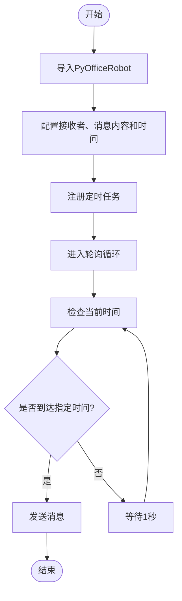
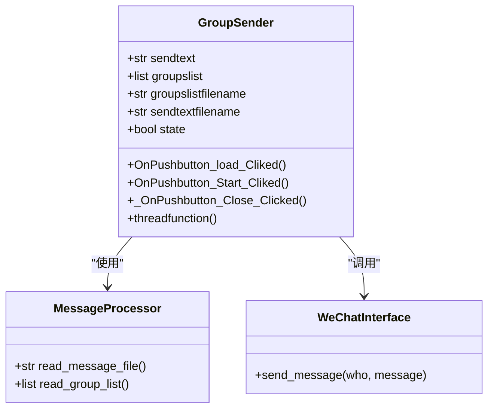

# 定时消息发送

<cite>
**本文档引用的文件**   
- [wechat.py](file://office/api/wechat.py)
- [chat.py](file://venv/Lib/site-packages/PyOfficeRobot/api/chat.py)
- [group.py](file://venv/Lib/site-packages/PyOfficeRobot/api/group.py)
- [Start.py](file://venv/Lib/site-packages/PyOfficeRobot/core/group/Start.py)
- [004-定时发送.py](file://examples/PyOfficeRobot/004-定时发送.py)
- [010-定时群发.py](file://examples/PyOfficeRobot/010-定时群发.py)
</cite>

## 目录
1. [简介](#简介)
2. [核心功能实现](#核心功能实现)
3. [参数使用说明](#参数使用说明)
4. [实际应用示例](#实际应用示例)
5. [定时群发机制分析](#定时群发机制分析)
6. [调度系统建议](#调度系统建议)
7. [时间同步与容错](#时间同步与容错)
8. [结论](#结论)

## 简介
本项目提供了基于Python的微信自动化办公解决方案，其中包含定时发送消息和定时群发两大核心功能。`send_message_by_time`函数允许用户在指定时间向特定联系人发送消息，而`send`函数则支持批量向多个群组成员发送消息。这些功能基于PyOfficeRobot库实现，通过系统时间轮询机制来触发定时任务，适用于每日提醒、营销推送等场景。

## 核心功能实现
定时消息发送功能的实现依赖于`schedule`库，该库提供了一种简单的方式来安排任务在特定时间执行。`send_message_by_time`函数封装了这一逻辑，使得开发者可以轻松地设置定时任务。当调用此函数时，它会注册一个每天在指定时间执行的作业，并持续运行调度器以检查是否有待执行的任务。



**图表来源**
- [chat.py](file://venv/Lib/site-packages/PyOfficeRobot/api/chat.py#L74-L79)

**本节来源**
- [wechat.py](file://office/api/wechat.py#L18-L29)
- [chat.py](file://venv/Lib/site-packages/PyOfficeRobot/api/chat.py#L74-L79)

## 参数使用说明
### who（接收者）
`who`参数用于指定消息的接收者，可以是微信好友的昵称或备注名。系统将根据这个名称查找对应的聊天窗口并发送消息。

### message（消息内容）
`message`参数包含要发送的具体内容，支持普通文本以及包含Emoji的表情符号。对于需要换行的消息，可以使用特殊字符组合`{ctrl}{ENTER}`来实现。

### time（发送时间）
`time`参数定义了消息发送的具体时间点，采用24小时制格式（HH:MM:SS）。例如，"21:51:55"表示晚上9点51分55秒。此时间必须精确到秒，确保消息能够准时送达。

## 实际应用示例
以下代码展示了如何使用`send_message_by_time`函数进行每日提醒设置：

```python
PyOfficeRobot.chat.send_message_by_time(who='快手：程序员晚枫', message='你好', time='21:51:55')
```

此代码将在每天晚上9点51分55秒向名为"快手：程序员晚枫"的联系人发送一条问候消息。类似的，营销推送可以通过更改`message`参数的内容来定制化信息。

**本节来源**
- [004-定时发送.py](file://examples/PyOfficeRobot/004-定时发送.py#L8)

## 定时群发机制分析
定时群发功能通过`group_send`函数启动，其内部逻辑涉及读取预设的群组列表和消息内容文件。程序首先加载Excel格式的群组名单，筛选出状态为"True"的有效成员；然后从.txt文件中读取待发送的消息内容，利用`{ctrl}{ENTER}`作为段落分隔符保持原有排版。



**图表来源**
- [Start.py](file://venv/Lib/site-packages/PyOfficeRobot/core/group/Start.py#L26-L93)
- [group.py](file://venv/Lib/site-packages/PyOfficeRobot/api/group.py#L20-L28)

**本节来源**
- [010-定时群发.py](file://examples/PyOfficeRobot/010-定时群发.py#L8)
- [group.py](file://venv/Lib/site-packages/PyOfficeRobot/api/group.py#L20-L28)

## 调度系统建议
当前的定时功能依赖于简单的系统时间轮询机制，虽然易于理解和实现，但在处理复杂的调度需求时存在局限性。建议结合更强大的调度工具如cron或APScheduler来增强功能。APScheduler支持多种调度方式，包括一次性任务、周期性任务和基于日期的任务，能够更好地满足企业级应用的需求。

## 时间同步与容错
由于定时功能依赖于本地系统时间，因此必须确保计算机的时间准确无误。建议启用网络时间协议(NTP)服务以自动校准系统时钟。此外，考虑到网络延迟或其他异常情况可能导致消息未能及时发送，应设计相应的容错机制，比如记录发送日志并在失败后尝试重发。

## 结论
通过对`send_message_by_time`和`send`功能的技术分析，我们了解了它们的工作原理及应用场景。尽管现有实现已经能满足基本的定时发送需求，但为了提高可靠性和灵活性，推荐采用更为专业的调度框架。同时，加强时间同步措施和错误恢复策略将有助于保障消息的准时送达。