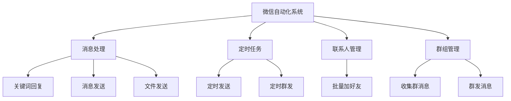
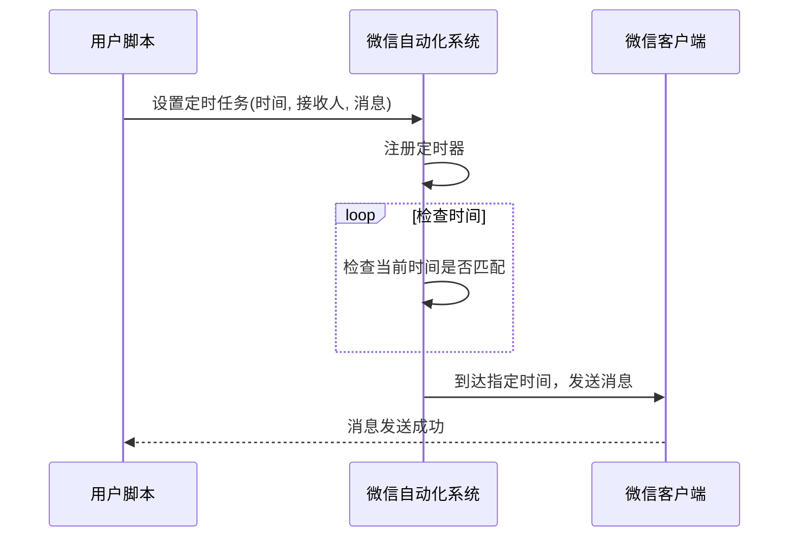
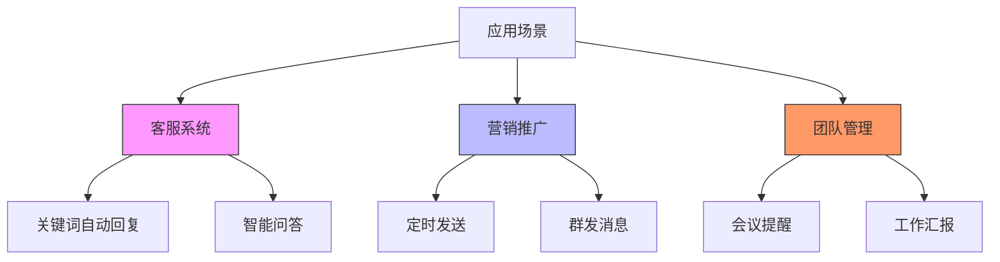

# 消息处理与自动化响应

<cite>
**本文档引用文件**  
- [wechat.py](file://office/api/wechat.py)
- [003-根据关键词回复.py](file://examples/PyOfficeRobot/003-根据关键词回复.py)
- [004-定时发送.py](file://examples/PyOfficeRobot/004-定时发送.py)
- [009-批量加好友.py](file://examples/PyOfficeRobot/009-批量加好友.py)
- [007-收集群消息.py](file://examples/PyOfficeRobot/007-收集群消息.py)
- [010-定时群发.py](file://examples/PyOfficeRobot/010-定时群发.py)
- [@AutomationLog.txt](file://examples/PyOfficeRobot/@AutomationLog.txt)
- [README.md](file://README.md)
- [readme.md](file://examples/readme.md)
</cite>

## 目录
1. [简介](#简介)
2. [核心功能详解](#核心功能详解)
3. [关键词自动回复机制](#关键词自动回复机制)
4. [定时消息发送功能](#定时消息发送功能)
5. [批量加好友流程](#批量加好友流程)
6. [收集群消息功能](#收集群消息功能)
7. [应用场景分析](#应用场景分析)
8. [异常处理与性能优化](#异常处理与性能优化)

## 简介
本项目提供了一套完整的微信自动化解决方案，支持消息处理、定时任务、批量操作等高级交互功能。系统基于PyOfficeRobot库构建，能够实现无需网页版微信的本地自动化操作，适用于客服系统、营销推广和团队管理等多种场景。

## 核心功能详解

### 功能架构概览
系统主要由以下几个核心模块组成：
- **消息处理模块**：负责消息的发送、接收和自动回复
- **定时任务模块**：支持精确到秒的定时消息发送
- **联系人管理模块**：实现批量加好友和群发功能
- **群组管理模块**：提供群消息收集和群发能力



**Diagram sources**
- [wechat.py](file://office/api/wechat.py#L6-L94)

## 关键词自动回复机制

### 实现原理
关键词自动回复功能通过监听指定联系人的消息流，对收到的消息进行关键词匹配，当检测到预设关键词时，自动发送对应的回复内容。该功能基于字典映射机制实现，支持灵活的响应模板配置。

### 配置方法
使用`chat_by_keywords`函数进行配置，需要提供两个参数：
- `who`：指定监听的联系人（昵称或备注名）
- `keywords`：关键词与回复内容的映射字典

```python
keywords = {
    "我要报名": "你好，这是报名链接：www.python-office.com",
    "点赞了吗？": "点了",
    "关注了吗？": "必须的",
    "投币了吗？": "三连走起",
}
PyOfficeRobot.chat.chat_by_keywords(who='抖音：程序员晚枫', keywords=keywords)
```

### 高级应用
支持与其他功能模块组合使用，例如结合密码生成工具实现动态回复：

```python
keywords = {
    "我要报名": "你好，这是报名链接：www.python-office.com",
    "来个密码": office.tools.passwordtools(),
}
PyOfficeRobot.chat.chat_by_keywords(who='知乎：程序员晚枫', keywords=keywords)
```

**Section sources**
- [003-根据关键词回复.py](file://examples/PyOfficeRobot/003-根据关键词回复.py#L7-L14)
- [005-自定义功能.py](file://examples/PyOfficeRobot/005-自定义功能.py#L8-L14)
- [wechat.py](file://office/api/wechat.py#L33-L43)

## 定时消息发送功能

### 单次定时发送
`send_message_by_time`函数支持在指定时间向特定联系人发送消息，时间格式为24小时制的"HH:MM:SS"。

```python
PyOfficeRobot.chat.send_message_by_time(
    who='快手：程序员晚枫', 
    message='你好', 
    time='21:51:55'
)
```

### 定时群发
通过`group.send()`函数实现群发功能，可结合定时任务调度器实现周期性群发。系统支持从外部文件读取群发内容。

```python
if __name__ == '__main__':
    PyOfficeRobot.group.send()
```

### 时间设定方式
目前支持两种时间设定方式：
1. **具体时间点**：指定精确到秒的发送时间
2. **Cron表达式**：支持更复杂的周期性任务调度（需结合外部调度器）



**Diagram sources**
- [004-定时发送.py](file://examples/PyOfficeRobot/004-定时发送.py#L6-L8)
- [010-定时群发.py](file://examples/PyOfficeRobot/010-定时群发.py#L7-L8)
- [wechat.py](file://office/api/wechat.py#L19-L30)

**Section sources**
- [004-定时发送.py](file://examples/PyOfficeRobot/004-定时发送.py#L6-L8)
- [010-定时群发.py](file://examples/PyOfficeRobot/010-定时群发.py#L7-L8)
- [wechat.py](file://office/api/wechat.py#L19-L30)

## 批量加好友流程

### 操作流程
批量加好友功能通过`friend.add`接口实现，需要提供：
- `msg`：添加好友时的验证消息
- `num_notes`：包含微信号/手机号和对应备注名的字典

```python
msg = "你好，我是程序员晚枫，全网同名。"
num_notes = {
    'CoderWanFeng': '小红书-晚枫',
}
PyOfficeRobot.friend.add(msg=msg, num_notes=num_notes)
```

### 当前限制
根据代码注释和日志文件显示，该功能存在控件兼容性问题：

```text
# TODO:控件改变了，有BUG
```

自动化日志文件`@AutomationLog.txt`中记录了大量"Find Control Timeout"错误，表明UI自动化过程中无法找到预期的控件。

### 问题分析
1. **控件识别失败**：微信客户端界面更新导致原有控件定位失效
2. **超时问题**：控件查找超时，影响操作成功率
3. **版本兼容性**：不同版本的微信客户端可能存在界面差异

**Section sources**
- [009-批量加好友.py](file://examples/PyOfficeRobot/009-批量加好友.py#L6-L14)
- [@AutomationLog.txt](file://examples/PyOfficeRobot/@AutomationLog.txt#L1-L84)

## 收集群消息功能

### 功能用途
`get_group_list`功能旨在收集和管理微信群消息，为群组运营提供数据支持。该功能可用于：
- 群成员行为分析
- 群活跃度监控
- 营销效果评估

### 当前状态
根据文档和代码注释，该功能目前存在严重BUG：

```python
# TODO：有BUG：AttributeError: 'NoneType' object has no attribute 'Name'
```

在`readme.md`文件中也明确标注"有BUG，待修复"。

### 异常分析
错误信息表明在尝试访问`Name`属性时，对象为`None`类型，可能原因包括：
1. 群组对象未正确初始化
2. 群组列表获取失败
3. 权限不足导致无法访问群组信息

**Section sources**
- [007-收集群消息.py](file://examples/PyOfficeRobot/007-收集群消息.py#L7-L9)
- [readme.md](file://examples/readme.md#L180)

## 应用场景分析

### 客服系统
利用关键词自动回复功能，可构建7×24小时在线的智能客服系统：
- 自动回答常见问题
- 提供产品信息和链接
- 引导用户完成特定操作

### 营销推广
结合定时发送和群发功能，实现精准营销：
- 定时推送促销信息
- 节假日祝福群发
- 新品发布通知

### 团队管理
提高团队沟通效率：
- 定时发送会议提醒
- 自动收集工作汇报
- 群组消息归档分析



**Diagram sources**
- [wechat.py](file://office/api/wechat.py#L33-L43)
- [004-定时发送.py](file://examples/PyOfficeRobot/004-定时发送.py#L6-L8)
- [010-定时群发.py](file://examples/PyOfficeRobot/010-定时群发.py#L7-L8)

## 异常处理与性能优化

### 异常处理建议
1. **控件识别失败**：增加重试机制和超时处理
2. **网络波动**：实现消息发送的重试逻辑
3. **微信更新**：定期检查并更新UI自动化脚本
4. **权限问题**：确保应用具有必要的系统权限

### 性能优化提示
1. **批量操作优化**：将多个操作合并为批处理任务
2. **资源管理**：及时释放不再使用的资源
3. **日志记录**：详细记录操作日志便于问题排查
4. **并发控制**：合理控制并发任务数量，避免系统过载

### 监控与维护
建立完善的监控体系：
- 操作成功率监控
- 错误日志分析
- 性能指标跟踪
- 定期功能测试

**Section sources**
- [wechat.py](file://office/api/wechat.py#L6-L94)
- [@AutomationLog.txt](file://examples/PyOfficeRobot/@AutomationLog.txt#L1-L84)