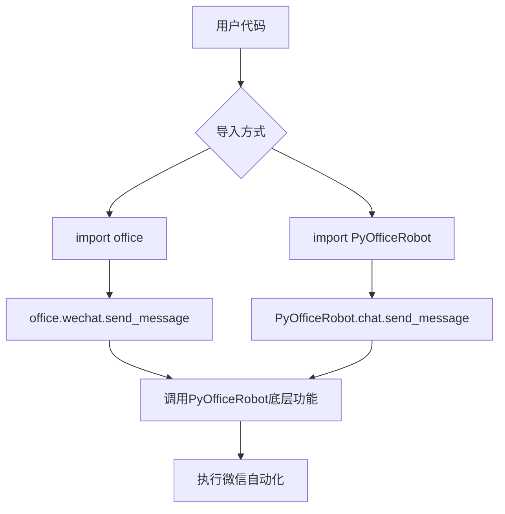
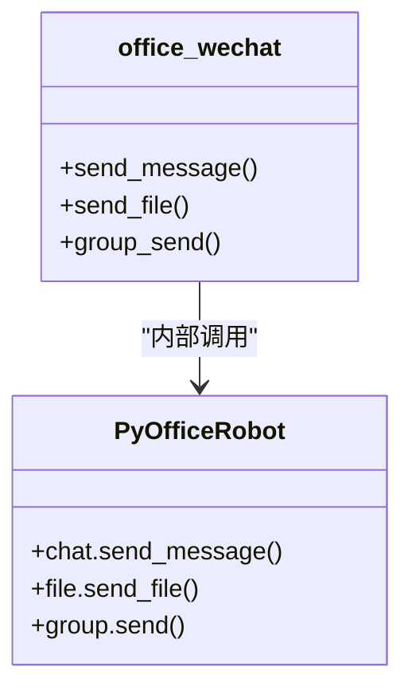

# 独立使用模式

<cite>
**本文档中引用的文件**   
- [006-独立版本.py](file://examples/PyOfficeRobot/006-独立版本.py)
- [wechat.py](file://office/api/wechat.py)
- [__init__.py](file://venv/Lib/site-packages/PyOfficeRobot/__init__.py)
- [README.md](file://README.md)
</cite>

## 目录
1. [简介](#简介)
2. [独立使用模式的优势](#独立使用模式的优势)
3. [使用方法](#使用方法)
4. [迁移指南](#迁移指南)
5. [依赖安装](#依赖安装)
6. [功能示例](#功能示例)

## 简介
PyOfficeRobot 是一个专注于微信自动化的独立 Python 包，作为 python-office 库的子模块存在。用户可以选择通过 `import office` 引入整个办公自动化套件，也可以独立引入 PyOfficeRobot 来仅使用微信机器人功能。

**Section sources**
- [README.md](file://README.md#L84-L116)

## 独立使用模式的优势
### 解耦设计
PyOfficeRobot 被设计为一个独立的包，允许开发者仅引入所需的微信自动化功能，而无需加载整个 python-office 库。这种解耦设计带来了以下优势：

- **减少依赖体积**：避免安装不必要的组件，减小项目依赖包的总体积
- **提高加载速度**：仅加载必要的模块，提升程序启动速度
- **降低冲突风险**：减少与其他库的依赖冲突可能性
- **便于版本控制**：可以独立管理 PyOfficeRobot 的版本更新

### 专注性
独立模式使开发者能够专注于微信自动化功能的开发和维护，而不受其他办公自动化模块的影响。

**Section sources**
- [README.md](file://README.md#L86-L87)

## 使用方法
### 原始调用方式
在旧版本中，需要通过 office 包来调用微信功能：
```python
# import office
# office.wechat.send_message(who='联系人', message='消息内容')
```

### 独立调用方式
现在可以直接导入并使用 PyOfficeRobot：
```python
import PyOfficeRobot

PyOfficeRobot.chat.send_message(who='百度一下：程序员晚枫', message='点个star吧')
```

这种方式更加直接和简洁，避免了通过中间层调用的复杂性。



**Diagram sources**
- [006-独立版本.py](file://examples/PyOfficeRobot/006-独立版本.py#L4-L14)
- [wechat.py](file://office/api/wechat.py#L6-L16)

**Section sources**
- [006-独立版本.py](file://examples/PyOfficeRobot/006-独立版本.py#L4-L14)

## 迁移指南
### 从旧版迁移到独立模式
对于已经使用 `office.wechat` 方式的用户，迁移过程非常简单：

1. **修改导入语句**：
   ```python
   # 旧方式
   # import office
   
   # 新方式
   import PyOfficeRobot
   ```

2. **调整调用路径**：
   ```python
   # 旧方式
   # office.wechat.send_message(who, message)
   
   # 新方式
   PyOfficeRobot.chat.send_message(who, message)
   ```

3. **功能映射**：
   - `office.wechat.send_message` → `PyOfficeRobot.chat.send_message`
   - `office.wechat.send_file` → `PyOfficeRobot.file.send_file`
   - `office.wechat.group_send` → `PyOfficeRobot.group.send`

### 兼容性说明
PyOfficeRobot 的独立包与原来的 `office.wechat` 模块保持完全兼容。实际上，`office.wechat` 模块内部也是通过调用 PyOfficeRobot 来实现功能的。



**Diagram sources**
- [wechat.py](file://office/api/wechat.py#L6-L56)
- [__init__.py](file://venv/Lib/site-packages/PyOfficeRobot/__init__.py#L1-L4)

**Section sources**
- [wechat.py](file://office/api/wechat.py#L4-L94)

## 依赖安装
### 安装命令
要使用独立的 PyOfficeRobot 包，必须先通过 pip 安装：
```bash
pip install -i https://mirrors.aliyun.com/pypi/simple/ PyOfficeRobot -U
```

### 安装必要性
即使项目中已经安装了 python-office，仍然建议单独安装 PyOfficeRobot，因为：

1. **确保最新版本**：独立安装可以确保获取到最新的 PyOfficeRobot 版本
2. **明确依赖关系**：在 requirements.txt 中明确列出对 PyOfficeRobot 的依赖
3. **避免版本冲突**：防止 python-office 和 PyOfficeRobot 版本不匹配的问题

**Section sources**
- [README.md](file://README.md#L72-L74)

## 功能示例
### 基本消息发送
通过 `PyOfficeRobot.chat.send_message` 方法可以发送文本消息：

```python
import PyOfficeRobot

PyOfficeRobot.chat.send_message(who='联系人昵称', message='你好，这是一条测试消息')
```

### 发送带换行的消息
支持使用特殊字符实现消息换行：
```python
PyOfficeRobot.chat.send_message(who='联系人', message='第一行' + '{ctrl}{ENTER}' + '第二行')
```

### 定时发送消息
可以设置在指定时间自动发送消息：
```python
PyOfficeRobot.chat.send_message_by_time(who='联系人', message='定时消息', time='2023-12-01 10:00:00')
```

### 智能聊天
启用智能聊天机器人模式：
```python
PyOfficeRobot.chat.chat_robot(who='聊天对象')
```

这些功能都可以通过独立引入 PyOfficeRobot 来使用，无需加载整个 python-office 库。

**Section sources**
- [006-独立版本.py](file://examples/PyOfficeRobot/006-独立版本.py)
- [wechat.py](file://office/api/wechat.py)