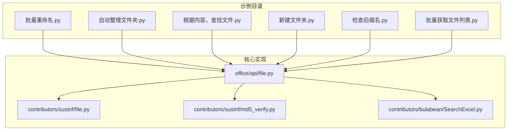
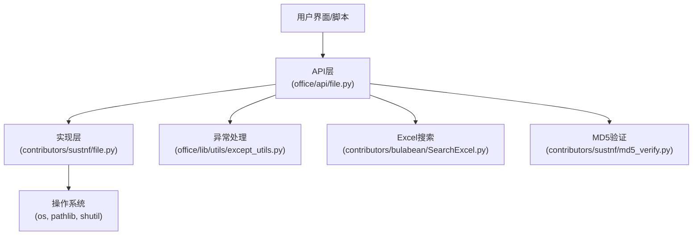
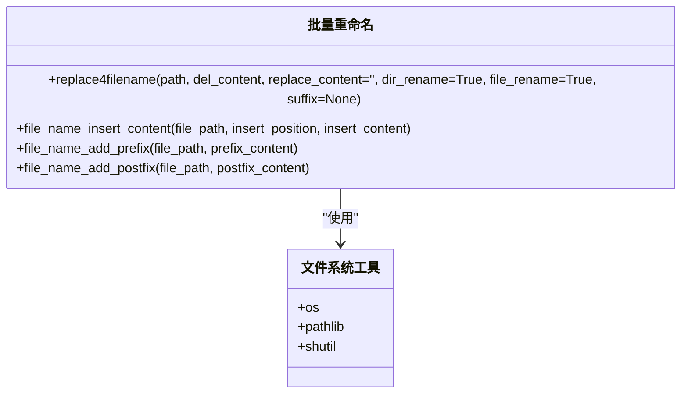
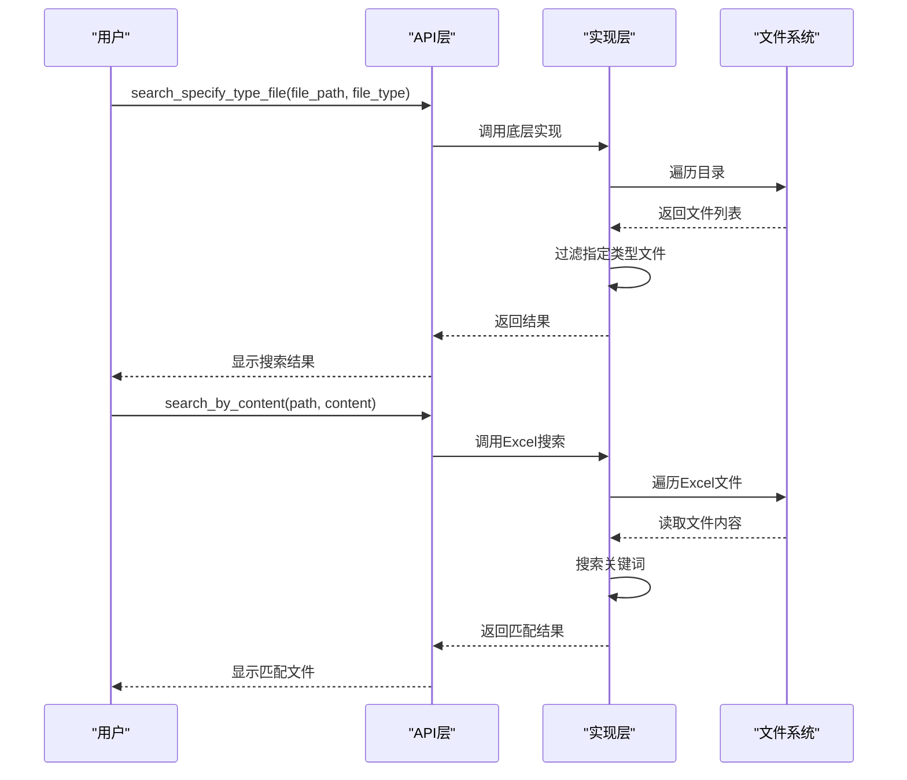
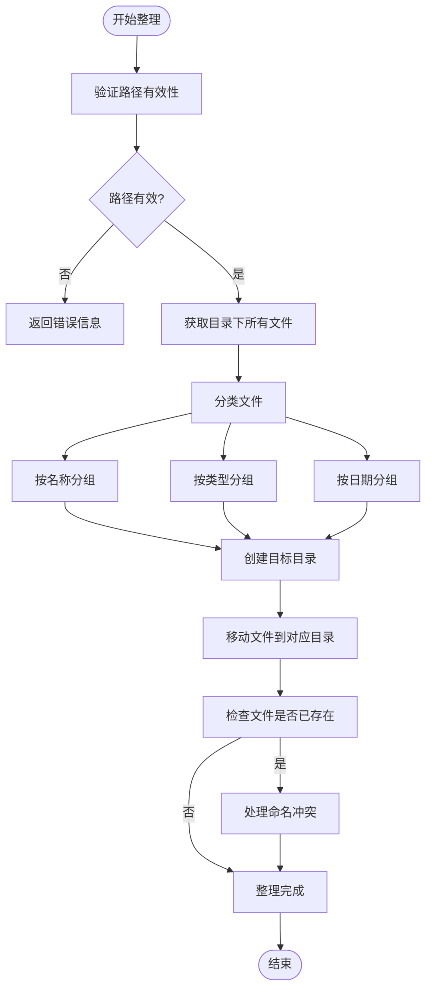
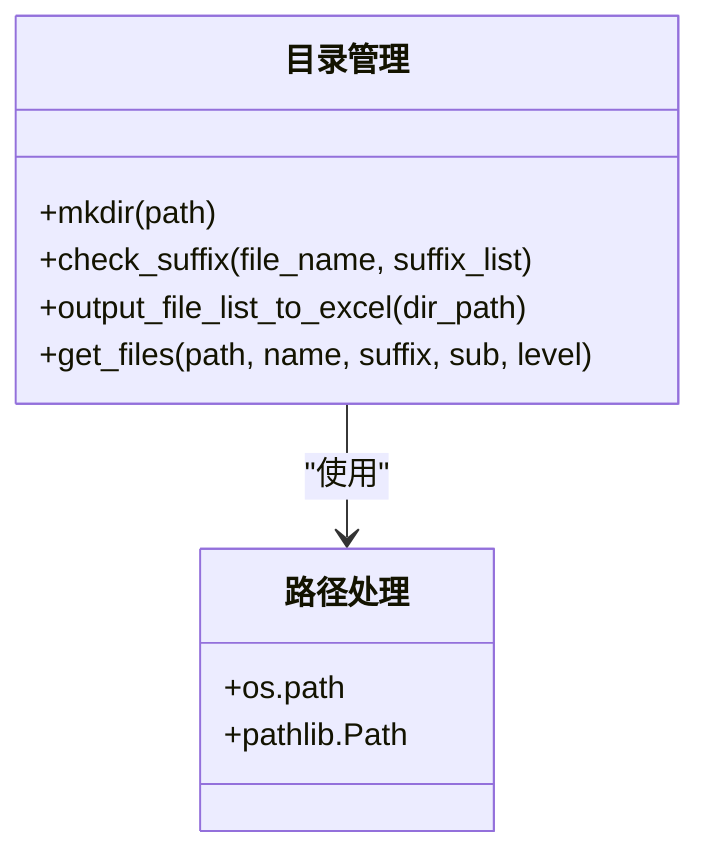
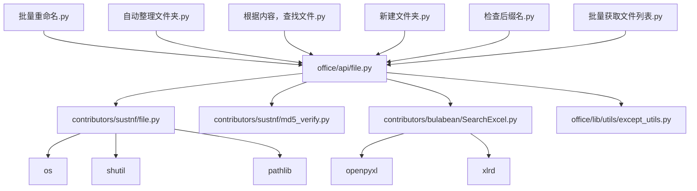
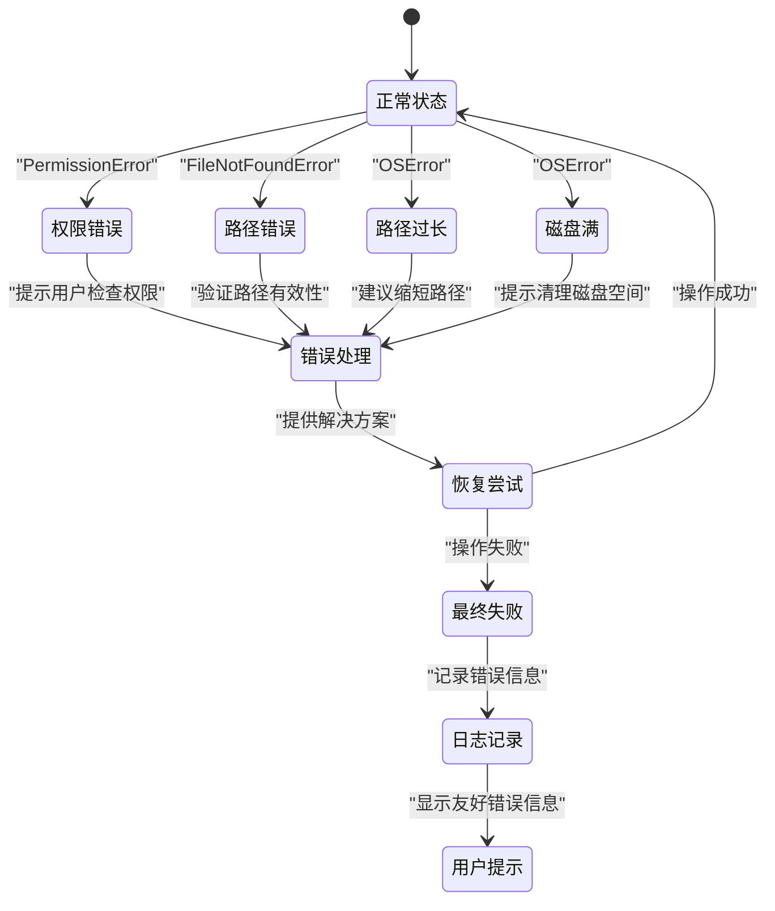

# 文件管理示例

<cite>
**本文档引用的文件**
- [批量重命名.py](file://examples/pofile/批量重命名.py)
- [自动整理文件夹.py](file://examples/pofile/自动整理文件夹.py)
- [根据内容，查找文件.py](file://examples/pofile/根据内容，查找文件.py)
- [新建文件夹.py](file://examples/pofile/新建文件夹.py)
- [检查后缀名.py](file://examples/pofile/检查后缀名.py)
- [批量获取文件列表.py](file://examples/pofile/批量获取文件列表.py)
- [Rename-AddSomething.py](file://contributors/yinzeyuan/Rename-AddSomething.py)
- [SearchSpecifyTypeFile.py](file://contributors/yinzeyuan/SearchSpecifyTypeFile.py)
- [file.py](file://office/api/file.py)
- [file.py](file://contributors/sustnf/file.py)
- [md5_verify.py](file://contributors/sustnf/md5_verify.py)
- [SearchExcel.py](file://contributors/bulabean/SearchExcel.py)
- [except_utils.py](file://office/lib/utils/except_utils.py)
</cite>

## 目录
1. [简介](#简介)
2. [项目结构](#项目结构)
3. [核心功能组件](#核心功能组件)
4. [架构概述](#架构概述)
5. [详细组件分析](#详细组件分析)
6. [依赖关系分析](#依赖关系分析)
7. [性能考虑](#性能考虑)
8. [故障排除指南](#故障排除指南)
9. [结论](#结论)

## 简介
本文档详细阐述了Python-Office项目中的文件系统自动化示例，涵盖批量重命名、按内容搜索、文件分类整理、目录结构创建等实用功能。文档解释了如何使用os、glob、pathlib等模块高效遍历和操作文件系统，提供了正则表达式在文件名匹配中的应用示例，并展示了"自动整理文件夹"中基于文件类型或日期的智能归类逻辑。同时，文档包含了处理权限错误、路径过长等系统级异常的健壮性设计。

## 项目结构
Python-Office项目的文件管理功能主要分布在examples/pofile目录下，提供了多个实用的文件操作示例。这些示例通过调用底层的pofile库实现各种文件系统自动化功能。

**图示来源**
- [批量重命名.py](file://examples/pofile/批量重命名.py)
- [自动整理文件夹.py](file://examples/pofile/自动整理文件夹.py)
- [根据内容，查找文件.py](file://examples/pofile/根据内容，查找文件.py)
- [新建文件夹.py](file://examples/pofile/新建文件夹.py)
- [检查后缀名.py](file://examples/pofile/检查后缀名.py)
- [批量获取文件列表.py](file://examples/pofile/批量获取文件列表.py)
- [file.py](file://office/api/file.py)

**本节来源**
- [批量重命名.py](file://examples/pofile/批量重命名.py)
- [自动整理文件夹.py](file://examples/pofile/自动整理文件夹.py)
- [根据内容，查找文件.py](file://examples/pofile/根据内容，查找文件.py)
- [新建文件夹.py](file://examples/pofile/新建文件夹.py)
- [检查后缀名.py](file://examples/pofile/检查后缀名.py)
- [批量获取文件列表.py](file://examples/pofile/批量获取文件列表.py)

## 核心功能组件
文件管理系统提供了多个核心功能组件，包括批量重命名、文件搜索、目录整理等。这些功能通过封装底层操作系统接口，为用户提供简单易用的API。

**本节来源**
- [file.py](file://office/api/file.py#L29-L162)
- [批量重命名.py](file://examples/pofile/批量重命名.py#L23-L27)
- [自动整理文件夹.py](file://examples/pofile/自动整理文件夹.py#L24-L25)

## 架构概述
文件管理系统的架构采用分层设计，上层提供用户友好的API接口，下层实现具体的文件系统操作。这种设计模式提高了代码的可维护性和可扩展性。

**图示来源**
- [file.py](file://office/api/file.py)
- [except_utils.py](file://office/lib/utils/except_utils.py)
- [SearchExcel.py](file://contributors/bulabean/SearchExcel.py)
- [md5_verify.py](file://contributors/sustnf/md5_verify.py)

## 详细组件分析

### 批量重命名功能分析
批量重命名功能允许用户对指定目录下的文件和文件夹进行批量名称修改，支持删除指定内容、添加前缀/后缀以及在文件名中间插入内容等多种操作方式。

**图示来源**
- [file.py](file://office/api/file.py#L29-L87)
- [Rename-AddSomething.py](file://contributors/yinzeyuan/Rename-AddSomething.py)

**本节来源**
- [批量重命名.py](file://examples/pofile/批量重命名.py)
- [file.py](file://office/api/file.py#L29-L87)
- [Rename-AddSomething.py](file://contributors/yinzeyuan/Rename-AddSomething.py)

### 文件搜索功能分析
文件搜索功能提供了多种搜索方式，包括按文件类型搜索、按内容搜索以及在Excel文件中搜索特定数据。

**图示来源**
- [file.py](file://office/api/file.py#L120-L130)
- [SearchSpecifyTypeFile.py](file://contributors/yinzeyuan/SearchSpecifyTypeFile.py)
- [SearchExcel.py](file://contributors/bulabean/SearchExcel.py)

**本节来源**
- [根据内容，查找文件.py](file://examples/pofile/根据内容，查找文件.py)
- [SearchSpecifyTypeFile.py](file://contributors/yinzeyuan/SearchSpecifyTypeFile.py)
- [SearchExcel.py](file://contributors/bulabean/SearchExcel.py)

### 文件分类整理功能分析
文件分类整理功能实现了智能的文件归类逻辑，可以根据文件名称、类型或日期等属性自动将文件整理到相应的目录结构中。

**图示来源**
- [自动整理文件夹.py](file://examples/pofile/自动整理文件夹.py)
- [file.py](file://office/api/file.py#L133-L146)

**本节来源**
- [自动整理文件夹.py](file://examples/pofile/自动整理文件夹.py)
- [file.py](file://office/api/file.py#L133-L146)

### 目录管理功能分析
目录管理功能提供了创建新文件夹、检查文件后缀名等基础操作，确保文件系统的完整性和安全性。

**图示来源**
- [新建文件夹.py](file://examples/pofile/新建文件夹.py)
- [检查后缀名.py](file://examples/pofile/检查后缀名.py)
- [批量获取文件列表.py](file://examples/pofile/批量获取文件列表.py)
- [file.py](file://office/api/file.py)

**本节来源**
- [新建文件夹.py](file://examples/pofile/新建文件夹.py)
- [检查后缀名.py](file://examples/pofile/检查后缀名.py)
- [批量获取文件列表.py](file://examples/pofile/批量获取文件列表.py)
- [file.py](file://office/api/file.py)

## 依赖关系分析
文件管理系统各组件之间存在清晰的依赖关系，上层API依赖于底层实现模块，同时集成了异常处理、文件验证等辅助功能。

**图示来源**
- [批量重命名.py](file://examples/pofile/批量重命名.py)
- [自动整理文件夹.py](file://examples/pofile/自动整理文件夹.py)
- [根据内容，查找文件.py](file://examples/pofile/根据内容，查找文件.py)
- [新建文件夹.py](file://examples/pofile/新建文件夹.py)
- [检查后缀名.py](file://examples/pofile/检查后缀名.py)
- [批量获取文件列表.py](file://examples/pofile/批量获取文件列表.py)
- [file.py](file://office/api/file.py)
- [md5_verify.py](file://contributors/sustnf/md5_verify.py)
- [SearchExcel.py](file://contributors/bulabean/SearchExcel.py)
- [except_utils.py](file://office/lib/utils/except_utils.py)

**本节来源**
- [批量重命名.py](file://examples/pofile/批量重命名.py)
- [自动整理文件夹.py](file://examples/pofile/自动整理文件夹.py)
- [根据内容，查找文件.py](file://examples/pofile/根据内容，查找文件.py)
- [新建文件夹.py](file://examples/pofile/新建文件夹.py)
- [检查后缀名.py](file://examples/pofile/检查后缀名.py)
- [批量获取文件列表.py](file://examples/pofile/批量获取文件列表.py)
- [file.py](file://office/api/file.py)
- [md5_verify.py](file://contributors/sustnf/md5_verify.py)
- [SearchExcel.py](file://contributors/bulabean/SearchExcel.py)
- [except_utils.py](file://office/lib/utils/except_utils.py)

## 性能考虑
文件管理系统在设计时考虑了性能优化，通过合理的算法选择和资源管理，确保在处理大量文件时仍能保持良好的性能表现。

- 使用生成器模式处理大文件列表，避免内存溢出
- 采用递归遍历与迭代遍历相结合的方式，提高目录遍历效率
- 对文件操作进行批量处理，减少系统调用次数
- 实现缓存机制，避免重复计算和读取

## 故障排除指南
文件管理系统包含了完善的异常处理机制，能够有效处理权限错误、路径过长等系统级异常。

**图示来源**
- [except_utils.py](file://office/lib/utils/except_utils.py)
- [file.py](file://office/api/file.py)

**本节来源**
- [except_utils.py](file://office/lib/utils/except_utils.py)
- [file.py](file://office/api/file.py)

## 结论
Python-Office的文件管理系统提供了一套完整且实用的文件操作工具集，涵盖了批量重命名、文件搜索、分类整理等常见需求。系统采用分层架构设计，具有良好的可维护性和扩展性。通过集成异常处理机制，系统能够健壮地处理各种系统级错误。整体设计简洁高效，为用户提供了简单易用的API接口，同时保持了底层操作的灵活性和性能。