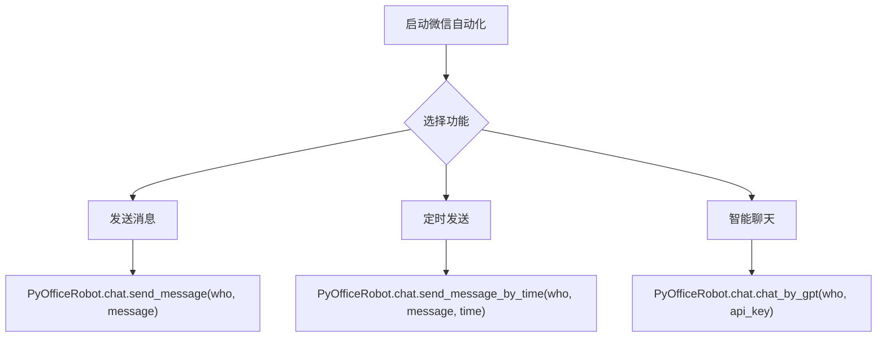
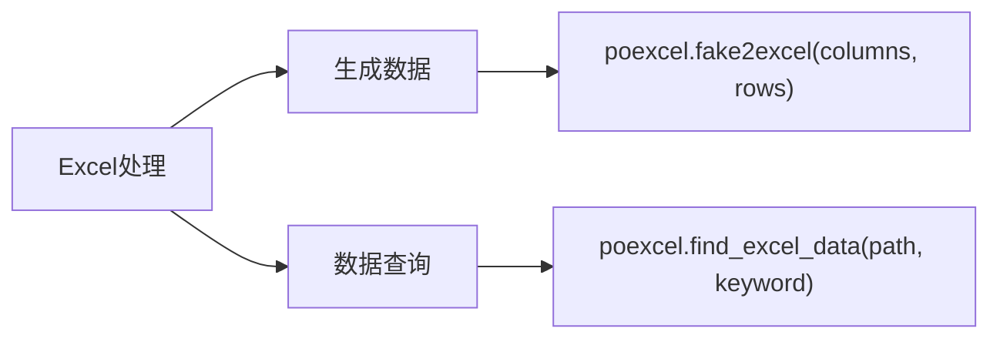
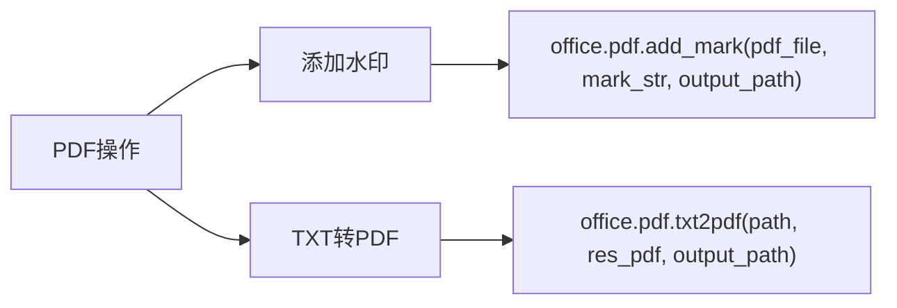
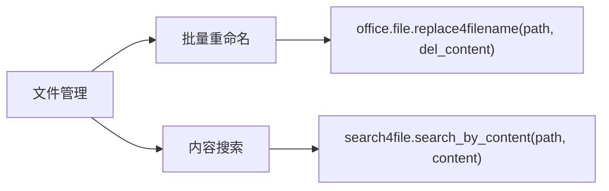
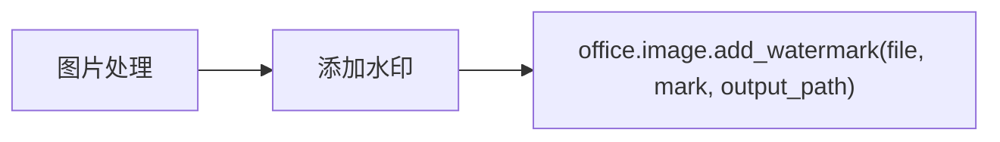

# 示例大全

<cite>
**本文档中引用的文件**  
- [examples/readme.md](file://examples/readme.md)
- [examples/PyOfficeRobot/001-发一条信息.py](file://examples/PyOfficeRobot/001-发一条信息.py)
- [examples/PyOfficeRobot/004-定时发送.py](file://examples/PyOfficeRobot/004-定时发送.py)
- [examples/PyOfficeRobot/011-chat_chatgpt.py](file://examples/PyOfficeRobot/011-chat_chatgpt.py)
- [examples/poexcel/批量模拟数据.py](file://examples/poexcel/批量模拟数据.py)
- [examples/poexcel/根据内容，查询Excel.py](file://examples/poexcel/根据内容，查询Excel.py)
- [examples/popdf/PDF加水印.py](file://examples/popdf/PDF加水印.py)
- [examples/popdf/TXT转PDF.py](file://examples/popdf/TXT转PDF.py)
- [examples/pofile/批量重命名.py](file://examples/pofile/批量重命名.py)
- [examples/pofile/根据内容，查找文件.py](file://examples/pofile/根据内容，查找文件.py)
- [examples/poimage/图片加水印.py](file://examples/poimage/图片加水印.py)
</cite>

## 目录
1. [简介](#简介)
2. [示例库结构与命名规范](#示例库结构与命名规范)
3. [功能领域分类与示例详解](#功能领域分类与示例详解)
   - [微信自动化](#微信自动化)
   - [Excel处理](#excel处理)
   - [PDF操作](#pdf操作)
   - [文件管理](#文件管理)
   - [图片处理](#图片处理)
   - [AI应用](#ai应用)
4. [如何运行与修改示例脚本](#如何运行与修改示例脚本)
5. [组合多个示例解决复杂问题](#组合多个示例解决复杂问题)
6. [最佳实践与注意事项](#最佳实践与注意事项)

## 简介

本《示例大全》文档旨在系统化整理和展示 `examples/` 目录下的所有示例脚本。这些示例是 `python-office` 库的核心实践指南，不仅作为学习工具帮助用户快速上手，更可直接作为生产环境脚本的起点。文档将示例按功能领域进行分类，提供清晰的标题、功能描述和使用说明，并解释文件命名约定与目录结构，帮助用户高效查找和应用所需解决方案。

**Section sources**
- [examples/readme.md](file://examples/readme.md)

## 示例库结构与命名规范

`examples/` 目录采用模块化组织结构，每个子目录对应一个功能模块，如 `PyOfficeRobot`（微信自动化）、`poexcel`（Excel处理）、`popdf`（PDF操作）等。这种结构清晰地划分了不同领域的功能，便于用户快速定位。

示例文件的命名遵循统一的规范：`三位数字-功能描述.扩展名`（如 `001-发一条信息.py`）。数字前缀用于排序，确保示例按学习或使用顺序排列；功能描述使用中文，直观表达脚本用途；`.py` 扩展名表明其为 Python 脚本。这种命名方式既保证了文件列表的有序性，又提高了可读性。

**Section sources**
- [examples/readme.md](file://examples/readme.md)

## 功能领域分类与示例详解

### 微信自动化

该类别下的示例位于 `examples/PyOfficeRobot/` 目录，专注于微信客户端的自动化操作。

- **001-发一条信息.py**：演示如何向指定微信联系人发送文本消息。脚本通过 `PyOfficeRobot.chat.send_message` 方法实现，用户只需修改 `who` 参数为好友昵称或备注，`message` 参数为要发送的内容即可。
- **004-定时发送.py**：实现消息的定时发送功能。通过 `PyOfficeRobot.chat.send_message_by_time` 方法，用户可以指定发送时间（24小时制），让脚本在精确时刻自动发送消息。
- **011-chat_chatgpt.py**：集成 ChatGPT 的智能聊天机器人。脚本调用 `PyOfficeRobot.chat.chat_by_gpt` 方法，需要用户提供 OpenAI 的 API Key，即可实现与微信好友的自动智能对话。

**Diagram sources**
- [examples/PyOfficeRobot/001-发一条信息.py](file://examples/PyOfficeRobot/001-发一条信息.py)
- [examples/PyOfficeRobot/004-定时发送.py](file://examples/PyOfficeRobot/004-定时发送.py)
- [examples/PyOfficeRobot/011-chat_chatgpt.py](file://examples/PyOfficeRobot/011-chat_chatgpt.py)

**Section sources**
- [examples/PyOfficeRobot/001-发一条信息.py](file://examples/PyOfficeRobot/001-发一条信息.py)
- [examples/PyOfficeRobot/004-定时发送.py](file://examples/PyOfficeRobot/004-定时发送.py)
- [examples/PyOfficeRobot/011-chat_chatgpt.py](file://examples/PyOfficeRobot/011-chat_chatgpt.py)

### Excel处理

该类别下的示例位于 `examples/poexcel/` 目录，涵盖各种 Excel 文件的自动化处理任务。

- **批量模拟数据.py**：演示如何使用 `poexcel.fake2excel` 方法批量生成模拟数据并保存为 Excel 文件。只需指定列名（如 `['name', 'text']`）和行数，即可快速创建测试数据。
- **根据内容，查询Excel.py**：提供根据特定内容在 Excel 文件中进行搜索的功能框架。此脚本展示了如何调用相关 API 来定位数据，是构建数据筛选和报表生成工具的基础。

**Diagram sources**
- [examples/poexcel/批量模拟数据.py](file://examples/poexcel/批量模拟数据.py)
- [examples/poexcel/根据内容，查询Excel.py](file://examples/poexcel/根据内容，查询Excel.py)

**Section sources**
- [examples/poexcel/批量模拟数据.py](file://examples/poexcel/批量模拟数据.py)
- [examples/poexcel/根据内容，查询Excel.py](file://examples/poexcel/根据内容，查询Excel.py)

### PDF操作

该类别下的示例位于 `examples/popdf/` 目录，提供对 PDF 文件的多种操作功能。

- **PDF加水印.py**：演示如何为 PDF 文件添加文字水印。脚本使用 `office.pdf.add_mark` 方法，指定源文件路径、水印文本和输出路径，即可生成带水印的新 PDF。
- **TXT转PDF.py**：实现将纯文本文件转换为 PDF 文档。通过 `office.pdf.txt2pdf` 方法，可以将 `.txt` 文件转换为格式化的 PDF，便于分享和打印。

**Diagram sources**
- [examples/popdf/PDF加水印.py](file://examples/popdf/PDF加水印.py)
- [examples/popdf/TXT转PDF.py](file://examples/popdf/TXT转PDF.py)

**Section sources**
- [examples/popdf/PDF加水印.py](file://examples/popdf/PDF加水印.py)
- [examples/popdf/TXT转PDF.py](file://examples/popdf/TXT转PDF.py)

### 文件管理

该类别下的示例位于 `examples/pofile/` 目录，专注于文件系统的批量操作。

- **批量重命名.py**：演示如何批量删除文件名中的特定字符串。脚本调用 `office.file.replace4filename` 方法，指定目标目录和要删除的内容，即可一次性完成大量文件的重命名。
- **根据内容，查找文件.py**：提供基于文件内容进行搜索的功能。通过 `search4file.search_by_content` 方法，可以在指定目录下搜索包含特定文本的所有文件，是文件内容审计和信息检索的有力工具。

**Diagram sources**
- [examples/pofile/批量重命名.py](file://examples/pofile/批量重命名.py)
- [examples/pofile/根据内容，查找文件.py](file://examples/pofile/根据内容，查找文件.py)

**Section sources**
- [examples/pofile/批量重命名.py](file://examples/pofile/批量重命名.py)
- [examples/pofile/根据内容，查找文件.py](file://examples/pofile/根据内容，查找文件.py)

### 图片处理

该类别下的示例位于 `examples/poimage/` 目录，提供对图片文件的自动化处理。

- **图片加水印.py**：演示如何给图片添加文字水印。脚本使用 `office.image.add_watermark` 方法，指定图片路径、水印文本和输出目录，即可生成带水印的图片，保护版权。

**Diagram sources**
- [examples/poimage/图片加水印.py](file://examples/poimage/图片加水印.py)

**Section sources**
- [examples/poimage/图片加水印.py](file://examples/poimage/图片加水印.py)

### AI应用

该类别下的示例展示了 `python-office` 库与 AI 技术的集成能力。

- **011-chat_chatgpt.py**：如前所述，此脚本是 AI 应用的典型代表，它将微信自动化与 ChatGPT 强大的自然语言处理能力相结合，实现了智能聊天机器人。这表明 `python-office` 不仅限于传统办公自动化，还能作为 AI 应用的集成平台。

**Section sources**
- [examples/PyOfficeRobot/011-chat_chatgpt.py](file://examples/PyOfficeRobot/011-chat_chatgpt.py)

## 如何运行与修改示例脚本

运行示例脚本前，请确保已安装 `python-office` 库（`pip install python-office`）。然后，将示例文件复制到您的工作目录。

修改脚本时，主要关注以下几个方面：
1.  **参数修改**：大多数脚本都包含可配置的参数，如文件路径、接收人名称、搜索关键词等。直接修改这些参数以适应您的具体需求。
2.  **功能扩展**：示例脚本通常只展示核心功能。您可以在其基础上添加错误处理、日志记录或与其他模块的集成，以构建更复杂的应用。
3.  **路径调整**：注意脚本中的相对路径（如 `./test_files/...`），在您的环境中可能需要调整为绝对路径或正确的相对路径。

**Section sources**
- [examples/PyOfficeRobot/001-发一条信息.py](file://examples/PyOfficeRobot/001-发一条信息.py)
- [examples/poexcel/批量模拟数据.py](file://examples/poexcel/批量模拟数据.py)
- [examples/popdf/PDF加水印.py](file://examples/popdf/PDF加水印.py)

## 组合多个示例解决复杂问题

`python-office` 的强大之处在于其模块化设计，允许用户将多个示例的功能组合起来，解决更复杂的自动化任务。

例如，可以构建一个“自动化报告生成与分发”流程：
1.  使用 `poexcel` 模块从数据库导出数据并生成 Excel 报表。
2.  使用 `popdf` 模块将 Excel 报表转换为 PDF 格式。
3.  使用 `poimage` 模块为 PDF 封面添加公司水印。
4.  最后，使用 `PyOfficeRobot` 模块将生成的 PDF 报告通过微信自动发送给指定的管理层。

通过将这些独立的脚本逻辑串联起来，即可实现端到端的自动化工作流。

**Section sources**
- [examples/poexcel/批量模拟数据.py](file://examples/poexcel/批量模拟数据.py)
- [examples/popdf/TXT转PDF.py](file://examples/popdf/TXT转PDF.py)
- [examples/poimage/图片加水印.py](file://examples/poimage/图片加水印.py)
- [examples/PyOfficeRobot/002-发文件.py](file://examples/PyOfficeRobot/002-发文件.py)

## 最佳实践与注意事项

- **从简单开始**：建议用户从最简单的示例（如 `001-发一条信息.py`）开始，成功运行后再逐步尝试更复杂的脚本。
- **阅读注释**：每个示例文件都包含详细的注释，解释了参数含义和使用方法，是学习的重要资源。
- **备份数据**：在对重要文件进行批量操作（如重命名、合并）前，务必先备份原始数据，以防意外。
- **API Key 安全**：在使用涉及 API Key 的功能（如 ChatGPT）时，切勿将 Key 硬编码在脚本中或提交到公共代码仓库，应使用环境变量等方式进行管理。

**Section sources**
- [examples/readme.md](file://examples/readme.md)