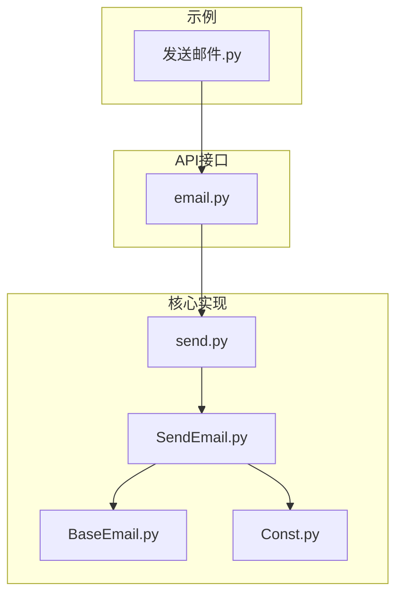
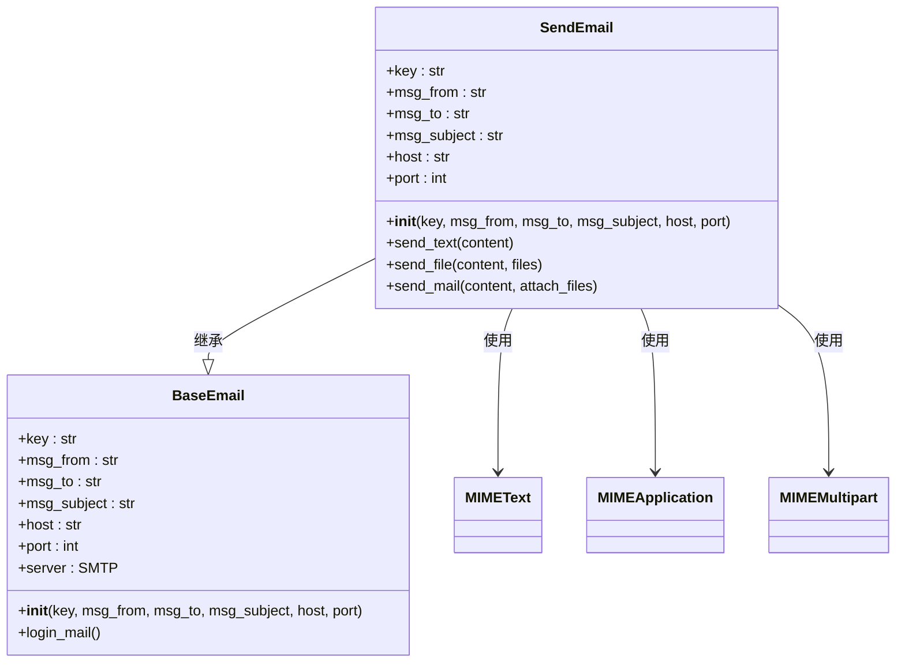
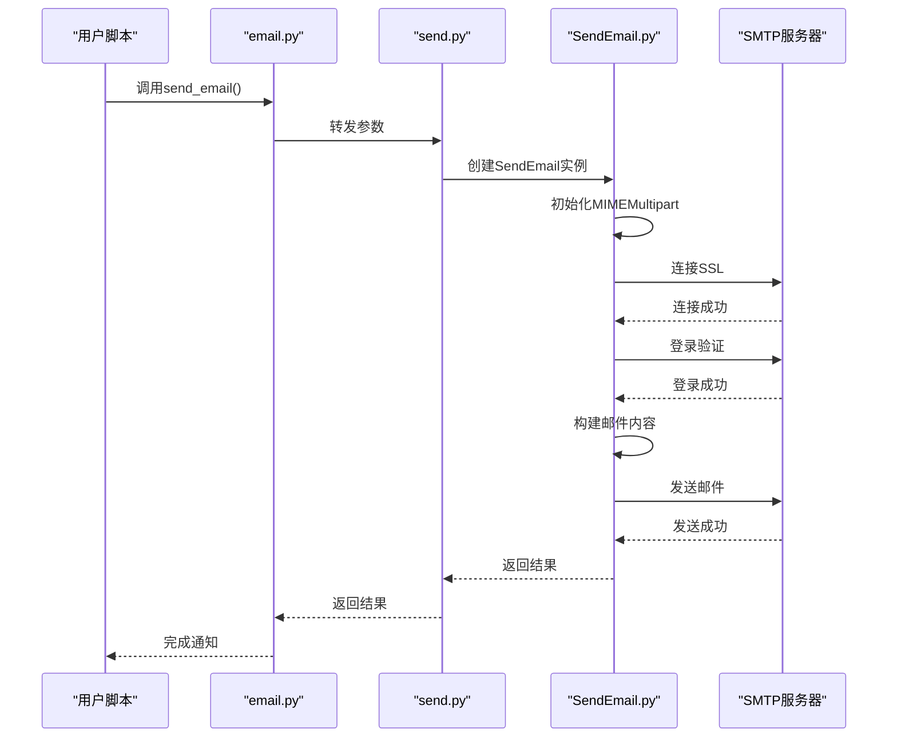
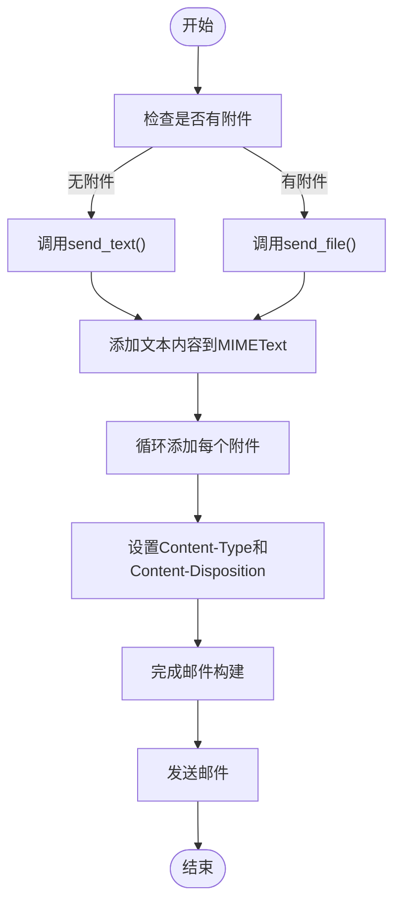
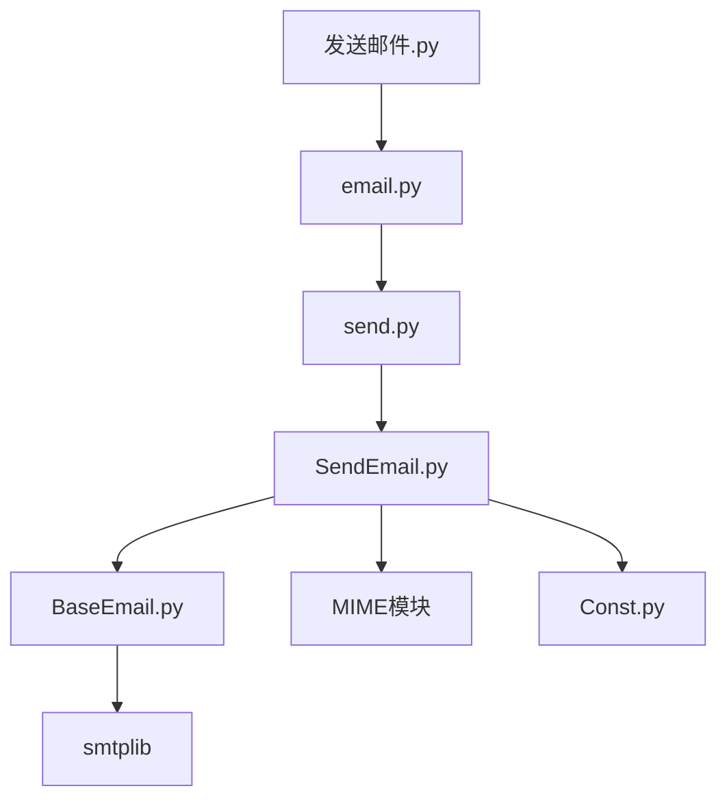

# 邮件自动化示例

<cite>
**本文档中引用的文件**  
- [发送邮件.py](file://examples/poemail/发送邮件.py)
- [email.py](file://office/api/email.py)
- [send.py](file://venv/Lib/site-packages/poemail/api/send.py)
- [SendEmail.py](file://venv/Lib/site-packages/poemail/core/SendEmail.py)
- [BaseEmail.py](file://venv/Lib/site-packages/poemail/core/BaseEmail.py)
- [Const.py](file://venv/Lib/site-packages/poemail/lib/Const.py)
</cite>

## 目录
1. [简介](#简介)
2. [项目结构](#项目结构)
3. [核心组件](#核心组件)
4. [架构概述](#架构概述)
5. [详细组件分析](#详细组件分析)
6. [依赖分析](#依赖分析)
7. [性能考虑](#性能考虑)
8. [故障排除指南](#故障排除指南)
9. [结论](#结论)

## 简介
本项目是一个基于Python的办公自动化工具集，其中包含强大的邮件发送功能。该功能允许用户通过简单的API调用实现邮件的自动发送，支持文本内容、附件以及批量发送等特性。项目由程序员晚枫开发，旨在简化日常办公中的重复性任务。

## 项目结构
该项目采用模块化设计，将不同功能分离到独立的目录中。邮件发送功能主要位于`examples/poemail`和`office/api/email.py`中，而核心实现则分布在`poemail`包的多个模块中。

**图示来源**  
- [发送邮件.py](file://examples/poemail/发送邮件.py#L1-L68)
- [email.py](file://office/api/email.py#L1-L44)
- [send.py](file://venv/Lib/site-packages/poemail/api/send.py#L1-L61)
- [SendEmail.py](file://venv/Lib/site-packages/poemail/core/SendEmail.py#L1-L81)
- [BaseEmail.py](file://venv/Lib/site-packages/poemail/core/BaseEmail.py#L1-L27)
- [Const.py](file://venv/Lib/site-packages/poemail/lib/Const.py#L1-L29)

**本节来源**  
- [发送邮件.py](file://examples/poemail/发送邮件.py#L1-L68)
- [email.py](file://office/api/email.py#L1-L44)

## 核心组件
邮件发送功能的核心组件包括SMTP协议配置、邮件内容构建、收件人列表管理以及安全凭证存储。这些组件共同协作，确保邮件能够安全、可靠地发送。

**本节来源**  
- [发送邮件.py](file://examples/poemail/发送邮件.py#L23-L34)
- [email.py](file://office/api/email.py#L9-L34)

## 架构概述
整个邮件发送功能采用分层架构设计，从上层的应用接口到底层的核心实现，每一层都有明确的职责划分。

**图示来源**  
- [SendEmail.py](file://venv/Lib/site-packages/poemail/core/SendEmail.py#L18-L81)
- [BaseEmail.py](file://venv/Lib/site-packages/poemail/core/BaseEmail.py#L11-L27)

## 详细组件分析

### SMTP协议配置与邮件发送流程
邮件发送功能通过SMTP协议与邮件服务器通信。用户需要提供邮箱授权码而非登录密码，以增强安全性。系统支持多种邮箱服务商，如QQ和163，并通过常量定义了对应的服务器地址。

**图示来源**  
- [email.py](file://office/api/email.py#L9-L34)
- [send.py](file://venv/Lib/site-packages/poemail/api/send.py#L34-L61)
- [SendEmail.py](file://venv/Lib/site-packages/poemail/core/SendEmail.py#L18-L81)
- [BaseEmail.py](file://venv/Lib/site-packages/poemail/core/BaseEmail.py#L11-L27)

**本节来源**  
- [email.py](file://office/api/email.py#L9-L34)
- [send.py](file://venv/Lib/site-packages/poemail/api/send.py#L34-L61)
- [SendEmail.py](file://venv/Lib/site-packages/poemail/core/SendEmail.py#L18-L81)

### 邮件内容构建与附件处理
系统支持纯文本邮件和带附件的邮件。对于附件，使用`MIMEApplication`进行封装，并正确设置内容类型和文件名。邮件内容采用UTF-8编码，确保中文字符的正确显示。

**图示来源**  
- [SendEmail.py](file://venv/Lib/site-packages/poemail/core/SendEmail.py#L34-L67)
- [Const.py](file://venv/Lib/site-packages/poemail/lib/Const.py#L19-L22)

**本节来源**  
- [SendEmail.py](file://venv/Lib/site-packages/poemail/core/SendEmail.py#L34-L67)

### 收件人列表与抄送管理
系统支持单个或多个收件人，以及抄送功能。收件人和抄送人地址以分号分隔的字符串形式传递，在发送时会被拆分为列表。抄送人信息会添加到邮件头的"Cc"字段中。

**本节来源**  
- [SendEmail.py](file://venv/Lib/site-packages/poemail/core/SendEmail.py#L20-L32)

### 安全凭证管理
邮箱凭证（授权码）作为参数直接传入，建议用户通过环境变量或配置文件管理敏感信息，避免硬编码在代码中。系统使用SSL加密连接，确保传输过程的安全性。

**本节来源**  
- [BaseEmail.py](file://venv/Lib/site-packages/poemail/core/BaseEmail.py#L23-L26)

## 依赖分析
邮件发送功能依赖于Python标准库中的`smtplib`和`email.mime`模块，以及项目内部的`poemail`包。各组件之间通过清晰的接口进行交互，降低了耦合度。

**图示来源**  
- [发送邮件.py](file://examples/poemail/发送邮件.py#L8-L50)
- [email.py](file://office/api/email.py#L5-L6)
- [send.py](file://venv/Lib/site-packages/poemail/api/send.py#L10-L11)
- [SendEmail.py](file://venv/Lib/site-packages/poemail/core/SendEmail.py#L14-L15)
- [BaseEmail.py](file://venv/Lib/site-packages/poemail/core/BaseEmail.py#L8)

**本节来源**  
- [发送邮件.py](file://examples/poemail/发送邮件.py#L8-L50)
- [email.py](file://office/api/email.py#L5-L6)

## 性能考虑
该实现采用同步方式发送邮件，在处理大量邮件时可能会成为性能瓶颈。建议在批量发送场景下使用连接池或异步IO优化性能。同时，大附件会显著增加发送时间，应考虑文件大小限制。

## 故障排除指南
常见问题包括SMTP配置错误、授权码无效、网络连接问题等。系统提供了基本的异常捕获机制，但在生产环境中建议添加更详细的日志记录和重试机制。

**本节来源**  
- [SendEmail.py](file://venv/Lib/site-packages/poemail/core/SendEmail.py#L70-L80)

## 结论
python-office的邮件发送功能提供了一个简洁而强大的API，使开发者能够轻松实现自动化邮件发送。通过合理的架构设计和清晰的接口定义，该功能既易于使用又具备良好的扩展性。在实际应用中，建议结合环境变量管理敏感信息，并添加适当的错误处理和日志记录。