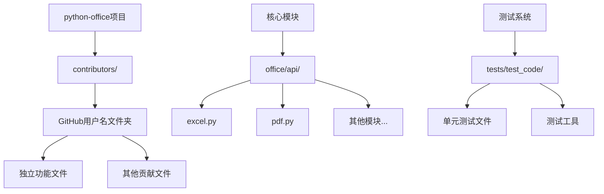
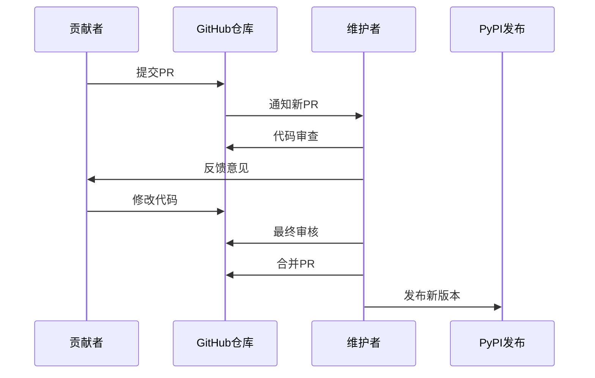
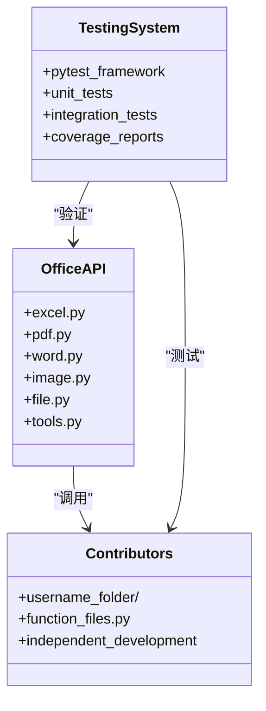
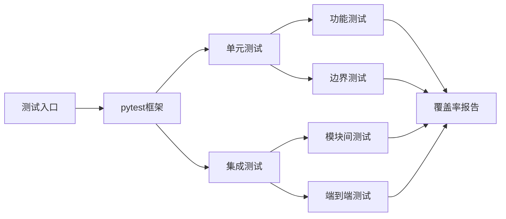
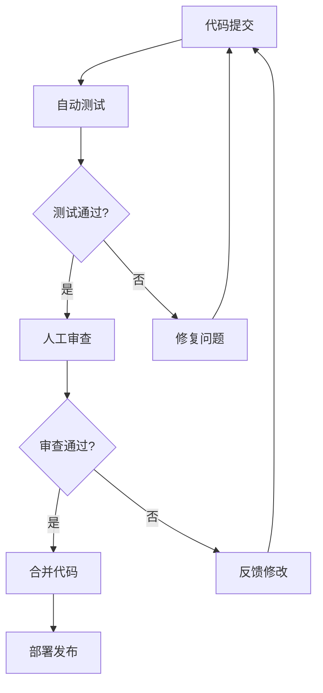

# 贡献指南

<cite>
**本文档引用的文件**
- [README.md](file://README.md)
- [README-EN.md](file://README-EN.md)
- [setup.py](file://setup.py)
- [settings.py](file://settings.py)
- [contributors/demo/WordType.py](file://contributors/demo/WordType.py)
- [contributors/CatchDr/doc2docx.py](file://contributors/CatchDr/doc2docx.py)
- [contributors/bulabean/SearchExcel.py](file://contributors/bulabean/SearchExcel.py)
- [contributors/yinzeyuan/Rename-AddSomething.py](file://contributors/yinzeyuan/Rename-AddSomething.py)
- [office/api/excel.py](file://office/api/excel.py)
- [office/api/pdf.py](file://office/api/pdf.py)
- [tests/test_code/test_excel.py](file://tests/test_code/test_excel.py)
- [tests/test_main.py](file://tests/test_main.py)
</cite>

## 目录
1. [项目简介](#项目简介)
2. [贡献政策概述](#贡献政策概述)
3. [贡献者架构设计](#贡献者架构设计)
4. [完整的贡献流程](#完整的贡献流程)
5. [代码质量标准](#代码质量标准)
6. [Bug报告与功能建议](#bug报告与功能建议)
7. [社区行为准则](#社区行为准则)
8. [技术架构支持](#技术架构支持)
9. [测试与验证](#测试与验证)
10. [常见问题解答](#常见问题解答)

## 项目简介

Python-office是一个功能强大的Python自动化办公第三方库，致力于解决大部分自动化办公问题。该项目采用"添砖加瓦"的理念，鼓励社区贡献者在不影响核心代码稳定性的前提下，自由发挥创意和实验新功能。

### 核心特性
- **开箱即用**：每个功能只需一行代码，无需学习Python基础知识
- **贴合职场需求**：功能设计紧密围绕实际办公场景
- **极简编程**：学习成本低，工作效率显著提升
- **模块化架构**：支持按需导入特定功能模块

**节来源**
- [README.md](file://README.md#L47-L65)

## 贡献政策概述

### 核心原则

Python-office采用独特的贡献策略，旨在平衡创新与稳定性：

1. **隔离式贡献**：所有贡献者必须在`contributors/`目录下创建独立文件夹
2. **禁止修改他人代码**：严禁修改其他贡献者的代码或核心模块
3. **保护主干稳定性**：通过隔离机制确保主干代码的稳定性
4. **鼓励创新实验**：为创新和实验提供安全的空间

### 设计意图

这种设计的核心目的是：
- **保护核心代码**：避免因个人实验影响整体项目稳定性
- **降低贡献门槛**：让任何人都能轻松参与项目
- **促进知识分享**：通过独立贡献展示不同解决方案
- **保持项目纯净**：确保主干代码的简洁性和可靠性

**节来源**
- [README.md](file://README.md#L117-L126)
- [README-EN.md](file://README-EN.md#L115-L147)

## 贡献者架构设计

### 目录结构



**图表来源**
- [contributors/demo/WordType.py](file://contributors/demo/WordType.py#L1-L92)
- [contributors/CatchDr/doc2docx.py](file://contributors/CatchDr/doc2docx.py#L1-L69)
- [office/api/excel.py](file://office/api/excel.py#L1-L137)

### 贡献者文件夹结构

每个贡献者都需要在`contributors/`目录下创建以GitHub用户名命名的独立文件夹：

```
contributors/
├── CatchDr/
│   ├── Baidu_Text_transAPI.py
│   ├── doc2docx.py
│   ├── docx2doc.py
│   └── ...
├── bulabean/
│   ├── SearchExcel.py
│   └── SplitExcel.py
├── demo/
│   └── WordType.py
└── yinzeyuan/
    ├── Rename-AddSomething.py
    ├── SearchSpecifyTypeFile.py
    └── ...
```

### 文件命名规范

1. **功能导向命名**：文件名应清晰反映功能用途
2. **描述性命名**：如`doc2docx.py`、`SearchExcel.py`、`Rename-AddSomething.py`
3. **避免冲突**：确保文件名在个人文件夹内唯一

**节来源**
- [contributors/CatchDr/doc2docx.py](file://contributors/CatchDr/doc2docx.py#L1-L10)
- [contributors/bulabean/SearchExcel.py](file://contributors/bulabean/SearchExcel.py#L1-L10)

## 完整的贡献流程

### 步骤1：准备工作

#### 1.1 Fork仓库
```bash
# 访问项目主页，在GitHub/Gitee/GitCode上点击"Fork"按钮
# 将项目复制到自己的账户下
```

#### 1.2 克隆到本地
```bash
# 克隆你自己的Fork仓库
git clone https://github.com/YOUR_USERNAME/python-office.git
cd python-office
```

#### 1.3 设置上游仓库
```bash
# 添加原始仓库作为上游源
git remote add upstream https://github.com/CoderWanFeng/python-office.git
```

### 步骤2：创建贡献分支

```bash
# 创建新的功能分支
git checkout -b feature-your-feature-name

# 或创建bug修复分支
git checkout -b fix-bug-description
```

### 步骤3：创建贡献文件夹

```bash
# 在contributors目录下创建你的GitHub用户名文件夹
mkdir contributors/your-github-username

# 在文件夹中创建功能文件
touch contributors/your-github-username/your-function-name.py
```

### 步骤4：编写高质量代码

#### 4.1 代码结构示例

```python
# 文件头部注释
# -*- coding: UTF-8 -*-
"""
功能描述：简要说明功能用途
作者：GitHub用户名
项目：https://www.python-office.com
"""

# 导入必要的模块
import necessary_modules

def your_function_name(param1, param2):
    """
    函数详细说明：
    - 参数说明
    - 返回值说明
    - 使用示例
    
    Args:
        param1 (type): 参数1说明
        param2 (type): 参数2说明
        
    Returns:
        type: 返回值说明
    """
    # 实现逻辑
    pass
```

#### 4.2 必备元素

1. **文件头部注释**：包含功能描述、作者信息、项目链接
2. **函数文档字符串**：详细说明参数和返回值
3. **适当的错误处理**：考虑边界情况和异常
4. **清晰的变量命名**：使用有意义的变量名

### 步骤5：提交更改

```bash
# 添加文件到暂存区
git add .

# 提交更改
git commit -m "feat: 添加新的功能描述"

# 推送到远程仓库
git push origin feature-your-feature-name
```

### 步骤6：创建Pull Request

1. **访问GitHub/Gitee/GitCode**
2. **点击"New Pull Request"**
3. **选择正确的分支对比**
4. **填写详细的PR描述**
5. **等待维护者审核**

### 步骤7：PR审查与合并



**图表来源**
- [README-EN.md](file://README-EN.md#L140-L147)

**节来源**
- [README-EN.md](file://README-EN.md#L140-L147)

## 代码质量标准

### 编码规范

#### 5.1 注释要求

每个新函数必须包含详细的文档字符串：

```python
def process_data(input_path: str, output_path: str) -> None:
    """
    处理指定路径下的数据文件。
    
    Args:
        input_path (str): 输入文件路径
        output_path (str): 输出文件路径
        
    Returns:
        None
        
    Raises:
        FileNotFoundError: 当输入文件不存在时抛出
        ValueError: 当输入参数无效时抛出
    """
```

#### 5.2 代码格式化

1. **缩进**：使用4个空格，不使用制表符
2. **行长度**：每行不超过88个字符
3. **命名规范**：
   - 函数和变量：使用snake_case
   - 类：使用PascalCase
   - 常量：使用UPPER_CASE

#### 5.3 错误处理

```python
import os
import logging

def safe_process_file(file_path: str) -> bool:
    """
    安全处理文件，包含完整的错误处理。
    
    Args:
        file_path (str): 要处理的文件路径
        
    Returns:
        bool: 处理成功返回True，否则返回False
    """
    try:
        # 验证文件存在
        if not os.path.exists(file_path):
            logging.error(f"文件不存在: {file_path}")
            return False
            
        # 验证文件可读
        if not os.access(file_path, os.R_OK):
            logging.error(f"文件不可读: {file_path}")
            return False
            
        # 执行处理逻辑
        # ...
        
        return True
        
    except Exception as e:
        logging.error(f"处理文件时发生错误: {e}")
        return False
```

### 性能考虑

1. **内存优化**：对于大文件处理，使用生成器模式
2. **并发处理**：在适当场景使用多线程或多进程
3. **资源清理**：确保正确关闭文件句柄和网络连接

**节来源**
- [contributors/demo/WordType.py](file://contributors/demo/WordType.py#L10-L20)
- [contributors/CatchDr/doc2docx.py](file://contributors/CatchDr/doc2docx.py#L16-L35)

## Bug报告与功能建议

### Bug报告渠道

Python-office提供三个官方bug报告渠道：

| 平台 | 链接 | 适用场景 |
|------|------|----------|
| GitCode Issue | https://atomgit.com/CoderWanFeng1/python-office/issues | 国内用户首选 |
| Gitee Issue | https://gitee.com/CoderWanFeng/python-office/issues | 国内镜像平台 |
| GitHub Issue | https://github.com/CoderWanFeng/python-office/issues | 国际用户首选 |

### 报告要求

#### 6.1 Bug报告模板

```markdown
## Bug描述
简要描述遇到的问题

## 重现步骤
1. 执行命令/操作：...
2. 观察到的现象：...
3. 期望的结果：...

## 环境信息
- Python版本：...
- 操作系统：...
- python-office版本：...

## 错误信息
```
粘贴完整的错误堆栈信息
```

## 附加信息
- 相关文件：...
- 截图：...
```

#### 6.2 功能建议模板

```markdown
## 功能描述
详细描述希望添加的功能

## 使用场景
说明该功能的应用场景和价值

## 实现建议
如果有想法，可以提供实现思路

## 替代方案
是否已有其他解决方案
```

### 禁止事项

1. **禁止Python学习答疑**：不提供Python基础语法教学
2. **禁止个人练习讨论**：不涉及个人编程练习问题
3. **专注代码相关问题**：仅讨论与python-office代码本身相关的问题

**节来源**
- [README.md](file://README.md#L128-L135)

## 社区行为准则

### 基本原则

1. **尊重他人**：尊重所有贡献者和用户的观点
2. **建设性沟通**：提供建设性的反馈和建议
3. **开放包容**：欢迎不同背景和经验水平的贡献者
4. **专业态度**：保持专业的技术讨论氛围

### 贡献者承诺

作为社区成员，我们承诺：

- 为所有人创造一个无骚扰的参与环境
- 尊重不同的观点和经验
- 以友好和包容的态度对待新手
- 致力于为整个社区的最佳利益做出贡献

### 不当行为

以下行为被视为不当：

- 使用性化的语言或图像
- 恶意攻击或人身攻击
- 公开或私下骚扰
- 发布他人的私人信息
- 其他在专业环境中不当的行为

### 执行机制

违反行为准则的用户可能会受到以下处理：

1. **警告**：首次违规给予警告
2. **临时限制**：严重违规可能被暂时限制参与
3. **永久移除**：反复违规可能导致永久移除

## 技术架构支持

### 核心模块架构



**图表来源**
- [office/api/excel.py](file://office/api/excel.py#L1-L20)
- [office/api/pdf.py](file://office/api/pdf.py#L1-L20)

### 模块化设计

项目采用模块化架构，每个功能模块独立：

- **poexcel**: Excel处理功能
- **popdf**: PDF处理功能  
- **poword**: Word处理功能
- **poimage**: 图片处理功能
- **pofile**: 文件管理功能

### 测试框架



**图表来源**
- [tests/test_main.py](file://tests/test_main.py#L1-L25)
- [tests/test_code/test_excel.py](file://tests/test_code/test_excel.py#L1-L30)

**节来源**
- [office/api/excel.py](file://office/api/excel.py#L1-L20)
- [office/api/pdf.py](file://office/api/pdf.py#L1-L20)
- [tests/test_main.py](file://tests/test_main.py#L1-L25)

## 测试与验证

### 测试策略

#### 7.1 单元测试

项目使用pytest框架进行单元测试：

```python
import unittest
from tests.test_utils.comm_utils import *
from office.api.excel import *

class TestExcel(unittest.TestCase):
    """Excel功能测试类"""
    
    def test_fake2excel(self) -> None:
        """测试fake2excel函数生成测试Excel文件的功能"""
        test_file_name = './fake2excel.xlsx'
        fake2excel(language='sdag')
        # 检查文件是否存在
        self.assertTrue(file_exist(test_file_name))
        # 检查文件标题
        self.assertEqual("name", get_colum_content(test_file_name, 0))
```

#### 7.2 测试覆盖范围

测试涵盖以下方面：

1. **功能完整性测试**：验证所有功能正常工作
2. **边界条件测试**：测试极端输入情况
3. **错误处理测试**：验证错误情况下的行为
4. **性能测试**：确保功能在合理时间内完成

### 质量保证流程



**图表来源**
- [tests/test_code/test_excel.py](file://tests/test_code/test_excel.py#L11-L81)

**节来源**
- [tests/test_code/test_excel.py](file://tests/test_code/test_excel.py#L11-L81)
- [tests/test_main.py](file://tests/test_main.py#L16-L25)

## 常见问题解答

### Q1: 如何确定我的贡献是否合适？

**A1**: 检查以下几点：
- 功能是否与自动化办公相关
- 是否解决了实际问题
- 代码是否遵循项目规范
- 是否有适当的文档和测试

### Q2: 我的代码被拒绝了怎么办？

**A2**: 
1. 仔细阅读拒绝原因
2. 根据反馈修改代码
3. 重新提交PR
4. 积极参与讨论，寻求改进意见

### Q3: 如何获得技术支持？

**A3**: 
- 查看项目文档和示例代码
- 在GitHub Issues中搜索类似问题
- 加入项目交流群获取帮助
- 参考视频教程学习

### Q4: 如何学习更多贡献技巧？

**A4**: 
- 研究现有贡献者的代码风格
- 学习项目的核心架构设计
- 参与社区讨论和代码审查
- 关注项目的发展方向和优先级

### Q5: 贡献后多久能看到效果？

**A5**: 
- 通常1-3个工作日内会收到初步反馈
- 完整审查和合并可能需要1-2周
- 新版本发布周期约为每月一次

## 结语

Python-office项目欢迎每一位贡献者的参与。我们相信，正是众多社区成员的共同努力，才使得这个项目能够持续发展和进步。无论你是初学者还是经验丰富的开发者，都可以在这里找到适合自己的贡献方式。

记住，每一次小小的改进都是对整个社区的巨大贡献。让我们携手共建更好的Python自动化办公生态！

**节来源**
- [README.md](file://README.md#L117-L135)
- [README-EN.md](file://README-EN.md#L115-L147)