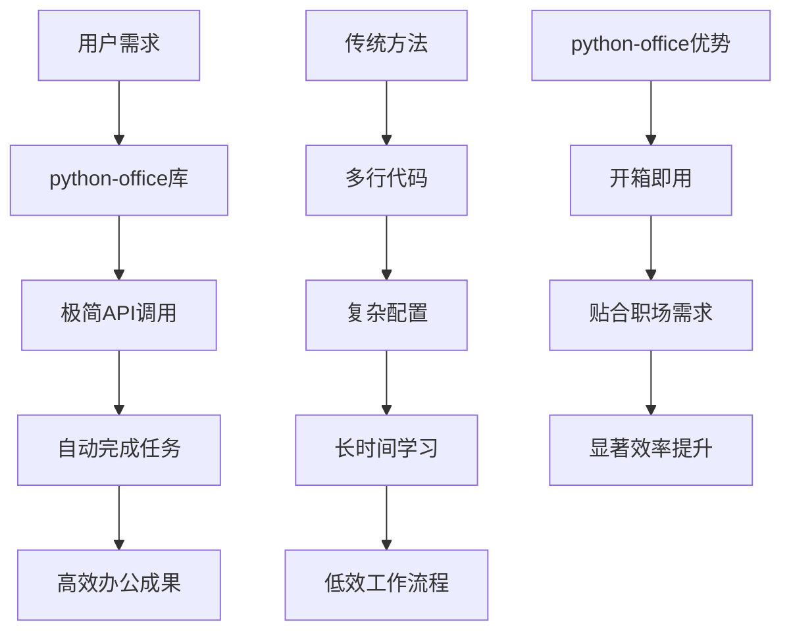
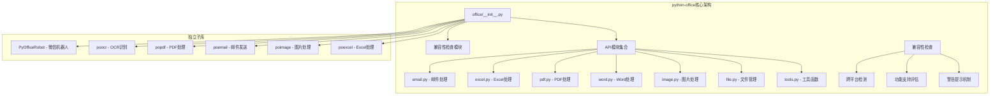
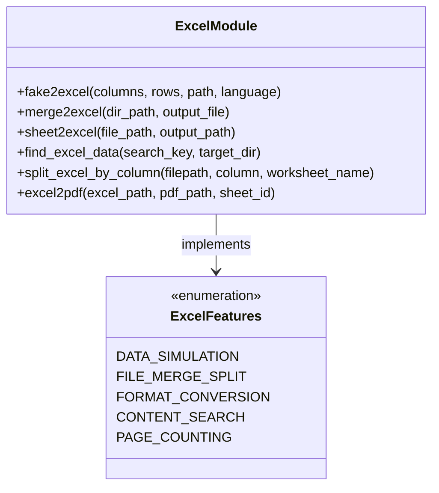
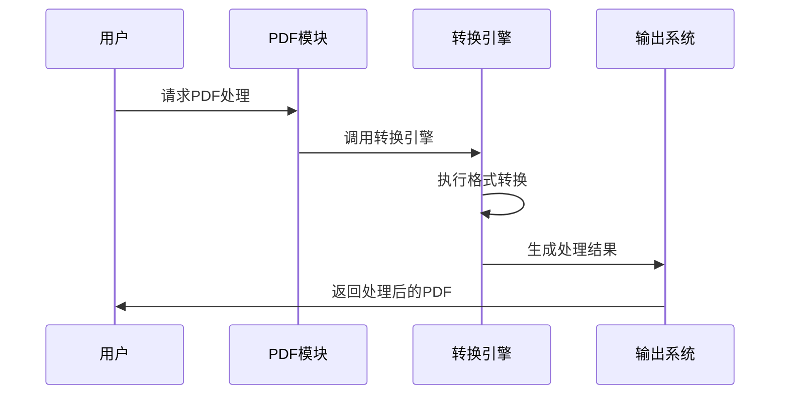
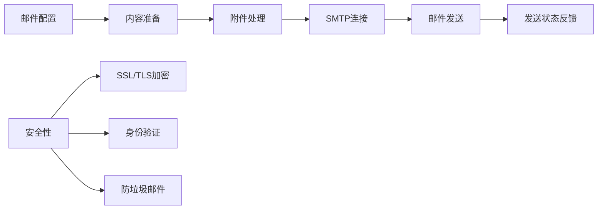
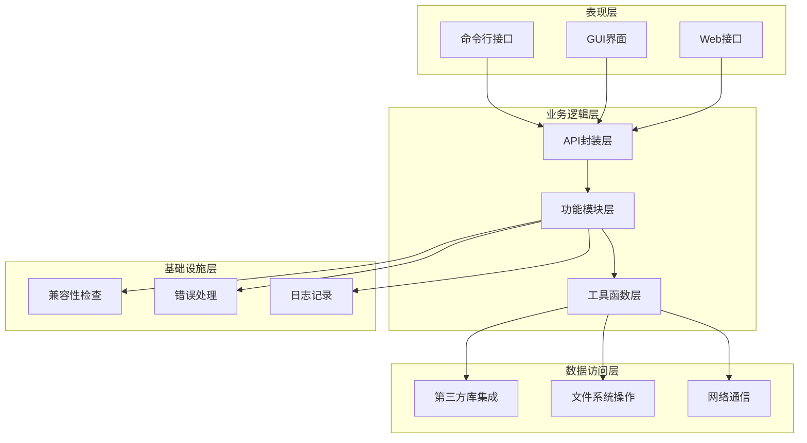
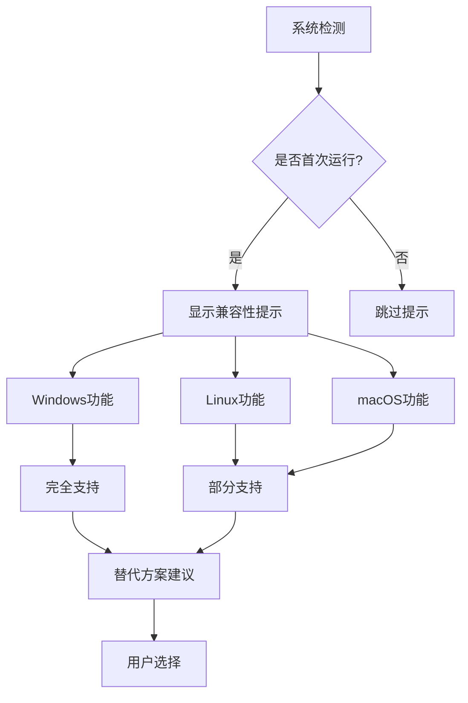
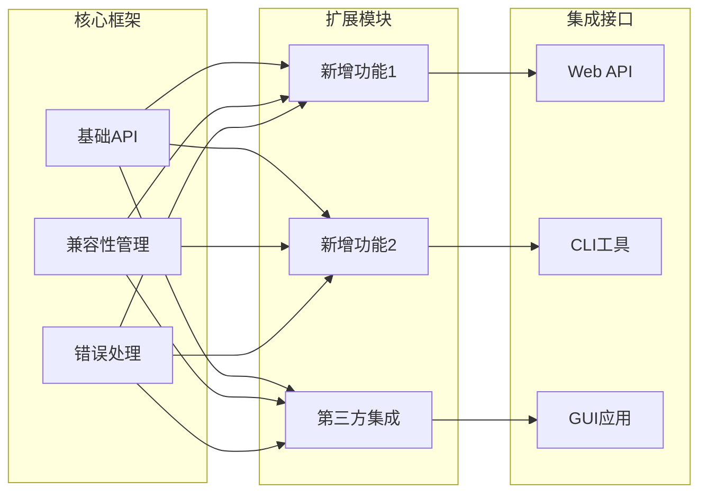

# python-office项目概述

<cite>
**本文档引用的文件**
- [README.md](file://README.md)
- [office/__init__.py](file://office/__init__.py)
- [office/api/__init__.py](file://office/api/__init__.py)
- [office/api/excel.py](file://office/api/excel.py)
- [office/api/pdf.py](file://office/api/pdf.py)
- [office/api/email.py](file://office/api/email.py)
- [office/compatibility.py](file://office/compatibility.py)
- [setup.py](file://setup.py)
- [settings.py](file://settings.py)
- [examples/readme.md](file://examples/readme.md)
- [examples/poexcel/创建Excel文件.py](file://examples/poexcel/创建Excel文件.py)
- [examples/popdf/TXT转PDF.py](file://examples/popdf/TXT转PDF.py)
- [examples/poemail/发送邮件.py](file://examples/poemail/发送邮件.py)
- [gui/qtpy/version1/main.py](file://gui/qtpy/version1/main.py)
</cite>

## 目录
1. [项目简介](#项目简介)
2. [设计理念与核心价值](#设计理念与核心价值)
3. [项目架构设计](#项目架构设计)
4. [核心功能模块](#核心功能模块)
5. [技术架构与设计理念](#技术架构与设计理念)
6. [跨平台兼容性](#跨平台兼容性)
7. [实际应用场景](#实际应用场景)
8. [扩展性与集成潜力](#扩展性与集成潜力)
9. [项目特色与优势](#项目特色与优势)
10. [总结](#总结)

## 项目简介

python-office是一个专为Python自动化办公场景设计的第三方库，致力于通过极简的一行代码调用实现复杂的办公任务自动化。该项目由程序员晚枫开发，旨在降低非专业编程人员的使用门槛，让职场人士能够快速实现办公效率的显著提升。

### 项目定位
python-office定位于"开箱即用"的自动化办公解决方案，专注于解决大部分日常办公中的自动化需求。项目采用模块化设计，集成了文档处理、通信自动化、AI交互等多个领域的功能，形成了一个完整的办公自动化生态系统。

### 技术愿景
项目的技术愿景是构建一个"集成文档处理、通信自动化、AI交互等多领域功能于一体"的综合办公平台，服务于职场效率提升。通过统一的API接口和简洁的调用方式，让复杂的办公任务变得简单易用。

**章节来源**
- [README.md](file://README.md#L47-L52)
- [office/__init__.py](file://office/__init__.py#L23-L30)

## 设计理念与核心价值

### 极简主义设计哲学

python-office的核心设计理念是"极简编程，学习成本极低，工作效率提升显著"。这一理念体现在以下几个方面：

#### 一行代码解决问题
项目强调每个功能只需一行代码即可完成，无需用户具备深厚的Python编程知识。这种设计理念使得非技术人员也能轻松使用复杂的办公自动化功能。



**图表来源**
- [README.md](file://README.md#L59-L65)
- [examples/poexcel/创建Excel文件.py](file://examples/poexcel/创建Excel文件.py#L17-L18)

#### 贴合职场需求
项目功能设计紧密贴合职场办公的实际需求，涵盖了文档处理、邮件发送、文件管理等日常工作中的常见场景。这种设计确保了用户能够直接应用项目功能解决实际问题。

### 开放式生态建设

python-office不仅仅是一个单一的库，而是一个开放式的办公自动化生态系统。项目鼓励社区贡献，支持独立子库的发展，形成了一个相互协作的功能集合。

**章节来源**
- [README.md](file://README.md#L59-L65)
- [office/__init__.py](file://office/__init__.py#L23-L30)

## 项目架构设计

### 模块化组织架构

python-office采用了清晰的模块化组织架构，通过`office/__init__.py`作为统一入口协调各个子模块的功能。



**图表来源**
- [office/__init__.py](file://office/__init__.py#L7-L21)
- [office/api/__init__.py](file://office/api/__init__.py#L1-L2)

### 统一入口设计

`office/__init__.py`作为项目的统一入口，承担着以下重要职责：

#### 兼容性检查机制
项目在初始化时会自动执行兼容性检查，确保在不同操作系统上的功能可用性。这种设计避免了用户在使用过程中遇到平台相关的问题。

#### 模块导入协调
通过统一的导入机制，用户可以选择：
- `import office`：导入所有功能模块
- `from office import excel`：按需导入特定模块
- 直接使用子模块：如`office.excel.fake2excel()`

#### 版本管理
项目通过`__version__`变量统一管理版本信息，便于用户了解当前使用的版本状态。

**章节来源**
- [office/__init__.py](file://office/__init__.py#L1-L30)
- [office/compatibility.py](file://office/compatibility.py#L227-L235)

## 核心功能模块

### 文档处理模块

#### Excel处理功能
Excel模块提供了丰富的数据处理功能，包括数据模拟、文件合并拆分、格式转换等核心功能。



**图表来源**
- [office/api/excel.py](file://office/api/excel.py#L25-L137)

#### PDF处理功能
PDF模块涵盖了文档转换、加密解密、水印添加等完整的PDF处理流程。



**图表来源**
- [office/api/pdf.py](file://office/api/pdf.py#L28-L200)

#### Word处理功能
Word模块提供了文档转换、合并等基本处理功能，支持常见的办公文档格式转换需求。

### 通信自动化模块

#### 邮件发送功能
邮件模块实现了自动化的邮件发送功能，支持多种邮件协议和附件处理。



**图表来源**
- [office/api/email.py](file://office/api/email.py#L8-L45)

### 文件管理模块

#### 文件操作功能
文件管理模块提供了批量重命名、内容搜索、文件分类等实用功能，帮助用户高效管理大量文件。

#### 系统集成
模块支持与操作系统深度集成，提供原生的文件操作体验。

**章节来源**
- [office/api/excel.py](file://office/api/excel.py#L1-L137)
- [office/api/pdf.py](file://office/api/pdf.py#L1-L200)
- [office/api/email.py](file://office/api/email.py#L1-L45)

## 技术架构与设计理念

### 分层架构设计

python-office采用了清晰的分层架构设计，确保了系统的可维护性和扩展性：



### 设计模式应用

#### 单例模式
兼容性检查器采用单例模式，确保全局只有一个检查实例，避免重复的系统检测。

#### 策略模式
不同平台的功能支持采用策略模式，根据系统特性选择最适合的实现方式。

#### 适配器模式
通过适配器模式整合第三方库，为用户提供统一的API接口。

### 性能优化策略

#### 延迟加载
模块采用延迟加载机制，只有在实际使用时才会加载相应的功能模块，提高了启动速度。

#### 缓存机制
对于频繁使用的功能，实现了适当的缓存机制，减少重复计算和系统调用。

#### 资源管理
合理管理内存和文件资源，避免长时间运行导致的资源泄漏。

**章节来源**
- [office/compatibility.py](file://office/compatibility.py#L14-L250)

## 跨平台兼容性

### 兼容性检查机制

python-office实现了完善的跨平台兼容性检查机制，确保在不同操作系统上的功能可用性。



**图表来源**
- [office/compatibility.py](file://office/compatibility.py#L14-L250)

### 平台特定功能

#### Windows平台
- **完全支持**：Excel处理、PDF处理、图片处理、文件管理、邮件发送
- **特殊功能**：PPT处理、Word处理、微信机器人、文件搜索

#### Linux平台
- **完全支持**：大部分核心功能
- **替代方案**：LibreOffice替代Microsoft Office功能

#### macOS平台
- **完全支持**：核心功能
- **替代方案**：Homebrew安装LibreOffice

### 兼容性警告系统

项目实现了智能的兼容性警告系统，在用户首次使用非Windows系统时，会显示详细的兼容性信息和替代方案建议。

**章节来源**
- [office/compatibility.py](file://office/compatibility.py#L40-L250)

## 实际应用场景

### 办公自动化场景

#### 数据处理自动化
```python
# Excel数据处理示例
import office

# 批量生成模拟数据
office.excel.fake2excel(
    columns=['姓名', '部门', '职位', '入职日期'],
    rows=100,
    path='./员工信息.xlsx',
    language='zh_CN'
)

# 合并多个Excel文件
office.excel.merge2excel('./data/', './合并后的员工信息.xlsx')

# 根据条件筛选数据
office.excel.find_excel_data('财务部', './data/')
```

#### 文档转换自动化
```python
# PDF处理示例
import office

# 文本转PDF
office.pdf.txt2pdf(
    input_file='./报告.txt',
    output_file='./报告.pdf'
)

# PDF加水印
office.pdf.add_text_watermark(
    input_file='./合同.pdf',
    point=(100, 100),
    text='机密文件',
    output_file='./带水印合同.pdf'
)

# PDF合并
office.pdf.merge2pdf(
    input_file_list=['./文档1.pdf', './文档2.pdf'],
    output_file='./合并文档.pdf'
)
```

#### 通信自动化
```python
# 邮件发送示例
import office

# 发送邮件
office.email.send_email(
    key='your_email_password',
    msg_from='sender@example.com',
    msg_to='recipient@example.com',
    msg_subject='项目进度报告',
    content='请查收最新的项目进展...',
    attach_files=['./项目报告.pdf']
)
```

### 行业应用案例

#### 企业行政管理
- **人事管理**：批量生成员工信息、考勤统计
- **文档管理**：合同归档、报告整理
- **沟通协作**：批量邮件发送、会议通知

#### 财务审计
- **报表处理**：Excel数据清洗、PDF报告生成
- **凭证管理**：票据扫描、账目核对
- **审计支持**：文档检索、数据统计

#### 市场营销
- **客户管理**：批量数据处理、客户分析
- **内容制作**：图文混排、格式转换
- **渠道推广**：邮件群发、资料分发

**章节来源**
- [examples/poexcel/创建Excel文件.py](file://examples/poexcel/创建Excel文件.py#L17-L18)
- [examples/popdf/TXT转PDF.py](file://examples/popdf/TXT转PDF.py#L6-L7)
- [examples/poemail/发送邮件.py](file://examples/poemail/发送邮件.py#L10-L68)

## 扩展性与集成潜力

### 插件化架构

python-office采用插件化架构设计，支持功能的动态扩展和模块化集成。



### 第三方集成能力

#### AI功能集成
- **图像识别**：OCR文字识别、图像分类
- **自然语言处理**：文本分析、语义理解
- **机器学习**：数据挖掘、预测分析

#### 云服务集成
- **文档服务**：云端存储、在线协作
- **通信服务**：即时通讯、消息推送
- **数据分析**：大数据处理、可视化

#### 硬件设备集成
- **打印机**：文档打印、标签制作
- **扫描仪**：文档扫描、图像处理
- **移动设备**：移动端同步、远程控制

### 开发者友好特性

#### 清晰的API设计
- **一致性**：统一的参数命名和返回格式
- **完整性**：覆盖常用功能的完整API
- **易用性**：直观的方法命名和参数说明

#### 丰富的示例代码
项目提供了大量的示例代码，涵盖各种使用场景，帮助开发者快速上手。

#### 完善的文档体系
- **功能文档**：详细的API说明和使用指南
- **视频教程**：直观的操作演示
- **最佳实践**：行业应用案例和经验分享

**章节来源**
- [office/__init__.py](file://office/__init__.py#L1-L30)
- [examples/readme.md](file://examples/readme.md#L1-L338)

## 项目特色与优势

### 技术特色

#### 1. 极简API设计
- **一行代码**：复杂功能通过简单的API调用实现
- **参数最少化**：合理的默认参数设置
- **直观命名**：方法名称直接反映功能用途

#### 2. 智能兼容性管理
- **自动检测**：运行时自动检测系统环境
- **智能提示**：针对不同平台提供合适的建议
- **无缝切换**：跨平台功能保持一致的使用体验

#### 3. 模块化架构
- **功能分离**：不同功能模块独立开发和维护
- **按需加载**：支持选择性功能导入
- **易于扩展**：清晰的扩展点和插件机制

### 商业价值

#### 提升工作效率
- **时间节省**：自动化处理重复性工作
- **质量保证**：减少人为错误
- **标准化**：统一的处理流程和格式

#### 降低学习成本
- **零基础使用**：无需编程知识即可使用
- **快速上手**：直观的API设计和丰富的示例
- **持续学习**：完善的文档和社区支持

#### 促进数字化转型
- **技术普及**：降低技术门槛，推动数字化应用
- **流程优化**：标准化和自动化的办公流程
- **创新应用**：为新的业务模式提供技术支持

### 社区生态

#### 开源协作
- **透明开发**：完整的代码公开和版本管理
- **社区参与**：鼓励用户贡献和反馈
- **持续改进**：基于用户需求的功能迭代

#### 教育价值
- **实践教学**：真实的项目案例和应用场景
- **技能培养**：从入门到精通的学习路径
- **职业发展**：提升职场竞争力的重要技能

**章节来源**
- [README.md](file://README.md#L47-L65)
- [office/__init__.py](file://office/__init__.py#L23-L30)

## 总结

python-office作为一个专业的Python自动化办公解决方案，成功地将复杂的技术实现转化为简单易用的API接口。项目通过极简的设计理念、完善的兼容性管理和丰富的功能集合，为职场人士提供了一个强大的办公自动化工具。

### 核心成就

1. **技术突破**：实现了"一行代码解决复杂办公任务"的技术目标
2. **用户体验**：创造了"开箱即用"的使用体验
3. **生态建设**：构建了完整的办公自动化生态系统
4. **社区影响**：推动了Python在办公自动化领域的应用普及

### 发展前景

python-office将继续朝着以下方向发展：
- **功能扩展**：持续增加新的办公自动化功能
- **性能优化**：提升处理效率和系统稳定性
- **生态完善**：加强与其他工具和平台的集成
- **国际化**：支持更多语言和地区的需求

### 使用建议

对于初学者：
- 从简单的功能开始，逐步掌握复杂的自动化技巧
- 参考项目提供的丰富示例和教程
- 积极参与社区讨论，分享使用经验和解决方案

对于高级用户：
- 利用项目的扩展性，开发定制化的办公自动化解决方案
- 参与项目贡献，推动功能的持续改进
- 探索与其他技术栈的集成可能性

python-office不仅是一个技术工具，更是连接技术与实际需求的桥梁，为现代办公的数字化转型提供了强有力的支持。

**章节来源**
- [README.md](file://README.md#L1-L150)
- [office/__init__.py](file://office/__init__.py#L1-L30)
- [office/compatibility.py](file://office/compatibility.py#L1-L250)