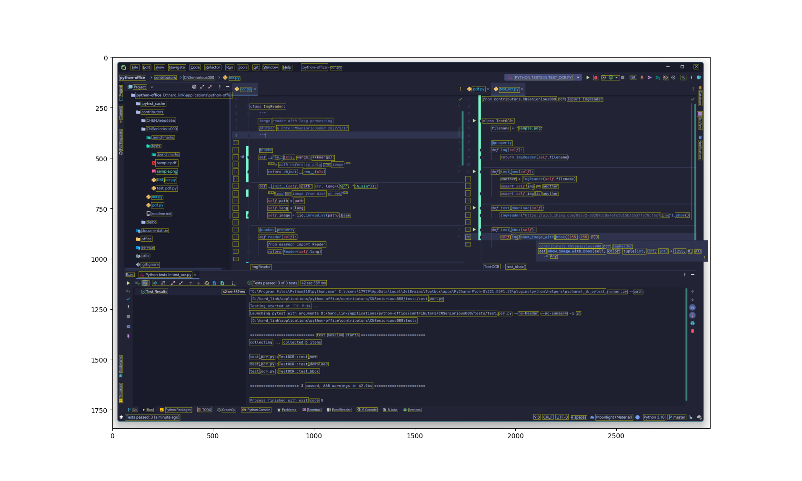

需要安装的库：

```text
# requirements.txt

PyMuPDF  # 解析PDF用
easyocr  # OCR用
imageio  # 读取图片用

requests  # 如果不加载网络图片/PDF则不用
rapidfuzz  # 模糊匹配用
matplotlib  # 展示图片（debug）用
opencv-python  # render_bbox()中画线用
```

---

## 如何使用

```python
from contributors.CNSeniorious000.pdf import PDF

# 将sample.pdf中的所有页面以300ppi的分辨率导出为jpg到output文件夹
PDF("sample.pdf").save_images("output", encode="jpg", dpi=300)
```

经过巧妙的设计，用同一个`path`获得的`PDF`对象是相同的。也就是说任何相同的操作都只会进行一次。可以放心地创建PDF对象，不用专心优化

对一张4K截图进行OCR即使用GPU也要将近10s，而`ImgReader`类保证了初始化两次同一个路径的图片都会返回同一个对象的引用，因此不会给欠优化的代码任何重复计算的可能

**`path`可以是本地路径也可以是网络上的链接，使用起来十分方便**

```python
from contributors.CNSeniorious000.ocr import ImgReader

img = ImgReader("sample.png")

# 获取sample.png中的所有文本
for points, string, degree in img.texts:
    ...  # do some processing
    # degree为区域内是文字的置信度

img.show_image_with_bbox(color=(255, 255, 0))  # yellow rects marking text areas
```



> ### `ImgReader.classify(self, choices)`的用法（真实案例）
> 假设你需要处理学校里200份mcm竞赛的获奖证书，用来查询比赛结果
> （MCM比赛没有别的查分途径，只能通过pdf进行查询）
> （而且他们的PDF中，关键信息既不是文本也不是图片，而是转曲的文字，可以认为就是svg
> 所以必须通过OCR的方式获取）
>
> 
>
> 但是由于文字格式有变化，所以并不能认为在某个区域的文字就是我们要的结果，或者认为第几个结果就是
>
> 因此我们提供所有的可能性，取匹配率最高的，即为所求
>
> 已知奖项一共只用6种，分别为：
> - Outstanding Winner
> - Finalist
> - Meritorious Winner
> - Honorable Mention
> - Successful Participant
> - Unsuccessful Participant
>
> 于是，识别一张图片只需要一行：
>
> ```python
> from contributors.CNSeniorious000.ocr import ImgReader
> 
> all_awards = ["Outstanding Winner", "Finalist", "Meritorious Winner", "Honorable Mention", "Successful Participant", "Unsuccessful Participant"]
> ImgReader.from_pdf("<pdf-path>").classify(all_awards)
> ```
>
> 而原来完成这个任务需要长达数十行的代码，详见我的仓库
> [GitHub](https://github.com/CNSeniorious000/mcm-utils/blob/master/app.py#L9)/[Gitee](https://gitee.com/Seniorious000/mcm-utils/blob/master/app.py#L9)

## 项目结构

- `pdf.py`是对pdf栅格化的相关工具
- `ocr.py`是对图片ocr的一些常用封装
- `tests`文件夹下是单元测试，使用`pytest`框架
    - 测试样例在`PyCharm`中运行，其他方式就需要手动往`sys.path`里加一些路径，很麻烦

## future features

- 实现提取pdf中的图片的功能