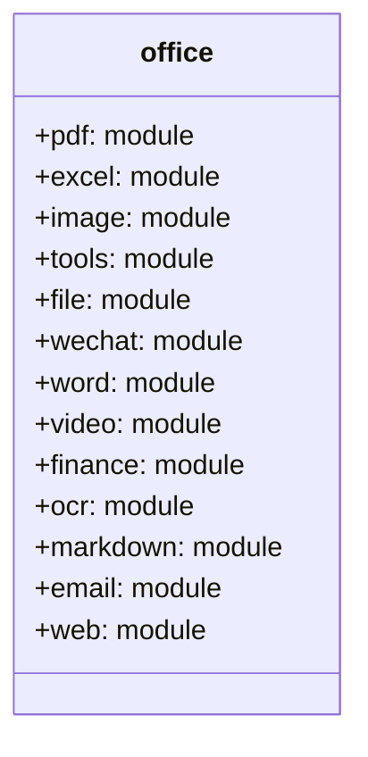
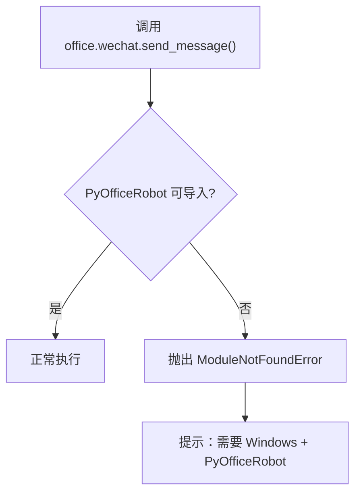

# API 参考

<cite>
**本文档中引用的文件**
- [office/api/pdf.py](file://office/api/pdf.py)
- [office/api/excel.py](file://office/api/excel.py)
- [office/api/image.py](file://office/api/image.py)
- [office/api/tools.py](file://office/api/tools.py)
- [office/api/file.py](file://office/api/file.py)
- [office/api/wechat.py](file://office/api/wechat.py)
- [office/api/word.py](file://office/api/word.py)
- [office/api/video.py](file://office/api/video.py)
- [office/api/finance.py](file://office/api/finance.py)
- [office/__init__.py](file://office/__init__.py)
</cite>

## 目录
1. [简介](#简介)
2. [模块概述](#模块概述)
3. [PDF 模块 API](#pdf-模块-api)
4. [Excel 模块 API](#excel-模块-api)
5. [Image 模块 API](#image-模块-api)
6. [Tools 模块 API](#tools-模块-api)
7. [File 模块 API](#file-模块-api)
8. [WeChat 模块 API](#wechat-模块-api)
9. [Word 模块 API](#word-模块-api)
10. [Video 模块 API](#video-模块-api)
11. [Finance 模块 API](#finance-模块-api)
12. [参数兼容与异常处理](#参数兼容与异常处理)

## 简介

python-office 库提供 13 个功能模块、73 个公共方法，覆盖办公自动化的各个方面。本 API 参考文档详细说明了所有公共接口的使用方法。

## 模块概述

所有模块通过 `office.__init__.py` 自动导入，用户只需 `import office` 即可使用全部功能。



**节来源**
- [office/__init__.py](file://office/__init__.py#L1-L30)

## PDF 模块 API

### pdf2docx
将 PDF 转换为 Word 文档。

```python
def pdf2docx(input_file=None, output_file=None, input_path=None, output_path=None, file_path=None)
```

**参数说明**
- `input_file`: 输入 PDF 文件路径，字符串，可选
- `output_file`: 输出 Word 文件路径，需包含 .docx 后缀，字符串，可选
- `input_path`: 批量输入目录路径，字符串，可选
- `output_path`: 批量输出目录路径，字符串，可选
- `file_path`: [已弃用] 请使用 `input_file` 代替

**调用示例**
```python
office.pdf.pdf2docx(input_file='report.pdf', output_file='report.docx')
```

**节来源**
- [office/api/pdf.py](file://office/api/pdf.py#L48-L87)

### pdf2imgs
将 PDF 转换为图片。

```python
def pdf2imgs(input_file=None, output_file=None, merge=False, pdf_path=None, out_dir=None)
```

**参数说明**
- `input_file`: 输入 PDF 文件路径，字符串，可选
- `output_file`: 输出图片路径，字符串，可选
- `merge`: 是否合并为一张图片，布尔，默认 False
- `pdf_path`: [已弃用] 请使用 `input_file` 代替
- `out_dir`: [已弃用] 请使用 `output_file` 代替

**节来源**
- [office/api/pdf.py](file://office/api/pdf.py#L90-L125)

### encrypt4pdf
加密 PDF 文件。

```python
def encrypt4pdf(password, input_file=None, output_file=None, input_path=None, output_path=None)
```

**参数说明**
- `password`: 加密密码，字符串，必填
- `input_file`: 单个输入 PDF 路径，字符串，可选
- `output_file`: 单个输出路径，字符串，可选
- `input_path`: 批量输入目录，字符串，可选
- `output_path`: 批量输出目录，字符串，可选

**节来源**
- [office/api/pdf.py](file://office/api/pdf.py#L171-L194)

### decrypt4pdf
解密 PDF 文件。

```python
def decrypt4pdf(password, input_file=None, output_file=None, input_path=None, output_path=None)
```

**节来源**
- [office/api/pdf.py](file://office/api/pdf.py#L197-L215)

### merge2pdf
合并多个 PDF 文件。

```python
def merge2pdf(input_file_list=None, output_file=None, one_by_one=None, output=None)
```

**参数说明**
- `input_file_list`: PDF 文件路径列表，列表，可选
- `output_file`: 输出合并后 PDF 路径，字符串，可选
- `one_by_one`: [已弃用] 请使用 `input_file_list` 代替
- `output`: [已弃用] 请使用 `output_file` 代替

**节来源**
- [office/api/pdf.py](file://office/api/pdf.py#L245-L279)

## Excel 模块 API

### fake2excel
自动创建 Excel 并模拟数据。

```python
def fake2excel(columns=['name'], rows=1, path='./fake2excel.xlsx', language='zh_CN')
```

**节来源**
- [office/api/excel.py](file://office/api/excel.py#L39-L55)

### merge2excel
合并多个 Excel 到不同 sheet。

```python
def merge2excel(dir_path, output_file='merge2excel.xlsx')
```

**节来源**
- [office/api/excel.py](file://office/api/excel.py#L58-L73)

### excel2pdf
Excel 转 PDF。

```python
def excel2pdf(excel_path, pdf_path, sheet_id: int = 0)
```

**节来源**
- [office/api/excel.py](file://office/api/excel.py#L147-L162)

## Image 模块 API

### compress_image
压缩图片。

```python
def compress_image(input_file: str, output_file: str, quality: int)
```

**节来源**
- [office/api/image.py](file://office/api/image.py#L21-L35)

### add_watermark
给图片加水印。

```python
def add_watermark(file, mark, output_path='./', color="#eaeaea", size=30, opacity=0.35, space=200, angle=30)
```

**节来源**
- [office/api/image.py](file://office/api/image.py#L58-L78)

### txt2wordcloud
生成词云。

```python
def txt2wordcloud(filename, color="white", result_file="your_wordcloud.png")
```

**节来源**
- [office/api/image.py](file://office/api/image.py#L131-L145)

## Tools 模块 API

### transtools
翻译工具。

```python
def transtools(to_lang: str, content: str, from_lang: str = 'zh') -> str
```

**返回值**
- `str`: 翻译后的结果

**节来源**
- [office/api/tools.py](file://office/api/tools.py#L24-L37)

### qrcodetools
生成二维码。

```python
def qrcodetools(url: str, output: str = r'./qrcode_img.png')
```

**节来源**
- [office/api/tools.py](file://office/api/tools.py#L40-L52)

### passwordtools
生成密码。

```python
def passwordtools(len=8) -> str
```

**节来源**
- [office/api/tools.py](file://office/api/tools.py#L55-L66)

## File 模块 API

### replace4filename
批量重命名文件/文件夹。

```python
def replace4filename(path: str, del_content, replace_content='', dir_rename: bool = True, file_rename: bool = True, suffix=None)
```

**节来源**
- [office/api/file.py](file://office/api/file.py#L44-L61)

### get_files
搜索指定类型文件并返回列表。

```python
def get_files(path: str, name: str = '', suffix: str = None, sub: bool = False, level: int = 0) -> list
```

**返回值**
- `list`: 文件路径列表

**节来源**
- [office/api/file.py](file://office/api/file.py#L182-L197)

## WeChat 模块 API

### send_message
发送消息给指定联系人。

```python
def send_message(who: str, message: str)
```

**异常情况**
- 非 Windows 环境或未安装 PyOfficeRobot 时抛出 ModuleNotFoundError

**节来源**
- [office/api/wechat.py](file://office/api/wechat.py#L32-L45)

### chat_robot
智能聊天。

```python
def chat_robot(who='程序员晚枫')
```

**节来源**
- [office/api/wechat.py](file://office/api/wechat.py#L132-L144)

## Word 模块 API

### docx2pdf
Word 转 PDF（仅 Windows）。

```python
def docx2pdf(path: str, output_path: str = None)
```

**节来源**
- [office/api/word.py](file://office/api/word.py#L33-L48)

### merge4docx
合并多个 Docx 文件。

```python
def merge4docx(input_path: str, output_path: str, new_word_name: str = 'merge4docx')
```

**节来源**
- [office/api/word.py](file://office/api/word.py#L50-L64)

## Video 模块 API

### video2mp3
视频转 MP3。

```python
def video2mp3(path, mp3_name=None, output_path=r'./')
```

**节来源**
- [office/api/video.py](file://office/api/video.py#L24-L37)

### txt2mp3
文本转语音。

```python
def txt2mp3(content='程序员晚枫', file=None, mp3=r'./程序员晚枫.mp3', speak=True)
```

**节来源**
- [office/api/video.py](file://office/api/video.py#L83-L97)

## Finance 模块 API

### t0
计算 T+0 交易收益。

```python
def t0(buy_price: float, sale_price: float, shares: int, w_rate: float = 2.5/10000, min_rate: int = 5, stamp_tax=1/1000) -> float
```

**参数说明**
- `buy_price`: 买入价格
- `sale_price`: 卖出价格
- `shares`: 单笔数量
- `w_rate`: 佣金费率（默认万0.25）
- `min_rate`: 单笔最低佣金（默认5元）
- `stamp_tax`: 印花税率（默认千分之一）

**返回值**
- `float`: 做T后的收益金额

**节来源**
- [office/api/finance.py](file://office/api/finance.py#L21-L46)

## 参数兼容与异常处理

### 参数兼容策略
python-office 的 API 设计支持新旧参数名共存，旧参数触发 `DeprecationWarning`：

```python
# 旧写法（会触发警告）
office.pdf.pdf2docx(file_path='report.pdf', output_path='./')

# 新写法（推荐）
office.pdf.pdf2docx(input_file='report.pdf', output_file='report.docx')
```

### Windows 专用模块延迟加载
wechat 和 word 模块采用延迟加载策略，在调用时才检查依赖：



**节来源**
- [office/api/wechat.py](file://office/api/wechat.py#L19-L29)
- [office/api/word.py](file://office/api/word.py#L20-L30)
