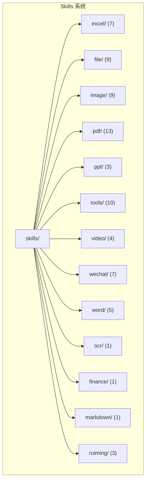
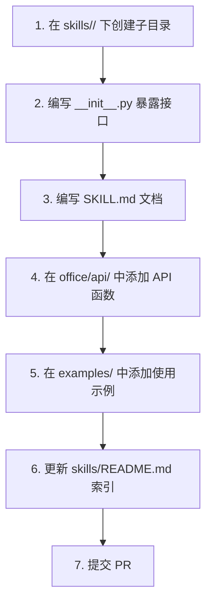

# Skills 系统

<cite>
**本文档中引用的文件**
- [skills/README.md](file://skills/README.md)
- [skills/__init__.py](file://skills/__init__.py)
- [README.md](file://README.md)
</cite>

## 目录
1. [简介](#简介)
2. [Skills 架构](#skills-架构)
3. [13 个分类概览](#13-个分类概览)
4. [三种使用方式](#三种使用方式)
5. [SKILL.md 文档规范](#skillmd-文档规范)
6. [添加新 Skill](#添加新-skill)
7. [常见问题](#常见问题)

## 简介

python-office 内置 **Skills 系统**：将库的 73 个方法封装为 73 个独立可导入的 Skill。每个 Skill 是一个独立子目录，包含 `__init__.py`（暴露接口）和 `SKILL.md`（文档说明），可被 Codex / Claude / Cursor 等 AI 工具自动识别调用。

**Section sources**
- [README.md](file://README.md#L97-L116)

## Skills 架构



每个 Skill 的目录结构：

```
skills/<category>/<skill_name>/
├── SKILL.md       # Skill 的详细说明文档
└── __init__.py    # 暴露 Skill 接口，让用户可以单独调用
```

**Section sources**
- [skills/README.md](file://skills/README.md#L241-L254)

## 13 个分类概览

| 分类 | Skill 数量 | 典型 Skill |
|------|-----------|-----------|
| Excel | 7 | `fake2excel` / `merge2excel` / `excel2pdf` |
| File | 9 | `replace4filename` / `get_files` |
| Finance | 1 | `t0`（股票T+0收益计算） |
| Image | 9 | `compress_image` / `add_watermark` / `txt2wordcloud` |
| Markdown | 1 | `excel2markdown` |
| OCR | 1 | `VatInvoiceOCR2Excel`（增值税发票识别） |
| PDF | 13 | `pdf2docx` / `pdf2imgs` / `merge2pdf` / `encrypt4pdf` |
| PPT | 3 | `ppt2pdf` / `ppt2img` / `merge4ppt` |
| Tools | 10 | `transtools` / `qrcodetools` / `passwordtools` |
| Video | 4 | `video2mp3` / `audio2txt` / `txt2mp3` |
| WeChat | 7 | `send_message` / `chat_robot` / `receive_message` |
| Word | 5 | `docx2pdf` / `merge4docx` / `docx4imgs` |
| Ruiming | 3 | `screen_unmarked_image` / `change_label_in_xml` |

**Section sources**
- [skills/README.md](file://skills/README.md#L117-L134)

## 三种使用方式

```python
# 方式 1：直接导入特定 Skill
from skills.image import compress_image
compress_image(input_file='photo.jpg', output_file='photo_small.jpg', quality=30)

# 方式 2：按分类导入
from skills.pdf import pdf2docx
pdf2docx(input_file='report.pdf', output_file='report.docx')

# 方式 3：传统 office 风格（仍然可用）
import office
office.image.compress_image(input_file='photo.jpg', output_file='photo_small.jpg', quality=30)
```

**Section sources**
- [README.md](file://README.md#L103-L115)
- [skills/README.md](file://skills/README.md#L27-L39)

## SKILL.md 文档规范

每个 Skill 的 `SKILL.md` 文件包含以下内容：
- **功能描述**：该 Skill 的用途和适用场景
- **参数说明**：每个参数的名称、类型、是否必填、默认值
- **返回值**：函数返回值的类型和含义
- **使用示例**：可直接运行的代码示例
- **注意事项**：平台限制、依赖要求等

这种标准化的文档格式使 AI 工具能够自动识别用户意图并调用正确的 Skill。

**Section sources**
- [skills/README.md](file://skills/README.md#L241-L254)

## 添加新 Skill

为项目添加新 Skill 需要遵循以下步骤：



**Section sources**
- [README.md](file://README.md#L317-L332)

## 常见问题

1. **Skill 导入失败**：确保已安装对应的子库（如 `pip install popdf`）
2. **Windows 专用 Skill 不可用**：wechat、word、ppt 分类下的 Skill 仅在 Windows 上可用
3. **Skill 与 office API 的关系**：Skill 是 office API 的薄封装，两者功能等价，Skill 额外提供独立导入和 SKILL.md 文档
4. **AI 工具如何识别 Skill**：AI 工具通过读取 SKILL.md 文件中的触发条件和参数说明来识别和调用 Skill

**Section sources**
- [skills/README.md](file://skills/README.md#L241-L274)
