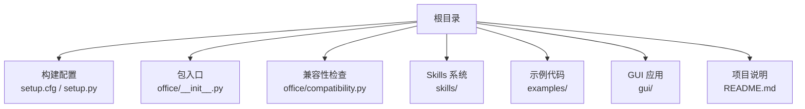
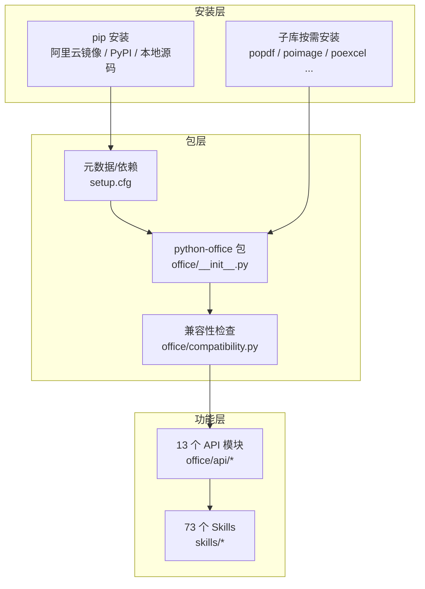
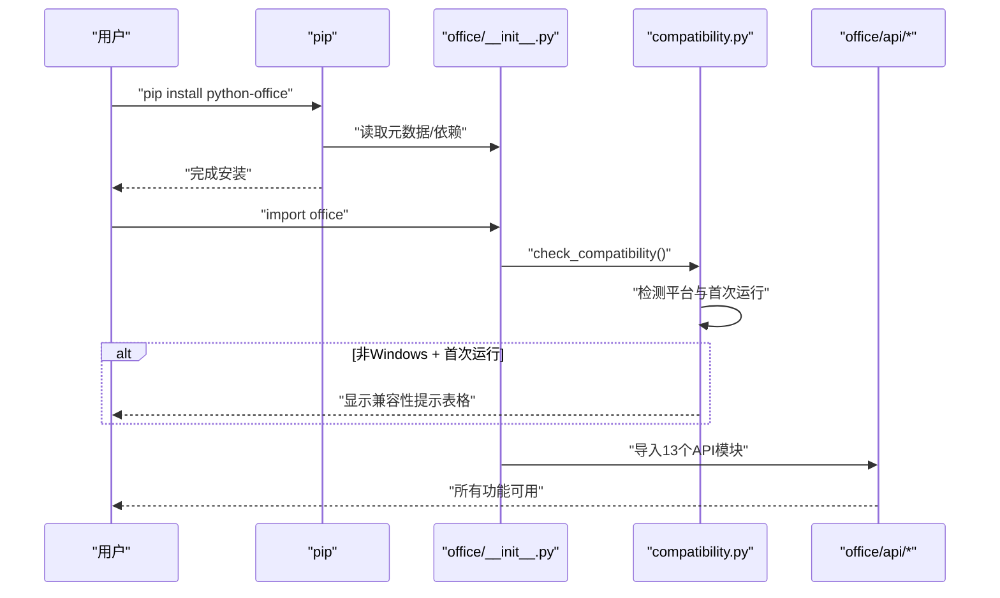

# 安装指南

<cite>
**本文引用的文件**
- [README.md](file://README.md)
- [setup.cfg](file://setup.cfg)
- [setup.py](file://setup.py)
- [office/__init__.py](file://office/__init__.py)
- [office/compatibility.py](file://office/compatibility.py)
</cite>

## 目录
1. [简介](#简介)
2. [项目结构](#项目结构)
3. [核心组件](#核心组件)
4. [架构总览](#架构总览)
5. [详细组件分析](#详细组件分析)
6. [依赖分析](#依赖分析)
7. [性能考虑](#性能考虑)
8. [故障排查指南](#故障排查指南)
9. [结论](#结论)
10. [附录](#附录)

## 简介

本指南面向希望安装与使用 python-office 的用户，系统讲解三种安装方式：
- 使用 pip 从阿里云镜像安装完整库
- 按需安装子库（轻量化方案）
- 从源码本地开发安装

同时覆盖安装过程中的常见问题排查（依赖冲突、权限问题、跨平台兼容性），以及如何验证安装成功与环境配置建议。

**章节来源**
- file://README.md#L139-L155

## 项目结构

python-office 作为 Python 包，其安装配置主要由以下文件定义：
- 构建与元数据：setup.cfg、setup.py
- 包入口：office/__init__.py
- 兼容性检查：office/compatibility.py
- Skills 索引：skills/README.md



**章节来源**
- file://setup.cfg#L1-L44
- file://office/__init__.py#L1-L30

## 核心组件

- 包元数据与依赖
  - 版本与描述：见 [setup.cfg](file://setup.cfg#L1-L44)
  - Python 版本要求：>=3.6（见 [setup.cfg](file://setup.cfg#L42)）
  - 安装依赖列表：见 [setup.cfg](file://setup.cfg#L21-L41)
- 包导出
  - 包入口导出：见 [office/__init__.py](file://office/__init__.py#L1-L30)
  - 13 个 API 模块自动导入
- 兼容性检查
  - 首次运行自动检测平台并提示：见 [office/compatibility.py](file://office/compatibility.py#L1-L250)

**章节来源**
- file://setup.cfg#L1-L44
- file://office/__init__.py#L1-L30
- file://office/compatibility.py#L1-L250

## 架构总览

下图展示 python-office 的安装与运行架构：从 pip 安装到包入口导入，再到兼容性检查和功能调用。



**章节来源**
- file://setup.cfg#L1-L44
- file://office/__init__.py#L1-L30

## 详细组件分析

### 方式一：使用 pip 安装完整库（推荐）

- 适用场景
  - 需要使用多个功能模块的用户
  - 快速获得完整功能，无需逐个安装子库
- 操作步骤

```bash
# 使用阿里云镜像加速安装
pip install -i https://mirrors.aliyun.com/pypi/simple/ python-office -U

# 或从 PyPI 官方源安装
pip install python-office -U
```

- 优点
  - 一次安装，所有功能可用
  - `import office` 即可使用全部 73 个 Skill
- 缺点
  - 安装依赖较多，首次安装时间较长
  - 包含 Windows 专用子库，非 Windows 环境会跳过
- 验证安装

```python
import office
print(office.__version__)  # 应输出 1.0.6
```

**章节来源**
- file://README.md#L139-L155

### 方式二：按需安装子库（轻量化）

- 适用场景
  - 只需要特定功能（如仅 PDF 处理）
  - 减少依赖体积和安装时间
- 操作步骤

```bash
pip install popdf      # PDF 处理
pip install poimage    # 图片处理
pip install poword     # Word 处理（仅 Windows）
pip install poexcel    # Excel 处理
pip install pofile     # 文件管理
pip install povideo    # 视频处理
pip install poocr      # OCR 识别
pip install wftools    # 工具类
```

- 优点
  - 按需安装，依赖精简
  - 各子库可独立使用，也可通过 python-office 统一调用
- 缺点
  - 需要了解各子库的对应关系
  - 多个子库分别安装时管理复杂度增加

**章节来源**
- file://README.md#L139-L155

### 方式三：从源码安装（本地开发）

- 适用场景
  - 需要调试或二次开发
  - 需要使用未发布的特性或修复
- 操作步骤

```bash
git clone https://github.com/CoderWanFeng/python-office.git
cd python-office
pip install -e .
```

- 优点
  - 可直接修改源码并即时生效
- 缺点
  - 需要本地 Python 环境与构建工具
  - 依赖管理复杂度增加

**章节来源**
- file://README.md#L317-L332

### 兼容性检查机制

安装后首次 `import office` 时，兼容性检查器会自动运行：



**章节来源**
- file://office/compatibility.py#L1-L250
- file://office/__init__.py#L1-L30

## 依赖分析

- 运行时核心依赖（跨平台）

| 依赖 | 用途 |
|------|------|
| popdf | PDF 处理 |
| poexcel | Excel 处理 |
| poimage | 图片处理 |
| pofile | 文件管理 |
| povideo | 视频处理 |
| poocr | OCR 识别 |
| wftools | 工具类（翻译、二维码等） |
| poemail | 邮件发送 |
| pomarkdown | Markdown 处理 |
| pocode | 代码管理 |
| pospider | 网络爬虫 |
| poprogress | 进度条 |
| rich | 彩色终端输出 |
| loguru | 日志记录 |
| you-get | 视频下载 |

- Windows 专用依赖

| 依赖 | 用途 |
|------|------|
| poppt | PPT 处理（需要 Microsoft PowerPoint） |
| poword | Word 处理（需要 Microsoft Word） |
| PyOfficeRobot | 微信机器人（需要桌面微信客户端） |
| search4file | 文件搜索（使用 Windows 特定 API） |

**章节来源**
- file://setup.cfg#L21-L41

## 性能考虑

- 选择合适的安装方式
  - 需要多功能的用户推荐完整安装
  - 只需单一功能的用户推荐子库安装
- 环境隔离
  - 使用虚拟环境（venv / conda）减少依赖冲突
- 跨平台注意
  - Windows 专用功能在 macOS/Linux 上不可用，但不会导致导入失败
  - 首次运行时兼容性检查器会提示替代方案

## 故障排查指南

- 依赖冲突
  - 现象：安装失败或运行时报错
  - 排查：检查依赖版本范围与现有环境，必要时使用虚拟环境隔离
  - 参考：[setup.cfg](file://setup.cfg#L21-L41)
- 权限问题
  - 现象：安装失败提示权限不足
  - 排查：使用用户级安装或以管理员身份运行
- 跨平台兼容性
  - 现象：poword / poppt / PyOfficeRobot 在非 Windows 上不可用
  - 排查：查看首次运行的兼容性提示，使用 LibreOffice 等替代方案
- 导入失败
  - 现象：`ModuleNotFoundError`
  - 排查：确认对应子库已安装，或使用完整安装 `pip install python-office`

**章节来源**
- file://office/compatibility.py#L40-L72
- file://setup.cfg#L21-L41

## 结论
- 对大多数用户，推荐使用 pip 从阿里云镜像完整安装，快速获得全部功能
- 只需特定功能的用户可按需安装子库，减少依赖体积
- 需要开发或调试时，采用本地源码可编辑安装
- 安装完成后，通过 `import office` 验证安装成功，首次运行会自动显示跨平台兼容性提示

## 附录
- 安装命令参考
  - 完整安装：参见 [README.md](file://README.md#L139-L155)
  - 子库安装：参见 [README.md](file://README.md#L146-L150)
- 依赖清单：参见 [setup.cfg](file://setup.cfg#L21-L41)
- 兼容性信息：参见 [office/compatibility.py](file://office/compatibility.py#L40-L72)
