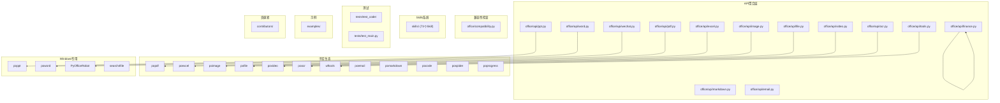
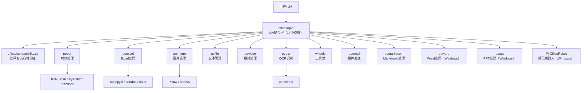
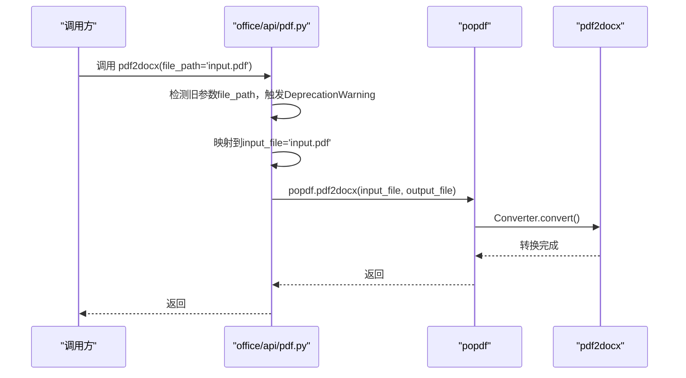
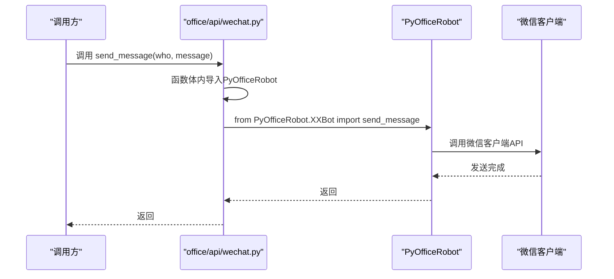
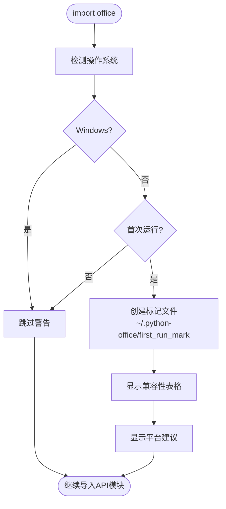
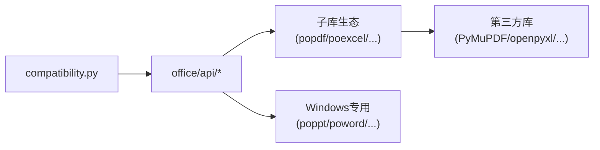

# 代码结构说明

<cite>
**本文引用的文件**
- [README.md](file://README.md)
- [setup.cfg](file://setup.cfg)
- [setup.py](file://setup.py)
- [office/__init__.py](file://office/__init__.py)
- [office/compatibility.py](file://office/compatibility.py)
- [office/api/pdf.py](file://office/api/pdf.py)
- [office/api/excel.py](file://office/api/excel.py)
- [office/api/image.py](file://office/api/image.py)
- [office/api/tools.py](file://office/api/tools.py)
- [office/api/file.py](file://office/api/file.py)
- [office/api/wechat.py](file://office/api/wechat.py)
- [office/api/word.py](file://office/api/word.py)
- [office/api/video.py](file://office/api/video.py)
- [office/api/finance.py](file://office/api/finance.py)
- [skills/README.md](file://skills/README.md)
</cite>

## 目录
1. [简介](#简介)
2. [项目结构](#项目结构)
3. [核心组件](#核心组件)
4. [架构总览](#架构总览)
5. [详细组件分析](#详细组件分析)
6. [依赖关系分析](#依赖关系分析)
7. [性能考量](#性能考量)
8. [故障排查指南](#故障排查指南)
9. [结论](#结论)

## 简介
本文件面向开发者，系统性梳理 python-office 项目的分层架构设计与模块职责。与 popdf 等单一功能子库不同，python-office 采用"API 聚合层 + Skills 系统层 + 子库生态"三层架构：
- **API 聚合层**（`office/api/`）：对外提供统一门面接口，13 个模块按功能领域划分，负责参数兼容处理与子库路由分发。
- **Skills 系统层**（`skills/`）：73 个独立可导入的 Skill，每个包含 `__init__.py` 和 `SKILL.md`，支持 AI 工具自动识别。
- **子库生态**（popdf/poexcel/poimage 等）：各子库独立维护，封装第三方库调用，提供稳定的功能接口。

同时，`office/compatibility.py` 提供跨平台兼容性检查，在非 Windows 系统首次运行时提示 Windows 专用模块的替代方案。

章节来源
- [README.md](file://README.md#L1-L50)
- [office/__init__.py](file://office/__init__.py#L1-L29)

## 项目结构
项目采用"聚合层 + 子库 + Skills + 贡献者"的组织方式，配合 examples 与 tests 提供使用示例与测试覆盖。

图表来源
- [office/__init__.py](file://office/__init__.py#L1-L29)
- [setup.cfg](file://setup.cfg#L19-L41)
- [skills/README.md](file://skills/README.md#L1-L50)

## 核心组件
- **office/\_\_init\_\_.py**：包入口，首先导入兼容性检查模块并执行检查，然后导入 13 个 API 模块。当前版本 `1.0.6`。
- **office/compatibility.py**：跨平台兼容性检查器 `CrossPlatformCompatibility`，检测操作系统类型，首次运行时在 `~/.python-office/first_run_mark` 创建标记文件，非 Windows 系统显示功能兼容性表格与替代方案。
- **office/api/\***：13 个 API 模块，每个模块导入对应子库并封装为函数式接口。pdf.py 最大（434 行，13 个函数），finance.py 最小（51 行，1 个函数）。
- **skills/**：73 个 Skill 的索引与规范文档，每个 Skill 包含 `__init__.py`（可直接导入使用）和 `SKILL.md`（AI 工具可读的文档）。
- **contributors/**：12 个贡献者的独立代码目录，采用隔离式贡献模式，不修改核心代码。

章节来源
- [office/__init__.py](file://office/__init__.py#L1-L29)
- [office/compatibility.py](file://office/compatibility.py#L14-L50)
- [office/api/pdf.py](file://office/api/pdf.py#L1-L30)
- [skills/README.md](file://skills/README.md#L1-L30)

## 架构总览
下图展示了三层之间的依赖关系与典型调用链路，体现"API 调用子库，子库调用第三方库"的分层设计。

图表来源
- [office/__init__.py](file://office/__init__.py#L1-L29)
- [setup.cfg](file://setup.cfg#L19-L41)
- [office/api/pdf.py](file://office/api/pdf.py#L1-L30)
- [office/api/excel.py](file://office/api/excel.py#L1-L20)

## 详细组件分析

### 入口层：包初始化与兼容性检查
- **职责**
  - `office/__init__.py` 首先导入 `check_compatibility`，确保在所有 API 模块导入之前完成跨平台检测。
  - 然后按序导入 13 个 API 模块，使 `import office` 后可直接使用 `office.pdf.pdf2docx()` 等调用。
  - `office/compatibility.py` 中的 `CrossPlatformCompatibility` 类在首次运行时创建标记文件 `~/.python-office/first_run_mark`，非 Windows 系统通过 rich 库展示彩色兼容性表格。
- **关键点**
  - 兼容性检查在导入时自动执行，仅首次运行显示提示。
  - Windows 专用模块（poppt、poword、PyOfficeRobot、search4file）在 `setup.cfg` 中通过 `platform_system=='Windows'` 条件安装。
  - `__version__ = '1.0.6'`，对应 `setup.cfg` 中的版本号。
- **示例路径**
  - [包入口与模块导入](file://office/__init__.py#L1-L29)
  - [兼容性检查器](file://office/compatibility.py#L14-L73)

章节来源
- [office/__init__.py](file://office/__init__.py#L1-L29)
- [office/compatibility.py](file://office/compatibility.py#L14-L73)

### API 层：统一门面接口
- **职责**
  - 每个 API 模块导入对应子库，将子库功能封装为函数式接口。
  - pdf.py 是最复杂的模块（434 行），支持新旧参数兼容：旧参数名触发 `DeprecationWarning`，同时映射到新参数。
  - wechat.py 和 word.py 采用延迟加载策略：在函数调用时才 `import PyOfficeRobot` / `import poword`，避免非 Windows 系统导入失败。
- **关键点**
  - 参数兼容机制：pdf.py 中的 `pdf2docx` 支持 `file_path`（旧）和 `input_file`（新）两种参数名，旧参数触发 `warnings.warn("参数名已弃用", DeprecationWarning)`。
  - 延迟加载：wechat.py 的 `send_message` 函数在函数体内 `from PyOfficeRobot.XXBot import send_message as bot_send`，而非模块顶部导入。
  - 日志记录：使用 `loguru` 进行统一日志记录。
- **示例路径**
  - [PDF API 参数兼容](file://office/api/pdf.py#L1-L50)
  - [微信延迟加载](file://office/api/wechat.py#L1-L40)
  - [Excel API](file://office/api/excel.py#L1-L30)

章节来源
- [office/api/pdf.py](file://office/api/pdf.py#L1-L50)
- [office/api/wechat.py](file://office/api/wechat.py#L1-L40)
- [office/api/excel.py](file://office/api/excel.py#L1-L30)
- [office/api/image.py](file://office/api/image.py#L1-L30)
- [office/api/tools.py](file://office/api/tools.py#L1-L30)
- [office/api/file.py](file://office/api/file.py#L1-L30)
- [office/api/word.py](file://office/api/word.py#L1-L30)
- [office/api/video.py](file://office/api/video.py#L1-L30)
- [office/api/finance.py](file://office/api/finance.py#L1-L51)

### Skills 系统层
- **职责**
  - 73 个 Skill 按 13 个分类组织，每个 Skill 是一个独立目录，包含 `__init__.py`（功能实现）和 `SKILL.md`（AI 可读文档）。
  - 支持三种使用方式：`from skills.分类.Skill名 import 函数名`、`import skills.分类.Skill名`、AI 工具自动识别 SKILL.md。
  - Skills 系统与 API 聚合层互补：API 面向传统 Python 开发者，Skills 面向 AI 工具用户。
- **关键点**
  - SKILL.md 遵循统一格式：名称、功能描述、参数说明、返回值、使用示例。
  - 新增 Skill 需在 `skills/` 对应分类目录下创建子目录，包含 `__init__.py` 和 `SKILL.md`。
  - 13 个分类：PDF、Excel、Word、PPT、图片、视频、文件管理、工具类、微信自动化、OCR识别、金融计算、Markdown处理、邮件。
- **示例路径**
  - [Skills 索引](file://skills/README.md#L1-L50)

章节来源
- [skills/README.md](file://skills/README.md#L1-L50)

### 数据流与控制流（以典型流程为例）

#### 流程一：PDF 转 Word（参数兼容）

图表来源
- [office/api/pdf.py](file://office/api/pdf.py#L1-L50)

#### 流程二：微信发消息（延迟加载）

图表来源
- [office/api/wechat.py](file://office/api/wechat.py#L1-L40)

#### 流程三：跨平台兼容性检查（首次运行）

图表来源
- [office/compatibility.py](file://office/compatibility.py#L14-L73)

## 依赖关系分析
- **模块耦合**
  - API 聚合层仅依赖子库包，保持对外接口稳定。
  - 子库独立发布，各自封装第三方库，向上提供简洁接口。
  - 兼容性检查器与 API 模块无直接耦合，仅在包入口处执行。
- **外部依赖**
  - 跨平台子库：popdf、poexcel、poimage、pofile、povideo、poocr、wftools、poemail、pomarkdown、pocode、pospider、poprogress
  - Windows 专用子库：poppt、poword、PyOfficeRobot、search4file
  - 通用依赖：rich（彩色输出）、loguru（日志）、you-get（视频下载）
- **接口契约**
  - API 层函数签名统一，子库提供稳定接口，便于替换与扩展。
  - 参数兼容机制确保旧代码无需修改即可运行。

图表来源
- [setup.cfg](file://setup.cfg#L19-L41)
- [office/__init__.py](file://office/__init__.py#L1-L29)

## 性能考量
- **延迟加载**：Windows 专用模块（wechat、word）在调用时才导入，减少非 Windows 系统的启动开销。
- **首次运行检测**：兼容性检查仅在首次运行时执行，后续导入无额外开销。
- **子库按需安装**：用户可单独安装子库（如 `pip install popdf`），无需安装完整 python-office。
- **批量操作**：支持目录级批量处理，子库内部使用进度条（poprogress）提升用户体验。

## 故障排查指南
- **常见问题**
  - 导入错误：非 Windows 系统导入 wechat/word 模块时，若直接 `from office.api.wechat import *` 可能触发延迟加载，但调用函数时才会报错。
  - 参数弃用警告：旧参数名会触发 `DeprecationWarning`，建议迁移到新参数名。
  - 子库版本不匹配：部分功能对子库版本有最低要求，升级至满足条件的版本。
- **定位路径**
  - 从 API 入口定位到子库调用，再深入到第三方库，逐步缩小问题范围。
  - 查看 `loguru` 日志输出定位参数错误。
- **示例路径**
  - [API 参数兼容处理](file://office/api/pdf.py#L1-L50)
  - [延迟加载策略](file://office/api/wechat.py#L1-L40)
  - [兼容性检查](file://office/compatibility.py#L185-L201)

## 结论
python-office 采用清晰的聚合层架构：API 层负责统一入口与参数兼容，子库生态负责具体功能实现，Skills 系统为 AI 工具用户提供额外入口。跨平台兼容性检查器确保非 Windows 用户获得清晰的功能限制提示。该设计使得功能扩展与维护更加清晰，子库可独立迭代，API 层保持稳定。
