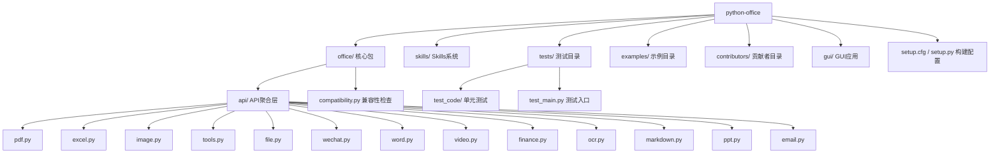
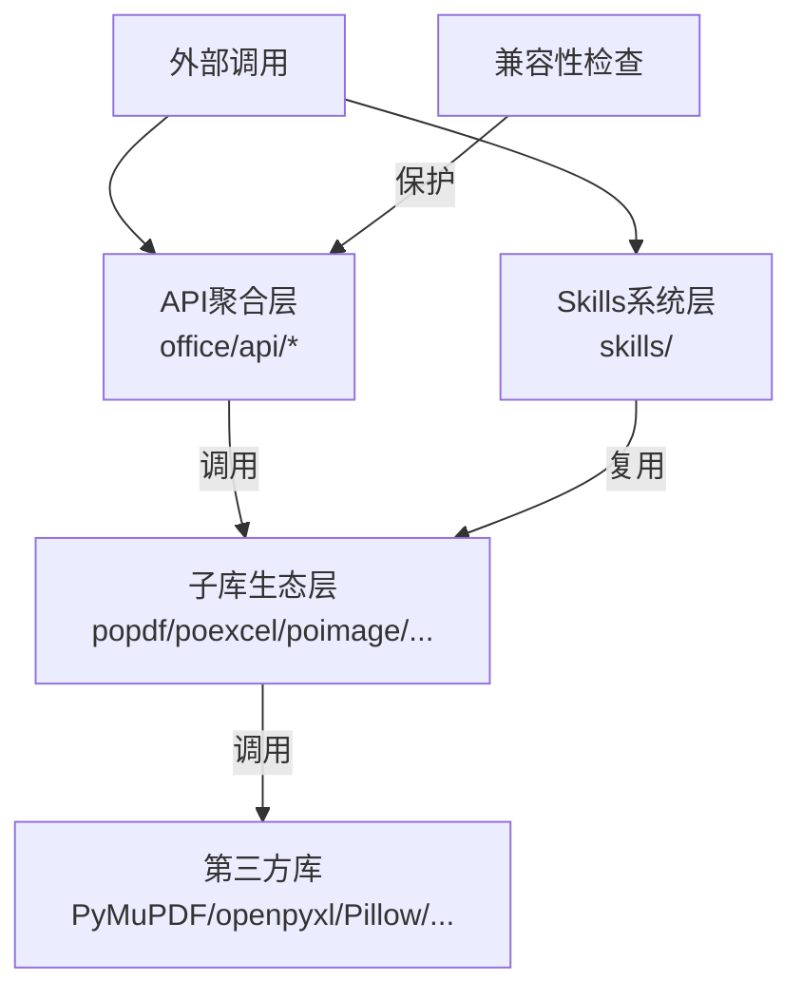
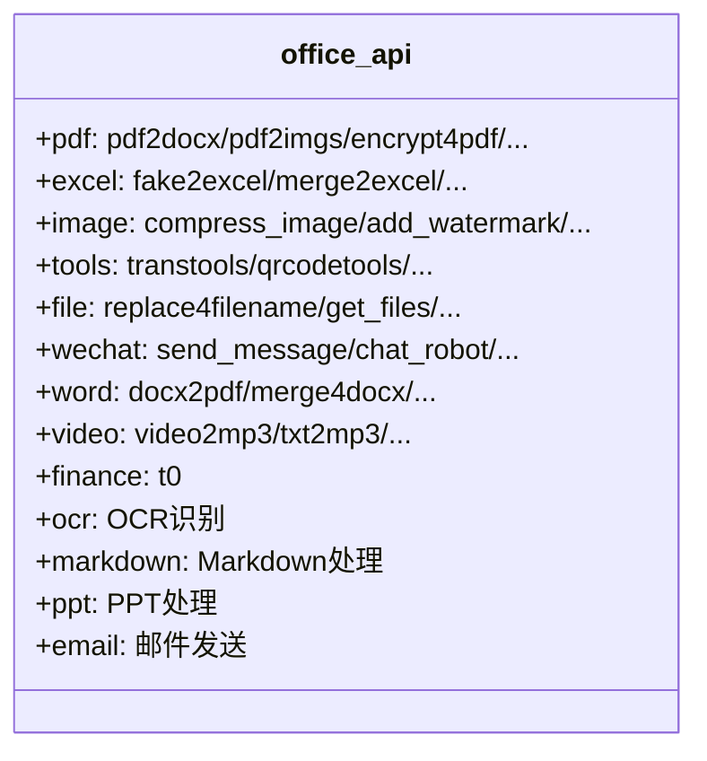
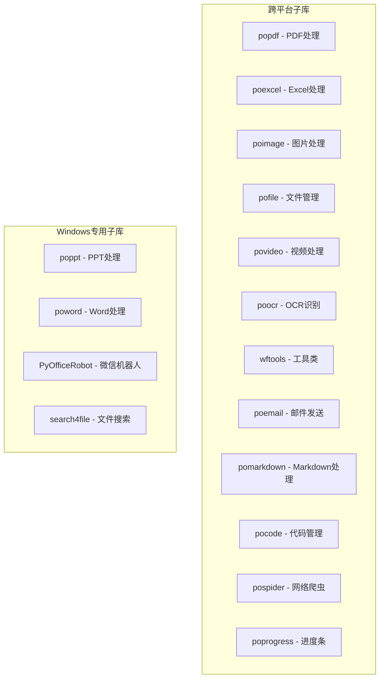
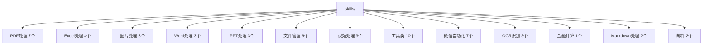
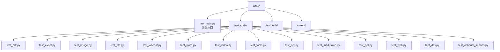
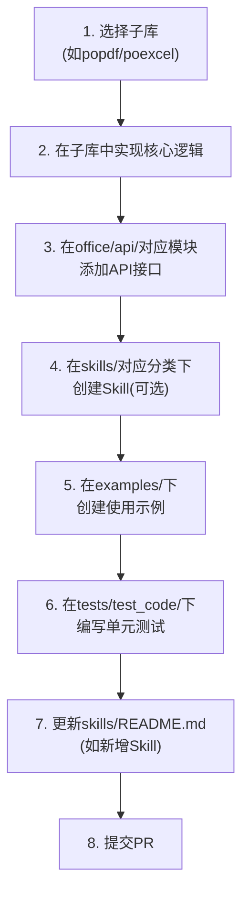
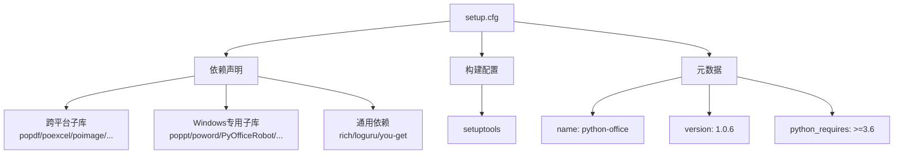
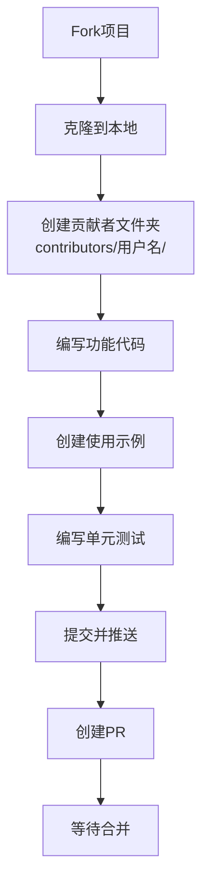

# 开发者指南

<cite>
**本文档中引用的文件**
- [README.md](file://README.md)
- [setup.cfg](file://setup.cfg)
- [setup.py](file://setup.py)
- [office/__init__.py](file://office/__init__.py)
- [office/compatibility.py](file://office/compatibility.py)
- [office/api/pdf.py](file://office/api/pdf.py)
- [office/api/excel.py](file://office/api/excel.py)
- [office/api/wechat.py](file://office/api/wechat.py)
- [skills/README.md](file://skills/README.md)
- [tests/test_main.py](file://tests/test_main.py)
- [tests/test_code/test_pdf.py](file://tests/test_code/test_pdf.py)
- [examples/readme.md](file://examples/readme.md)
- [gui/](file://gui/)
</cite>

## 目录

1. [项目结构](#项目结构)
2. [代码分层设计](#代码分层设计)
3. [API聚合层](#api聚合层)
4. [子库生态层](#子库生态层)
5. [Skills系统层](#skills系统层)
6. [单元测试](#单元测试)
7. [添加新功能](#添加新功能)
8. [依赖管理与构建流程](#依赖管理与构建流程)
9. [贡献代码](#贡献代码)

## 项目结构

本项目采用"API聚合 + 子库生态 + Skills系统 + 贡献者"的组织方式，主要目录结构如下：



**图源**
- [README.md](file://README.md#L1-L50)
- [office/__init__.py](file://office/__init__.py#L1-L29)

## 代码分层设计

项目采用三层架构设计，各层职责分明，便于维护和扩展。



**图源**
- [office/__init__.py](file://office/__init__.py#L1-L29)
- [setup.cfg](file://setup.cfg#L19-L41)

## API聚合层

API聚合层提供外部调用的接口，是用户与库交互的主要入口。通过`office/__init__.py`导出所有功能模块。



**关键设计模式：**

| 模式 | 说明 | 示例 |
|------|------|------|
| 参数兼容 | 新旧参数名共存，旧参数触发 DeprecationWarning | `pdf2docx(file_path=...)` → `pdf2docx(input_file=...)` |
| 延迟加载 | Windows 专用模块在函数体内导入 | `wechat.send_message()` 内部 `from PyOfficeRobot.XXBot import ...` |
| 子库路由 | API 函数直接调用子库同名函数 | `office.api.pdf.pdf2docx()` → `popdf.pdf2docx()` |

**图源**
- [office/api/pdf.py](file://office/api/pdf.py#L1-L50)
- [office/api/wechat.py](file://office/api/wechat.py#L1-L40)
- [office/__init__.py](file://office/__init__.py#L1-L29)

## 子库生态层

子库生态层包含 16 个独立子库，各自封装特定领域的第三方库调用，实现高内聚低耦合。



**子库依赖关系：**

| 子库 | 主要第三方依赖 | 功能 |
|------|-------------|------|
| popdf | PyMuPDF, PyPDF2, pdf2docx, Pillow | PDF 转换/加密/解密/水印/合并/拆分 |
| poexcel | openpyxl, pandas, faker | Excel 模拟/合并/拆分/搜索/转换 |
| poimage | Pillow, opencv, wordcloud | 图片压缩/水印/词云/二维码 |
| pofile | pathlib, shutil | 文件重命名/搜索/批量管理 |
| povideo | you-get, moviepy | 视频下载/转码/音频提取 |
| poocr | paddleocr | OCR 文字识别 |
| wftools | translator, qrcode | 翻译/二维码/密码生成 |
| poemail | smtplib | 邮件发送 |
| pomarkdown | markdown | Markdown 处理 |
| poppt | python-pptx, COM接口 | PPT 处理（Windows） |
| poword | python-docx, COM接口 | Word 处理（Windows） |
| PyOfficeRobot | pywinauto | 微信自动化（Windows） |

**图源**
- [setup.cfg](file://setup.cfg#L19-L41)

## Skills系统层

Skills系统层是 python-office 的特色设计，为 AI 工具用户提供自动识别的功能入口。每个 Skill 包含 `__init__.py`（功能实现）和 `SKILL.md`（AI 可读文档）。



**三种使用方式：**
```python
# 方式一：直接导入函数
from skills.PDF.pdf2docx import pdf2docx
pdf2docx(input_file='input.pdf', output_file='output.docx')

# 方式二：导入模块
import skills.PDF.pdf2docx as skill
skill.pdf2docx(input_file='input.pdf')

# 方式三：AI 工具自动识别
# AI 工具读取 SKILL.md 文档，自动调用对应函数
```

**图源**
- [skills/README.md](file://skills/README.md#L1-L50)

## 单元测试

项目使用 `pytest` 框架进行单元测试，测试代码位于 `tests/test_code/` 目录下。



测试入口支持生成 HTML 报告：
```python
# tests/test_main.py
import pytest
if __name__ == '__main__':
    pytest.main(['./test_code', '--html=report.html'])
```

**图源**
- [tests/test_main.py](file://tests/test_main.py#L1-L25)
- [tests/test_code/](file://tests/test_code/)

## 添加新功能

为项目添加新功能需要遵循以下步骤：



### 详细步骤说明

**步骤 1-2：子库实现**
在对应子库（如 popdf）中实现核心逻辑，确保功能独立可用。

**步骤 3：API 接口封装**
在 `office/api/` 对应模块中添加函数，导入子库并封装：
```python
# office/api/pdf.py 示例
from popdf import pdf2docx as _pdf2docx

def pdf2docx(input_file, output_file, **kwargs):
    """PDF转Word

    Args:
        input_file (str): 输入PDF文件路径
        output_file (str): 输出Word文件路径
    """
    _pdf2docx(input_file=input_file, output_file=output_file, **kwargs)
```

**步骤 4：创建 Skill（可选）**
在 `skills/` 对应分类下创建子目录：
```
skills/PDF/my_new_feature/
├── __init__.py      # 功能实现
└── SKILL.md         # AI可读文档
```

**步骤 5-6：示例与测试**
- 在 `examples/` 下创建使用示例文件
- 在 `tests/test_code/` 下编写单元测试，使用 `unittest.TestCase`

**图源**
- [README.md](file://README.md#L80-L100)
- [skills/README.md](file://skills/README.md#L1-L50)

## 依赖管理与构建流程

项目使用 `setup.cfg` 进行依赖管理，通过 `setuptools` 进行构建。



**构建与发布：**
```bash
# 安装构建工具
pip install build twine

# 构建包
python -m build

# 发布到PyPI
twine upload dist/*
```

**图源**
- [setup.cfg](file://setup.cfg#L1-L44)
- [setup.py](file://setup.py#L1-L10)

## 贡献代码

欢迎任何人参与项目开发。贡献代码的步骤如下：

1. Fork 项目到自己的仓库
2. 克隆到本地进行修改
3. 在 `contributors/` 下创建以 GitHub 用户名命名的文件夹
4. 在文件夹中创建功能文件
5. 提交代码并推送到自己的仓库
6. 创建 Pull Request 到主分支
7. 等待作者合并



**注意事项：**
- 禁止修改其他贡献者的代码或核心模块
- 禁止修改 README.md、setup.py 等核心配置文件
- 每个新增功能需配套使用示例和单元测试

**图源**
- [README.md](file://README.md#L100-L135)
