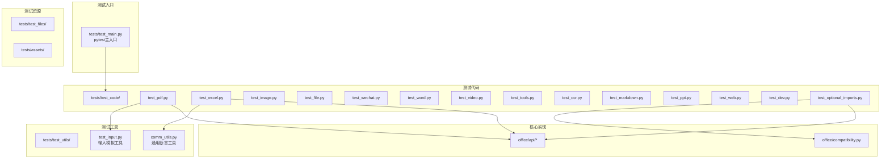
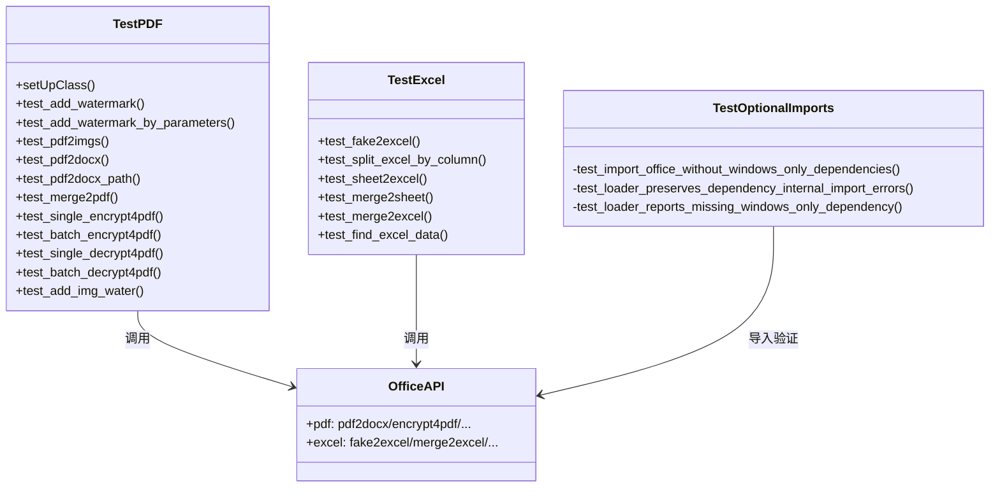
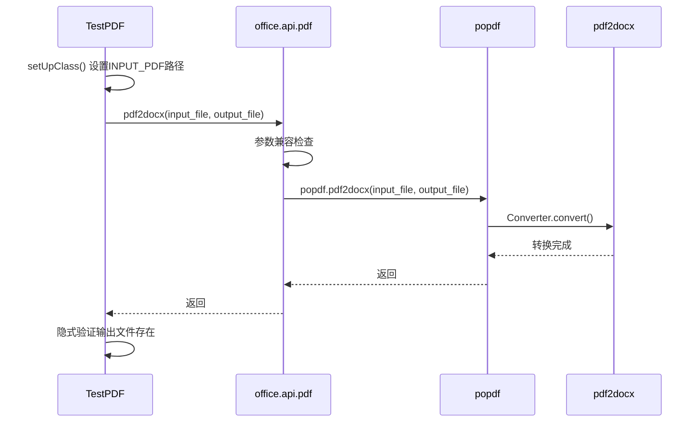
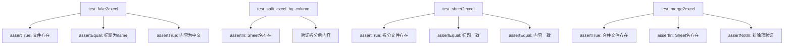
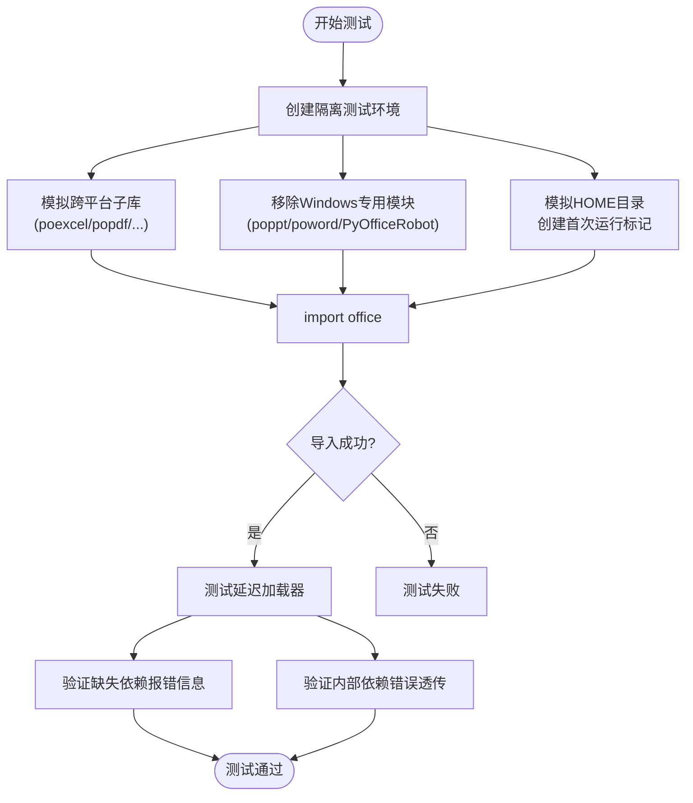

# 测试策略与实践

<cite>
**本文档引用的文件**
- [tests/test_main.py](file://tests/test_main.py)
- [tests/test_code/test_pdf.py](file://tests/test_code/test_pdf.py)
- [tests/test_code/test_excel.py](file://tests/test_code/test_excel.py)
- [tests/test_code/test_dev.py](file://tests/test_code/test_dev.py)
- [tests/test_code/test_optional_imports.py](file://tests/test_code/test_optional_imports.py)
- [tests/test_utils/comm_utils.py](file://tests/test_utils/comm_utils.py)
- [tests/test_utils/test_input.py](file://tests/test_utils/test_input.py)
- [office/api/pdf.py](file://office/api/pdf.py)
- [office/api/excel.py](file://office/api/excel.py)
- [office/compatibility.py](file://office/compatibility.py)
</cite>

## 目录
1. [引言](#引言)
2. [项目结构与测试布局](#项目结构与测试布局)
3. [核心测试组件分析](#核心测试组件分析)
4. [测试架构概述](#测试架构概述)
5. [详细组件测试分析](#详细组件测试分析)
6. [跨平台导入测试](#跨平台导入测试)
7. [测试工具与辅助函数](#测试工具与辅助函数)
8. [依赖关系分析](#依赖关系分析)
9. [性能与覆盖率考量](#性能与覆盖率考量)
10. [故障排查指南](#故障排查指南)
11. [结论](#结论)

## 引言
本文档旨在为开发者提供一套完整的单元测试策略，指导如何使用 `unittest` 与 `pytest` 框架对 python-office 的多模块功能进行高质量测试验证。通过分析 `test_pdf.py`、`test_excel.py`、`test_optional_imports.py` 的测试结构，结合 `test_utils/` 中的辅助工具，明确测试用例组织规范、测试数据管理方式以及覆盖率要求。

## 项目结构与测试布局



**图示来源**
- [tests/test_main.py](file://tests/test_main.py#L1-L25)
- [tests/test_code/test_pdf.py](file://tests/test_code/test_pdf.py#L1-L10)
- [tests/test_code/test_excel.py](file://tests/test_code/test_excel.py#L1-L10)
- [tests/test_code/test_optional_imports.py](file://tests/test_code/test_optional_imports.py#L1-L30)

## 核心测试组件分析

### 测试框架选型
项目同时使用 `unittest` 和 `pytest` 两种框架：
- **unittest**：用于编写测试类和测试方法，提供 `setUpClass`、`assert*` 等标准断言。
- **pytest**：用于运行测试套件、生成 HTML 报告、支持参数化测试。

```python
# tests/test_main.py — pytest 主入口
import pytest
if __name__ == '__main__':
    pytest.main(['./test_code', '--html=report.html'])
```

### 测试类组织
每个功能模块对应一个测试文件，测试类继承 `unittest.TestCase`，使用 `@classmethod setUpClass` 共享测试资源。

**图示来源**
- [tests/test_main.py](file://tests/test_main.py#L1-L25)
- [tests/test_code/test_pdf.py](file://tests/test_code/test_pdf.py#L12-L22)

## 测试架构概述



**图示来源**
- [tests/test_code/test_pdf.py](file://tests/test_code/test_pdf.py#L12-L112)
- [tests/test_code/test_excel.py](file://tests/test_code/test_excel.py#L11-L81)
- [tests/test_code/test_optional_imports.py](file://tests/test_code/test_optional_imports.py#L65-L166)

## 详细组件测试分析

### PDF 功能测试分析

#### 测试场景覆盖

| 测试方法 | 测试场景 | 覆盖类型 |
|---------|---------|---------|
| `test_add_watermark` | 交互式输入添加水印 | 正常流程（stdin模拟） |
| `test_add_watermark_by_parameters` | 参数式添加水印 | 正常流程 |
| `test_pdf2imgs` | PDF转图片 | 正常流程 |
| `test_pdf2docx` | 单文件PDF转Word | 正常流程 |
| `test_pdf2docx_path` | 批量PDF转Word（目录） | 批量处理 |
| `test_merge2pdf` | 合并多个PDF | 正常流程 |
| `test_single_encrypt4pdf` | 单文件加密 | 正常流程 |
| `test_batch_encrypt4pdf` | 批量加密 | 批量处理 |
| `test_single_decrypt4pdf` | 单文件解密 | 正常流程 |
| `test_batch_decrypt4pdf` | 批量解密 | 批量处理 |
| `test_add_img_water` | 图片水印 | 正常流程 |

#### 测试流程（以PDF转Word为例）



**图示来源**
- [tests/test_code/test_pdf.py](file://tests/test_code/test_pdf.py#L18-L112)

### Excel 功能测试分析

#### 测试特点
Excel 测试是项目中验证最严格的模块，使用了多种断言方法：



**关键断言模式：**
```python
# 文件存在性验证
self.assertTrue(file_exist(test_file_name))

# 内容一致性验证
self.assertEqual(
    get_colum_content(test_file_name, 0, sheet_name),
    get_colum_content(f'./{sheet_name}.xlsx', 0, sheet_name)
)

# 排除性验证
self.assertNotIn("sedemo_Split_2022-08-23_203413", 
                 get_all_sheet_names(test_file_name))
```

**图示来源**
- [tests/test_code/test_excel.py](file://tests/test_code/test_excel.py#L16-L81)

## 跨平台导入测试

`test_optional_imports.py` 是项目最复杂的测试文件，验证 Windows 专用模块在非 Windows 系统上的导入安全性。

### 测试策略



### 三种测试场景

| 测试方法 | 测试目标 | 验证点 |
|---------|---------|-------|
| `test_import_office_without_windows_only_dependencies` | 无 Windows 依赖时包导入正常 | `import office` 不抛出异常 |
| `test_loader_reports_missing_windows_only_dependency` | 延迟加载器报告友好的缺失依赖信息 | `ModuleNotFoundError` 消息包含中文说明 |
| `test_loader_preserves_dependency_internal_import_errors` | 内部依赖错误不被吞没 | 原始 `ModuleNotFoundError` 透传 |

### 测试环境隔离技术

```python
# 使用 contextmanager 创建隔离环境
@contextmanager
def _optional_import_test_environment(self):
    # 1. 保存原始模块状态
    original_modules = {name: sys.modules.get(name) for name in ...}
    # 2. 创建临时 HOME 目录（模拟首次运行标记）
    with tempfile.TemporaryDirectory() as temp_home:
        os.environ["HOME"] = temp_home
        # 3. 创建标记文件跳过兼容性检查
        mark_file.write("already checked")
        # 4. 注入模拟模块
        for name in SUPPORTED_DEPENDENCIES:
            sys.modules[name] = types.ModuleType(name)
        # 5. 移除 Windows 专用模块
        for name in WINDOWS_ONLY_DEPENDENCIES:
            sys.modules.pop(name, None)
        yield
    # 6. 恢复原始状态
```

**图示来源**
- [tests/test_code/test_optional_imports.py](file://tests/test_code/test_optional_imports.py#L65-L166)

## 测试工具与辅助函数

### comm_utils.py — 通用测试工具

| 工具函数 | 功能 | 使用场景 |
|---------|------|---------|
| `file_exist(file_path)` | 判断文件是否存在 | 验证输出文件生成 |
| `get_colum_content(file_path, col, sheet)` | 获取 Excel 列标题 | 验证 Excel 内容 |
| `get_content(file_path, row, col, sheet)` | 获取 Excel 单元格值 | 验证 Excel 数据一致性 |
| `get_all_sheet_names(file_path)` | 获取所有 Sheet 名称 | 验证合并/拆分结果 |
| `get_filter_names(file_path, col)` | 获取列分类值 | 验证拆分逻辑 |
| `get_latest_file(dir_path)` | 获取目录最新文件 | 验证生成文件 |
| `is_chinese_chars_regex(s)` | 判断中文字符串 | 验证中文内容 |
| `get_file_by_suffix(dir_path, suffix)` | 按后缀获取文件 | 测试资源管理 |

### test_input.py — 输入模拟工具

```python
# 模拟 stdin 输入，用于交互式功能的测试
stub_stdin(self, f'{self.INPUT_PDF}\npython-office\n')
add_watermark()  # 函数内部读取 stdin
```

**图示来源**
- [tests/test_utils/comm_utils.py](file://tests/test_utils/comm_utils.py#L1-L187)
- [tests/test_code/test_pdf.py](file://tests/test_code/test_pdf.py#L22-L24)

## 依赖关系分析

```mermaid
graph TD
A[test_main.py] --> B[pytest]
B --> C[test_code/*.py]
C --> D[office.api.*]
D --> E[子库 (popdf/poexcel/...)]
C --> F[test_utils/comm_utils.py]
C --> G[test_utils/test_input.py]
F --> H[pandas]
F --> I[openpyxl]
D --> J[office.compatibility]
J --> K[rich / platform]
```

所有测试用例均依赖于 `office.api.*` 提供的高层接口，而这些接口又依赖于子库的具体实现。`test_utils/` 提供通用的断言工具，减少重复代码。

**图示来源**
- [tests/test_code/test_pdf.py](file://tests/test_code/test_pdf.py#L1-L10)
- [tests/test_code/test_excel.py](file://tests/test_code/test_excel.py#L1-L10)
- [tests/test_utils/comm_utils.py](file://tests/test_utils/comm_utils.py#L1-L10)

## 性能与覆盖率考量

### 测试覆盖率要求

| 功能模块 | 正常流程 | 批量处理 | 异常处理 | 边界情况 |
|---------|---------|---------|---------|---------|
| PDF转Word | ✓ | ✓ (目录) | 参数兼容 | — |
| PDF转图片 | ✓ | — | — | — |
| PDF加密 | ✓ | ✓ (目录) | — | — |
| PDF解密 | ✓ | ✓ (目录) | — | — |
| PDF水印 | ✓ (交互) | ✓ (参数) | — | — |
| PDF合并 | ✓ | — | — | — |
| Excel模拟 | ✓ | — | — | — |
| Excel拆分 | ✓ | — | — | — |
| Excel合并 | ✓ | — | — | ✓ (排除验证) |
| 跨平台导入 | ✓ | — | ✓ (缺失依赖) | ✓ (内部错误透传) |

### 测试数据管理规范
- **测试代码**：存放于 `tests/test_code/` 目录下
- **测试工具**：存放于 `tests/test_utils/` 目录下
- **测试资源**：存放于 `tests/test_files/` 对应子目录中
- **命名规范**：测试文件与功能模块对应，如 `test_pdf.py` 对应 PDF 功能
- **共享资源**：使用 `@classmethod setUpClass` 在测试类级别共享测试文件路径

### 运行测试

```bash
# 运行所有测试并生成HTML报告
cd tests
python test_main.py

# 运行单个测试文件
python -m pytest tests/test_code/test_pdf.py -v

# 运行特定测试类
python -m pytest tests/test_code/test_excel.py::TestExcel -v

# 运行并查看覆盖率
python -m pytest tests/test_code/ --cov=office --cov-report=html
```

## 故障排查指南

当测试失败时，请按以下步骤排查：

1. **检查路径问题**：确认测试文件路径使用 `./tests/test_files/` 前缀，使用 `os.path.join` 构造跨平台路径
2. **验证依赖项**：确保子库（popdf、poexcel 等）已正确安装
3. **查看日志输出**：检查 `loguru` 输出的错误信息，定位参数错误原因
4. **测试数据完整性**：确认测试用 PDF/Excel 文件未损坏且可正常打开
5. **权限问题**：确保程序有读写目标目录的权限
6. **Windows 专用模块**：非 Windows 系统运行 wechat/word/ppt 测试时，需确认延迟加载机制正常工作
7. **首次运行标记**：如兼容性检查干扰测试，可创建 `~/.python-office/first_run_mark` 标记文件跳过

**图示来源**
- [tests/test_code/test_pdf.py](file://tests/test_code/test_pdf.py#L18-L22)
- [tests/test_code/test_optional_imports.py](file://tests/test_code/test_optional_imports.py#L68-L90)

## 结论
python-office 项目采用分层测试策略：功能测试（`test_pdf.py`、`test_excel.py` 等）验证 API 层的正确性，跨平台导入测试（`test_optional_imports.py`）验证延迟加载机制的健壮性，通用工具（`comm_utils.py`）提供统一的断言辅助。建议在后续开发中持续完善测试用例，特别是补充图片处理、视频处理、微信自动化等模块的断言验证，并使用 `coverage.py` 确保核心模块测试覆盖率不低于 85%。
